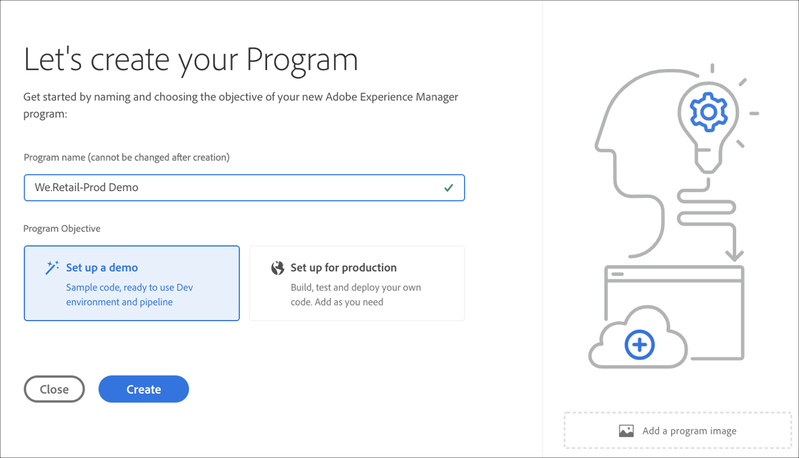

# Creación de un programa {#create-a-program}

La solución nativa de la nube proporciona al usuario los permisos necesarios y la capacidad de crear un programa en un modelo de autoservicio.

Un asistente para la creación de programas pedirá al usuario que envíe detalles, según el objetivo del usuario de crear el programa dentro de los límites de lo que esté disponible para el cliente o la organización en cuestión.

En caso de que el usuario tenga acceso por primera vez a Cloud Manager o de que no haya programas en el inquilino, verá **Crear su primera pantalla de programa** . Si el usuario selecciona *Esc* o hace clic fuera del cuadro de diálogo, se muestra la siguiente pantalla:

## Uso del Asistente para crear programas {#using-create-program-wizard}

Según el objetivo del usuario de crear el programa dentro de los límites de lo que está disponible para el cliente o la organización específicos, un asistente para la creación de programas pedirá al usuario que envíe uno o varios detalles.

>[!NOTE]
>Si ya existe un programa, verá **Agregar programa** en la parte superior derecha de la página de aterrizaje, como se muestra en la figura siguiente.

## Creación de un programa de demostración {#create-demo-program}

>[!NOTE]
>
Un programa de demostración es análogo a un programa de simulación de pruebas en la interfaz de usuario de Cloud Manager.

Siga los pasos a continuación para crear un programa de simulación de pruebas:

1. En el asistente para crear programas, seleccione **Configurar una demostración**. El usuario envía el nombre del programa antes de seleccionar **Crear**.

   

1. El usuario verá la nueva tarjeta de programa de simulación de pruebas en la página de aterrizaje y podrá pasar el ratón sobre ella para seleccionar el icono Administrador de nubes y navegar hasta la página de información general del Administrador de nubes. La tarjeta informará al usuario sobre el estado de la configuración automática del programa de simulación de pruebas recién creado. El usuario verá progresión.

   

1. Una vez que se haya configurado el programa y se haya completado el paso de creación del proyecto, el usuario podrá acceder al vínculo **Administrar Git** , como se muestra en la figura siguiente:

   

   >[!NOTE]
   >
   >Para obtener más información sobre el acceso y la administración del repositorio Git mediante la administración de cuentas Git de autoservicio desde la interfaz de usuario de Cloud Manager, consulte [Acceso a Git](/help/implementing/cloud-manager/accessing-git.md).

1. Una vez creado el entorno de desarrollo, el usuario puede **acceder al vínculo de AEM** , como se muestra en la figura siguiente:

   

1. Una vez que se haya completado la implementación de la canalización sin producción en el desarrollo, el asistente guiará al usuario para que acceda a AEM (en desarrollo) o para implementar código en el entorno de desarrollo:

   

## Creación de un programa regular {#create-regular-program}

Un programa *regular* está dirigido a un usuario familiarizado con AEM y Cloud Manager y está listo para empezar a escribir, crear y probar código con el objetivo de implementarlo en Producción.

Siga los pasos a continuación para crear un programa normal:

1. Seleccione **Configurar para producción** en el asistente Crear programa para crear un programa normal. El usuario puede aceptar el nombre predeterminado del programa o editarlo antes de seleccionar **Continuar**.

   

1. El usuario seleccionará las soluciones que se incluirán en el programa en la pantalla que se presentará después de la pantalla de arriba.

   >[!NOTE]
   >
   >La pantalla siguiente solo se muestra para el segmento de clientes que han comprado más de una solución. Para los clientes que han comprado una sola solución, no se mostrará la pantalla de selección de la solución que aparece a continuación.

   

1. Una vez que haya seleccionado las soluciones, haga clic en **Crear**.

   

1. Una vez que vea la tarjeta del programa en la página de aterrizaje, pase el ratón por encima para seleccionar el icono Administrador de nube para navegar a la página **Información general** del Administrador de nube.

   

1. La tarjeta principal de llamada a acción guiará al usuario para crear un entorno, crear una canalización que no sea de producción y, finalmente, una canalización de producción.
   

   >[!NOTE]
   >
   >Un programa normal no tiene la función de configuración **** automática.

