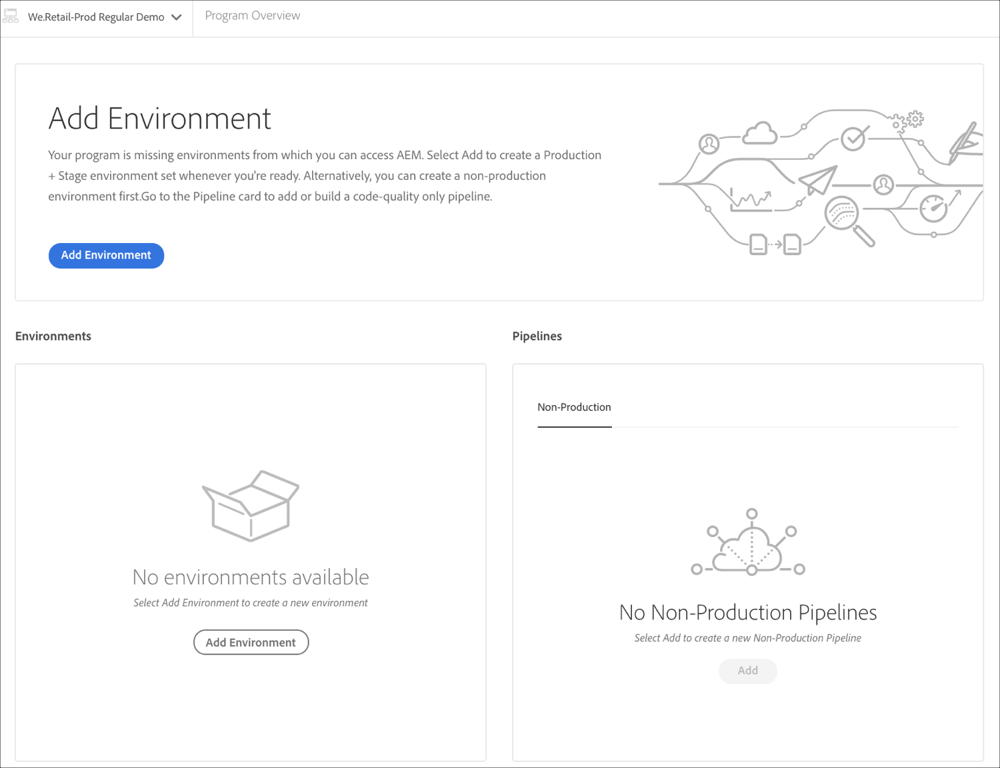

# Creación de un proyecto de aplicación de AEM {#aem-application-project}

## Uso del Asistente para crear un proyecto de aplicación AEM {#using-wizard-to-create-an-aem-application-project}

Para ayudar a que los nuevos clientes se inicien, Cloud Manager ahora puede crear un proyecto de AEM mínimo como punto de partida. Este proceso se basa en el [**AEM Arquetipo**](https://github.com/Adobe-Marketing-Cloud/aem-project-archetype)del Proyecto.


Siga los pasos a continuación para crear un proyecto de aplicación AEM en Cloud Manager:

1. Una vez que inicie sesión en Cloud Manager y se complete la configuración básica del programa, se mostrará una tarjeta de llamada a la acción especial en la pantalla **Información general**, si el repositorio está vacío.

   

1. Haga clic en **Crear** para desplazarse hasta la pantalla **Crear una rama y un proyecto**.

   

1. El mosaico Creación de **proyectos en curso** se muestra en la pantalla Información general *de* Programa.

   

1. Una vez que la creación del programa ha finalizado, el mosaico **Agregar entorno** aparece en la página *Información general del programa*.
   

   Consulte [Administración de Entornos](/help/implementing/cloud-manager/manage-environments.md) para obtener información sobre cómo agregar o administrar entornos.

## Configuración del proyecto {#setting-up-your-project}

### Modificación de los detalles de configuración del proyecto {#modifying-project-setup-details}

Para poder compilar e implementar correctamente con Cloud Manager, los proyectos de AEM existentes deben cumplir algunas reglas básicas:

* Los proyectos deben crearse con Apache Maven.
* Debe haber un *archivo pom.xml* en la raíz del repositorio Git. Este archivo *pom.xml* puede referirse a tantos submódulos (que a su vez pueden tener otros submódulos, etc.) según sea necesario.

* Puede agregar referencias a repositorios de artefactos Maven adicionales en los archivos *pom.xml* . El acceso a repositorios [de artefactos protegidos con](#password-protected-maven-repositories) contraseña se admite cuando se configura. Sin embargo, no se admite el acceso a repositorios de artefactos protegidos por la red.
* Los paquetes de contenido implementable se descubren mediante la búsqueda de archivos *zip* del paquete de contenido que se encuentran en un directorio denominado *destinatario*. Cualquier número de submódulos puede producir paquetes de contenido.

* Los artefactos de Dispatcher implementables se detectan mediante el análisis de archivos *zip* (nuevamente, contenidos en un directorio denominado *destinatario*) que tienen directorios llamados *conf* y *conf.d*.

* Si hay más de un paquete de contenido, no se garantiza el orden de las implementaciones de paquetes. Si se necesita un orden específico, se pueden usar dependencias de paquetes de contenido para definir el orden. Es posible que los paquetes se [omitan](#skipping-content-packages) de la implementación.


## Detalles del Entorno de compilación {#build-environment-details}

Cloud Manager crea y prueba el código mediante un entorno de compilación especializado. Este entorno tiene los atributos siguientes:

* El entorno de compilación está basado en Linux, derivado de Ubuntu 18.04.
* Se ha instalado Apache Maven 3.6.0.
* Las versiones de Java instaladas son Oracle JDK 8u202 y 11.0.2.
* Hay algunos paquetes de sistema adicionales instalados que son necesarios:

   * bzip2
   * descomprimir
   * libpng
   * imagemagick
   * graphicsmagick

* Se pueden instalar otros paquetes en el momento de la compilación, como se describe [a continuación](#installing-additional-system-packages).
* Cada obra se construye sobre un entorno prístino; el contenedor de compilación no mantiene ningún estado entre las ejecuciones.
* Maven siempre se ejecuta con el comando: *mvn —batch-mode clean org.jacoco:jacoco-maven-plugin:prepare-agent package*
* Maven se configura a nivel de sistema con un archivo settings.xml que incluye automáticamente el repositorio público de Adobe **Artiact** . (Consulte Repositorio [de Maven Público de](https://repo.adobe.com/) Adobe para obtener más detalles).

>[!NOTE]
>Aunque Cloud Manager no define una versión específica del `jacoco-maven-plugin`, la versión utilizada debe ser al menos `0.7.5.201505241946`.

### Uso de la compatibilidad con Java 11 {#using-java-support}

Cloud Manager ahora admite la creación de proyectos de clientes con Java 8 y Java 11. De forma predeterminada, los proyectos se crean con Java 8.

Los clientes que deseen utilizar Java 11 en sus proyectos pueden hacerlo mediante el complemento [Apache Maven Toolchain](https://maven.apache.org/plugins/maven-toolchains-plugin/).

Para ello, en el archivo pom.xml, agregue una `<plugin>` entrada con este aspecto:

```
<plugin>
    <groupId>org.apache.maven.plugins</groupId>
    <artifactId>maven-toolchains-plugin</artifactId>
    <version>1.1</version>
    <executions>
        <execution>
            <goals>
                <goal>toolchain</goal>
            </goals>
        </execution>
    </executions>
    <configuration>
        <toolchains>
            <jdk>
                <version>11</version>
                <vendor>oracle</vendor>
           </jdk>
        </toolchains>
    </configuration>
</plugin>
```

>[!NOTE]
>Los valores de proveedor admitidos son `oracle` y `sun`.
>
>Los valores de versión admitidos son `1.8`, `1.11`y `11`.

## Variables de entorno {#environment-variables}

### Variables de Entorno estándar {#standard-environ-variables}

En algunos casos, los clientes consideran necesario variar el proceso de compilación en función de la información sobre el programa o la canalización.

Por ejemplo, si se está realizando la minimización de JavaScript en tiempo de compilación, a través de una herramienta como gulp, puede haber un deseo de usar un nivel de minificación diferente cuando se construye para un entorno de desarrollo en lugar de construir para etapa y producción.

Para admitir esto, Cloud Manager agrega estas variables de entorno estándar al contenedor de compilación para cada ejecución.

| **Nombre de variable** | **Definición** |
|---|---|
| CM_BUILD | Siempre configurado como &quot;true&quot; |
| RAMA | La rama configurada para la ejecución |
| CM_PIPELINE_ID | El identificador de canalización numérica |
| CM_PIPELINE_NAME | El nombre de la canalización |
| CM_PROGRAMA_ID | El identificador de programa numérico |
| CM_PROGRAMA_NAME | El nombre del programa |
| ARTIFACTS_VERSION | Para una fase o canalización de producción, la versión sintética generada por Cloud Manager |
| CM_AEM_PRODUCT_VERSION | El nombre de la versión |

### Variables de canalización {#pipeline-variables}

En algunos casos, el proceso de generación de un cliente puede depender de variables de configuración específicas que no se pueden colocar en el repositorio Git o que necesitan variar entre las ejecuciones de canalizaciones que utilizan la misma rama.

Cloud Manager permite configurar estas variables mediante la API de Cloud Manager o la CLI de Cloud Manager por canalización. Las variables pueden almacenarse como texto sin formato o cifradas en reposo. En cualquier caso, las variables se ponen a disposición dentro del entorno de compilación como una variable de entorno a la que se puede hacer referencia desde dentro del `pom.xml` archivo u otras secuencias de comandos de compilación.

Para configurar una variable mediante la CLI, ejecute un comando como:

`$ aio cloudmanager:set-pipeline-variables PIPELINEID --variable MY_CUSTOM_VARIABLE test`

Se pueden enumerar las variables actuales:

`$ aio cloudmanager:list-pipeline-variables PIPELINEID`

Los nombres de variables solo pueden contener caracteres alfanuméricos y de subrayado (_). Por convención, los nombres deben estar en mayúsculas. Hay un límite de 200 variables por canalización, cada nombre debe tener menos de 100 caracteres y cada valor debe tener menos de 2048 caracteres.

Cuando se utiliza dentro de un `Maven pom.xml` archivo, generalmente resulta útil asignar estas variables a las propiedades de Maven con una sintaxis similar a esta:

```xml
        <profile>
            <id>cmBuild</id>
            <activation>
                <property>
                    <name>env.CM_BUILD</name>
                </property>
            </activation>
            <properties>
                <my.custom.property>${env.MY_CUSTOM_VARIABLE}</my.custom.property> 
            </properties>
        </profile>
```


## Activación de Perfiles Maven en Cloud Manager {#activating-maven-profiles-in-cloud-manager}

En algunos casos limitados, es posible que deba variar ligeramente el proceso de compilación al ejecutarse dentro de Cloud Manager, en lugar de hacerlo en estaciones de trabajo para desarrolladores. En estos casos, los Perfiles [](https://maven.apache.org/guides/introduction/introduction-to-profiles.html) Maven se pueden usar para definir cómo la compilación debe ser diferente en diferentes entornos, incluido Cloud Manager.

La activación de un Perfil Maven dentro del entorno de compilación de Cloud Manager debe realizarse buscando la variable de entorno CM_BUILD descrita anteriormente. Por el contrario, un perfil que se pretenda usar solamente fuera del entorno de compilación de Cloud Manager debería realizarse buscando la ausencia de esta variable.

Por ejemplo, si desea enviar un mensaje sencillo solo cuando la compilación se ejecute dentro de Cloud Manager, puede hacer lo siguiente:

```xml
        <profile>
            <id>cmBuild</id>
            <activation>
                  <property>
                        <name>env.CM_BUILD</name>
                  </property>
            </activation>
            <build>
                <plugins>
                    <plugin>
                        <artifactId>maven-antrun-plugin</artifactId>
                        <version>1.8</version>
                        <executions>
                            <execution>
                                <phase>initialize</phase>
                                <configuration>
                                    <target>
                                        <echo>I'm running inside Cloud Manager!</echo>
                                    </target>
                                </configuration>
                                <goals>
                                    <goal>run</goal>
                                </goals>
                            </execution>
                        </executions>
                    </plugin>
                </plugins>
            </build>
        </profile>
```

>[!NOTE]
>
>Para probar este perfil en una estación de trabajo para desarrolladores, puede habilitarlo en la línea de comandos (con `-PcmBuild`) o en el Entorno de desarrollo integrado (IDE).

Y si desea enviar un mensaje sencillo solo cuando la compilación se ejecute fuera de Cloud Manager, puede hacer lo siguiente:

```xml
        <profile>
            <id>notCMBuild</id>
            <activation>
                  <property>
                        <name>!env.CM_BUILD</name>
                  </property>
            </activation>
            <build>
                <plugins>
                    <plugin>
                        <artifactId>maven-antrun-plugin</artifactId>
                        <version>1.8</version>
                        <executions>
                            <execution>
                                <phase>initialize</phase>
                                <configuration>
                                    <target>
                                        <echo>I'm running outside Cloud Manager!</echo>
                                    </target>
                                </configuration>
                                <goals>
                                    <goal>run</goal>
                                </goals>
                            </execution>
                        </executions>
                    </plugin>
                </plugins>
            </build>
        </profile>
```

## Compatibilidad con repositorio Maven protegido por contraseña {#password-protected-maven-repositories}

Para utilizar un repositorio Maven protegido por contraseña de Cloud Manager, especifique la contraseña (y, opcionalmente, el nombre de usuario) como una variable [secreta de](#pipeline-variables) canalización y, a continuación, haga referencia a ese secreto dentro de un archivo denominado `.cloudmanager/maven/settings.xml` en el repositorio git. Este archivo sigue el esquema [Maven Settings File](https://maven.apache.org/settings.html) . Cuando el administrador de nube genera inicios de proceso, el `<servers>` elemento de este archivo se combina en el archivo `settings.xml` predeterminado proporcionado por Cloud Manager. Los ID de servidor que comienzan con `adobe` y `cloud-manager` se consideran reservados y no deben ser utilizados por servidores personalizados. Los ID de servidor que **no** coincidan con uno de estos prefijos o el ID predeterminado nunca `central` será reflejado por Cloud Manager. Con este archivo en su lugar, se haría referencia a la identificación del servidor desde dentro de un elemento `<repository>` y/o `<pluginRepository>` dentro del `pom.xml` archivo. Por lo general, estos `<repository>` y/o `<pluginRepository>` elementos se contendrían dentro de un perfil [específico del Administrador de](#activating-maven-profiles-in-cloud-manager)nube, aunque esto no es estrictamente necesario.

Por ejemplo, supongamos que el repositorio se encuentra en https://repository.myco.com/maven2, el nombre de usuario Cloud Manager debe utilizarse `cloudmanager` y la contraseña es `secretword`.

Primero, establezca la contraseña como un secreto en la canalización:

`$ aio cloudmanager:set-pipeline-variables PIPELINEID --secret CUSTOM_MYCO_REPOSITORY_PASSWORD secretword`

A continuación, haga referencia a esto desde el `.cloudmanager/maven/settings.xml` archivo:

```xml
<?xml version="1.0" encoding="UTF-8"?>
<settings xmlns="http://maven.apache.org/SETTINGS/1.0.0" xmlns:xsi="http://www.w3.org/2001/XMLSchema-instance"
        xsi:schemaLocation="http://maven.apache.org/SETTINGS/1.0.0 http://maven.apache.org/xsd/settings-1.0.0.xsd">
    <servers>
        <server>
            <id>myco-repository</id>
            <username>cloudmanager</username>
            <password>${env.CUSTOM_MYCO_REPOSITORY_PASSWORD}</password>
        </server>
    </servers>
</settings>
```

Y finalmente haga referencia al ID de servidor dentro del `pom.xml` archivo:

```xml
<profiles>
    <profile>
        <id>cmBuild</id>
        <activation>
                <property>
                    <name>env.CM_BUILD</name>
                </property>
        </activation>
        <build>
            <repositories>
                <repository>
                    <id>myco-repository</id>
                    <name>MyCo Releases</name>
                    <url>https://repository.myco.com/maven2</url>
                    <snapshots>
                        <enabled>false</enabled>
                    </snapshots>
                    <releases>
                        <enabled>true</enabled>
                    </releases>
                </repository>
            </repositories>
            <pluginRepositories>
                <pluginRepository>
                    <id>myco-repository</id>
                    <name>MyCo Releases</name>
                    <url>https://repository.myco.com/maven2</url>
                    <snapshots>
                        <enabled>false</enabled>
                    </snapshots>
                    <releases>
                        <enabled>true</enabled>
                    </releases>
                </pluginRepository>
            </pluginRepositories>
        </build>
    </profile>
</profiles>
```

## Instalación de paquetes de sistema adicionales {#installing-additional-system-packages}

Algunas compilaciones requieren que se instalen paquetes de sistema adicionales para funcionar completamente. Por ejemplo, una compilación puede invocar una secuencia de comandos Python o ruby y, como resultado, debe tener instalado un intérprete de idioma adecuado. Esto se puede hacer llamando al [exec-maven-plugin](https://www.mojohaus.org/exec-maven-plugin/) para invocar APT. Esta ejecución generalmente debe envolverse en un perfil Maven específico del Administrador de la nube. Por ejemplo, para instalar python:

```xml
        <profile>
            <id>install-python</id>
            <activation>
                <property>
                        <name>env.CM_BUILD</name>
                </property>
            </activation>
            <build>
                <plugins>
                    <plugin>
                        <groupId>org.codehaus.mojo</groupId>
                        <artifactId>exec-maven-plugin</artifactId>
                        <version>1.6.0</version>
                        <executions>
                            <execution>
                                <id>apt-get-update</id>
                                <phase>validate</phase>
                                <goals>
                                    <goal>exec</goal>
                                </goals>
                                <configuration>
                                    <executable>apt-get</executable>
                                    <arguments>
                                        <argument>update</argument>
                                    </arguments>
                                </configuration>
                            </execution>
                            <execution>
                                <id>install-python</id>
                                <phase>validate</phase>
                                <goals>
                                    <goal>exec</goal>
                                </goals>
                                <configuration>
                                    <executable>apt-get</executable>
                                    <arguments>
                                        <argument>install</argument>
                                        <argument>-y</argument>
                                        <argument>--no-install-recommends</argument>
                                        <argument>python</argument>
                                    </arguments>
                                </configuration>
                            </execution>
                        </executions>
                    </plugin>
                </plugins>
            </build>
        </profile>
```

Esta misma técnica se puede utilizar para instalar paquetes específicos de idioma, es decir, `gem` para RubyGems o `pip` para paquetes Python.

>[!NOTE]
>
>La instalación de un paquete de sistema de esta manera **no** lo instala en el entorno de tiempo de ejecución utilizado para ejecutar Adobe Experience Manager. Si necesita un paquete de sistema instalado en el entorno de AEM, póngase en contacto con su representante de Adobe.

## Omisión de paquetes de contenido {#skipping-content-packages}

En Cloud Manager, las compilaciones pueden producir cualquier número de paquetes de contenido.
Por diversos motivos, puede que sea conveniente crear un paquete de contenido pero no implementarlo. Esto puede resultar útil, por ejemplo, cuando se generan paquetes de contenido que solo se utilizan para pruebas o que se van a volver a empaquetar con otro paso en el proceso de compilación, es decir, como un subpaquete de otro paquete.

Para dar cabida a estos escenarios, Cloud Manager buscará una propiedad denominada ***cloudManagerTarget*** en las propiedades de los paquetes de contenido creados. Si esta propiedad se establece en “ninguno”, el paquete se omitirá y no se implementará. El mecanismo para establecer esta propiedad depende de la forma en que la compilación produce el paquete de contenido. Por ejemplo, con el complemento filevault-maven-plugin puede configurar el complemento de esta manera:

```xml
        <plugin>
            <groupId>org.apache.jackrabbit</groupId>
            <artifactId>filevault-package-maven-plugin</artifactId>
            <extensions>true</extensions>
            <configuration>
                <properties>
                    <cloudManagerTarget>none</cloudManagerTarget>
                </properties>
        <!-- other configuration -->
            </configuration>
        </plugin>
```

Con el content-package-maven-plugin es similar:

```xml
        <plugin>
            <groupId>com.day.jcr.vault</groupId>
            <artifactId>content-package-maven-plugin</artifactId>
            <extensions>true</extensions>
            <configuration>
                <properties>
                    <cloudManagerTarget>none</cloudManagerTarget>
                </properties>
        <!-- other configuration -->
            </configuration>
        </plugin>
```

## Recursos adicionales {#additional-resources}

Consulte las secciones a continuación para obtener información sobre cómo utilizar Cloud Manager en Cloud Service:

* [Administración de entornos](/help/implementing/cloud-manager/manage-environments.md)
* [Configuración de la canalización CI-CD](/help/implementing/cloud-manager/configure-pipeline.md)
* [Implementación del código](/help/implementing/cloud-manager/deploy-code.md)
* [Comprender los resultados de la prueba](/help/implementing/cloud-manager/overview-test-results.md)