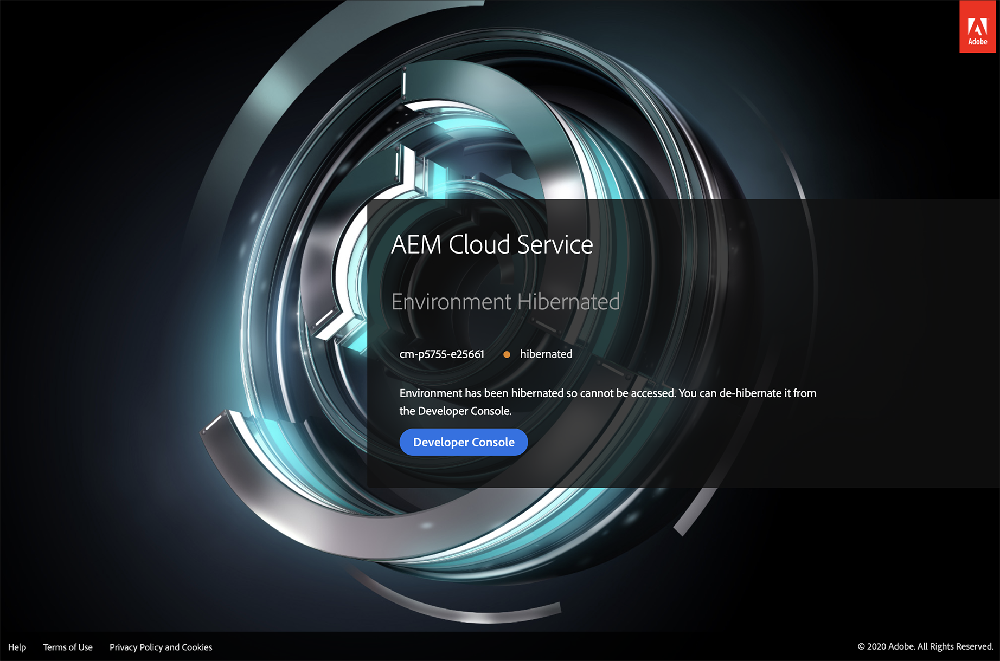

# Entornos de espacio aislado en hibernación y dehibernación {#hibernating-introduction}

Los entornos de programa de espacio aislado especifican un *modo de hibernación* si no se detecta ninguna actividad durante un período determinado.

>[!NOTE]
>La hibernación es única para los entornos de programa de espacio aislado. Los entornos de programas de producción no hibernan.

## Hibernación {#hibernation-introduction}

La hibernación puede producirse de forma automática o manual. Los entornos de programa de espacio aislado pueden tardar hasta unos minutos en entrar en un *modo de hibernación*. Los datos se conservan durante la hibernación.

La hibernación se clasifica como:

* ****  Los entornos del programa AutomaticSandbox hibernan automáticamente tras ocho horas de inactividad, lo que significa que ni el autor ni los servicios de vista previa o publicación reciben solicitudes.

* **Manual**: Como usuario, puede hibernar manualmente un entorno de programa de espacio aislado, aunque no es necesario hacerlo, ya que la hibernación se producirá automáticamente después de un determinado período (ocho horas) de inactividad.

>[!CAUTION]
>En la última versión, la vinculación a Developer Console directamente desde Cloud Manager no le dará la opción de hibernar un entorno de programa de espacio aislado para pruebas. La solución alternativa se encuentra una vez en Developer Console, añada el siguiente patrón al final de la URL `#release-cm-p1234-e5678 where 1234` 1234 es su *ID de programa* y 5678 es su *ID de entorno*.

### Uso de hibernación manual {#using-manual-hibernation}

Puede hibernar manualmente el programa de espacio aislado desde Developer Console de dos formas diferentes:

* Pantalla de detalles del entorno
* Pantalla de lista de entorno

>[!NOTE]
>El acceso a Developer Console para un programa de espacio aislado está disponible para cualquier usuario de Cloud Manager.

Siga los pasos a continuación para hibernar manualmente los entornos del programa de espacio aislado:

1. Vaya a **Developer Console**.
Consulte [Acceso a Developer Console](/help/implementing/cloud-manager/manage-environments.md#accessing-developer-console) para obtener información sobre cómo acceder a **Developer Console** desde la tarjeta **Entornos**.
   >[!IMPORTANT]
   >Vincular a **Developer Console** directamente desde Cloud Manager no le dará la opción de hibernar un entorno de programa de espacio aislado para pruebas. La solución alternativa se encuentra una vez en Developer Console, añada el siguiente patrón al final de la URL `#release-cm-p1234-e5678 where 1234` 1234 es su *ID de programa* y 5678 es su *ID de entorno*.

1. Haga clic en **Hibernate**, como se muestra en la figura siguiente:

   

   O bien,

   Haga clic en el enlace **Environments** en la parte superior izquierda para ver la lista de entornos y, a continuación, haga clic en **Hibernate**, como se muestra en la figura siguiente:

   

1. Haga clic en **Hibernate** para confirmar el paso.

   

1. Cuando la hibernación se realice correctamente, verá la notificación de finalización del proceso de hibernación para su entorno en la pantalla **Developer Console**.

   

## Deshibernación {#de-hibernation-introduction}

1. Vaya a **Developer Console**.
Consulte [Acceso a Developer Console](/help/implementing/cloud-manager/manage-environments.md#accessing-developer-console) para obtener información sobre cómo acceder a **Developer Console** desde la tarjeta **Entornos**.

   >[!IMPORTANT]
   >Vincular a **Developer Console** directamente desde Cloud Manager no le dará la opción de anular la hibernación de un entorno de programa de espacio aislado para pruebas. La solución alternativa se encuentra una vez en Developer Console, añada el siguiente patrón al final de la URL `#release-cm-p1234-e5678 where 1234` 1234 es su *ID de programa* y 5678 es su *ID de entorno*.

   >[!NOTE]
   >Como alternativa, puede navegar a **Developer Console** para anular la hibernación intentando acceder al servicio de autor, vista previa o publicación de un entorno ya en hibernación; en ese caso, aparecerá una página de aterrizaje con un vínculo a Developer Console. Consulte la sección Acceso a un entorno hibernado a continuación.

   >[!IMPORTANT]
   >El acceso a Developer Console se define mediante el **Cloud Manager - Developer Role** en el **Admin Console**. Un usuario con permiso de rol de desarrollador puede anular la hibernación de un entorno de programa de espacio aislado.

1. Haga clic en **Deshibernate**, como se muestra en la figura siguiente:

   

   O bien,

   Haga clic en el enlace **Environments** en la parte superior izquierda para ver la lista de entornos y, a continuación, haga clic en **Deshibernate**, como se muestra en la figura siguiente

   

1. Haga clic en **De Hibernate** para confirmar el paso.

   

1. Recibirá la notificación de que el proceso de deshibernación se ha iniciado y se actualizará con el progreso.

   

1. Una vez finalizado el proceso, el entorno del programa de espacio aislado vuelve a estar activo.

   

### Permisos para anular la hibernación {#permissions-de-hibernate}

Cualquier usuario con un perfil de producto que les permita acceder a AEM como Cloud Service debe poder acceder a **Developer Console**, lo que le permite anular la hibernación del entorno.

## Acceso a un entorno en hibernación {#accessing-hibernated-environment}

Al realizar cualquier solicitud del explorador para el nivel de autor, vista previa o publicación de un entorno hibernado, el usuario se encontrará con una página de aterrizaje que describe el estado de hibernación del entorno, como se muestra en la figura siguiente:

## Consideraciones importantes {#important-considerations}

Algunas consideraciones clave relacionadas con los entornos en hibernación y en desuso son:

* Un usuario puede utilizar una canalización para implementar código personalizado en entornos en hibernación. El entorno permanecerá en hibernación y el nuevo código aparecerá en el entorno una vez que se haya deshibernado.

* AEM actualizaciones se pueden aplicar a entornos en hibernación, que los clientes pueden almacenar en déclencheur manualmente desde Cloud Manager. El entorno permanecerá en hibernación y la nueva versión aparecerá en el entorno una vez que esté en desuso.

* Los entornos limitados se colocan en un nodo de hibernación después de 8 horas de inactividad, tras las cuales se puede anular la hibernación.

* Los entornos limitados se eliminan después de 6 meses de estar en modo de hibernación continua, después de lo cual se pueden volver a crear.

   >[!NOTE]
   >Actualmente, Cloud Manager no indica si un entorno está en hibernación.

## AEM actualizaciones en entornos de espacio aislado {#aem-updates-sandbox}

Consulte [AEM actualizaciones de la versión](/help/implementing/deploying/aem-version-updates.md) para obtener más información.

Un usuario puede aplicar manualmente AEM actualizaciones a los entornos en un programa de espacio aislado.

Consulte [Actualización del entorno](/help/implementing/cloud-manager/manage-environments.md#updating-dev-environment) para obtener información sobre cómo actualizar un entorno.

>[!NOTE]
>* Una actualización manual solo se puede ejecutar cuando el entorno de destino tiene una canalización configurada correctamente.
>* Una actualización manual del entorno *Production* o *Stage* actualizará automáticamente el otro. El conjunto de entornos Producción+Fase debe estar en la misma versión de AEM.

