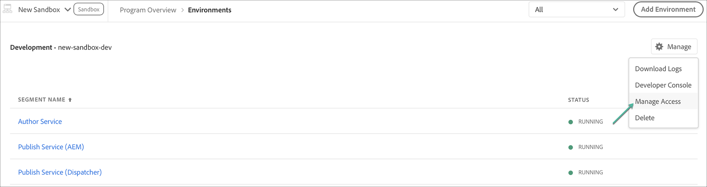

# Obtener acceso a Cloud Manager para AEM as a Cloud Service {#navigation}

Una vez que el administrador del sistema le conceda acceso a Cloud Manager, recibirá un correo electrónico que le llevará a la página de inicio de sesión de Cloud Manager a la que también se puede acceder mediante [Adobe Experience Cloud](https://my.cloudmanager.adobe.com/).

Una vez que el inicio de sesión se haya realizado correctamente, se le dirigirá a la página de aterrizaje de Cloud Manager como se muestra a continuación.

## Tareas de SysAdmin {#sysadmin-tasks}

Un usuario con la función SysAdmin puede seleccionar **Administrar acceso** para acceder directamente al Admin Console para administrar las funciones y los permisos y acceder a AEM instancias.

### Administración de funciones {#manage-roles}

Como usuario con la función SysAdmin , tiene acceso con un solo clic a la ubicación en **Admin Console** desde la que se administran las funciones de usuario o los permisos de Cloud Manager.

Consulte [Acceso a Cloud Manager](https://docs.adobe.com/content/help/en/experience-manager-cloud-service/security/ims-support.html#accessing-cloud-manager) para obtener más información sobre cómo agregar usuarios a un perfil.

>[!NOTE]
>Para algunas organizaciones a las que se les dio acceso a AEM como Cloud Service antes de enero de 2020, se les llevará a Adobe Admin Console y se tendrá que seleccionar el Perfil de productos y productos de entorno .

1. Vaya a la página de aterrizaje de Cloud Manager y haga clic en **Administrar acceso**.

   

1. Una vez que haga clic en **Administrar acceso**, navegará a **Admin Console** desde donde podrá administrar las funciones de usuario o los permisos en Cloud Manager.

   

### Administración del acceso a la instancia de autor {#manage-access-aem}

Como usuario con la función SysAdmin, tiene acceso con un solo clic al **Admin Console** desde donde puede desplazarse directamente a la instancia de autor y administrar el acceso.

>[!NOTE]
>Para algunas organizaciones a las que se les dio acceso a AEM como Cloud Service antes de enero de 2020, se les llevará a Adobe Admin Console y se tendrá que seleccionar el Perfil de productos y productos de entorno .

Consulte [Acceso a una instancia en AEM as a Cloud Service](https://docs.adobe.com/content/help/en/experience-manager-cloud-service/security/ims-support.html#accessing-instance-cloud-service) para obtener más información.

1. Vaya a la tarjeta **Environments** de la página **Program Overview** y haga clic en **Manage Access**.

   

   O bien,

   **Administrar** acceso también disponible en el  **** botón Administrar , si hace clic en  **** Detalles en la tarjeta  **** Entornos .

   

1. Una vez que haga clic en **Administrar acceso**, navegará a **Admin Console** desde donde tendrá acceso a la instancia de autor del entorno.

   

## Para clientes de AMS existentes {#existing-aem}

Si ya es cliente de AMS (Adobe Managed Services) y tiene acceso a Cloud Service, verá los programas existentes y el botón **Agregar programa** en la esquina superior derecha de la página de aterrizaje.

Si no ve el botón **Agregar programa** y tiene preguntas sobre el acceso al Cloud Service, póngase en contacto con el representante del Adobe.

Consulte [Añadir un nuevo programa en Cloud Service con programas existentes](/help/onboarding/getting-access-to-aem-in-cloud/first-time-login.md#existing-program) para obtener más información.

## Para nuevos clientes Cloud Service {#new-cloud-services}

Si es un nuevo cliente Cloud Service, verá el botón **Agregar programa** en la esquina superior derecha de una página de aterrizaje vacía. Desea agregar un nuevo programa a su Cloud Service.

Consulte [Añadir un nuevo programa en Cloud Service sin programas existentes](/help/onboarding/getting-access-to-aem-in-cloud/first-time-login.md#no-program) para obtener más información.

