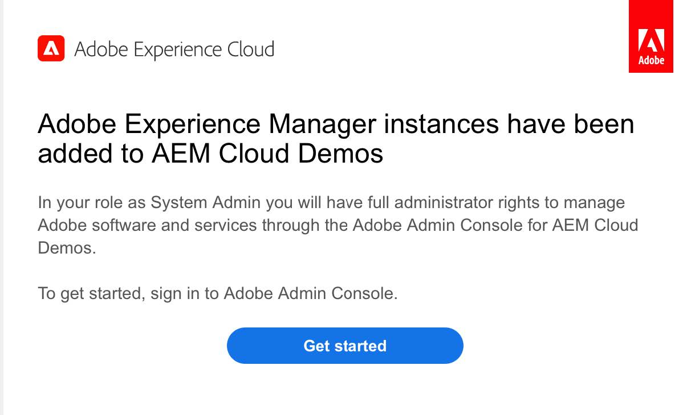

# AEM as a Cloud Service: Incorporación y acceso

En esta página se muestran los recursos informativos sobre el proceso de aprovisionamiento de Experience Manager as a Cloud Service.

## Información general sobre el proceso de aprovisionamiento de AEM as a Cloud Service

Esta sección muestra algunos de los artículos más importantes centrados en:

* Acceso a AEM as a Cloud Service
* Proceso de incorporación y aprovisionamiento de Adobe Experience Manager as a Cloud Service
* Ayuda y recursos

### Acceso a AEM as a Cloud Service

Una vez completado el aprovisionamiento automático:

* Derechos de acceso concedidos: Adobe creará una organización en Adobe Identity Management System (IMS)
* El administrador designado tendrá permisos de administrador de forma predeterminada
* El administrador puede agregar usuarios y funciones para otros integrantes del equipo a través de Admin Console
* Revise los permisos basados en funciones para los usuarios con el fin de determinar las asignaciones de permisos en Cloud Manager

> 

Para obtener más información, visite [Incorporación a Experience Manager as a Cloud Service en Experience League](https://experienceleague.adobe.com/docs/experience-manager-cloud-service/onboarding/home.html?lang=en)

### Recursos y vínculos

• [Compatibilidad con IMS para AEM as a Cloud Service](https://experienceleague.adobe.com/docs/experience-manager-cloud-service/security/ims-support.html?lang=en)\
・ [Permisos basados en roles en Cloud Manager](https://experienceleague.adobe.com/docs/experience-manager-cloud-service/onboarding/what-is-required/role-based-permissions.html?lang=en#what-is-required)\
• [Acceso a Experience Manager as a Cloud Service](https://experienceleague.adobe.com/docs/experience-manager-cloud-service/onboarding/getting-access/navigation.html?lang=en#getting-access)

## Proceso de integración de Adobe Experience Manager as a Cloud Service

### 1. Orden de compra Activa el aprovisionamiento automático.

### 2. Incorporar organizaciones a Adobe Admin Console:

>   

* Administrador del sistema:
   * Aprovisionar programas y entornos de AEM.
   * Vaya a Admin Console para tareas administrativas.
   * Reclama un dominio para confirmar la propiedad del dominio respectivo
   * Configura los directorios de usuario.
   * Configuración IDP.
* Administrador de AEM:
   * Administre grupos locales, permisos y privilegios.

### 3. Incorporar usuarios y administrar acceso en Admin Console:

>   

Tres métodos para incorporar usuarios, según el tamaño y la preferencia:
* Crear usuarios manualmente en Admin Console
* Cargar archivo .csv
* Sincronizar usuarios de enterprise Active
Directorio

### 4. El administrador configura la organización y concede a los usuarios y grupos acceso a los entornos

## Ayuda y recursos

* [Primer inicio de sesión - Servicio en la nube](https://experienceleague.adobe.com/docs/experience-manager-cloud-service/onboarding/getting-access/cloud-service-programs/first-time-login.html#getting-access)
* [Configuración del acceso a AEM as a Cloud Service](https://experienceleague.adobe.com/docs/experience-manager-learn/cloud-service/accessing/overview.html?lang=en#accessing)
