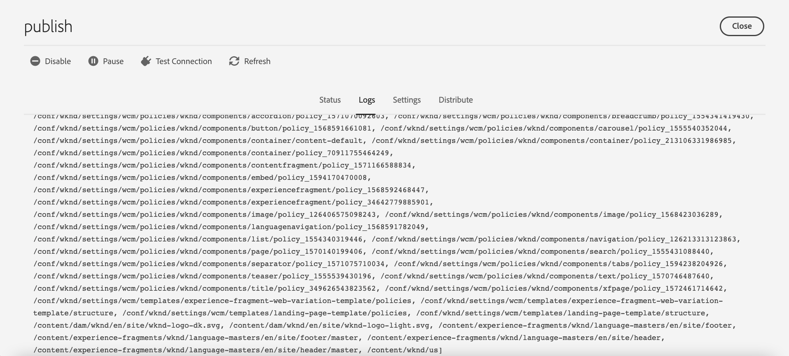

# Replicación {#replication}

Adobe Experience Manager as a Cloud Service usa la capacidad [Sling Content Distribution](https://sling.apache.org/documentation/bundles/content-distribution.html) para mover el contenido que se va a replicar a un servicio de canalización que se ejecute en Adobe Developer que esté fuera del tiempo de ejecución de AEM.

>[!NOTE]
>
>Lectura [Distribución](/help/overview/architecture.md#content-distribution) para obtener más información.

## Métodos de publicación de contenido {#methods-of-publishing-content}

>[!NOTE]
>
>Si le interesa publicar contenido en lotes, cree un flujo de trabajo con el [Paso del flujo de trabajo de activación de árbol](#tree-activation), que puede administrar de manera eficiente las cargas útiles grandes.
>&#x200B;>No se recomienda crear su propio código personalizado de publicación en lotes.
>&#x200B;>Si debe personalizar por cualquier motivo, puede almacenar en déclencheur un flujo de trabajo con este paso mediante las API de flujo de trabajo existentes.
>&#x200B;>Siempre es recomendable publicar solo el contenido que se debe publicar. Y sea prudente al no intentar publicar grandes cantidades de contenido, si no es necesario. Sin embargo, no hay límites en cuanto a la cantidad de contenido que se puede enviar a través de flujos de trabajo con el paso de flujo de trabajo de activación de árbol.

### Cancelación/publicación rápida: cancelación/publicación planeada {#publish-unpublish}

Esta función le permite publicar las páginas seleccionadas inmediatamente, sin las opciones adicionales posibles a través del enfoque Administrar publicación.

Para obtener más información, consulte [Administrar publicación](/help/sites-cloud/authoring/sites-console/publishing-pages.md#manage-publication).

### Horas de activación y desactivación: configuración del activador {#on-and-off-times-trigger-configuration}

Las posibilidades adicionales de **Tiempo de activación** y **Tiempo de inactividad** están disponibles en la [Pestaña básica de propiedades de página](/help/sites-cloud/authoring/sites-console/page-properties.md#basic).

Para realizar la replicación automática de esta característica, habilite **Replicar automáticamente** en la [configuración OSGi](/help/implementing/deploying/configuring-osgi.md) **Configuración del Déclencheur de activación/desactivación**:


### Administrar publicación     {#manage-publication}

Administrar publicación ofrece más opciones que Publicación rápida, pues permite incluir páginas secundarias, personalizar las referencias e iniciar cualquier flujo de trabajo aplicable, además de poder publicar más adelante.

Si se incluyen los elementos secundarios de una carpeta para la opción &quot;publicar más tarde&quot;, se invoca el flujo de trabajo Publicar árbol de contenido, descrito en este artículo.

Puede encontrar información más detallada sobre Administrar publicación en la [Documentación de aspectos básicos de la publicación](/help/sites-cloud/authoring/sites-console/publishing-pages.md#manage-publication).

### Etapa de flujo de trabajo de activación de árbol {#tree-activation}

El paso del flujo de trabajo de activación de árbol está diseñado para replicar de forma eficaz una jerarquía profunda de nodos de contenido. Se pone en pausa automáticamente cuando la cola crece demasiado para permitir que otras réplicas se realicen en paralelo con una latencia mínima.

Crear un modelo de flujo de trabajo que utilice el paso de proceso `TreeActivation`:

1. Desde la página de inicio de AEM as a Cloud Service, vaya a **Herramientas - Flujo de trabajo - Modelos**.
1. En la página Modelos de flujo de trabajo, presione **Crear** en la esquina superior derecha de la pantalla.
1. Agregue un título y un nombre al modelo. Para obtener más información, consulte [Creación de modelos de flujo de trabajo](https://experienceleague.adobe.com/docs/experience-manager-65/developing/extending-aem/extending-workflows/workflows-models.html?lang=es).
1. Seleccione el modelo creado de la lista y pulse **Editar**
1. En la siguiente ventana, elimine el Paso que aparece por defecto
1. Arrastre y suelte el paso Proceso en el flujo del modelo actual:

   

1. Seleccione el paso Proceso en el flujo y seleccione **Configurar** pulsando el icono de la llave inglesa.
1. Seleccione la ficha **Proceso**, seleccione `Publish Content Tree` en la lista desplegable y, a continuación, marque la casilla de verificación **Avance del controlador**

   

1. Configure cualquier parámetro adicional en el campo **Argumentos**. Se pueden unir varios argumentos separados por comas. Por ejemplo:

   `enableVersion=false,agentId=publish,chunkSize=50,maxTreeSize=500000,dryRun=false,filters=onlyModified,maxQueueSize=10`

   >[!NOTE]
   >
   >Para obtener la lista de parámetros, consulte la sección **Parámetros** a continuación.

1. Pulse **Listo** para guardar el modelo de flujo de trabajo.

**Parámetros**

| Nombre | predeterminado | descripción |
| -------------- | ------- | --------------------------------------------------------------- |
| path |         | ruta raíz desde la que comenzar |
| agentId | publicación | Nombre del agente de replicación que utilizar |
| chunkSize | 50 | Número de rutas para agrupar en una sola replicación |
| maxTreeSize | 500000 | Número máximo de nodos para que un árbol se considere pequeño |
| maxQueueSize | 10 | Número máximo de elementos en la cola de replicación |
| enableVersion | false | Activar control de versiones |
| dryRun | false | Cuando se establece en true, no se llama a la replicación |
| userId |         | solo para el trabajo. En el flujo de trabajo se utiliza el usuario que llama al flujo de trabajo |
| filtros |         | Lista de nombres de filtros de nodo. Consulte el filtro admitido a continuación |

**Filtros de soporte**

| Nombre | Descripción |
| ------------- | ------------------------------------------- |
| onlyModified | Nodos: tanto nuevos como preexistentes que se han modificado desde la última publicación |
| onlyActivated | Nodos: que se publicaron antes de la última publicación |


**Reanudar compatibilidad**

El flujo de trabajo procesa el contenido en fragmentos, cada uno de los cuales representa un subconjunto del contenido completo que se va a publicar.  Si el sistema detiene el flujo de trabajo, continuará donde lo dejó.

**Supervisar el progreso del flujo de trabajo**

1. Desde la página de inicio de AEM as a Cloud Service, vaya a **Herramientas - General - Trabajos**.
1. Observe la fila correspondiente al flujo de trabajo. La columna *progreso* proporciona una indicación del progreso de la replicación. Por ejemplo, puede mostrar 41/564 y, al actualizar, puede actualizarse a 52/564.

   


1. Si se selecciona la fila y se abre, se proporcionan detalles adicionales sobre el estado de ejecución del flujo de trabajo.

   


### Publicación del flujo de trabajo del árbol de contenido {#publish-content-tree-workflow}

>[!NOTE]
>
>Esta función queda obsoleta y prefiere el paso de activación de árbol, que es más eficiente y se puede incluir en un flujo de trabajo personalizado.

+++ Haga clic aquí para obtener más información sobre esta función obsoleta.

Puede activar una replicación de árbol seleccionando **Herramientas - Flujo de trabajo - Modelos** y copiando el modelo de flujo de trabajo integrado **Árbol de contenido de publicación**, como se muestra a continuación:


No invoque el modelo original. En su lugar, asegúrese de copiar primero el modelo e invocar esa copia.

Al igual que todos los flujos de trabajo, también se puede invocar mediante una API. Para obtener más información, vea [Interactuar con flujos de trabajo mediante programación](https://experienceleague.adobe.com/docs/experience-manager-65/developing/extending-aem/extending-workflows/workflows-program-interaction.html?lang=es#extending-aem).

También puede crear un modelo de flujo de trabajo que utilice el paso de proceso `Publish Content Tree`.

1. Desde la página de inicio de AEM as a Cloud Service, vaya a **Herramientas - Flujo de trabajo - Modelos**.
1. En la página Modelos de flujo de trabajo, presione **Crear** en la esquina superior derecha de la pantalla.
1. Agregue un título y un nombre al modelo. Para obtener más información, consulte [Creación de modelos de flujo de trabajo](https://experienceleague.adobe.com/docs/experience-manager-65/developing/extending-aem/extending-workflows/workflows-models.html?lang=es).
1. Seleccione el modelo creado de la lista y pulse **Editar**
1. En la siguiente ventana, arrastre y suelte el paso de proceso en el flujo del modelo actual:

   

1. Seleccione el paso Proceso en el flujo y seleccione **Configurar** pulsando el icono de la llave inglesa.
1. Seleccione la ficha **Proceso**, seleccione `Publish Content Tree` en la lista desplegable y, a continuación, marque la casilla de verificación **Avance del controlador**

   

1. Configure cualquier parámetro adicional en el campo **Argumentos**. Se pueden unir varios argumentos separados por comas. Por ejemplo:

   `enableVersion=true,agentId=publish,includeChildren=true`


   >[!NOTE]
   >
   >Para obtener la lista de parámetros, consulte la sección **Parámetros** a continuación.

1. Pulse **Listo** para guardar el modelo de flujo de trabajo.

**Parámetros**

* `includeChildren` (valor booleano, predeterminado: `false`). El valor `false` significa que solo se publica la ruta de acceso; `true` significa que también se publican las rutas secundarias.
* `replicateAsParticipant` (valor booleano, predeterminado: `false`). Si está configurado como `true`, la replicación está usando la `userid` del principal que realizó el paso del participante.
* `enableVersion` (valor booleano, predeterminado: `false`). Este parámetro determina si se crea una nueva versión tras la replicación.
* `agentId` (valor de cadena, de forma predeterminada significa que solo se utilizan agentes para la publicación). Se recomienda ser explícito sobre agentId; por ejemplo, si se establece el valor: publicar. Si se establece el agente en `preview`, se publica en el servicio de vista previa.
* `filters` (valor de cadena, predeterminado significa que todas las rutas están activadas). Los valores disponibles son los siguientes:
   * `onlyActivated`: activar solo las páginas que ya se han activado. Actúa como una forma de reactivación.
   * `onlyModified` activar solo las rutas que ya están activadas y que tienen una fecha de modificación posterior a la fecha de activación.
   * Lo anterior puede ser ORed con una barra vertical &quot;|&quot;. Por ejemplo, `onlyActivated|onlyModified`.

**Registro**

Cuando se inicia el paso del flujo de trabajo de activación de árbol, registra sus parámetros de configuración en el nivel de registro INFO. Cuando se activan las rutas, también se registra una instrucción INFO.

Se registra una instrucción INFO final después de que el paso del flujo de trabajo haya duplicado todas las rutas.

Además, puede aumentar el nivel de registro de los registradores por debajo de `com.day.cq.wcm.workflow.process.impl` a DEBUG/TRACE para obtener aún más información de registro.

Si hay errores, el paso del flujo de trabajo finaliza con un `WorkflowException`, que ajusta la excepción subyacente.

A continuación se muestran ejemplos de registros generados durante un flujo de trabajo de árbol de contenido de publicación de muestra:

```
21.04.2021 19:14:55.566 [cm-p123-e456-aem-author-797aaaf-wkkqt] *INFO* [JobHandler: /var/workflow/instances/server60/2021-04-20/brian-tree-replication-test-2_1:/content/wknd/us/en/adventures] com.day.cq.wcm.workflow.process.impl.treeactivation.TreeActivationWorkflowProcess TreeActivation options: replicateAsParticipant=false(userid=workflow-process-service), agentId=publish, chunkSize=100, filter=, enableVersion=false
```

```
21.04.2021 19:14:58.541 [cm-p123-e456-aem-author-797aaaf-wkkqt] *INFO* [JobHandler: /var/workflow/instances/server60/2021-04-20/brian-tree-replication-test-2_1:/content/wknd/us/en/adventures] com.day.cq.wcm.workflow.process.impl.ChunkedReplicator closing chunkedReplication-VolatileWorkItem_node1_var_workflow_instances_server60_2021-04-20_brian-tree-replication-test-2_1, 17 paths replicated in 2971 ms
```

+++

### API de replicación {#replication-api}

Puede publicar contenido mediante la API de replicación que aparece en AEM as a Cloud Service.

Para obtener más información, consulte la [Documentación de la API](https://javadoc.io/doc/com.adobe.aem/aem-sdk-api/latest/com/day/cq/replication/package-summary.html).

**Uso básico de la API**

```
@Reference
Replicator replicator;
@Reference
ReplicationStatusProvider replicationStatusProvider;

....
Session session = ...
// Activate a single page to all agents, which are active by default
replicator.replicate(session,ReplicationActionType.ACTIVATE,"/content/we-retail/en");
// Activate multiple pages (but try to limit it to approx 100 at max)
replicator.replicate(session,ReplicationActionType.ACTIVATE, new String[]{"/content/we-retail/en","/content/we-retail/de"});

// ways to get the replication status
Resource enResource = resourceResolver.getResource("/content/we-retail/en");
Resource deResource = resourceResolver.getResource("/content/we-retail/de");
ReplicationStatus enStatus = enResource.adaptTo(ReplicationStatus.class);
// if you need to get the status for more more than 1 resource at once, this approach is more performant
Map<String,ReplicationStatus> allStatus = replicationStatusProvider.getBatchReplicationStatus(enResource,deResource);
```

**Replicación con agentes específicos**

Al replicar recursos, como en el ejemplo anterior, solo se utilizan los agentes activos de forma predeterminada. En AEM as a Cloud Service, solo significa el agente denominado &quot;publicar&quot;, que conecta al autor con el nivel de publicación.

Para admitir la funcionalidad de previsualización, se ha agregado un nuevo agente llamado “previsualización”, que no está activo de forma predeterminada. Este agente se utiliza para conectar al autor al nivel de previsualización. Si desea replicar solo mediante el agente de vista previa, debe seleccionar explícitamente este agente de vista previa mediante un `AgentFilter`.

Consulte el siguiente ejemplo:

```
private static final String PREVIEW_AGENT = "preview";

ReplicationStatus beforeStatus = enResource.adaptTo(ReplicationStatus.class); // beforeStatus.isActivated == false

ReplicationOptions options = new ReplicationOptions();
options.setFilter(new AgentFilter() {
  @Override
  public boolean isIncluded (Agent agent) {
    return agent.getId().equals(PREVIEW_AGENT);
  }
});
// will replicate only to preview
replicator.replicate(session,ReplicationActionType.ACTIVATE,"/content/we-retail/en", options);

ReplicationStatus afterStatus = enResource.adaptTo(ReplicationStatus.class); // afterStatus.isActivated == false
ReplicationStatus previewStatus = afterStatus.getStatusForAgent(PREVIEW_AGENT); // previewStatus.isActivated == true
```

Si no proporciona dicho filtro y solo utiliza el agente “publicar”, no se utiliza el agente “previsualización” y la acción de replicación no afecta al nivel de previsualización.

El conjunto `ReplicationStatus` de un recurso solo se modifica si la acción de replicación incluye al menos un agente activo de forma predeterminada. En el ejemplo anterior, este flujo no era el caso. La replicación estaba utilizando el agente de &quot;previsualización&quot;. Por lo tanto, debe utilizar el nuevo método `getStatusForAgent()`, que permite consultar el estado de un agente específico. Este método también funciona para el agente “publicar”. Devuelve un valor no nulo si se ha realizado alguna acción de replicación con el agente proporcionado.

### Métodos de invalidación de contenido {#invalidating-content}

Puede invalidar contenido directamente utilizando Invalidación de contenido de Sling (SCD) del autor (el método preferido) o utilizando la API de replicación para invocar el agente de replicación de vaciado de Dispatcher de publicación. Consulte la página [Almacenamiento en caché](/help/implementing/dispatcher/caching.md) para obtener más información.

**Límites de capacidad de la API de replicación**

Repita menos de 100 rutas a la vez, siendo 500 el límite. Por encima del límite, se arroja un `ReplicationException`.
Si la lógica de la aplicación no requiere replicación atómica, este límite se puede superar configurando `ReplicationOptions.setUseAtomicCalls` como false, que acepta cualquier número de rutas, pero crea bloques internamente para permanecer por debajo de este límite.

El tamaño del contenido transmitido por llamada de replicación no debe superar `10 MB`. Esta regla incluye los nodos y las propiedades, pero no ningún binario (los paquetes de flujo de trabajo y los paquetes de contenido se consideran binarios).


## Solución de problemas {#troubleshooting}

Para solucionar problemas de replicación, vaya a las colas de replicación en la interfaz de usuario web del servicio de autor de AEM:

1. Desde la [navegación global](/help/sites-cloud/authoring/basic-handling.md#global-navigation) de AEM, vaya a **Herramientas** > **Implementación** > **Distribución**
1. Seleccione la tarjeta **publicar**

   

1. Comprobar el estado de la cola que debería ser verde
1. Puede probar la conexión con el servicio de replicación
1. Seleccione la pestaña **Registros** que muestra el historial de publicaciones de contenido



Si no se pudo publicar el contenido, toda la publicación se revierte desde el servicio de publicación de AEM.

En ese caso, la cola principal editable muestra un estado rojo y debe revisarse para identificar qué elementos provocaron la cancelación de la publicación. Al hacer clic en esa cola, se muestran los elementos pendientes, desde los cuales se puede borrar un solo elemento o todos los elementos si es necesario.
