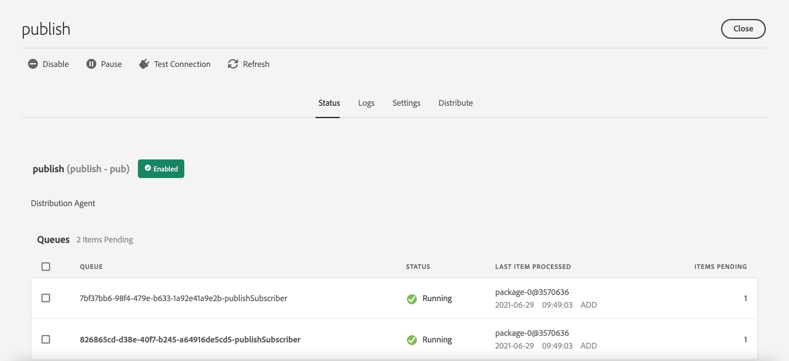

# Replicación {#replication}

Adobe Experience Manager as a Cloud Service utiliza la capacidad [Distribución de contenido de Sling](https://sling.apache.org/documentation/bundles/content-distribution.html) para mover el contenido que se va a replicar a un servicio de canalización que se ejecute en Adobe I/O que esté fuera del tiempo de ejecución de AEM.

>[!NOTE]
>
>Lectura [Distribución](/help/overview/architecture.md#content-distribution) para obtener más información.

## Métodos de publicación de contenido {#methods-of-publishing-content}

>[!NOTE]
>
>Si le interesa publicar contenido por lotes, utilice el [Flujo de trabajo Publicar árbol de contenido](#publish-content-tree-workflow).
>Este paso del flujo de trabajo está diseñado específicamente para Cloud Service y puede gestionar de forma eficaz grandes cargas útiles.
>No se recomienda crear su propio código personalizado de publicación en lotes.
>Si necesita personalizar por algún motivo, puede almacenar en déclencheur este paso de flujo de trabajo/flujo de trabajo mediante las API de flujo de trabajo existentes.
>Aunque siempre es una buena práctica publicar únicamente contenido que debe publicarse y ser prudente al no intentar publicar una gran cantidad de contenido si no es necesario, no hay límites en cuanto a la cantidad de contenido que puede enviar a través del flujo de trabajo Publicar árbol de contenido.

### Cancelación/publicación rápida: cancelación/publicación planeada {#publish-unpublish}

Esto le permite publicar las páginas seleccionadas inmediatamente, sin las opciones adicionales posibles a través del enfoque Administrar publicación.

Para obtener más información, consulte [Administrar publicación](/help/sites-cloud/authoring/fundamentals/publishing-pages.md#manage-publication).

### Horas de activación y desactivación: configuración del activador {#on-and-off-times-trigger-configuration}

Las posibilidades adicionales de **Tiempo de activación** y **Tiempo de inactividad** están disponibles en la [Pestaña básica de propiedades de página](/help/sites-cloud/authoring/fundamentals/page-properties.md#basic).

Para realizar la replicación automática para esto, debe habilitar **Replicar automáticamente** en la [Configuración de OSGi](/help/implementing/deploying/configuring-osgi.md) **Configuración del activador de activación**:


### Administrar publicación     {#manage-publication}

Administrar publicación ofrece más opciones que Publicación rápida, pues permite incluir páginas secundarias, personalizar las referencias e iniciar cualquier flujo de trabajo aplicable, además de poder publicar en un momento posterior.

Si se incluyen los elementos secundarios de una carpeta para la opción “publicar más tarde”, se invocará el flujo de trabajo Publicar árbol de contenido, descrito en este artículo.

Puede encontrar información más detallada sobre Administrar publicación en la [Documentación de aspectos básicos de la publicación](/help/sites-cloud/authoring/fundamentals/publishing-pages.md#manage-publication).

### Publicación del flujo de trabajo del árbol de contenido {#publish-content-tree-workflow}

Puede activar una replicación de árbol seleccionando **Herramientas - Flujo de trabajo - Modelos** y copiando el modelo de flujo de trabajo integrado **Árbol de contenido de publicación**, como se muestra a continuación:


No modifique ni invoque el modelo original. En su lugar, asegúrese de copiar primero el modelo y luego modificar o invocar esa copia.

Al igual que todos los flujos de trabajo, también se puede invocar mediante una API. Para obtener más información, consulte [Interactuar con flujos de trabajo mediante programación](https://experienceleague.adobe.com/docs/experience-manager-65/developing/extending-aem/extending-workflows/workflows-program-interaction.html?lang=es#extending-aem).

También puede conseguirlo creando un modelo de flujo de trabajo que utilice el `Publish Content Tree` paso del proceso:

1. Desde la página de inicio as a Cloud Service de AEM, vaya a **Herramientas - Flujo de trabajo - Modelos**
1. En la página Modelos de flujo de trabajo, pulse **Crear** en la esquina superior derecha de la pantalla
1. Agregue un título y un nombre al modelo. Para obtener más información, consulte [Creación de modelos de flujo de trabajo](https://experienceleague.adobe.com/docs/experience-manager-65/developing/extending-aem/extending-workflows/workflows-models.html?lang=es)
1. Seleccione el modelo recién creado de la lista y pulse **Editar**
1. En la siguiente ventana, arrastre y suelte el paso de proceso en el flujo del modelo actual:

   

1. Haga clic en el paso Proceso del flujo y seleccione **Configurar** pulsando el icono de la llave inglesa
1. Haga clic en la pestaña **Proceso** y seleccione `Publish Content Tree` en la lista desplegable, luego marque la **Avance del controlador** casilla de verificación

   

1. Configure cualquier parámetro adicional en el campo **Argumentos**. Los argumentos separados por comas múltiples se pueden agrupar. Por ejemplo:

   `enableVersion=true,agentId=publish,includeChildren=true`


   >[!NOTE]
   >
   >Para obtener la lista de parámetros, consulte la sección **Parámetros** a continuación.

1. Pulse **Listo** para guardar el modelo de flujo de trabajo.

**Parámetros**

* `includeChildren` (valor booleano, predeterminado: `false`). false significa que solo se publica la ruta. true significa que las tareas secundarias también se publican.
* `replicateAsParticipant` (valor booleano, predeterminado: `false`). Si está configurado como `true`, la replicación está usando la `userid` del principal que realizó el paso del participante.
* `enableVersion` (valor booleano, predeterminado: `true`). Este parámetro determina si se crea una nueva versión tras la replicación.
* `agentId` (valor de cadena, de forma predeterminada significa que solo se utilizan agentes para la publicación). Se recomienda ser explícito sobre agentId; por ejemplo, si se establece el valor: publicar. Configuración del agente en `preview` se publicará en el servicio de previsualización
* `filters` (valor de cadena, predeterminado significa que todas las rutas están activadas). Los valores disponibles son los siguientes:
   * `onlyActivated` - activar solo las páginas que (ya) se han activado. Actúa como una forma de reactivación.
   * `onlyModified` activar solo las rutas que ya están activadas y que tienen una fecha de modificación posterior a la fecha de activación.
   * Lo anterior puede ser ORed con una barra vertical &quot;|&quot;. Por ejemplo, `onlyActivated|onlyModified`.

**Registro**

Cuando se inicie el paso del flujo de trabajo de activación del árbol, registrará sus parámetros de configuración en el nivel de registro INFO. Cuando se activan las rutas, también se registra una instrucción INFO.

A continuación, se registra una instrucción INFO final después de que el paso del flujo de trabajo haya duplicado todas las rutas.

Además, puede aumentar el nivel de registro de los registradores siguientes `com.day.cq.wcm.workflow.process.impl` a DEBUG/TRACE para obtener aún más información de registro.

En caso de errores, el paso del flujo de trabajo finaliza con un `WorkflowException`, que ajusta la excepción subyacente.

A continuación, se muestran ejemplos de registros generados durante un flujo de trabajo de árbol de contenido de publicación de muestra:

```
21.04.2021 19:14:55.566 [cm-p123-e456-aem-author-797aaaf-wkkqt] *INFO* [JobHandler: /var/workflow/instances/server60/2021-04-20/brian-tree-replication-test-2_1:/content/wknd/us/en/adventures] com.day.cq.wcm.workflow.process.impl.treeactivation.TreeActivationWorkflowProcess TreeActivation options: replicateAsParticipant=false(userid=workflow-process-service), agentId=publish, chunkSize=100, filter=, enableVersion=false
```

```
21.04.2021 19:14:58.541 [cm-p123-e456-aem-author-797aaaf-wkkqt] *INFO* [JobHandler: /var/workflow/instances/server60/2021-04-20/brian-tree-replication-test-2_1:/content/wknd/us/en/adventures] com.day.cq.wcm.workflow.process.impl.ChunkedReplicator closing chunkedReplication-VolatileWorkItem_node1_var_workflow_instances_server60_2021-04-20_brian-tree-replication-test-2_1, 17 paths replicated in 2971 ms
```

**Reanudar compatibilidad**

El flujo de trabajo procesa el contenido en fragmentos, cada uno de los cuales representa un subconjunto del contenido completo que se va a publicar. Si, por cualquier motivo, el sistema detiene el flujo de trabajo, se reiniciará y procesará el fragmento que aún no se haya procesado. Una sentencia de registro indicará que el contenido se ha reanudado desde una ruta específica.

### API de replicación {#replication-api}

Puede publicar contenido mediante la API de replicación que aparece en AEM as a Cloud Service.

Para obtener más información, consulte la [Documentación de la API](https://javadoc.io/doc/com.adobe.aem/aem-sdk-api/latest/com/day/cq/replication/package-summary.html).

**Uso básico de la API**

```
@Reference
Replicator replicator;
@Reference
ReplicationStatusProvider replicationStatusProvider;

....
Session session = ...
// Activate a single page to all agents, which are active by default
replicator.replicate(session,ReplicationActionType.ACTIVATE,"/content/we-retail/en");
// Activate multiple pages (but try to limit it to approx 100 at max)
replicator.replicate(session,ReplicationActionType.ACTIVATE, new String[]{"/content/we-retail/en","/content/we-retail/de"});

// ways to get the replication status
Resource enResource = resourceResolver.getResource("/content/we-retail/en");
Resource deResource = resourceResolver.getResource("/content/we-retail/de");
ReplicationStatus enStatus = enResource.adaptTo(ReplicationStatus.class);
// if you need to get the status for more more than 1 resource at once, this approach is more performant
Map<String,ReplicationStatus> allStatus = replicationStatusProvider.getBatchReplicationStatus(enResource,deResource);
```

**Replicación con agentes específicos**

Al replicar recursos, como en el ejemplo anterior, solo se utilizan los agentes activos de forma predeterminada. En AEM as a Cloud Service, solo será el agente denominado &quot;publicar&quot;, que conecta al autor con el nivel de publicación.

Para admitir la funcionalidad de previsualización, se ha agregado un nuevo agente llamado “previsualización”, que no está activo de forma predeterminada. Este agente se utiliza para conectar al autor al nivel de previsualización. Si desea duplicar solo a través del agente de previsualización, debe seleccionar explícitamente este agente de previsualización a través de un `AgentFilter`.

Consulte el ejemplo siguiente sobre cómo hacerlo:

```
private static final String PREVIEW_AGENT = "preview";

ReplicationStatus beforeStatus = enResource.adaptTo(ReplicationStatus.class); // beforeStatus.isActivated == false

ReplicationOptions options = new ReplicationOptions();
options.setFilter(new AgentFilter() {
  @Override
  public boolean isIncluded (Agent agent) {
    return agent.getId().equals(PREVIEW_AGENT);
  }
});
// will replicate only to preview
replicator.replicate(session,ReplicationActionType.ACTIVATE,"/content/we-retail/en", options);

ReplicationStatus afterStatus = enResource.adaptTo(ReplicationStatus.class); // afterStatus.isActivated == false
ReplicationStatus previewStatus = afterStatus.getStatusForAgent(PREVIEW_AGENT); // previewStatus.isActivated == true
```

Si no proporciona dicho filtro y solo utiliza el agente “publicar”, no se utiliza el agente “previsualización” y la acción de replicación no afecta al nivel de previsualización.

El conjunto `ReplicationStatus` de un recurso solo se modifica si la acción de replicación incluye al menos un agente activo de forma predeterminada. En el ejemplo anterior, este no es el caso, ya que la replicación está utilizando el agente de “previsualización”. Por lo tanto, debe utilizar el nuevo método `getStatusForAgent()`, que permite consultar el estado de un agente específico. Este método también funciona para el agente “publicar”. Devuelve un valor no nulo si se ha realizado alguna acción de replicación con el agente proporcionado.

### Métodos de invalidación de contenido {#invalidating-content}

Puede invalidar contenido directamente utilizando Invalidación de contenido de Sling (SCD) del autor (el método preferido) o utilizando la API de replicación para invocar el agente de replicación de vaciado del despachante de publicación. Consulte la [Almacenamiento en caché](/help/implementing/dispatcher/caching.md) para obtener más información.

**Límites de capacidad de la API de replicación**

Se recomienda duplicar menos de 100 rutas a la vez, siendo 500 el límite estricto. Por encima del límite duro, se arroja una `ReplicationException`.
Si la lógica de la aplicación no requiere replicación atómica, este límite se puede superar configurando la variable `ReplicationOptions.setUseAtomicCalls` como falsa, que acepta cualquier cantidad de rutas, pero crea bloques internamente para permanecer por debajo de este límite.

El tamaño del contenido transmitido por llamada de replicación no debe superar `10 MB`. Esto incluye los nodos y las propiedades, pero no ningún binario (los paquetes de flujo de trabajo y los paquetes de contenido se consideran binarios).


## Solución de problemas {#troubleshooting}

Para solucionar problemas de replicación, vaya a las colas de replicación en la interfaz de usuario web del servicio de autor de AEM:

1. En el menú Inicio de AEM vaya a **Herramientas > Implementación > Distribución**
2. Seleccione la tarjeta **publicar**
   
3. Comprobar el estado de la cola que debería ser verde
4. Puede probar la conexión con el servicio de replicación
5. Seleccione la pestaña **Registros** que muestra el historial de publicaciones de contenido


Si no se pudo publicar el contenido, toda la publicación se revierte desde el servicio de publicación de AEM.
En ese caso, la cola principal editable mostrará un estado rojo y debe revisarse para identificar qué elemento provocó la cancelación de la publicación. Al hacer clic en esa cola, se mostrarán los elementos pendientes, desde los cuales se puede borrar un solo artículo o todos los elementos si es necesario.
