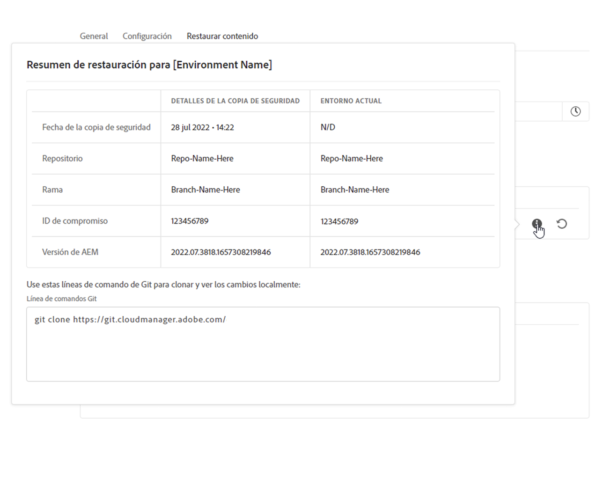
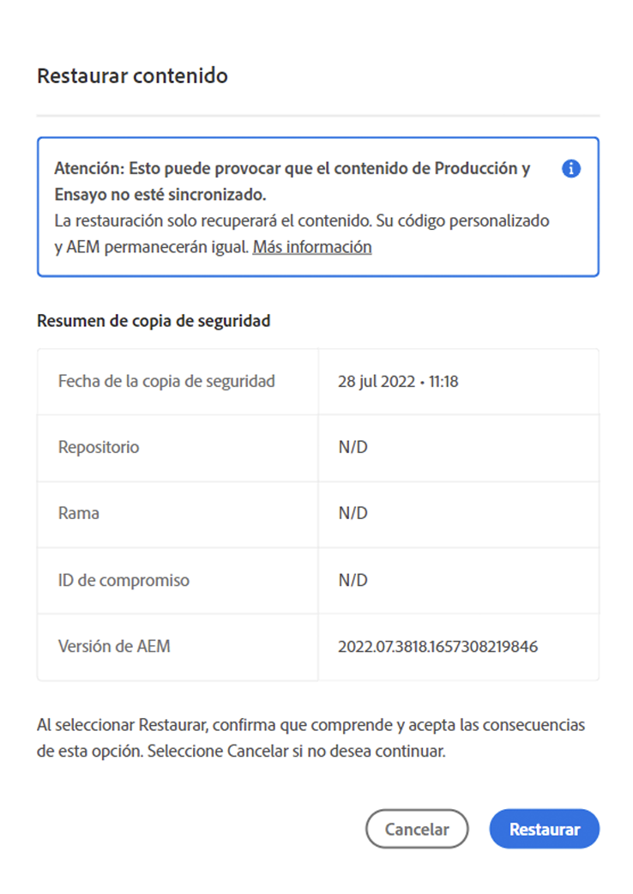
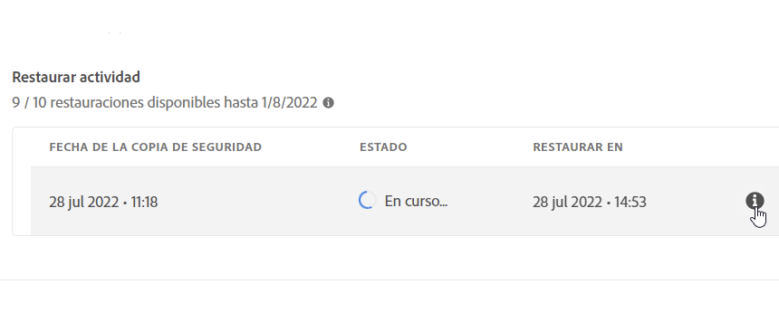

# Restauración de contenido en AEM as a Cloud Service {#content-restore}

Puede restaurar el contenido de AEM as a Cloud Service desde la copia de seguridad mediante Cloud Manager.

El proceso de restauración de autoservicio de Cloud Manager copia los datos de las copias de seguridad del sistema de Adobe y los restaura a su entorno original. Se realiza una restauración para devolver los datos que se han perdido, dañado o eliminado accidentalmente a su estado original.

El proceso de restauración solo afecta al contenido, no modifica el código ni la versión de AEM. Puede iniciar una operación de restauración de entornos individuales en cualquier momento.

Si necesita restaurar el código fuente implementado anteriormente de manera fácil y rápida, sin necesidad de iniciar una nueva ejecución de canalización, puede usar [Restaurar el código anterior implementado](/help/operations/restore-previous-code-deployed.md).

Cloud Manager ofrece dos tipos de copias de seguridad desde las que puede restaurar contenido.

* **Punto en el tiempo (PIT):** Esta opción restaura las copias de seguridad continuas capturadas en las últimas 24 horas.
* **Última semana:** este tipo restaura de las copias de seguridad del sistema en los últimos siete días, excluyendo las 24 horas anteriores.

En ambos casos, la versión del código personalizado y la versión de AEM permanecen sin cambios.

>[!TIP]
>
>También es posible restaurar copias de seguridad [mediante la API pública](https://developer.adobe.com/experience-cloud/cloud-manager/reference/api/).

>[!WARNING]
>
>* Esta función solo debe utilizarse cuando haya problemas graves con el código o el contenido.
>* Al restaurar una copia de seguridad, se eliminan los datos agregados después de dicha copia. El ensayo también vuelve a su versión anterior.
>* Antes de iniciar una restauración de contenido, considere otras opciones selectivas de restauración de contenido.

## Opciones de restauración selectiva de contenido {#selective-options}

Antes de restaurar a una restauración de contenido completa, tenga en cuenta estas opciones para restaurar el contenido con mayor facilidad.

* Si hay un paquete disponible para la ruta eliminada, instálelo de nuevo con el [Administrador de paquetes](/help/implementing/developing/tools/package-manager.md).
* Si la ruta eliminada era una página de Sites, use la [función Restaurar árbol](/help/sites-cloud/authoring/sites-console/page-versions.md).
* Si la ruta eliminada era una carpeta de recursos y los archivos originales están disponibles, vuelva a cargarlos a través de [la consola de Assets](/help/assets/add-assets.md).
* Si el contenido eliminado eran recursos, considere [restaurar versiones anteriores de los recursos](/help/assets/manage-digital-assets.md).

Si ninguna de las opciones anteriores funciona y el contenido de la ruta eliminada es significativo, realice una restauración de contenido como se detalla en las secciones siguientes.

## Crear función de usuario {#user-role}

De forma predeterminada, ningún usuario tiene permiso para ejecutar restauraciones de contenido en entornos de desarrollo, producción o ensayo. Para delegar este permiso a usuarios o grupos específicos, siga los siguientes pasos generales.

1. Cree un perfil de producto con un nombre expresivo que haga referencia a la restauración de contenido.
1. Proporcione el permiso **Acceso al programa** en el programa requerido.
1. Proporcione el permiso **Crear restauración del entorno** en el entorno requerido o en todos los entornos del programa, según el caso de uso.
1. Asigne usuarios a ese perfil.

Para obtener más información sobre la administración de permisos, consulte [Permisos personalizados](/help/implementing/cloud-manager/custom-permissions.md).

## Restauración del contenido de un entorno {#restoring-content}

>[!NOTE]
>
>Un usuario debe tener [permisos apropiados](#user-role) para iniciar una operación de restauración.

**Para restaurar el contenido de un entorno:**

1. Inicie sesión en Cloud Manager en [my.cloudmanager.adobe.com](https://my.cloudmanager.adobe.com/) y seleccione la organización adecuada.

1. Haga clic en el programa para el que desea iniciar una restauración.

1. Enumere todos los entornos para el programa mediante uno de los procedimientos siguientes:

   * En el menú del lado izquierdo, debajo de **Servicios**, haga clic en  **Entornos**.

     

   * En el menú del lado izquierdo, debajo de **Programa**, haga clic en **Información general** y, a continuación, en la tarjeta **Entornos**, haga clic en  **Mostrar todo**.

     

     >[!NOTE]
     >
     >La tarjeta **Entornos** solo enumera tres entornos. Haga clic en **Mostrar todo** en la tarjeta para ver *todos* los entornos del programa.

1. En la tabla Entornos, a la derecha de un entorno cuyo contenido desea restaurar, haga clic en  y, a continuación, haga clic en **Restaurar contenido**.

   

1. En la ficha **Restaurar contenido** de la página del entorno, en la lista desplegable **Tiempo para restaurar**, seleccione el lapso de tiempo para la restauración.

   

   * Si elige **Últimas 24 horas**, en el campo **Hora** adyacente, especifique el tiempo exacto dentro de las últimas 24 horas para la restauración.
   * Si elige **Última semana**, en el campo **Día** adyacente, seleccione una fecha en los últimos siete días, excluyendo las 24 horas anteriores.

1. Una vez seleccionada una fecha o especificada una hora, la sección **Copias de seguridad disponibles**, más abajo, muestra una lista de las copias de seguridad disponibles que se pueden restaurar.

1. Haga clic en  junto a una copia de seguridad para ver su versión de código y su versión de AEM y, a continuación, sopese el impacto de la restauración antes de seleccionar una copia de seguridad (consulte [Elegir la copia de seguridad correcta](#choosing-backup)).

   

   La marca de tiempo mostrada para las opciones de restauración se basa en la zona horaria del equipo del usuario.

1. En el extremo derecho de la fila que representa la copia de seguridad que desea restaurar, haga clic en  para iniciar el proceso de restauración.

1. Revise los detalles en el cuadro de diálogo **Restaurar contenido** y, a continuación, haga clic en **Restaurar**.

   

Se inicia el proceso de copia de seguridad. Puede ver su estado en la lista **[Actividad de restauración](#restore-activity)**. El tiempo necesario para completar una operación de restauración depende del tamaño y el perfil del contenido que se está restaurando.

Cuando la restauración se completa correctamente, el entorno hace lo siguiente:

* Ejecuta el mismo código y versión de AEM que en el momento de iniciar la operación de restauración.
* Tiene el mismo contenido que estaba disponible en la marca de tiempo de la instantánea elegida, con los índices reconstruidos para coincidir con el código actual.

## Elija la copia de seguridad correcta {#choosing-backup}

El proceso de restauración de autoservicio de Cloud Manager solo restaura el contenido en AEM. Por este motivo, debe tener en cuenta cuidadosamente los cambios que se hayan realizado en el código entre el punto de restauración deseado y el momento actual. Revise el historial de compromiso entre el ID de compromiso actual y el que se está restaurando.

Existen varios escenarios.

* El código personalizado de entorno y la restauración se encuentran en el mismo repositorio y en la misma rama.
* El código personalizado de entorno y la restauración comparten un repositorio, utilizan una rama independiente y se originan a partir de una confirmación común.
* El código personalizado de entorno y la restauración se encuentran en diferentes repositorios.
   * En este caso, no se muestra un ID de compromiso.
   * Adobe recomienda clonar ambos repositorios y utilizar una herramienta de diferenciación para comparar las ramas.

Además, tenga en cuenta que una restauración puede provocar que los entornos de producción y ensayo no estén sincronizados. Usted es responsable de las consecuencias de restaurar contenido.

## Actividad de restauración {#restore-activity}

La lista **Actividad de restauración** muestra el estado de las diez solicitudes de restauración más recientes, incluidas las operaciones de restauración activas.

Si hace clic en  para una copia de seguridad, podrá descargar los registros de dicha copia de seguridad e inspeccionar los detalles del código, incluidas las diferencias entre la instantánea y los datos en el momento en que se inició la restauración.

## Copia de seguridad fuera del sitio {#offsite-backup}

Las copias de seguridad regulares cubren el riesgo de eliminaciones accidentales o fallos técnicos en AEM Cloud Services, pero pueden surgir riesgos adicionales debido al fallo de una zona. Además de la disponibilidad, el mayor riesgo en estas interrupciones de la región es la pérdida de datos.

AEM as a Cloud Service mitiga este riesgo para todos los entornos de producción de AEM. Es decir, copia continuamente todo el contenido de AEM en una región remota. Este proceso hace que el contenido esté disponible para la recuperación durante tres meses. Esta capacidad se conoce como copia de seguridad fuera del sitio.

El ingeniería de fiabilidad del servicio de AEM restaura los entornos de ensayo y producción de AEM Cloud Service a partir de copias de seguridad fuera del sitio durante las interrupciones de la región de datos.

## Restricciones     {#limitations}

El uso del mecanismo de restauración de autoservicio está sujeto a las siguientes limitaciones.

* Las operaciones de restauración están limitadas a siete días, lo que significa que no es posible restaurar una instantánea con más de esa antigüedad.
* Se permiten un máximo de diez restauraciones exitosas en todos los entornos de un programa por mes calendario.
* Después de la creación del entorno, la primera instantánea de copia de seguridad tarda seis horas en producirse. Hasta que se genera esta, no se puede llevar a cabo ninguna restauración en el entorno.
* No se inicia una operación de restauración si hay una pila completa o una canalización de configuración de nivel web que se esté ejecutando para el entorno.
* No se puede iniciar una restauración si ya se está ejecutando otra en el mismo entorno.
* En casos excepcionales, debido al límite de copias de seguridad de 24 horas y siete días, es posible que la copia de seguridad seleccionada no esté disponible por un retraso entre el momento en que se seleccionó y el momento en que se inició la restauración.
* Los datos de los entornos eliminados se pierden de forma permanente y no se pueden recuperar.
