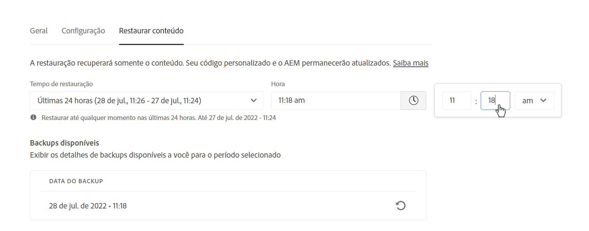

# Restauración de contenidos en AEM as a Cloud Service {#content-restore}

Obtenga información sobre cómo restaurar el contenido de AEM as a Cloud Service desde la copia de seguridad mediante Cloud Manager.

>[!NOTE]
>
>Esta función solo está disponible para [el programa de usuarios pioneros](/help/implementing/cloud-manager/release-notes/current.md#early-adoption) y tiene ciertas limitaciones además de las documentadas en el artículo. En la fase de adopción temprana:
>
>* La función solo está disponible en entornos de desarrollo.
>* Las restauraciones de contenido están limitadas a dos al mes por programa.
>
>AEM Para obtener más información sobre el sistema de copia de seguridad y restauración existente para el as a Cloud Service de la, consulte el documento [AEM Copia de seguridad y restauración en as a Cloud Service](/help/operations/backup.md)

## Información general {#overview}

El proceso de restauración de autoservicio de Cloud Manager copia los datos de las copias de seguridad del sistema de Adobe y los restaura a su entorno original. Se realiza una restauración para devolver los datos que se han perdido, dañado o eliminado accidentalmente a su estado original.

El proceso de restauración solo afecta al contenido, no modifica el código ni la versión de AEM. Puede iniciar una operación de restauración de entornos individuales en cualquier momento.

Cloud Manager ofrece dos tipos de copias de seguridad desde las que puede restaurar contenido.

* **Punto en el tiempo (PIT):** Este tipo restaura a partir de las copias de seguridad continuas del sistema de las últimas 24 horas desde el momento actual.
* **Última semana:** este tipo restaura de las copias de seguridad del sistema en los últimos siete días, excluyendo las 24 horas anteriores.

AEM En ambos casos, la versión del código personalizado y la versión de la permanecen sin cambios.

>[!TIP]
>
>También es posible restaurar copias de seguridad [mediante la API pública.](https://developer.adobe.com/experience-cloud/cloud-manager/reference/api/)

## Restauración de contenido {#restoring-content}

En primer lugar, determine el lapso de tiempo del contenido que desea restaurar. A continuación, para restaurar el contenido de su entorno desde una copia de seguridad, siga estos pasos.

>[!NOTE]
>
>Un usuario con **Propietario del negocio** o **Administrador de implementación** La función debe estar conectada para iniciar una operación de restauración.

1. Inicie sesión en Cloud Manager en [my.cloudmanager.adobe.com](https://my.cloudmanager.adobe.com/) y seleccione la organización adecuada.

1. Haga clic en el programa para el que desea iniciar una restauración.

1. Desde el **Resumen del programa** , en la **Entornos** , haga clic en el botón de los tres puntos situado junto al entorno para el que desea iniciar una restauración y seleccione **Restaurar contenido**.

   

   * También puede navegar directamente a la pestaña **Restaurar contenido** de la página de detalles de un entorno específico.

1. En la pestaña **Restaurar contenido** de la página de detalles del entorno, seleccione primero el lapso de tiempo de la restauración en la lista desplegable **Tiempo para la restauración**.

   1. Si selecciona **Últimas 24 horas** la vecina **Hora** El campo permite especificar el tiempo exacto dentro de las últimas 24 horas para la restauración.

      

   1. Si selecciona **Última semana** la vecina **Día** El campo permite seleccionar una fecha en los últimos siete días, excluidas las 24 horas anteriores.

      

1. Una vez seleccionada una fecha o especificada una hora, la sección **Copias de seguridad disponibles**, más abajo, muestra una lista de las copias de seguridad disponibles que se pueden restaurar.

   

1. Busque la copia de seguridad que desea restaurar mediante el icono de información para ver información sobre la versión del código y la versión de AEM que se incluye en la copia de seguridad y tenga en cuenta las implicaciones de una restauración cuando [seleccione la copia de seguridad.](#choosing-the-right-backup)

   

   * Tenga en cuenta que la marca de tiempo mostrada para las opciones de restauración se basa en la zona horaria del equipo del usuario.

1. Haga clic en el icono **Restaurar** en el extremo derecho de la fila que representa la copia de seguridad que desea restaurar para iniciar el proceso de restauración.

1. Consulte los detalles en el cuadro de diálogo **Restaurar contenido** antes de confirmar la solicitud haciendo clic en **Restaurar**.

   

El proceso de copia de seguridad se inicia y puede ver su estado en la **[Actividad de restauración](#restore-activity)** lista. El tiempo necesario para completar una operación de restauración depende del tamaño y el perfil del contenido que se está restaurando.

Cuando la restauración se complete correctamente, el entorno hará lo siguiente:

* Ejecutará el mismo código y versión de AEM que en el momento de iniciar la operación de restauración.
* Tendrá el mismo contenido que estaba disponible en la marca de tiempo de la instantánea elegida, con los índices reconstruidos para coincidir con el código actual.

## Elección de la copia de seguridad adecuada {#choosing-backup}

AEM El proceso de restauración de autoservicio de Cloud Manager solo restaura el contenido a los recursos de la. Por este motivo, debe tener en cuenta cuidadosamente los cambios que se hayan realizado en el código entre el punto de restauración deseado y el momento actual revisando el historial de compromiso entre el ID de compromiso actual y el que se está restaurando.

Existen varios escenarios.

* El código personalizado en el entorno y la restauración se encuentran en el mismo repositorio y en la misma rama.
* El código personalizado en el entorno y la restauración se encuentran en el mismo repositorio, pero en una rama diferente con un compromiso común.
* El código personalizado del entorno y la restauración se encuentran en diferentes repositorios.
   * En este caso, no se mostrará un ID de compromiso.
   * Se recomienda clonar ambos repositorios y utilizar una herramienta de diferenciación para comparar las ramas.

Además, tenga en cuenta que una restauración puede causar que los entornos de producción y ensayo no estén sincronizados. Usted es responsable de las consecuencias de restaurar contenido.

## Actividad de restauración {#restore-activity}

El **Actividad de restauración** La lista muestra el estado de las diez solicitudes de restauración más recientes, incluidas las operaciones de restauración activas.

Al hacer clic en el icono de información de una copia de seguridad, puede descargar registros para ella, así como inspeccionar los detalles del código, incluidas las diferencias entre la instantánea y los datos en el momento en que se inició la restauración.

## Copia de seguridad fuera del sitio {#offsite-backup}

Las copias de seguridad regulares cubren el riesgo de eliminaciones accidentales o fallos técnicos en AEM Cloud Services, pero pueden surgir riesgos adicionales debido al fallo de una zona. Además de la disponibilidad, el mayor riesgo en estas interrupciones de la región es la pérdida de datos.

AEM as a Cloud Service mitiga este riesgo para todos los entornos de producción de AEM copiando continuamente todo el contenido de AEM en una región remota y poniéndolo a disposición para su recuperación durante un período de tres meses. Esta capacidad se denomina copia de seguridad fuera del sitio.

La restauración de AEM Cloud Services para entornos de ensayo y producción a partir de copias de seguridad fuera del sitio la realiza ingeniería de fiabilidad del servicio AEM, en caso de interrupciones en la región de datos.

## Restricciones     {#limitations}

El uso del mecanismo de restauración de autoservicio está sujeto a las siguientes limitaciones.

* Las operaciones de restauración están limitadas a siete días, lo que significa que no es posible restaurar una instantánea con más de esa antigüedad.
* Se permiten un máximo de diez restauraciones exitosas en todos los entornos de un programa por mes calendario.
* Después de la creación del entorno, la primera instantánea de copia de seguridad tarda seis horas en producirse. Hasta que se genera esta, no se puede llevar a cabo ninguna restauración en el entorno.
* Una operación de restauración no se iniciará si hay una pila completa o una canalización de configuración de nivel web que se esté ejecutando para el entorno.
* No se puede iniciar una restauración si ya se está ejecutando otra en el mismo entorno.
* En casos excepcionales, debido al límite de copias de seguridad de 24 horas y siete días, es posible que la copia de seguridad seleccionada no esté disponible por un retraso entre el momento en que se seleccionó y el momento en que se inició la restauración.
* Los datos de los entornos eliminados se pierden de forma permanente y no se pueden recuperar.
