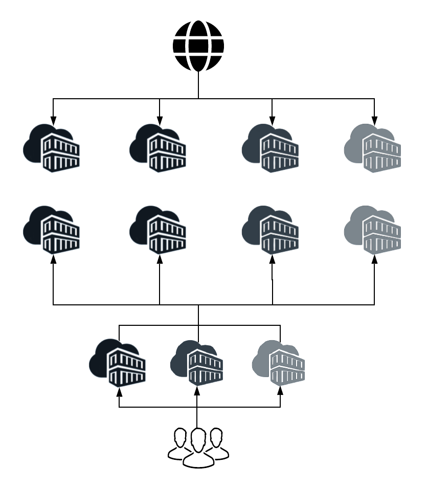

# Introducción a la arquitectura de Adobe Experience Manager as a Cloud Service {#an-introduction-to-the-architecture-adobe-experience-manager-as-a-cloud-service}

>[!CONTEXTUALHELP]
>id="intro_aem_cloudservice_architecture"
>title="Introducción a la arquitectura de AEM as a Cloud Service"
>abstract="En esta pestaña, puede ver la nueva arquitectura de AEM as a Cloud Service y comprender los cambios. AEM ha resultado en una arquitectura dinámica con un número variable de imágenes, por lo que es importante tomarse un tiempo para comprender la arquitectura de la nube."
>additional-url="https://video.tv.adobe.com/v/330542/" text="Información general sobre la arquitectura"

Adobe Experience Manager (AEM) as a Cloud Service ha producido cambios en la arquitectura.

## Adaptabilidad {#scaling}

AEM as a Cloud Service ahora tiene:

* Arquitectura dinámica con un número variable de imágenes de AEM.

Esta arquitectura:

* Se adapta en función del tráfico *real* y la actividad *real*.

* Tiene instancias individuales que solo se ejecutan cuando es necesario.

* Utiliza aplicaciones modulares.

* Tiene un clúster de creación predeterminado, lo que elimina el tiempo de inactividad durante las tareas de mantenimiento.

Esto permite adaptarse automáticamente a distintos patrones de uso:

Para conseguirlo, se crean del mismo modo todas las instancias de AEM as a Cloud Service (un servicio en la nube), cada una con las mismas características de tamaño predeterminadas en cuanto al número de nodos, la memoria asignada y la capacidad de CPU establecida.

AEM as a Cloud Service se basa en el uso de un motor de orquestación que:

* Controla constantemente el estado del servicio.

* Adapta dinámicamente cada una de las instancias de servicio según las necesidades reales; se puede ampliar y reducir, según corresponda.

Así pues:

* Se aplica al número de nodos, la cantidad de memoria y la capacidad de CPU asignada en cada nodo.

* Permite que AEM as a Cloud Service ajuste los patrones de tráfico a medida que cambian.

La escala de las instancias de cada inquilino del servicio se aplica a los dos ejes:

* Horizontal: el número de nodos de un servicio determinado aumenta o disminuye automáticamente, lo que permite configuraciones predeterminadas individuales.

* Vertical: la memoria asignada y la capacidad de CPU se pueden aumentar o reducir mediante la configuración de un número fijo de nodos para satisfacer los requisitos individuales según sea necesario.

## Entornos {#environments}

>[!NOTE]
>Para obtener más información, consulte [Implementación: modos de ejecución](/help/implementing/deploying/overview.md#runmodes)

AEM as a Cloud Service está disponible como instancias individuales y cada instancia representa un entorno AEM completo.

Existen tres tipos de entornos disponibles con AEM as a Cloud Service:

* **Entorno de producción**: aloja las aplicaciones para usuarios empresariales.

* **Entorno de ensayo**: siempre se asocia a un único entorno de producción individual. El entorno de ensayo se utiliza para varias pruebas de rendimiento y calidad antes de que los cambios en la aplicación se inserten en el entorno de producción.

* **Entorno de desarrollo**: permite a los desarrolladores implementar aplicaciones de AEM en las mismas condiciones de tiempo de ejecución que los entornos de ensayo y producción.

  Consulte [Administración de entornos](https://experienceleague.adobe.com/docs/experience-manager-cloud-service/implementing/using-cloud-manager/manage-environments.html?lang=es#using-cloud-manager) para obtener más información.

* **Entorno de desarrollo rápido**: permite realizar iteraciones de desarrollo rápidas para depurar código nuevo o existente.

## Programas {#programs}

Cualquier nuevo proyecto de AEM siempre está enlazado a exactamente un código base específico, donde puede almacenar tanto la configuración como el código personalizado para el proyecto. Esta información se almacena en un repositorio de código, al que se puede acceder a través de los clientes Git habituales, y que está disponible durante la creación de nuevos programas.

Un programa de AEM es el contenedor que incluye:

|  Elemento de programa |  Número |
|--- |--- |
| Repositorio de códigos (Git) |  1 |
| Imagen de línea de base (Sites o Assets) |  1 |
| Conjunto de entorno de fase y producción (individual) | 0 o 1 |
| Entornos no productivos (RDE, desarrollo o demostración) | 0 a N |
| Canalización para cada entorno | 0 o 1 |

Inicialmente, AEM as a Cloud Service dispone de dos tipos de programas:

* AEM Cloud Sites Service

* AEM Cloud Assets Service

Ambos permiten el acceso a una serie de funciones y características. La capa de creación contendrá toda la funcionalidad de Sites y Assets para todos los programas, pero los programas de Assets no tendrán una capa de publicación, ni de previsualización, de forma predeterminada.

## Arquitectura de tiempo de ejecución {#runtime-architecture}

Hay varios componentes principales de esta nueva arquitectura:

<!--- needs reworking -->

* Para AEM Sites as a Cloud Service:

   * Sigue existiendo el concepto de una capa de creación y una capa de publicación para cada entorno (de alto nivel).

   * El nivel de creador está formado por dos o más nodos dentro de un único clúster de creación. Se adapta automáticamente según la actividad de creación.

      * Los creadores y autores de contenido inician sesión en el nivel de creación de AEM para crear, editar y administrar contenido.

      * El inicio de sesión en el nivel de creación se administra mediante Adobe Identity Management Services (IMS).

      * La integración y el procesamiento de recursos utilizan un servicio de procesamiento de Assets específico.

   * El nivel de previsualización consta de un nodo de vista previa único. Se utiliza para garantizar la calidad del contenido antes de publicarlo en el nivel de publicación.

   * El nivel de publicación consta de dos o más nodos dentro de un único conjunto de servidores de publicación.

      * Los nodos pueden operar de forma independiente entre sí.

      * Cada nodo consta de un editor de AEM y un servidor web equipado con el módulo de AEM Dispatcher.

      * Se adapta automáticamente según las necesidades de tráfico del sitio.

      * De forma predeterminada hay un único conjunto de servidores de publicación en la región principal, sin embargo, pueden tener licencia [regiones de publicación adicionales](/help/operations/additional-publish-regions.md).

      * Los usuarios finales, o los visitantes del sitio, visitan el sitio web a través del servicio de AEM Publish.

* Para AEM Assets as a Cloud Service:

   * La arquitectura solo incluye un entorno de creación.

* Tanto el nivel de creación como el de publicación y el de previsualización leen y conservan el contenido desde o hacia un servicio de repositorio de contenido.

   * El nivel de publicación y el de previsualización solo leen contenido de la capa de persistencia.

   * El nivel de creación lee y escribe contenido desde y hacia la capa de persistencia.

   * El almacenamiento de blobs se comparte en los niveles de publicación, de previsualización y de creación. Los archivos no se *mueven*.

   * Cuando el contenido se aprueba desde el nivel de creación, esto indica que se puede activar, por lo que se envía a la capa de persistencia del nivel de publicación, o al de previsualización de forma opcional. Esto sucede a través del servicio de replicación, un conducto de software intermedio. Esta canalización recibe el nuevo contenido y los nodos de servicio de publicación (o de previsualización) individuales se suscriben al contenido insertado en la canalización.

     >[!NOTE]
     >
     >Para obtener más información, consulte [Replicación](/help/operations/replication.md).

   * Los desarrolladores y administradores gestionan la aplicación de AEM as a Cloud Service mediante un servicio de integración continua/entrega continua (CI/CD), disponible mediante [Cloud Manager](/help/overview/what-is-new-and-different.md#cloud-manager). Esto incluye implementaciones de código y configuración mediante el canalizador CI/CD de Cloud Manager. Cualquier elemento relacionado con la supervisión, el mantenimiento y la solución de problemas (por ejemplo, archivos de registro) está a disposición de los clientes dentro de Cloud Manager.

   * El acceso a los niveles de creación y publicación siempre se produce mediante un equilibrador de carga. Siempre está actualizado con los nodos activos de cada uno de los niveles.

   * Para el nivel de publicación y el de previsualización, también está disponible un servicio de red de entrega continua (CDN) como primer punto de entrada.

* En el caso de instancias de demostración de AEM as a Cloud Service, la arquitectura se simplifica a un solo nodo de creación. Por lo tanto, no presenta todas las características del desarrollo, la fase o el entorno de producción estándar. Esto también significa que puede haber cierto tiempo de inactividad y que no hay soporte para operaciones de copia de seguridad y restauración.

## Arquitectura de implementación {#deployment-architecture}

Cloud Manager administra todas las actualizaciones de las instancias de AEM as a Cloud Service. Es obligatorio, ya que es la única manera de generar, probar e implementar la aplicación del cliente, tanto en el nivel de creación como en los de publicación y previsualización. Estas actualizaciones las puede activar Adobe, cuando hay lista una nueva versión de AEM Cloud Service, o el cliente, cuando hay una nueva versión de su aplicación lista.

Técnicamente, esto se lleva a cabo debido al concepto de una canalización de implementación, junto con cada entorno dentro de un programa. Cuando se está ejecutando una canalización de Cloud Manager, se crea una nueva versión de la aplicación del cliente, tanto para el nivel de creación como para el de publicación y el de previsualización. Esto se logra combinando los últimos paquetes de clientes con la última imagen de línea base de Adobe. Cuando las nuevas imágenes se crean y prueban correctamente, Cloud Manager automatiza completamente el cambio a la última versión de la imagen mediante la actualización de todos los nodos de servicio mediante un patrón de actualización móvil. Esto no provoca que haya desconexiones ni para el creador ni para el servicio de publicación.

<!--- needs reworking -->

## Distribución de contenido {#content-distribution}

Adobe Experience Manager as a Cloud Service ha modificado la forma en que funciona la publicación de contenido. Con AEM as a Cloud Service, el marco de replicación de versiones anteriores de AEM ya no se utiliza para publicar páginas (se mueven los cambios de la instancia de autor a las instancias de publicación).

AEM as a Cloud Service ahora utiliza la función [Sling Content Distribution](https://sling.apache.org/documentation/bundles/content-distribution.html) para mover el contenido adecuado. Utiliza un servicio de canalización que se ejecuta en Adobe I/O, que está fuera del tiempo de ejecución de AEM.

La configuración está automatizada, incluida la autoconfiguración cuando se agregan, eliminan o reciclan nodos de publicación durante el tiempo de ejecución.

Una sola solicitud de publicación o cancelación de publicación puede incluir varios recursos, pero devuelve un solo estado aplicado a todos. Se debe realizar correctamente con todos los recursos del servicio de publicación de AEM o se produce un error en todos los casos. Esto garantiza que los recursos del servicio de publicación de AEM nunca sean incoherentes.

**Diagrama de la arquitectura de distribución de contenido de alto nivel**

## Evoluciones clave {#key-evolutions}

La nueva arquitectura de AEM as a Cloud Service presenta algunos cambios e innovaciones fundamentales en comparación con las generaciones anteriores:

* Todos los archivos (blobs) se cargan directamente y se sirven desde un almacén de datos en la nube. El flujo de bits asociado nunca pasa por el JVM de los servicios de AEM Author y Publish. Como resultado, los nodos de los servicios de AEM Author y Publish pueden tener un tamaño menor y ser más compatibles con la expectativa de una adaptabilidad automática rápida. Para los profesionales del sector empresarial, esto significa una experiencia más rápida al cargar y descargar imágenes, vídeos, etc.

* Todas las operaciones consistentes en publicar contenido ahora implican una canalización siguiendo un patrón de suscripción. El contenido publicado se inserta en varias colas de la canalización, a las que se suscriben todos los nodos del servicio de publicación. Como resultado, el nivel de creación no necesita tener en cuenta el número de nodos en el servicio de publicación; esto permite aplicar una adaptación automática rápida al nivel de publicación.

* Se ha introducido el concepto de nodo maestro para automatizar el ciclo de vida de los nodos de publicación. El nodo maestro es un nodo de publicación especializado, al que ningún usuario final tiene acceso y desde el que se crean todos los nodos del servicio de publicación. Las operaciones de mantenimiento, como la compactación, se realizan en el repositorio de contenido adjunto al nodo maestro. Los nodos de publicación se reciclan diariamente y no requieren ningún tipo de mantenimiento rutinario; en el pasado, dicho mantenimiento requería cierto tiempo de inactividad, especialmente para la instancia de creación.

* La arquitectura separa completamente el contenido de la aplicación del código de la aplicación y la configuración. Todo el código y la configuración son prácticamente inmutables y se codifican en la imagen de línea de base utilizada para crear los distintos nodos de Author y Publish. Como resultado, existe una garantía absoluta de que cada nodo es idéntico, y los cambios en el código y la configuración solo se pueden realizar de forma global mediante la ejecución de una canalización de Cloud Manager.
