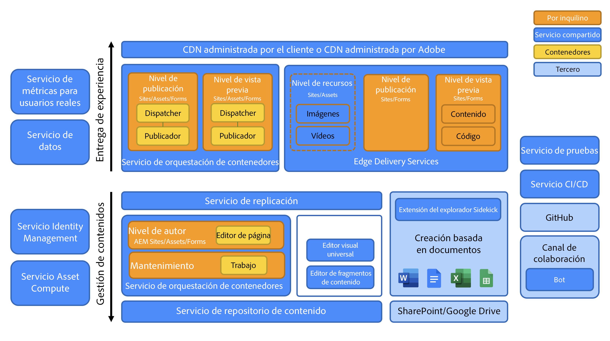

# Introducción a la arquitectura de Adobe Experience Manager as a Cloud Service {#an-introduction-to-the-architecture-adobe-experience-manager-as-a-cloud-service}

>[!CONTEXTUALHELP]
>id="intro_aem_cloudservice_architecture"
>title="Introducción a la arquitectura de AEM as a Cloud Service"
>abstract="En esta pestaña, puede ver la nueva arquitectura de AEM as a Cloud Service y comprender los cambios. AEM ha resultado en una arquitectura dinámica con un número variable de imágenes, por lo que es importante tomarse un tiempo para comprender la arquitectura de la nube."
>additional-url="https://video.tv.adobe.com/v/330542/" text="Información general sobre la arquitectura"

Adobe Experience Manager AEM () as a Cloud Service ofrece un conjunto de servicios componibles para la creación y gestión de experiencias de alto impacto.

AEM Esta página proporciona una introducción a la arquitectura lógica, la arquitectura de servicios, la arquitectura del sistema y la arquitectura de desarrollo para la arquitectura de as a Cloud Service.

## Arquitectura lógica {#logical-architecture}

AEM El as a Cloud Service está formado por soluciones de alto nivel, como AEM Sites, AEM Assets y AEM Forms. Estos servicios tienen una licencia individual, pero se pueden utilizar en colaboración. AEM Cada solución utiliza una combinación de servicios componibles proporcionados por los as a Cloud Service, según sus respectivos casos de uso.

### Programas {#programs}

AEM Las aplicaciones de la aplicación se materializan en forma de [Programa](/help/implementing/cloud-manager/getting-access-to-aem-in-cloud/program-types.md) que crea en la aplicación Cloud Manager, según sus derechos de licencia. AEM Estos programas le proporcionan control total sobre cómo se nombra, configura y asigna los permisos a la aplicación de asociada, en el contexto de un proyecto concreto.

Como cliente, normalmente se le identifica por Adobe como **inquilino**, también conocido como *Organización IMS* (Sistema Identity Management). Un inquilino puede tener tantos programas como sea necesario y tener licencia. Por ejemplo, es bastante habitual ver un programa central para AEM Assets, mientras que AEM Sites puede utilizarse en varios programas correspondientes a varias experiencias en línea.

>[!NOTE]
>
>AEM Los Edge Delivery Services de se exponen como una solución de nivel superior en Cloud Manager, a la vez que forman parte de las otras soluciones principales desde el punto de vista de las licencias. Por ejemplo, AEM Sites con Edge Delivery Services.

Un programa se puede configurar con cualquier combinación de soluciones de alto nivel, y cada solución puede admitir de uno a varios complementos. Por ejemplo, Commerce o Screens para AEM Sites, Dynamic Media o Brand Portal para AEM Assets.

### Entornos {#environments}

Una vez creado un programa con las soluciones AEM Sites, AEM Assets o AEM Forms AEM AEM, las instancias de asociadas se representarán en forma de entornos de en este programa.

Existen cuatro tipos de [entorno](/help/implementing/cloud-manager/manage-environments.md) AEM disponible con el as a Cloud Service de la:

* Entorno de producción:

   * Un entorno de producción aloja las aplicaciones para los profesionales del negocio y ejecuta las experiencias en directo.

* Entorno de ensayo:

   * Un entorno de ensayo suele estar asociado a un entorno de producción en una relación 1:1.
   * El entorno de ensayo está diseñado principalmente para pruebas automatizadas antes de que los cambios en la aplicación se inserten en el entorno de producción.
      * Esto es independiente de los cambios que se inician por Adobe como parte de una actualización de mantenimiento o por las implementaciones de código.
      * También puede realizar pruebas manuales en el caso de una implementación de código.
   * El contenido del entorno de ensayo se suele mantener sincronizado con el contenido de producción mediante la función de copia de contenido de autoservicio.
* Entorno de desarrollo:
   * AEM Un entorno de desarrollo permite a los desarrolladores implementar y probar aplicaciones en las mismas condiciones de tiempo de ejecución que los entornos de ensayo y producción.
   * Los cambios pasan por una canalización de implementación que permite las mismas puertas de calidad y seguridad del código que en las canalizaciones de implementación de producción.
* Entorno de desarrollo rápido (RDE):
   * Un entorno RDE permite realizar iteraciones de desarrollo rápidas al implementar código nuevo o existente en las instancias RDE, sin pasar por una canalización de implementación formal, como se encuentra en los entornos de desarrollo normales.

### Edge Delivery Services {#logical-architecture-edge-delivery-services}

AEM Se puede configurar un programa de trabajo con la variable [Edge Delivery Services](/help/edge/overview.md) y también.

AEM Una vez configurados, los pueden hacer referencia a los repositorios de código de GitHub utilizados para crear las experiencias con los Edge Delivery Services. Como resultado, hay nuevas opciones de configuración disponibles para las experiencias asociadas. Estas incluyen la configuración de la CDN administrada por Adobe y el acceso a las métricas de licencias o a los informes de SLA.

## Arquitectura de servicios {#service-architecture}

AEM La lista de servicios de composición de alto nivel en el as a Cloud Service se puede representar con dos segmentos: Gestión de contenido y Entrega de experiencias.

Para la administración de contenido, hay dos conjuntos principales de servicios para la creación de contenido, ambos representados como *fuentes de contenido*:

* AEM Nivel de autor de la: proporciona una interfaz basada en web (con API asociadas) para la administración de contenido web. Esto funciona para ambos enfoques:
   * Encabezado: a través del editor de páginas y del editor universal
   * Sin encabezado: a través del editor de fragmentos de contenido
* Nivel de creación basado en documentos: permite crear contenido mediante aplicaciones estándar, como:
   * Microsoft Word y Excel: a través de SharePoint
   * Documentos y hojas de Google: a través de Google Drive

Para la entrega de experiencias, al utilizar AEM Sites o AEM Forms, también hay dos conjuntos principales de servicios, que no se excluyen mutuamente y que funcionan bajo una CDN administrada por Adobe compartido (red de entrega de contenido) como orígenes diferentes:

* AEM Nivel de publicación de la:
   * AEM Ejecuta una granja de editores y distribuidores de contenido estándar, lo que permite el procesamiento dinámico de páginas web y contenido de API (por ejemplo, GraphQL) ensamblados con contenido publicado.
   * Se basa principalmente en la lógica de la aplicación del lado del servidor.
* Nivel de publicación de entrega de Edge:
   * AEM Permite el procesamiento dinámico de páginas web y contenido de API a partir de varias fuentes de contenido, como el nivel de creación de documentos o el nivel de creación basado en documentos
   * Se basa en la lógica de la aplicación del lado del cliente y está diseñado para obtener el máximo rendimiento.

También están los servicios adyacentes clave:

* Nivel de activos de entrega perimetral:
   * Permite la entrega de elementos de medios aprobados y publicados de AEM Assets. Por ejemplo, imágenes y vídeos.
   * AEM Normalmente se hace referencia a los elementos de medios desde experiencias que se ejecutan en el nivel de publicación de la publicación, en el nivel de publicación Entrega perimetral o en cualquier otra aplicación de Adobe Experience Cloud integrada con AEM Assets.
* AEM El nivel de vista previa de los Edge Delivery Services y el nivel de vista previa de los:
   * AEM También están disponibles para las experiencias creadas con el nivel de publicación de o el nivel de publicación de entrega de Edge, respectivamente.
   * Permite a los autores de contenido previsualizar el contenido en contexto antes de publicar operaciones.

>[!NOTE]
>
>De forma predeterminada, los programas solo de Assets no tienen una capa de publicación ni de previsualización.

Hay otros servicios adyacentes:

* El servicio de replicación:
   * Se encuentra entre el nivel de administración de contenido y el de entrega de experiencias.
   * Es responsable de procesar la *publicar* AEM Las operaciones emitidas por los autores de contenido y que, a continuación, proporcionan el contenido publicado a los niveles de publicación (entrega a través de Edge o de la red de distribución de contenido de Adobe).

  >[!NOTE]
  >AEM AEM El servicio de replicación se ha sometido a un completo rediseño en comparación con las versiones 6.x de la aplicación, ya que el marco de trabajo de replicación de versiones anteriores de la aplicación ya no se utiliza para publicar contenido de la aplicación.
  >
  >La arquitectura más reciente se basa en una *publicación y suscripción* enfoque con colas de contenido basadas en la nube. AEM AEM En el caso del nivel de publicación de la publicación, permite que un número variable de editores se suscriba al contenido de publicación y es una parte esencial para lograr un escalado automático verdadero y rápido para los as a Cloud Service

* El servicio Repositorio de contenido:
   * AEM Lo utiliza el nivel de autor de la.
   * Es una instancia basada en la nube de un repositorio de contenido compatible con JCR, implementado por la tecnología Apache Oak.
   * La persistencia del contenido se basa principalmente en el almacenamiento en la nube basado en blob.
* El servicio CI/CD:
   * AEM Representa el subconjunto de funcionalidades de Cloud Manager dedicadas a la administración de canalizaciones de implementación en los entornos de la.
* El servicio Testing:
   * Representa la infraestructura subyacente utilizada para ejecutar:
      * pruebas funcionales,
      * Pruebas de IU: por ejemplo, en función de los scripts de Selenium o Cypress,
      * pruebas de auditoría de experiencias: por ejemplo, puntuaciones de Lighthouse,

     AEM como parte de una canalización de implementación a un entorno de, o como parte de una solicitud de extracción de GitHub a un repositorio de código de entrega de Edge.
* El servicio de datos:
   * Es responsable de exponer los datos del cliente, como las métricas de licencia (por ejemplo, Solicitudes de contenido, Almacenamiento, Usuarios) o los informes de uso (como el número de cargas y descargas).
   * Los datos del cliente se pueden exponer a través de las API y dentro de las interfaces de usuario del producto (como Cloud Manager).
* El servicio Métrica de usuario real (RUM):
   * Es responsable de recopilar las métricas clave de una experiencia del cliente (como vistas de página, elementos vitales web principales y eventos de conversión), así como de responder a las consultas asociadas (por ejemplo, vistas de página principales de un dominio determinado en los últimos 7 días).
* El servicio de cómputo de recursos:
   * Es responsable del procesamiento de imágenes, vídeos y documentos cargados; por ejemplo, archivos de PDF y Adobe Photoshop. El procesamiento puede utilizar Adobe Sensei para extraer metadatos de imagen y vídeo (como etiquetas descriptivas o tonos de color principales) y luego generar representaciones (como diferentes tamaños o formatos), con acceso a API como las API de Adobe Photoshop y Adobe Lightroom.
* El servicio Identity Management (IMS):
   * Es el lugar central responsable de administrar y autenticar los usuarios y grupos de usuarios para una aplicación de Adobe Experience Cloud AEM determinada (por ejemplo, Cloud Manager o el nivel de creación de).
   * Se accede a través de Adobe Admin Console.

## Arquitectura del sistema {#system-architecture}

### AEM Creación, previsualización y publicación de niveles de {#aem-author-preview-publish-tiers}

AEM Los niveles de autor y publicación de la se implementan como un conjunto de contenedores Docker, operados por un servicio de orquestación de contenedores estándar. La arquitectura en contenedores resultante significa un sistema completamente dinámico con un número variable de pods, según la actividad real (para la administración de contenido) y el tráfico real (para la entrega de experiencias). AEM Esto permite a los as a Cloud Service adaptarse a los patrones de tráfico a medida que cambian.

AEM AEM El nivel de Author de la funciona como un clúster de pods de creación de la aplicación que comparten un único repositorio de contenido. Un mínimo de dos pods permite la continuidad del negocio mientras se ejecutan las tareas de mantenimiento o mientras se produce un proceso de implementación.

AEM AEM El nivel Publicación de la funciona como una granja de instancias de publicación de la publicación de la publicación, cada una con su propio repositorio de contenido publicado. AEM Cada publicador está acoplado a una sola instancia de Apache equipada con el módulo de Dispatcher de para obtener una vista materializada del contenido, que sirve como origen de la CDN administrada por el Adobe. Un mínimo de dos pods también permite la continuidad del negocio, pero no es inusual ver este número expandiéndose en períodos de alto tráfico.

AEM AEM El nivel de vista previa de la está formado por un solo nodo de. Se utiliza para garantizar la calidad del contenido antes de publicarlo en el nivel de publicación. Los tiempos de inactividad ocasionales, especialmente durante las implementaciones, pueden producirse en el nivel de vista previa.

### Edge Delivery Services {#system-architecture-edge-delivery-services}

Los Edge Delivery Services funcionan sobre una CDN e infraestructura sin servidor para ensamblar las páginas de la manera más eficiente. Cuando se solicita un recurso, la infraestructura sin servidor es responsable de convertir el contenido publicado en HTML semántico y sirve como origen para la CDN.

La conversión a HTML AEM semántico se produce a partir del contenido publicado servido desde el nivel de creación de la publicación o desde el entorno de creación basado en documentos de la publicación de la publicación de la publicación de la documentación de.

El diagrama siguiente ilustra cómo se puede editar el contenido de Sites en Microsoft Word (creación basada en documentos) y publicarlo en Edge Delivery. AEM También muestra el método de publicación tradicional de la publicación de la utilizando los diversos editores.

Como los Edge Delivery Services forman parte de Adobe Experience Manager y, como tales, Edge Delivery, AEM Sites y AEM Assets pueden coexistir en el mismo dominio. Este es un caso de uso común para sitios web más grandes. Por ejemplo, es posible que un cliente desee migrar una página concreta con mucho tráfico a los Edge Delivery Services AEM, mientras que el resto de páginas podrían permanecer en el nivel de publicación de la.

## Arquitectura de desarrollo {#development-architecture}

### Repositorios de código {#code-repositories}

AEM El código y la configuración de los proyectos de se almacenan en un repositorio de código, desde el cual se emiten canalizaciones de implementación cuando se realizan cambios. Existen diferentes tipos de repositorios de código:

* AEM pila completa de:
   * AEM Para almacenar el código Java del lado del servidor y las configuraciones OSGI para los niveles de creación y publicación de la.
* AEM extremo delantero:
   * Para almacenar código JS, CSS y HTML AEM del lado del cliente para los niveles de autor y publicación de la.
Para obtener más información sobre clientlibs, consulte [AEM Uso de bibliotecas del lado del cliente en el as a Cloud Service.](/help/implementing/developing/introduction/clientlibs.md)
* AEM Nivel web de la:
   * AEM Almacena los archivos de configuración de Dispatcher para el nivel de publicación de la.
* AEM Configuración de la:
   * AEM Permite almacenar varias opciones de configuración (como la configuración de CDN o la configuración de tareas de mantenimiento) para el nivel de publicación de la publicación y el nivel de publicación de los Edge Delivery Services.
* AEM Entrega de borde de:
   * Para almacenar el código JS, CSS y HTML del lado del cliente para los sitios creados con los Edge Delivery Services

### Canalizaciones de implementación {#deployment-pipelines}

AEM Los desarrolladores y administradores gestionan la aplicación as a Cloud Service de la mediante un servicio de integración continua/entrega continua (CI/CD), disponible mediante Cloud Manager. Cloud Manager también expone todo lo relacionado con la monitorización, el mantenimiento, la resolución de problemas (por ejemplo, el acceso a los archivos de registro) y las licencias.

AEM Cloud Manager administra todas las actualizaciones de las instancias de la aplicación as a Cloud Service de la. Es obligatorio, ya que es la única manera de generar, probar e implementar la aplicación del cliente en los niveles de autor, vista previa y publicación. Estas actualizaciones se pueden activar por Adobe, cuando hay lista una nueva versión de AEM Cloud Service, o por su cuenta, cuando hay una nueva versión de la aplicación lista.

Esto se implementa mediante una canalización de implementación, junto con cada entorno dentro de un programa. Cuando se está ejecutando una canalización de Cloud Manager, se crea una nueva versión de la aplicación del cliente, tanto para el nivel de creación como para el de publicación. Esto se logra combinando los últimos paquetes de clientes con la última imagen de línea base de Adobe.

La canalización de implementación se activa cuando los clientes realizan cambios en el código o cuando Adobe implementa una nueva versión de mantenimiento.

En ambos casos, se ejecuta el mismo conjunto de pruebas automatizadas. Se compone de pruebas:

* aportado por el Adobe para garantizar la integridad del producto
* pruebas aportadas por el cliente
   * AEM Pruebas funcionales: a través de solicitudes http al nivel de autor o publicación de la
   * Pruebas de IU: basadas en la tecnología Selenium o Cypress

Estas pruebas automatizadas se ejecutan en el entorno de ensayo, por lo que es importante mantener el contenido del entorno de ensayo lo más cerca posible del contenido de la instancia de producción.

Una vez que todas las pruebas se hayan realizado correctamente, el nuevo código se implementará en el entorno de producción.

### Actualizaciones móviles {#rolling-updates}

AEM Cloud Manager automatiza completamente el corte a la última versión de la aplicación de la mediante la actualización de todos los nodos de servicio mediante un patrón de actualización móvil. Esto significa que sí **sin tiempo de inactividad** para el servicio de creación o publicación.

## AEM Principales innovaciones desde la versión 6.x de {#major-innovations-since-aem-6x}

AEM La arquitectura más reciente para la creación de archivos as a Cloud Service AEM presenta algunos cambios e innovaciones fundamentales en comparación con las generaciones anteriores (la versión 6.x y la anterior), como las siguientes:

* Todos los archivos se cargan directamente y se sirven desde un almacén de datos en la nube. El flujo de bits asociado nunca pasa por el JVM de los servicios de AEM Author y Publish. AEM Como resultado, los nodos de los servicios de autor y publicación de la pueden tener un tamaño menor y, por lo tanto, ser más compatibles con la expectativa de una adaptabilidad automática rápida. Para los profesionales del sector empresarial, esto significa una experiencia más rápida al cargar y descargar imágenes, vídeos y otras tareas.

* Todas las operaciones consistentes en publicar contenido ahora implican una canalización siguiendo un patrón de suscripción. El contenido publicado se inserta en varias colas de la canalización, a las que se suscriben todos los nodos del servicio de publicación. Como resultado, el nivel de creación no necesita tener en cuenta el número de nodos en el servicio de publicación; esto permite aplicar una adaptación automática rápida al nivel de publicación.

* La arquitectura separa completamente el contenido de la aplicación del código de la aplicación y la configuración. Todo el código y la configuración son prácticamente inmutables y se codifican en la imagen de línea de base utilizada para crear los distintos nodos de Author y Publish. Como resultado, existe una garantía absoluta de que cada nodo es idéntico, y los cambios en el código y la configuración solo se pueden realizar de forma global mediante la ejecución de una canalización de Cloud Manager.

* La arquitectura incluye varios microservicios basados en tecnología sin servidor, especialmente con el tiempo de ejecución del Adobe I/O

## Información adicional {#further-information}

Consulte también lo siguiente:

* Edge Delivery Services:

   * [AEM Información general as a Cloud Service de: con Edge Delivery Services](/help/edge/overview.md)
   * [Uso de Edge Delivery Services](/help/edge/using.md)
   * [AEM Explore la arquitectura subyacente y las piezas importantes de la arquitectura as a Cloud Service con los Edge Delivery Services.](https://experienceleague.adobe.com/docs/experience-manager-learn/cloud-service/introduction/architecture.html)
