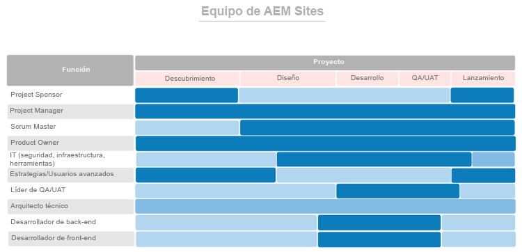

# Primero, coloque a las personas adecuadas en los roles correctos {#get-the-right-people-in-the-right-roles}

>[!CONTEXTUALHELP]
>id="aemcloud_chooseteam"
>title="Elija el equipo adecuado"
>abstract="Debe colocar a las personas adecuadas en los trabajos correctos para que la implementación de Adobe Experience Manager tenga éxito."
>additional-url="https://experienceleague.adobe.com/docs/experience-manager-cloud-service/onboarding/best-practices/aligning-kpis.html?lang=es" text="Alineación de los KPI"
>additional-url="https://experienceleague.adobe.com/docs/experience-manager-cloud-service/onboarding/best-practices/assessing-kpis.html?lang=es" text="Evaluación de los indicadores clave de rendimiento (KPI)"

Es probable que en su organización varios departamentos sean propietarios de diferentes aspectos de la experiencia digital. Sin gobierno, la fase está lista para interminables debates, luchas internas y confusión.

La gobernanza digital comienza con averiguar quién está a cargo de qué y quién está haciendo cada trabajo centrado en lo digital. Es posible que tenga que realizar alguna contratación estratégica para sumar las habilidades necesarias. Un desafío aún mayor es impulsar un cambio cultural: construir un amplio apoyo a la nueva tecnología y ayudar a la gente a acostumbrarse a nuevas formas de hacer las cosas. Una parte clave de ese esfuerzo es la creación de una comunidad digital, que permita a las personas aprender unos de otros y apoyarse entre sí.

Por ahora, nos centraremos en poner a las personas adecuadas en los trabajos correctos para impulsar la implementación de Adobe Experience Manager. Para cada producto principal (Experience Manager Sites y Experience Manager Assets), Adobe ha proporcionado una lista de funciones que se deben desempeñar, junto con las habilidades, los niveles de experiencia y los atributos que hacen que las personas sean eficaces en las distintas funciones.

Su asignación de esta semana es revisar ambas listas con su equipo de implementación y asegurarse de que tiene personas con cualificaciones relevantes en cada función.

## **Funciones principales de AEM Experience Manager Sites**

Un equipo ganador necesita nueve personas en los asientos adecuados, al igual que su equipo de implementación. Su éxito con Adobe Experience Manager Sites depende de la solidez de los integrantes del equipo y de cómo trabajen juntos. Asegúrese de que tiene estas nueve funciones asignadas
a personas con las cualificaciones sugeridas.

| Función | Habilidades | Nivel de capacidad | Cualidades |
|--- |--- |--- |--- |
| Gestor de proyectos | Certificación PMP, certificación Agile, experiencia de gestión de riesgos | Experto | Justo, coherente, responsable, organizado, positivo, accesible, dispuesto a aceptar el cambio |
| Scrum Master | Certificación ScrumMaster, certificación Agile, experiencia de facilitación | Experto | Coherente, creativo |
| Product Owner | Certificación Agile, profunda comprensión de las necesidades empresariales | Experto | Equilibrado, seguro |
| IT Leads en Seguridad, Infraestructura, Herramientas | Certificación CISM, certificación para desarrolladores de componentes de Adobe Experience Manager | Experto | Orientación al detalle |
| Encargados de estrategias/usuarios avanzados | Competencia en Adobe Experience Manager Sites | De novato a experto | Tenacidad, curiosidad, minuciosidad, mentalidad abierta, disposición al cambio, colaboración |
| QA/UAT Lead | Certificación Agile, comprensión del SDLC | De novato a intermedio | Orientación al detalle, impulso de procesos, coherencia |
| Arquitecto técnico | Experiencia en infraestructura de TI | Experto | Orientado a los detalles, impulsado por el proceso, coherente |
| Desarrollador de back-end | Certificación Agile, experiencia en programación informática y ciencias de la computación | De novato a intermedio | Orientado a los detalles, impulsado por el proceso, coherente |
| Desarrollador front-end | Certificación Agile, comprensión de HTML, CSS y JavaScript | De novato a intermedio | Orientado a los detalles, impulsado por el proceso, coherente |

Ahora que sabe qué funciones son necesarias, consulte el gráfico siguiente para ver cuándo cada función entra en juego en el proceso de implementación.

 

**Revise esta lista con su equipo de implementación** y asegúrese de tener personas con cualificaciones relevantes en cada función. Los integrantes del equipo que estén menos familiarizados con Adobe Experience Cloud pueden utilizar los recursos de aprendizaje de [Experience League](https://experienceleague.adobe.com/es?lang=es#recommended/solutions/experience-manager) para obtener una certificación en el [Aprendizaje digital de Adobe](https://learning.adobe.com/certification.html).

## **Funciones clave de AEM Experience Manager Assets**

Desde Arquitecto hasta ScrumMaster, cada función es indispensable en este equipo, incluyendo la de bibliotecario DAM.

Es posible que ya tenga a la mayoría de las personas que necesita para ejecutar una implementación correcta de Adobe Experience Manager Assets. Esta lista es similar a la de Adobe Experience Manager Sites, con una adición importante: necesitará un bibliotecario para garantizar que sus recursos digitales estén organizados y etiquetados de manera que sean fáciles de encontrar.

| Función | Habilidades | Nivel de capacidad | Cualidades |
|--- |--- |--- |--- |
| Gestor de proyectos | Certificación PMP, certificación Agile, experiencia de gestión de riesgos | Experto | Justo, coherente, responsable, organizado, positivo, accesible, dispuesto a aceptar el cambio |
| Scrum Master | Certificación ScrumMaster, certificación Agile, experiencia de facilitación | Experto | Coherente, creativo |
| Product Owner | Certificación Agile, profunda comprensión de las necesidades empresariales | Experto | Equilibrado, seguro |
| IT Leads en Seguridad, Infraestructura, Herramientas | Certificación CISM, certificación para desarrolladores de componentes de Adobe Experience Manager | Experto | Orientación al detalle |
| Encargados de estrategias/usuarios avanzados | Competencia en Adobe Experience Manager Sites | De novato a experto | Tenacidad, curiosidad, minuciosidad, mentalidad abierta, disposición al cambio, colaboración |
| QA/UAT Lead | Certificación Agile, comprensión del SDLC | De novato a intermedio | Orientación al detalle, impulso de procesos, coherencia |
| Arquitecto técnico | Experiencia en infraestructura de TI | Experto | Orientado a los detalles, impulsado por el proceso, coherente |
| Desarrollador de back-end | Certificación Agile, experiencia en programación informática y ciencias de la computación | De novato a intermedio | Orientado a los detalles, impulsado por el proceso, coherente |
| Desarrollador front-end | Certificación Agile, comprensión de HTML, CSS y JavaScript | De novato a intermedio | Orientado a los detalles, impulsado por el proceso, coherente |
| Biblioteca DAM | Antecedentes y titulación en ciencias de la biblioteca | Experto | Orientado a los detalles, impulsado por el proceso, organizado |

Ahora que sabe qué funciones son necesarias, consulte el gráfico siguiente para ver cuándo cada función entra en juego en el proceso de implementación.

 

.

>[!TIP]
>
> Obtenga más información sobre Adobe Experience Cloud y aproveche los recursos en [Experience League](https://experienceleague.adobe.com/es?lang=es#recommended/solutions/experience-manager) y obtenga la certificación mediante el [Aprendizaje digital de Adobe](https://learning.adobe.com/certification.html).
