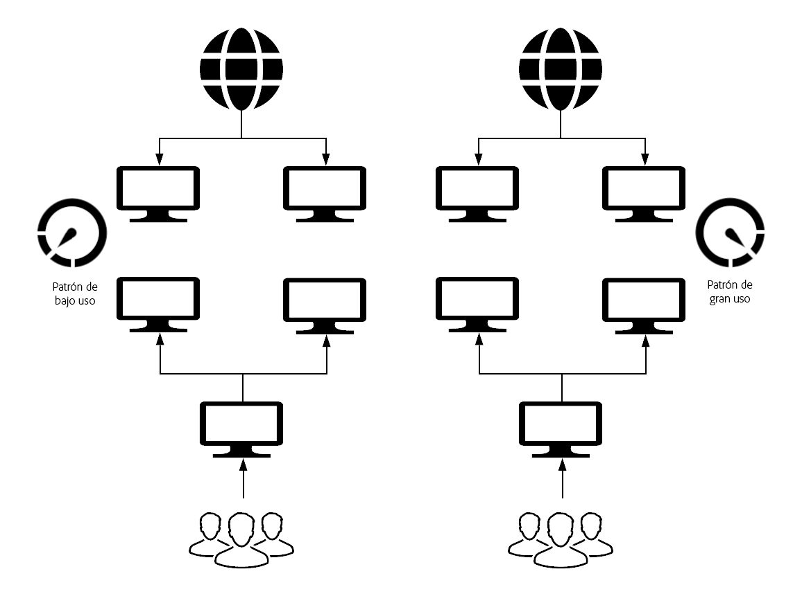

# Novedades y diferencias {#what-is-new-and-what-is-different}

Durante muchos años, AEM ha estado disponible para:

* Local

* como un servicio administrado

Existen diferencias intrínsecas entre estos enfoques anteriores y AEM como servicio de nube:

* [Arquitectura](#architecture)
* [Actualizaciones](#upgrades)
* [Cloud Manager](#cloud-manager)
* [Incorporación](#onboarding)
* [Desarrollo de](#developing)
* [Operaciones y rendimiento](#operations-and-performance)
* [Administración de identidades](#identity-management)
* [Creación de la interfaz de usuario](#authoring-user-interface)
* [AEM Sites](#aem-sites)
* [AEM Assets](#aem-assets)

>[!NOTE]
>
>Estas descripciones generales no son exhaustivas, pero tienen por objeto proporcionar una introducción.

<!-- change link when 6.5 hub page migrated -->

>[!NOTE]
>
>Para obtener más información sobre las versiones de los servicios administrados y locales, consulte el conjunto de documentación de [AEM 6.5](https://helpx.adobe.com/support/experience-manager/6-5.html).

<!-- * [Miscellaneous](#miscellaneous) -->

## Arquitectura {#architecture}

>[!NOTE]
>
>Para obtener más información, consulte [Arquitectura](/help/core-concepts/architecture.md).

<!--
### Previous Versions {#previous-versions-architecture}

Both AEM on-premise, and AEM under Managed Services used a static architecture comprised of a fixed number of machines and instances. 

These:

* Were sized for *peak* traffic (internet) and *peak* activity (marketing), which resulted in them being idle for significant periods of time:

* Were monolithic applications (the quickstart).

* Had a single author instance; which was subject to downtime during maintenance windows.

### AEM as a Cloud Service {#aem-as-a-cloud-service-architecture}
-->

AEM como servicio de nube ahora tiene:

* Arquitectura dinámica con un número variable de imágenes de AEM.

Esta arquitectura:

* Se escala en función del tráfico *real* y la actividad *real* .

* Tiene instancias individuales que solo se ejecutan cuando es necesario.

* Utiliza aplicaciones modulares.

* Tiene un clúster de creación como predeterminado; esto evita el tiempo de inactividad para tareas de mantenimiento.

Esto permite escalar automáticamente en distintos patrones de uso:

## Actualizaciones {#upgrades}

<!--
>[!NOTE]
>
>For further details see the [Deploying Introduction](/help/sites/deploying/introduction.md).
-->

<!--
### Previous Versions {#previous-versions-upgrades}

Both AEM on-premise, and AEM under Managed Services were subject to a fixed pattern of a yearly major release augmented by service packs, feature packs and hot-fixes. Often instances would run a major version for two or more years. 

Depending on the upgrade type, the process could require significant preparation consisting of analysis, development and testing, followed with a window of downtime for the actual upgrade.

### AEM as a Cloud Service {#aem-as-a-cloud-service-upgrades}
-->

AEM como servicio de nube ahora utiliza la integración continua y la entrega continua (CI/CD) para garantizar que los proyectos están completamente actualizados. Esto significa que todas las operaciones de actualización están completamente automatizadas, por lo que no es necesario interrumpir el servicio para los usuarios.

Adobe se encarga de actualizar de forma proactiva todas las instancias operativas del servicio a la versión más reciente de la base de código de AEM:

* Correcciones de errores:

   * Se puede liberar diariamente.

   * Las instancias se actualizan con frecuencia con las últimas correcciones de errores. A medida que los cambios se aplican con regularidad, el impacto es incremental, lo que reduce el impacto en el servicio.

   * La mayoría de las actualizaciones son por motivos de mantenimiento y seguridad.

* Nuevas funciones:

   * Se publicará con una programación mensual predecible.

>[!NOTE]
>
>Para obtener más información, consulte Arquitectura [de implementación](/help/core-concepts/architecture.md#deployment-architecture).

## Cloud Manager {#cloud-manager}

Adobe Cloud Manager es esencial para el enfoque de actualización continua de AEM como servicio de nube, ya que controla todas las actualizaciones de las instancias. Esto es obligatorio.

Adobe puede activar las actualizaciones cuando hay una nueva versión del servicio en la nube disponible. También puede activar las actualizaciones de la aplicación mediante las canalizaciones proporcionadas por Cloud Manager.

Cloud Manager es:

* se utiliza para administrar los programas y entornos de AEM,

* un componente esencial de AEM como servicio de nube; cada nuevo inquilino se aprovisiona primero para el acceso a Cloud Manager,

* el único punto de entrada para su personal de operaciones y desarrollo.

Específicamente, el número y el tipo de programas de AEM que se pueden crear desde el Administrador de nube se derivan de:

* del acuerdo de licencia del cliente,

* de los actores internos cuando AEM como servicio de nube se utiliza para la habilitación o formación,

* a partir de procesos impulsados por el exterior como las pruebas iniciadas desde Adobe.com.

Cloud Manager ha evolucionado como un portal de autoservicio en el que se pueden crear y configurar los componentes principales de AEM como servicio de nube:

* Creación y gestión de nuevos programas.

* Creación y administración de entornos AEM en estos programas.

* Creación y administración de las tuberías para implementar el código del cliente y la configuración relacionada en un entorno específico.

* Recibir notificaciones de eventos de ciclo vital importantes para estos componentes (por ejemplo, actualizaciones de productos).

Actualmente, Cloud Manager puede crear entornos en 3 regiones geográficas (con más regiones a continuación):

* EE.UU. (Este)

* EMEA (Países Bajos)

* APAC (Australia)

## Incorporación {#onboarding}

<!--
>[!NOTE]
>
>For further details see [Onboarding - An Overview](/help/onboarding/overview.md).
-->

<!--
### Previous Versions {#previous-versions-onboarding}

Implementing an AEM project basically followed traditional project management methods.  

### AEM as a Cloud Service {#aem-as-a-cloud-service-onboarding}

Starting and managing an AEM project is significantly easier when using AEM as a Cloud service as Adobe is responsible for many aspects:
-->

El inicio y la administración de un proyecto de AEM son sencillos cuando se utiliza AEM como servicio de nube, ya que Adobe es responsable de muchos aspectos:

* Las imágenes de AEM de línea de base están optimizadas para casos de uso específicos.

* Muchas de las tareas de configuración manual se han vuelto redundantes.

También es significativamente diferente, como ahora lo es:

* Una fase de evaluación para asegurar que se hayan cumplido todos los requisitos previos; incluyendo, por ejemplo:

   * Requisitos legales

   * Acuerdos contractuales

   * Requisitos técnicos para cualquier contenido existente o código personalizado por el cliente

* Requisitos de implementación:

   * Actualizaciones de código; cualquier aplicación para clientes desarrollada para una versión anterior de AEM deberá revisarse y posiblemente actualizarse.

   * Migración de contenido

## Desarrollo de {#developing}

>[!NOTE]
>
>Para obtener más información, comience con la documentación de las Directrices [de](/help/implementing/developing/introduction/development-guidelines.md) desarrollo.

<!--
>[!NOTE]
>
>For further details start with [The Developing Experience](/help/sites/developing/introduction/developer-experience.md, [Developing - The Basics](/help/sites/developing/introduction/the-basics.md) and [Developing Best Practices](/help/sites/best-practices/developing.md).
-->

<!--
### Previous Versions {#previous-versions-developing}
-->

<!-- needs more detail -->

<!-- 
Development was an intensive task performed locally, followed by deployment to the production instance. 

### AEM as a Cloud Service {#aem-as-a-cloud-service-developing}
-->

<!-- Will need information for new customers -->
La nueva arquitectura que admite AEM como un servicio de nube incluye algunos cambios clave en la experiencia general del desarrollador. Uno de los principales objetivos de AEM como servicio de nube es permitir que los clientes con experiencia (que han utilizado AEM in situ o en el contexto de los servicios gestionados de Adobe) migren a AEM como servicio de nube lo antes posible, sin tener que reescribir la mayor parte de su código personalizado. Sin embargo, es posible que aún sean necesarios algunos ajustes.

<!-- adjusting title level -->

### Desarrollo de nube {#aem-as-a-cloud-service-developing-cloud-development}

Para que las aplicaciones de AEM existentes se ejecuten en AEM como un servicio de nube, se esperan los siguientes pasos:

* El código y la configuración de la aplicación deben almacenarse en el repositorio de código Git del programa Cloud Manager asociado.
* El código y la configuración de la aplicación deben ser compatibles con la versión más reciente de la imagen AEM de línea base (que puede estar cambiando diariamente).
   * La aplicación cliente debe crearse e implementarse mediante la canalización de Cloud Manager asociada al entorno de Cloud Manager.
* La aplicación cliente debe pasar todas las puertas de calidad, seguridad y rendimiento del código que se apliquen en la canalización.
* Las imágenes creadas para la aplicación del cliente deben implementarse mediante la canalización de Cloud Manager.

<!-- duration of what? -->
Este proceso se conoce comúnmente como desarrollo primerizado en la nube. Dado que se espera que la duración de extremo a extremo tome minutos (de 20 a 50 según la complejidad de la aplicación), es necesario adoptar metodologías de desarrollo rápido antes de que se intenten los cambios de código y configuración pendientes en la nube.

<!-- is this really relevant at this point? -->
La consola web, en la que se administran los paquetes OSGI y su configuración asociada, y que anteriormente formaba parte de AEM QuickStart, ya no es accesible directamente para los usuarios de AEM como entorno de servicio en la nube. Se puede acceder a esta interfaz en modo de solo lectura mediante una nueva consola para desarrolladores. Con esta consola, los desarrolladores pueden seleccionar e iniciar sesión directamente en cualquier nodo concreto de un autor o servicio de publicación y, a continuación, acceder a las áreas bloqueadas de forma predeterminada.

Otro requisito común para los desarrolladores es el acceso rápido a los archivos de registro de los distintos entornos. Con AEM como servicio de nube, los archivos de registro de los diferentes nodos de los nodos de creación y publicación están disponibles mediante el Administrador de nube, ya sea en forma de archivos que se pueden descargar o mediante API.

Debido a la clara separación de código y contenido, los desarrolladores pueden utilizar un proceso particular para actualizar el contenido como parte de una implementación. Los casos de uso típicos del contenido mutable son:

* Contenido *predeterminado* estándar que forma parte del proyecto del cliente (por ejemplo, carpetas, plantillas, flujos de trabajo, etc.)

* Definiciones de índice de búsqueda

* ACL y permisos

* Usuarios de servicios y grupos de usuarios

<!-- adjusting title level -->

### Desarrollo local {#aem-as-a-cloud-service-developing-local-development}

Para permitir el desarrollo y las iteraciones rápidas, también es posible desarrollar aplicaciones AEM fuera de AEM como contexto de servicio en la nube. Con este fin, los desarrolladores pueden acceder a los siguientes artefactos:

* Inicio rápido de AEM as a Cloud Service: un instalador independiente `.jar` basado en la última base de código de AEM, con la misma superficie funcional y de API.

* El SDK de AEM as a Cloud Service Dispatcher: un proceso basado en imágenes para probar y validar localmente las configuraciones de Dispatcher

>[!NOTE]
>
>Debe tenerse en cuenta que el inicio rápido de la nube no permite todas las funcionalidades de AEM Sites y AEM Assets. Consiste en un entorno de creación sencillo en el que la mayoría de las extensiones se pueden desarrollar y probar.

## Operaciones y rendimiento {#operations-and-performance}

>[!NOTE]
>
>Para obtener más información, comience con [Copia de seguridad](/help/operations/backup.md), [Indexación](/help/operations/indexing.md)y [otras tareas](/help/operations/maintenance.md)de mantenimiento.

<!--
### Previous Versions {#previous-versions-operations-and-performance}

In the past, especially on the author side, there was a need to periodically stop an instance; for routine maintenance operations, as well as upgrades and updates. For some customers, this resulted in hours of scheduled downtime on a weekly basis. 

### AEM as a Cloud Service {#aem-as-a-cloud-service-operatioms-and-performance}
-->

Con AEM como servicio de nube, estas operaciones se automatizan para que ya no sea necesaria ninguna interrupción del servicio.

En estas áreas:

* Se han automatizado muchas tareas.

* Las topologías están optimizadas para lograr la máxima resiliencia y eficiencia; por ejemplo, la replicación sin binarios es la predeterminada.

* Las tareas de gran carga, como colas, trabajos y tareas de procesamiento masivo, se han trasladado de la instancia principal de AEM para que se gestionen mediante microservicios compartidos y dedicados.

Las operaciones para AEM como servicio de nube también son compatibles con una nueva infraestructura de supervisión, informes y alertas. Esto permite que los SRE de Adobe (Ingenieros de confiabilidad del sitio) mantengan el servicio de forma proactiva y saludable. Los diferentes elementos de la arquitectura están equipados con una gran variedad de controles sanitarios. Si, por alguna razón, un nodo particular de la arquitectura se considera insalubre, entonces se elimina del servicio y se reemplaza silenciosamente por uno nuevo y saludable.

## Administración de identidades {#identity-management}

<!--
>[!NOTE]
>
>For further details see [Security - Single Sign-On](/help/sites/security/single-sign-on.md).
-->

<!--
### Previous Versions {#previous-versions-identity-management}

By default, identity management was internal to AEM.

>[!NOTE]
>
>AEM 6.4.3.0 introduced:
>
>* Admin Console support for AEM instances. 
>* Adobe IMS (Identity Management System) based authentication for AEM Managed Services customers.

### AEM as a Cloud Service {#aem-as-a-cloud-service-identity-management}
-->

Un cambio importante en AEM como servicio de nube es el uso totalmente integrado de Adobe ID para acceder al nivel de creación.

Esto requiere el uso de la consola [de administración de](https://helpx.adobe.com/enterprise/using/admin-console.html) Adobe para administrar usuarios y grupos de usuarios. Las cuentas de usuario permiten a los usuarios acceder a los productos y servicios de Adobe, ya que la información de perfil de usuario está centralizada en Adobe Identity Management System (IMS) para compartirse en todos los servicios en la nube. Una vez asignado el acceso a AEM, se puede hacer referencia a las cuentas de usuario en AEM como un servicio de nube (como antes); por ejemplo, para definir funciones y permisos desde las interfaces de usuario de AEM Security.

Esto combina las ventajas de:

* Uso de Adobe Identity Management System (IMS) para proporcionar el inicio de sesión único en todas las aplicaciones de nube de Adobe.

* Las preferencias de usuario permanecen locales en cada instancia concreta de AEM como servicio de nube.

## Creación de la interfaz de usuario {#authoring-user-interface}

<!--
>[!NOTE]
>
>For further details, the [Basic Handling](/help/sites/authoring/getting-started/basic-handling.md) and [Best Practices](/help/sites/best-practices/authoring.md) are good starting points.
-->

<!--
### Previous Versions {#previous-versions-authoring}

The user interface of the author instance (UI), for both Sites and Assets, was progressively developed and optimized to cater for all use-cases, using both the touch-enabled and classic UIs.

### AEM as a Cloud Service {#aem-as-a-cloud-service-authoring}
-->

Los principios básicos de la interfaz de usuario (IU) de creación, tanto para sitios como para recursos, resultarán muy familiares para cualquiera que haya utilizado AEM en el pasado.

La principal diferencia es que la interfaz de usuario está habilitada exclusivamente para la función táctil; la IU clásica ya no está disponible. De lo contrario, los conceptos básicos permanecen inalterados y sólo se observan pequeños cambios.

## AEM Sites {#aem-sites}

Los sitios de Adobe Experience Manager como servicio de nube le permiten ofrecer a sus clientes experiencias personalizadas basadas en contenido, combinando la potencia de AEM Content Management System con AEM Digital Asset Management.

Para obtener más información, consulte la descripción general de [los cambios en los sitios](/help/sites-cloud/sites-cloud-changes.md).

## AEM Assets {#aem-assets}

Recursos Adobe Experience Manager como servicio de nube ofrece una solución SaaS nativa de la nube para que las empresas no solo realicen sus operaciones de administración de recursos digitales y de medios dinámicos con rapidez e impacto, sino que también utilicen funciones inteligentes de próxima generación, como AI/ML, desde un sistema que siempre está actualizado, siempre disponible y siempre aprendiendo.

La oferta de recursos incluye el procesamiento de recursos de próxima generación en la nube y la búsqueda y la ingesta de recursos de alto rendimiento.

Para obtener más información, consulte [información general e introducción a Recursos como servicio](/help/assets/overview.md)de nube.
