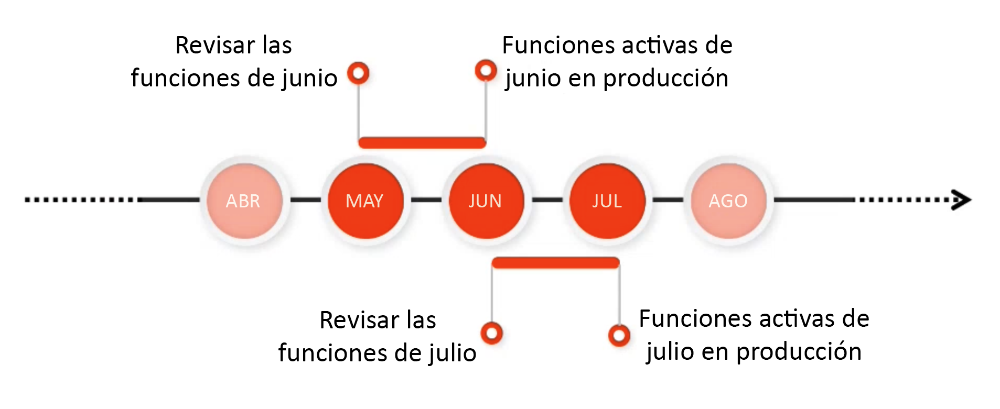

# Información de la versión {#release-information}

| Producto | Adobe Experience Manager as a Cloud Service |
|---|---|
| Versión | 2025.5.0 |
| Tipo | Actualizaciones continuas |
| Fecha de disponibilidad | Actualización continua |

## Programación de versiones de AEM {#release-schedule}

Con el modelo de versiones continuas de [!DNL Adobe Experience Manager] as a Cloud Service, la aplicación se actualiza automáticamente de forma continua. Existen dos tipos de actualizaciones, versiones de funciones y de mantenimiento:

* **Las versiones de características se realizan con una frecuencia mensual predecible y se centran en nuevas funcionalidades e innovaciones de productos.**
   * Consulte las [notas de la versión actual](/help/release-notes/release-notes-cloud/release-notes-current.md) para obtener más información sobre la última versión de la función.
* **Las versiones de mantenimiento** se realizan con frecuencia y se centran en actualizaciones de seguridad, correcciones de errores y mejoras de rendimiento. 
   * Esto garantiza que [!DNL Adobe Experience Manager] as a Cloud Service siempre está actualizado con cualquier corrección crítica.
   * Consulte las [notas de la versión de mantenimiento actuales](/help/release-notes/maintenance/latest.md) para obtener más información sobre la última versión de mantenimiento.

Este modelo garantiza versiones continuas sin interrupción del servicio. Las próximas funciones generalmente se anunciarán en una versión y luego se harán públicas en una versión posterior. De este modo, puede evaluar la próxima funcionalidad y planificar su posible implementación para sus propios proyectos. Le permite planificar con antelación la próxima versión de la función en la que está disponible la función.

Por ejemplo, si es mayo, puede evaluar las próximas funciones que estarán disponibles para el público en general en una próxima versión, como junio.

Esta cadencia le ofrece una ventana dinámica para evaluar el impacto de las próximas funciones en sus proyectos y personalizaciones, así como para planificar la implementación de dichas funciones, pruebas y formaciones del usuario.

Consulte la [hoja de ruta de las versiones de Experience Manager](https://experienceleague.adobe.com/docs/experience-manager-release-information/aem-release-updates/update-releases-roadmap.html?lang=es#aem-as-cloud-service) para obtener información detallada sobre próximas versiones.

## Preparación para una versión {#how-to-prepare}

Para prepararse para una versión:

1. [Marcado de calendarios](#mark-calendars)
1. [Revisión de las notas de la versión](#release-notes)
1. [Acceso y prueba de las próximas funciones](#upcoming-features)
1. [Formación de los usuarios](#train-users)

## Marcado de calendarios {#mark-calendars}

Las versiones de funciones se programan con mucha antelación y las fechas de activación de las mismas se publican en [Adobe Experience League.](https://experienceleague.adobe.com/docs/experience-manager-release-information/aem-release-updates/update-releases-roadmap.html?lang=es#aem-as-cloud-service)

Tenga en cuenta las fechas de la versión para que pueda planificar el tiempo necesario para revisar y probar las próximas funciones.

## Revisión de las notas de la versión {#release-notes}

Una vez que tenga las fechas de lanzamiento marcadas en el calendario, asegúrese de comprobar el sitio web de [Adobe Experience League](/help/release-notes/release-notes-cloud/release-notes-current.md) el día correspondiente para obtener las últimas notas de la versión.

Cada versión va acompañada de las notas de la versión que documentan no solo las novedades, sino también las próximas funciones disponibles para la evaluación. Infórmese con antelación y planifique cómo aprovechar las últimas funciones de AEMaaCS.

También puede [ver los problemas conocidos](/help/release-notes/maintenance/latest.md) que se publican junto con cada versión para conocer cualquier problema técnico que pueda presentar un desafío para su evaluación o posible adopción de cualquier función nueva.

## Acceso y prueba de las próximas funciones {#upcoming-features}

Las próximas funciones suelen estar disponibles de una de las dos maneras siguientes:

* Como parte de un programa de Alpha, Beta o de disponibilidad limitada
* Como parte del canal de versión preliminar

La manera en que la próxima función estará disponible se detallará en las [notas de la versión.](#release-notes)

* Si forma parte de un programa de Alpha, Beta o de disponibilidad limitada, generalmente debe ponerse en contacto con Adobe para habilitarlo como se detalla en las notas de la versión.
* Si forma parte del canal de versión preliminar, deberá [habilitar el canal de versión preliminar en un entorno de desarrollo o de zona protegida.](/help/release-notes/prerelease.md)

## Formación de los usuarios {#train-users}

Cuando ya haya probado las nuevas funciones y haya decidido utilizarlas en sus proyectos, deberá formar a sus usuarios.

Adobe Experience League ofrece muchos recursos para aprender AEMaaCS.

* [La documentación de AEMaaCS](https://experienceleague.adobe.com/docs/experience-manager-cloud-service.html?lang=es)
* [Tutoriales](https://experienceleague.adobe.com/docs/experience-manager-learn/aem-tutorials/overview.html?lang=es)
* [Vídeo de información general de la versión mensual](/help/release-notes/release-notes-cloud/release-notes-current.md#release-video) en las notas de la versión

## Información clave de la versión {#key-articles}

* [Notas de la versión de la funcionalidad](/help/release-notes/release-notes-cloud/release-notes-current.md)
* [Notas de la versión de mantenimiento](/help/release-notes/maintenance/latest.md)
* [Novedades](what-is-new.md)
* [Cambios importantes](aem-cloud-changes.md)
* [Funciones en desuso y eliminadas](deprecated-removed-features.md)
