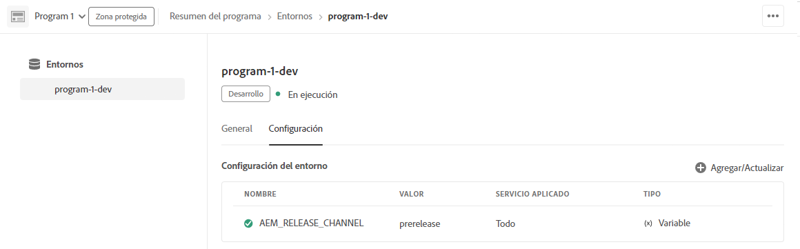

# Canal de la versión preliminar de Adobe Experience Manager as a Cloud Service {#prerelease-channel}

Aprenda a utilizar el canal de la versión preliminar para obtener una vista previa de las próximas funciones de AEM as a Cloud Service.

## Introducción {#introduction}

Adobe Experience Manager as a Cloud Service ofrece nuevas funciones con una cadencia normal. La lista de funciones nuevas y próximas para una versión determinada se publica en las [notas de la versión.](/help/release-notes/release-notes-cloud/release-notes-current.md)

Las próximas funciones suelen estar disponibles de una de las dos maneras siguientes:

* Como parte de un programa de primeros usuarios
* Como parte del canal de versión preliminar

En este documento se describe cómo habilitar el canal de versión preliminar El canal de versión preliminar ofrece acceso a las primeras funciones que se presentarán en una futura versión de funciones de AEM. Esto le ofrece la oportunidad de validar nuevas funciones y planificar su adopción antes de su lanzamiento próximo. Consulte el documento [Notas de la versión para Adobe Experience Manager (AEM) as a Cloud Service](/help/release-notes/home.md) para obtener más información sobre la programación de versiones de AEM.

## Habilitación del canal de versión preliminar para acceder y probar próximas funciones {#enable-prerelease}

El canal de la versión preliminar se puede habilitar en cualquier entorno de desarrollo o zona protegida. El canal de versión preliminar no se puede habilitar en los entornos de ensayo o producción.

Al canal de versión preliminar se puede acceder de dos maneras:

* [Entornos de la nube](#cloud-environments)
* [SDK local](#local-sdk)

### Entornos de la nube {#cloud-environments}

Para actualizar un entorno de nube a fin de utilizar la versión preliminar, debe añadir una nueva variable de entorno. Puede hacerlo mediante la IU de Cloud Manager o mediante CLI.

#### Adición de variable de entorno mediante la IU {#add-with-ui}

1. Inicie sesión en Cloud Manager en [my.cloudmanager.adobe.com](https://my.cloudmanager.adobe.com/) y seleccione la organización adecuada.

1. Vaya al programa en el que desea habilitar el canal de versión preliminar.

1. Seleccione el entorno en el que desea habilitar el canal de versión preliminar y acceda a su configuración mediante **Programa** > **Entorno** > **Configuración del entorno**.

1. Agregar una nueva [variable de entorno](/help/implementing/cloud-manager/environment-variables.md)

   | Nombre | Value | Servicio aplicado | Tipo |
   |------|-------|-----------------|------|
   | `AEM_RELEASE_CHANNEL` | `prerelease` | Todos | Variable |

1. Guarde los cambios y el entorno se actualizará con el canal de versión preliminar habilitado.

   

#### Adición de variable de entorno mediante CLI {#add-with-cli}

También puede utilizar la API y la CLI de Cloud Manager para actualizar las variables de entorno.

* Mediante el [punto final de variables de entorno de API de Cloud Manager](https://developer.adobe.com/experience-cloud/cloud-manager/reference/api/#operation/patchEnvironmentVariables), establezca la variable de entorno `AEM_RELEASE_CHANNEL` en el valor `prerelease`.

  ```text
  PATCH /program/{programId}/environment/{environmentId}/variables
  [
          {
                  "name" : "AEM_RELEASE_CHANNEL",
                  "value" : "prerelease",
                  "type" : "string"
          }
  ]
  ```

* [La CLI de Cloud Manager](https://github.com/adobe/aio-cli-plugin-cloudmanager#aio-cloudmanagerset-environment-variables-environmentid) también se puede utilizar en

  ```shell
  aio cloudmanager:environment:set-variables <ENVIRONMENT_ID> --programId=<PROGRAM_ID> --variable AEM_RELEASE_CHANNEL "prerelease
  ```

La variable se puede eliminar si desea restaurar el entorno al comportamiento estándar (canal que no es de versión preliminar).

### SDK local {#local-sdk}

Puede acceder a las próximas funciones en el canal de versión preliminar del SDK de Quickstart local y codificar para las nuevas API configurando el proyecto de Maven para que haga referencia al canal de versión preliminar `API Jar` situado en Maven Central. También puede acceder al canal de versión preliminar en el entorno de desarrollo local iniciando el SDK de Quickstart normal en modo de versión preliminar.

#### Inicio del SDK de Quickstart en modo versión preliminar {#prerelease-mode}

1. Descargue el SDK desde la distribución de software e instálelo tal como se describe en [Acceso al SDK de AEM as a Cloud Service.](/help/implementing/developing/introduction/aem-as-a-cloud-service-sdk.md)
1. Al iniciar Quickstart de SDK, incluya el argumento `-r prerelease`.

El valor es fijo, por lo tanto, solo se puede seleccionar en el primer inicio. Vuelva a instalar el SDK para cambiar la opción de la línea de comandos.

Dado que puede haber varias versiones de mantenimiento de AEM entre las versiones de funciones mensuales, puede descargar estos nuevos SDK y hacer referencia a las nuevas versiones de JAR de API de SDK en proyectos en Maven. Las versiones de mantenimiento no añadirán funciones de versión preliminar adicionales, pero podrían incluir otros cambios más pequeños, como correcciones de errores, correcciones de seguridad y mejoras de rendimiento.
Los JavaDocs se publican en Maven Central.

#### Compilación con el SDK de la versión preliminar {#build-sdk}

1. Modifique el `pom.xml` de su proyecto de Maven para hacer referencia a un JAR de API de SDK de la versión preliminar distinta, que se publica en Maven central. Contiene cualquier nueva API de Java para las funciones de la versión preliminar y depende del JAR de la API del SDK. Utiliza la misma versión.

   Por ejemplo, a continuación se muestra un fragmento de la sección de administración de dependencias del POM principal que hace referencia al JAR de API normal:

   ```
   <dependencyManagement>
    <dependencies>
        <dependency>
            <groupId>com.adobe.aem</groupId>
            <artifactId>aem-sdk-api</artifactId>
            <version>${aem.sdk.api}</version>
            <scope>provided</scope>
        </dependency>
   ```

   Y luego el uso en un módulo:

   ```
    <dependencies>
     <dependency>
         <groupId>com.adobe.aem</groupId>
         <artifactId>aem-sdk-api</artifactId>
     </dependency>
   ```

   Para cambiar al SDK de prelanzamiento, simplemente cambie la dependencia de `com.adobe.aem:aem-sdk-api` a `com.adobe.aem:aem-prerelease-sdk-api` como se indica a continuación:

   ```
   <dependencyManagement>
    <dependencies>
      <dependency>
            <groupId>com.adobe.aem</groupId>
            <artifactId>aem-prerelease-sdk-api</artifactId>
            <version>${aem.sdk.api}</version>
            <scope>provided</scope>
      </dependency>
   <dependencies>
      <dependency>
         <groupId>com.adobe.aem</groupId>
         <artifactId>aem-prerelease-sdk-api</artifactId>
      </dependency>
   ```

   Como de costumbre, los proyectos individuales pueden utilizar la dependencia.

1. Implementación en el servidor local.

1. Si está satisfecho con el funcionamiento local, confirme el código en una rama de desarrollo y utilice una canalización que no sea de producción de Cloud Manager para implementarla en un [entorno que tenga habilitado el canal de versión preliminar.](#cloud-environments)

>[!CAUTION]
> 
> El artifactId `aem-prerelease-sdk-api` nunca debe utilizarse al implementar en ensayo o producción. Utilice siempre `aem-sdk-api` al implementar mediante la canalización de producción. Del mismo modo, el código que hace referencia a las API de la versión preliminar no debe implementarse mediante la canalización de producción.

El [complemento Maven de AEM CS SDK Analyzer versión 1.0 y superior](https://experienceleague.adobe.com/docs/experience-manager-core-components/using/developing/archetype/build-analyzer-maven-plugin.html?lang=es#developing) detectará si la API de la versión preliminar se utiliza en un proyecto inspeccionando las dependencias. Si el analizador lo encuentra, utilizará la API del SDK de la versión preliminar para analizar el proyecto.

## Consideraciones {#considerations}

Hay algunos elementos que se deben tener en cuenta al utilizar el canal de la versión preliminar.

* El canal de la versión preliminar no contiene necesariamente todas las nuevas funciones que se implementarán en la siguiente versión.
* Las funciones de la versión preliminar se someten a rigurosas garantías de calidad y se pretende que sean características completas en lugar de calidad beta. Si nota algún problema, informe de él, tal como lo haría si sospechara que hay errores en las características de una versión de AEM normal.
* Para determinar si un entorno está configurado para el canal de versión preliminar, acceda a la página **Acerca de** de la consola de AEM y compruebe si el número de versión de AEM incluye un sufijo de `PRERELEASE` como, por ejemplo, `Adobe Experience Manager 2021.4.5226.20210427T070726Z-210429-PRERELEASE`.


