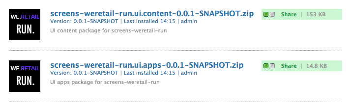

# Desarrollo de un componente personalizado para AEM Screens as a Cloud Service{#developing-a-custom-component-for-aem-screens}

El siguiente tutorial muestra los pasos para crear un componente personalizado para AEM Screens. AEM Screens reutiliza muchos patrones de diseño y tecnologías existentes de otros productos de AEM. El tutorial destaca las diferencias y las consideraciones especiales al desarrollar para AEM Screens.

## Información general {#overview}

Este tutorial está diseñado para desarrolladores que son nuevos en AEM Screens. En este tutorial, se crea un componente &quot;Hello World&quot; simple para un canal de secuencia en AEM Screens. Un cuadro de diálogo permite a los autores actualizar el texto mostrado.


## Requisitos previos {#prerequisites}

Para completar este tutorial, necesita lo siguiente:

1. Último Screens Feature Pack

1. Reproductor de AEM Screens

1. Entorno de desarrollo local

Los pasos y las capturas de pantalla del tutorial se realizan con **CRXDE Lite**. Los IDE también se pueden utilizar para completar el tutorial. Encontrará más información sobre el uso de un IDE para desarrollar [con AEM aquí](https://experienceleague.adobe.com/docs/experience-manager-learn/getting-started-wknd-tutorial-develop/project-archetype/project-setup.html).


## Configuración del proyecto {#project-setup}

El código fuente de un proyecto de Screens se administra normalmente como un proyecto Maven de varios módulos. Para adelantar el tutorial, se generó previamente un proyecto usando el [Arquetipo de proyecto de AEM 13](https://github.com/adobe/aem-project-archetype). Consulte [Configuración del proyecto](https://experienceleague.adobe.com/docs/experience-manager-learn/getting-started-wknd-tutorial-develop/project-archetype/project-setup.html) para obtener más información sobre cómo crear un proyecto con el tipo de archivo del proyecto Maven AEM.

1. Descargue e instale los siguientes paquetes con [CRX Package Manager](http://localhost:4502/crx/packmgr/index.jsp):

[Obtener archivo](/help/screens-cloud/developing/assets/base-screens-weretail-runuiapps-001-snapshot.zip)

   [Obtener archivo](/help/screens-cloud/developing/assets/base-screens-weretail-runuiapps-001-snapshot.zip)
   **Opcionalmente** si trabaja con Eclipse u otro IDE, descargue el siguiente paquete de origen. Implemente el proyecto en una instancia local de AEM mediante el comando Maven:

   **`mvn -PautoInstallPackage clean install`**

   Inicie el proyecto HelloWorld SRC Screens We.Retail Run

[Obtener archivo](/help/screens-cloud/developing/assets/src-screens-weretail-run.zip)

1. En [Administrador de paquetes de CRX](http://localhost:4502/crx/packmgr/index.jsp), compruebe que estén instalados los dos paquetes siguientes:

   1. **screens-weretail-run.ui.content-0.0.1-SNAPSHOT.zip**
   1. **screens-weretail-run.ui.apps-0.0.1-SNAPSHOT.zip**

   

   Screens We.Retail ejecuta paquetes Ui.Apps y Ui.Content instalados mediante el administrador de paquetes de CRX

1. El paquete **screens-weretail-run.ui.apps** instala código debajo de `/apps/weretail-run`.

   Este paquete contiene el código responsable de procesar los componentes personalizados del proyecto. Este paquete incluye código de componente y cualquier JavaScript o CSS necesario. Este paquete también incrusta **screens-weretail-run.core-0.0.1-SNAPSHOT.jar**, que contiene cualquier código Java™ necesario para el proyecto.

   >[!NOTE]
   >
   >En este tutorial, no se escribe ningún código Java™. Si se necesita una lógica empresarial más compleja, se puede crear e implementar el back-end Java™ mediante el paquete Java™ principal.

   

   Representación del código ui.apps en CRXDE Lite

   El componente **`helloworld`** es solo un marcador de posición. A lo largo del tutorial, se añade una funcionalidad que permite al autor actualizar el mensaje mostrado por el componente.

1. El paquete **screens-weretail-run.ui.content** instala el código debajo de:

   * `/conf/we-retail-run`
   * `/content/dam/we-retail-run`
   * `/content/screens/we-retail-run`

   Este paquete contiene el contenido de inicio y la estructura de configuración necesaria para el proyecto. **`/conf/we-retail-run`** contiene todas las configuraciones para el proyecto de ejecución de We.Retail. **`/content/dam/we-retail-run`** incluye el inicio de recursos digitales para el proyecto. **`/content/screens/we-retail-run`** contiene la estructura de contenido de Screens. El contenido debajo de estas rutas se actualiza principalmente en AEM. Para promover la coherencia entre entornos (local, Dev, Stage, Prod), a menudo se guarda una estructura de contenido base en el control de código fuente.

1. **Vaya al proyecto AEM Screens > We.Retail Run:**

   En Navegación global de AEM > Haga clic en Screens y en el icono. Compruebe que se puede ver el proyecto de ejecución de We.Retail.

   

## Crear el componente Hello World {#hello-world-cmp}

El componente Hello World es un componente sencillo que permite al usuario introducir un mensaje para que se muestre en la pantalla. El componente se basa en la [plantilla del componente AEM Screens: https://github.com/Adobe-Marketing-Cloud/aem-screens-component-template](https://github.com/Adobe-Marketing-Cloud/aem-screens-component-template).

AEM Screens tiene algunas restricciones interesantes que no son necesariamente verdaderas para los componentes tradicionales de WCM Sites.

* La mayoría de los componentes de Screens deben ejecutarse en pantalla completa en los dispositivos de señalización digital de destino
* La mayoría de los componentes de Screens deben estar incrustados en los canales de secuencia para generar presentaciones de diapositivas
* La creación debe permitir la edición de componentes individuales en un canal de secuencia, por lo que no se trata de procesarlos a pantalla completa

1. En **CRXDE-Lite** `http://localhost:4502/crx/de/index.jsp` (o IDE de su elección), vaya a `/apps/weretail-run/components/content/helloworld.`

   Agregue las siguientes propiedades al componente `helloworld`:

   ```
       jcr:title="Hello World"
       sling:resourceSuperType="foundation/components/parbase"
       componentGroup="We.Retail Run - Content"
   ```

   

   Propiedades de /apps/weretail-run/components/content/helloworld

   El componente **`helloworld`** amplía el componente **foundation/components/parbase** para que se pueda utilizar correctamente dentro de un canal de secuencia.

1. Crear un archivo debajo de `/apps/weretail-run/components/content/helloworld` con el nombre `helloworld.html.`

   Rellene el archivo con lo siguiente:

   ```xml
   <!--/*
   
    /apps/weretail-run/components/content/helloworld/helloworld.html
   
   */-->
   
   <!--/* production: preview authoring mode + unspecified mode (that is, on publish) */-->
   <sly data-sly-test.production="${wcmmode.preview || wcmmode.disabled}" data-sly-include="production.html" />
   
   <!--/* edit: any other authoring mode, that is, edit, design, scaffolding, and so on. */-->
   <sly data-sly-test="${!production}" data-sly-include="edit.html" />
   ```

   Los componentes de Screens requieren dos procesamientos diferentes según el [modo de creación](https://experienceleague.adobe.com/docs/experience-manager-64/authoring/authoring/author-environment-tools.html#page-modes) que se esté usando:

   1. **Producción**: modo de vista previa o publicación (wcmmode=disabled)
   1. **Editar**: se usa para todos los demás modos de creación, es decir, edición, diseño, andamiaje, desarrollador...

   `helloworld.html` actúa como un conmutador, comprobando qué modo de creación está activo y redirigiendo a otro script HTL. Una convención común utilizada por los componentes de pantallas es tener un script `edit.html` para el modo de edición y un script `production.html` para el modo de producción.

1. Crear un archivo debajo de `/apps/weretail-run/components/content/helloworld` con el nombre `production.html.`

   Rellene el archivo con lo siguiente:

   ```xml
   <!--/*
    /apps/weretail-run/components/content/helloworld/production.html
   
   */-->
   
   <div data-duration="${properties.duration}" class="cmp-hello-world">
    <h1 class="cmp-hello-world__message">${properties.message}</h1>
   </div>
   ```

   El marcado de producción anterior es para el componente Hello World. Se incluye un atributo `data-duration` porque el componente se usa en un canal de secuencia. El canal de secuencia utiliza el atributo `data-duration` para saber durante cuánto tiempo se va a mostrar un elemento de secuencia.

   El componente procesa una etiqueta `div` y una etiqueta `h1` con texto. `${properties.message}` es una parte del script HTL que genera el contenido de una propiedad JCR llamada `message`. Más adelante se crea un cuadro de diálogo que permite al usuario escribir un valor para el texto de la propiedad `message`.

   Tenga en cuenta también que la notación BEM (Modificador de elementos de bloque) se utiliza con el componente. BEM es una convención de codificación CSS que facilita la creación de componentes reutilizables. BEM es la notación utilizada por [los componentes principales de AEM](https://github.com/adobe/aem-core-wcm-components/wiki/CSS-coding-conventions). <!-- WEBSITE WAS NOT ACCESSIBLE AS OF SEPTEMBER 1, 2022 More info can be found at: [https://getbem.com/](https://getbem.com/) -->

1. Crear un archivo debajo de `/apps/weretail-run/components/content/helloworld` con el nombre `edit.html.`

   Rellene el archivo con lo siguiente:

   ```xml
   <!--/*
   
    /apps/weretail-run/components/content/helloworld/edit.html
   
   */-->
   
   <!--/* if message populated */-->
   <div
    data-sly-test.message="${properties.message}"
    class="aem-Screens-editWrapper cmp-hello-world">
    <p class="cmp-hello-world__message">${message}</p>
   </div>
   
   <!--/* empty place holder */-->
   <div data-sly-test="${!message}"
        class="aem-Screens-editWrapper cq-placeholder cmp-hello-world"
        data-emptytext="${'Hello World' @ i18n, locale=request.locale}">
   </div>
   ```

   El marcado de edición anterior es para el componente Hello World. El primer bloque muestra una versión de edición del componente si se ha rellenado el mensaje de diálogo.

   El segundo bloque se representa si no se ha introducido ningún mensaje de diálogo. `cq-placeholder` y `data-emptytext` representan la etiqueta ***Hello World*** como marcador de posición en ese caso. La cadena de la etiqueta se puede internacionalizar con i18n para admitir la creación en varias configuraciones regionales.

1. **Copiar cuadro de diálogo de imagen de Screens para usar en el componente Hello World.**

   Es más fácil comenzar desde un cuadro de diálogo existente y luego realizar modificaciones.

   1. Copiar el cuadro de diálogo de: `/libs/screens/core/components/content/image/cq:dialog`
   1. Pegar el cuadro de diálogo debajo de `/apps/weretail-run/components/content/helloworld`

   

1. **Actualice el cuadro de diálogo Hola a todos para incluir una ficha para el mensaje.**

   Actualice el cuadro de diálogo para que coincida con lo siguiente. La estructura del nodo JCR del cuadro de diálogo final se presenta a continuación en XML:

   ```xml
   <?xml version="1.0" encoding="UTF-8"?>
   <jcr:root xmlns:sling="https://sling.apache.org/jcr/sling/1.0" xmlns:cq="https://www.day.com/jcr/cq/1.0" xmlns:jcr="https://www.jcp.org/jcr/1.0" xmlns:nt="https://www.jcp.org/jcr/nt/1.0"
       jcr:primaryType="nt:unstructured"
       jcr:title="Hello World"
       sling:resourceType="cq/gui/components/authoring/dialog">
       <content
           jcr:primaryType="nt:unstructured"
           sling:resourceType="granite/ui/components/coral/foundation/tabs"
           size="L">
           <items jcr:primaryType="nt:unstructured">
               <message
                   jcr:primaryType="nt:unstructured"
                   jcr:title="Message"
                   sling:resourceType="granite/ui/components/coral/foundation/fixedcolumns">
                   <items jcr:primaryType="nt:unstructured">
                       <column
                           jcr:primaryType="nt:unstructured"
                           sling:resourceType="granite/ui/components/coral/foundation/container">
                           <items jcr:primaryType="nt:unstructured">
                               <message
                                   jcr:primaryType="nt:unstructured"
                                   sling:resourceType="granite/ui/components/coral/foundation/form/textfield"
                                   fieldDescription="Message for component to display"
                                   fieldLabel="Message"
                                   name="./message"/>
                           </items>
                       </column>
                   </items>
               </message>
               <sequence
                   jcr:primaryType="nt:unstructured"
                   jcr:title="Sequence"
                   sling:resourceType="granite/ui/components/coral/foundation/fixedcolumns">
                   <items jcr:primaryType="nt:unstructured">
                       <column
                           jcr:primaryType="nt:unstructured"
                           sling:resourceType="granite/ui/components/coral/foundation/container">
                           <items jcr:primaryType="nt:unstructured">
                               <duration
                                   jcr:primaryType="nt:unstructured"
                                   sling:resourceType="granite/ui/components/coral/foundation/form/numberfield"
                                   defaultValue=""
                                   fieldDescription="Amount of time the image is shown in the sequence, in milliseconds"
                                   fieldLabel="Duration (ms)"
                                   min="0"
                                   name="./duration"/>
                           </items>
                       </column>
                   </items>
               </sequence>
           </items>
       </content>
   </jcr:root>
   ```

   El `textfield` del mensaje se guardó en una propiedad denominada `message` y que el `numberfield` de Duración se guardó en una propiedad denominada `duration`. HTL hace referencia a estas dos propiedades en `/apps/weretail-run/components/content/helloworld/production.html` como `${properties.message}` y `${properties.duration}`.

   

   Hello World: cuadro de diálogo completado

## Creación de bibliotecas del lado del cliente {#clientlibs}

Las bibliotecas del lado del cliente proporcionan un mecanismo para organizar y administrar los archivos CSS y JavaScript necesarios para una implementación de AEM.

Los componentes de AEM Screens se representan de forma diferente en el modo de edición frente al modo de previsualización/producción. Se crean dos bibliotecas de cliente: una para el modo de edición y otra para la vista previa/producción.

1. Cree una carpeta para las bibliotecas del lado del cliente para el componente Hello World.

   Debajo de `/apps/weretail-run/components/content/helloworld`, cree una carpeta denominada `clientlibs`.

   

1. Bajo la carpeta `clientlibs`, cree un nodo denominado `shared` de tipo `cq:ClientLibraryFolder.`

   

1. Agregue las siguientes propiedades a la biblioteca de cliente compartida:

   * `allowProxy` | Booleano | `true`

   * `categories`| Cadena[] | `cq.screens.components`

   

   Propiedades de /apps/weretail-run/components/content/helloworld/clientlibs/shared

   La propiedad categories es una cadena que identifica la biblioteca de cliente. La categoría cq.screens.components se utiliza en los modos Edición y Previsualización/Producción. Por lo tanto, cualquier CSS/JS definido en sharedclientlib se carga en todos los modos.

   Se recomienda no exponer nunca ninguna ruta directamente a /apps en un entorno de producción. La propiedad allowProxy garantiza que se haga referencia a la biblioteca de cliente CSS y JS mediante el prefijo of/etc.clientlibs.

1. Cree un archivo con el nombre `css.txt` debajo de la carpeta compartida.

   Rellene el archivo con lo siguiente:

   ```
   #base=css
   
   styles.less
   ```

1. Cree una carpeta denominada `css` debajo de la carpeta `shared`. Agregue un archivo de nombre `style.less` debajo de la carpeta `css`. La estructura de las bibliotecas de cliente debería tener este aspecto:

   

   En lugar de escribir CSS directamente, este tutorial utiliza LESS. [LESS](https://lesscss.org/) es un precompilador de CSS popular que admite variables, mezclas y funciones CSS. Las bibliotecas de cliente de AEM admiten de forma nativa la compilación LESS. Sass u otros precompiladores pueden utilizarse, pero deben compilarse fuera de AEM.

1. Rellene `/apps/weretail-run/components/content/helloworld/clientlibs/shared/css/styles.less` con lo siguiente:

   ```css
   /**
       Shared Styles
      /apps/weretail-run/components/content/helloworld/clientlibs/shared/css/styles.less
   
   **/
   
   .cmp-hello-world {
       background-color: #fff;
   
    &__message {
     color: #000;
     font-family: Helvetica;
     text-align:center;
    }
   }
   ```

1. Copie y pegue la carpeta de biblioteca de cliente `shared` para crear una biblioteca de cliente llamada `production`.

   

   Copie la biblioteca de cliente compartida para crear una biblioteca de cliente de producción.

1. Actualizar la propiedad `categories` de la biblioteca de cliente de producción a `cq.screens.components.production.`

   Al hacerlo, se garantiza que los estilos solo se carguen en el modo de Previsualización/Producción.

   

   Propiedades de /apps/weretail-run/components/content/helloworld/clientlibs/production

1. Rellene `/apps/weretail-run/components/content/helloworld/clientlibs/production/css/styles.less` con lo siguiente:

   ```css
   /**
       Production Styles
      /apps/weretail-run/components/content/helloworld/clientlibs/production/css/styles.less
   
   **/
   .cmp-hello-world {
   
       height: 100%;
       width: 100%;
       position: fixed;
   
    &__message {
   
     position: relative;
     font-size: 5rem;
     top:25%;
    }
   }
   ```

   Los estilos anteriores muestran el mensaje centrado en el centro de la pantalla, pero solo en el modo de producción.

Se puede usar una tercera categoría clientlibrary: `cq.screens.components.edit` para agregar al componente estilos específicos de solo edición.

| Categoría de Clientlib | Uso |
|---|---|
| `cq.screens.components` | Estilos y scripts compartidos entre los modos de edición y producción |
| `cq.screens.components.edit` | Estilos y scripts que solo se utilizan en el modo de edición |
| `cq.screens.components.production` | Estilos y scripts que solo se utilizan en el modo de producción |

## Crear una página de diseño {#design-page}

AEM Screens usa [plantillas de página estáticas](https://experienceleague.adobe.com/docs/experience-manager-65/developing/platform/templates/page-templates-static.html) y [configuraciones de diseño](https://experienceleague.adobe.com/docs/experience-manager-64/authoring/siteandpage/default-components-designmode.html) para los cambios globales. Las configuraciones de diseño se utilizan frecuentemente para configurar los componentes permitidos para Parsys en un canal. Una práctica recomendada es almacenar estas configuraciones de una manera específica de la aplicación.

A continuación se crea una página de diseño de ejecución de We.Retail que almacena todas las configuraciones específicas del proyecto de ejecución de We.Retail.

1. En **CRXDE Lite** `http://localhost:4502/crx/de/index.jsp#/apps/settings/wcm/designs`, vaya a `/apps/settings/wcm/designs`
1. Cree un nodo debajo de la carpeta de diseños, denominado `we-retail-run` con un tipo de `cq:Page`.
1. Bajo la página `we-retail-run`, agregue otro nodo denominado `jcr:content` de tipo `nt:unstructured`. Agregue las siguientes propiedades al nodo `jcr:content`:

   | Nombre | Tipo | Valor  |
   |---|---|---|
   | jcr:title | Cadena | Ejecución de We.Retail |
   | sling:resourceType | Cadena | wcm/core/components/designer |
   | cq:doctype | Cadena | html_5 |

   

   Página de diseño en /apps/settings/wcm/designs/we-retail-run

## Creación de un canal de secuencia {#create-sequence-channel}

El componente Hello World está diseñado para utilizarse en un canal de secuencias. Para probar el componente, se crea un nuevo Canal de secuencia.

1. En AEM Global Navigation, vaya a **Screens** > **We.Retail Run** n > y seleccione **Canales**.

1. Haga clic en el botón **Crear**

   1. Elija **Crear entidad**

   

1. En el asistente Crear:

1. Paso de plantilla: elija **Canal de secuencia**

   1. Paso Propiedades

   * Pestaña básica > Título = **Canal inactivo**
   * Pestaña Canal > marca **Hacer canal en línea**

   

1. Abra las propiedades de página del canal inactivo. Actualice el campo Diseño para que apunte a `/apps/settings/wcm/designs/we-retail-run,` la página de diseño creada en la sección anterior.

   

   Configuración de diseño que señala a /apps/settings/wcm/designs/we-retail-run

1. Edite el canal inactivo creado para poder abrirlo.

1. Cambiar el modo de página al modo **Diseño**.

   1. Haga clic en el icono **wrench** en Parsys para que pueda configurar los componentes permitidos.

   1. Seleccione el grupo **Screens** y el grupo **We.Retail Run - Content**.

   

1. Cambiar el modo de página a **Editar**. Ahora, el componente Hello World se puede agregar a la página y combinarse con otros componentes de canal de secuencia.

   

1. En **CRXDE Lite** `http://localhost:4502/crx/de/index.jsp#/apps/settings/wcm/designs/we-retail-run/jcr%3Acontent/sequencechannel/par`, vaya a `/apps/settings/wcm/designs/we-retail-run/jcr:content/sequencechannel/par`. Observe que la propiedad `components` ahora incluye `group:Screens`, `group:We.Retail Run - Content`.

   

   Configuración de diseño en /apps/settings/wcm/designs/we-retail-run

## Plantilla para controladores personalizados {#custom-handlers}

Si el componente personalizado utiliza recursos externos, como recursos (imágenes, vídeos, fuentes e iconos), representaciones de recursos específicas o bibliotecas del lado del cliente (css y js), estos recursos no se añaden automáticamente a la configuración sin conexión. El motivo es que Adobe solo agrupa el marcado de HTML de forma predeterminada.

Para permitirle personalizar y optimizar los recursos exactos que se descargan en el reproductor, Adobe ofrece un mecanismo de extensión para que los componentes personalizados expongan sus dependencias a la lógica de almacenamiento en caché sin conexión en Screens.

La sección siguiente muestra la plantilla para controladores de recursos sin conexión personalizados y los requisitos mínimos de `pom.xml` para ese proyecto específico.

```java
package …;

import javax.annotation.Nonnull;

import org.apache.felix.scr.annotations.Component;
import org.apache.felix.scr.annotations.Reference;
import org.apache.felix.scr.annotations.Service;
import org.apache.sling.api.resource.Resource;
import org.apache.sling.api.resource.ResourceUtil;
import org.apache.sling.api.resource.ValueMap;

import com.adobe.cq.screens.visitor.OfflineResourceHandler;

@Service(value = OfflineResourceHandler.class)
@Component(immediate = true)
public class MyCustomHandler extends AbstractResourceHandler {

 @Reference
 private …; // OSGi services injection

 /**
  * The resource types that are handled by the handler.
  * @return the handled resource types
  */
 @Nonnull
 @Override
 public String[] getSupportedResourceTypes() {
     return new String[] { … };
 }

 /**
  * Accept the provided resource, visit and traverse it as needed.
  * @param resource The resource to accept
  */
 @Override
 public void accept(@Nonnull Resource resource) {
     ValueMap properties = ResourceUtil.getValueMap(resource);
     
     /* You can directly add explicit paths for offline caching using the `visit`
        method of the visitor. */
     
     // retrieve a custom property from the component
     String myCustomRenditionUrl = properties.get("myCustomRenditionUrl", String.class);
     // adding that exact asset/rendition/path to the offline manifest
     this.visitor.visit(myCustomRenditionUrl);
     
     
     /* You can delegate handling for dependent resources so they are also added to
        the offline cache using the `accept` method of the visitor. */
     
     // retrieve a referenced dependent resource
     String referencedResourcePath = properties.get("myOtherResource", String.class);
     ResourceResolver resolver = resource.getResourceResolver();
     Resource referencedResource = resolver.getResource(referencedResourcePath);
     // let the handler for that resource handle it
     if (referencedResource != null) {
         this.visitor.accept(referencedResource);
     }
   }
}
```

El siguiente código proporciona los requisitos mínimos en `pom.xml` para ese proyecto específico:

```css
   <dependencies>
        …
        <!-- Felix annotations -->
        <dependency>
            <groupId>org.apache.felix</groupId>
            <artifactId>org.apache.felix.scr.annotations</artifactId>
            <version>1.9.0</version>
            <scope>provided</scope>
        </dependency>

        <!-- Screens core bundle with OfflineResourceHandler/AbstractResourceHandler -->
        <dependency>
            <groupId>com.adobe.cq.screens</groupId>
            <artifactId>com.adobe.cq.screens</artifactId>
            <version>1.5.90</version>
            <scope>provided</scope>
        </dependency>
        …
      </dependencies>
```

## En resumen {#putting-it-all-together}

El siguiente vídeo muestra el componente terminado y cómo se puede añadir a un canal de secuencia. A continuación, el canal se añade a una pantalla de ubicación y, finalmente, se asigna a un reproductor de Screens.

>[!VIDEO](https://video.tv.adobe.com/v/22385?quaity=9)

## Código finalizado {#finished-code}

A continuación se muestra el código terminado del tutorial. **screens-weretail-run.ui.apps-0.0.1-SNAPSHOT.zip** y **screens-weretail-run.ui.content-0.0.1-SNAPSHOT.zip** son los paquetes compilados de AEM. **SRC-screens-weretail-run-0.0.1.zip** es el código fuente no compilado que se puede implementar mediante Maven.

[Obtener archivo](/help/screens-cloud/developing/assets/screens-weretail-runuiapps-001-snapshot.zip)

[Obtener archivo](/help/screens-cloud/developing/assets/screens-weretail-runuicontent-001-snapshot.zip)

[Obtener archivo](/help/screens-cloud/developing/assets/screens-weretail-run.zip)
