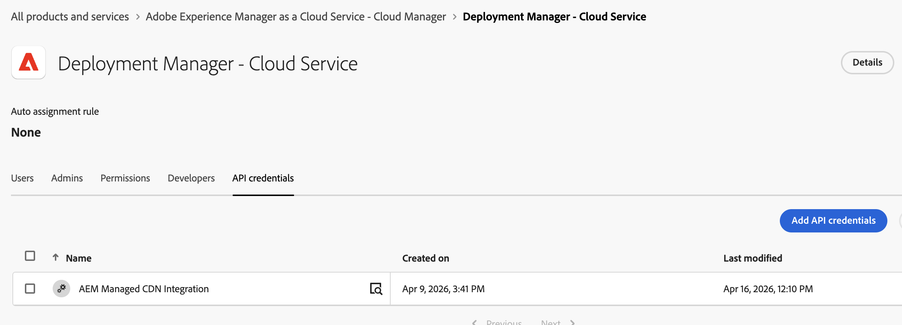

# Integraciones de API administradas por Adobe en Adobe Admin Console {#adobe-managed-api-integrations-in-adobe-admin-console}

Adobe aprovisiona un pequeño número de **integraciones de servicio** en su organización IMS como parte de AEM as a Cloud Service y las capacidades relacionadas de Adobe Experience Cloud. Estas integraciones aparecen en [Adobe Admin Console](https://adminconsole.adobe.com/) junto con las integraciones que crees tú mismo. Los servicios de Adobe son suyos y los gestionan en su nombre.

Como administrador del sistema o del producto de su organización IMS, puede revisar qué hace cada integración, qué función de Adobe depende de ella y si permanece habilitada. Puede deshabilitar cualquier integración de servicios administrada por Adobe en cualquier momento y restaurarla más tarde si es necesario.

## Información general {#overview}

Utilice este artículo para:

* Identifique las integraciones gestionadas por Adobe que tengan acceso a sus entornos de AEM.
* Comprenda el propósito de cada integración y la función de Adobe que admite.
* Deshabilite o restaure integraciones desde Admin Console cuando su organización lo requiera.

Adobe aplica los siguientes principios a cada integración de servicios que se enumera aquí:

* **Con nombre transparente**: cada integración usa un nombre legible en lenguaje natural que describe su propósito.
* **Documentado**: cada integración se describe aquí con la característica que admite.
* **Privilegio Least**: cada integración recibe únicamente el perfil de producto, rol o permiso necesario para su función, no los derechos generales de administrador.
* **Controlable por el cliente**: cada integración es visible en su Admin Console y los administradores pueden deshabilitarla o restaurarla.

## Dónde encontrar estas integraciones {#where-to-find-these-integrations}

1. Inicie sesión en [Adobe Admin Console](https://adminconsole.adobe.com/) con una cuenta de administrador del sistema o de producto para su organización IMS.
1. Para ver todas las credenciales de la API, vaya a **Usuarios** > **Credenciales de API**. Para inspeccionar las integraciones que tienen un permiso específico, vaya a **Productos** > *el producto de Adobe mencionado en el catálogo* > *el perfil de producto relevante*.
1. Busque Integraciones de servicio cuyo nombre comience por `Adobe` o que coincidan con un nombre del catálogo siguiente.

>[!NOTE]
>
>Cada entrada de catálogo enumera el producto de Adobe y el perfil de producto, la función o el permiso para esa integración de servicios. Utilice esa ruta al inspeccionar, deshabilitar o restaurar una integración.
>
>El nombre que se muestra en Admin Console es el identificador autorizado. Si ve una integración de servicio que no aparece en la lista a continuación, póngase en contacto con el [Servicio de atención al cliente de Adobe](https://helpx.adobe.com/es/support.html) antes de deshabilitarla.

## Catálogo de integraciones administradas de Adobe {#catalog-of-adobe-managed-integrations}

En la tabla siguiente se enumeran las integraciones de servicio que Adobe aprovisiona para los clientes de AEM as a Cloud Service.

| Nombre tal como se muestra en Admin Console | Qué hace | Utilizado por | Permisos concedidos | Habilitado de manera predeterminada |
|---|---|---|---|---|
| **Integración de CDN administrada por AEM** | Permite que el servicio de LLM Optimizer actualice en su nombre las **reglas de enrutamiento de tráfico agéntico** de CDN administrado por AEM as a Cloud Service para que los rastreadores de IA y agente (como ChatGPT, Perplexity y Claude) se puedan enrutar a orígenes optimizados de LLM Optimizer sin cambios manuales de CDN por parte de su equipo. | **LLM Optimizer** mediante la capacidad [Optimizar en Edge](https://experienceleague.adobe.com/es/docs/llm-optimizer/using/resources/optimize-at-edge/overview) | Función **Administrador de implementación** de Cloud Manager | Sí |

La siguiente captura de pantalla es un ejemplo de la **Integración de CDN administrada por AEM** que se menciona en la tabla anterior.

>[!NOTE]
>
>Adobe proporciona actualmente una integración de servicio en este modelo. Adobe actualiza esta tabla cuando servicios adicionales utilizan el mismo método. Si su Admin Console muestra otra integración de servicios aprovisionada por Adobe que no aparece en la lista, use Admin Console como fuente fiable y póngase en contacto con el [Servicio de atención al cliente de Adobe](https://helpx.adobe.com/es/support.html) para obtener más información.

## Impacto de la desactivación de una integración {#impact-of-disabling-an-integration}

Puede deshabilitar una integración de servicios administrada por Adobe en cualquier momento. Cuando lo haga, la función de Adobe que depende de esa integración dejará de funcionar para su organización hasta que la restaure. Revise la siguiente tabla antes de deshabilitar una integración.

| Integración | Qué deja de funcionar si está desactivado | Lo que sigue funcionando |
|---|---|---|
| **Integración de CDN administrada por AEM** | <ul><li><strong>Los usuarios de LLM Optimizer ya no podrán actualizar las reglas de enrutamiento de tráfico agéntico de CDN administrada por AEM as a Cloud Service</strong> para sus dominios. Cualquier intento posterior por parte de un administrador de LLMO de habilitar, cambiar o revocar el enrutamiento auténtico producirá un error de autorización en la capa de CDN.</li><li>Enrutamiento de los rastreadores de IA/agente (ChatGPT, Perplejidad, Claude, etc.) Las actualizaciones en orígenes optimizados para LLM Optimizer no se pueden (re)configurar hasta que se restablezca la integración.</li><li>Las reglas de enrutamiento agénticas ya aplicadas permanecen en vigor en el perímetro, pero no se pueden modificar ni eliminar sin volver a habilitar la integración (o coordinarse manualmente con la Asistencia al cliente de Adobe).</li></ul> | <ul><li>Los entornos de creación, publicación y vista previa de AEM as a Cloud Service siguen ofreciendo tráfico de forma normal.</li><li>La entrega de CDN estándar (no auténtico) de los sitios ya implementados seguirá sin cambios.</li><li>Las canalizaciones e implementaciones de Cloud Manager siguen funcionando para los operadores humanos con derechos de administrador de implementación.</li><li>Las funciones de LLM Optimizer que no dependan del enrutamiento perimetral siguen funcionando.</li></ul> |

## Desactivación de una integración {#how-to-disable-an-integration}

**Quién puede realizar esta tarea:** Una organización de IMS **Administrador del sistema** o el **Administrador de productos** para el producto de Adobe cuyo perfil, función o permiso concede acceso a la integración de servicio (consulte *Permisos concedidos* en la fila del catálogo).

Los pasos son los mismos para cada integración de servicio en este artículo. Solo la ruta de navegación en Admin Console cambia según el perfil del producto para esa integración.

1. Inicie sesión en [Adobe Admin Console](https://adminconsole.adobe.com/).
1. Identifique el **producto de Adobe** y el **perfil de producto, rol o permiso** para la integración de servicios. Ambos aparecen en la fila del catálogo.
1. Vaya a **Productos** > *el producto Adobe* > *el perfil del producto*.
1. Abra la ficha **Credenciales de API** o **Usuarios** para ese perfil.
1. Busque la integración de servicios con el nombre exacto de la fila del catálogo.
1. Elimine la integración de servicios del perfil de producto. La integración está deshabilitada para su organización. La próxima vez que el servicio de Adobe actúe en su nombre, se denegará la autorización.

**Ejemplo: Integración de CDN administrada por AEM:** Vaya a **Productos** > **Adobe Experience Manager as a Cloud Service** > **Cloud Manager** > **Administrador de implementación**, busque **Integración de CDN administrada por AEM** y elimínela del perfil del producto.

## Restauración de una integración {#how-to-restore-an-integration}

Si anteriormente deshabilitó una integración y desea habilitarla de nuevo:

1. Inicie sesión en [Adobe Admin Console](https://adminconsole.adobe.com/) como administrador de sistemas o productos.
1. Vaya al **mismo perfil de producto y producto** identificado para la integración de servicios en el catálogo anterior; este es el perfil del que se eliminó la integración de servicios cuando se deshabilitó.
1. Seleccione **Agregar usuario** o **Agregar API** y, a continuación, busque la integración de servicios por el nombre exacto que aparece en el catálogo.
1. Vuelva a añadir la integración de servicios al perfil del producto. La integración se reanuda en su siguiente ejecución programada o iniciada por el usuario.

**Ejemplo — Integración de CDN administrada por AEM:** Vaya a **Cloud Manager** > **Administrador de implementación** y agregue de nuevo **Integración de CDN administrada por AEM** usando **Agregar usuario** o **Agregar API**.

>[!NOTE]
>
>Si no encuentra la integración de servicios en el cuadro de diálogo del usuario agregado (por ejemplo, porque Adobe la eliminó de su organización en lugar de solo del perfil), póngase en contacto con el [Servicio de atención al cliente de Adobe](https://helpx.adobe.com/es/support.html) para solicitar el aprovisionamiento. Adobe no vuelve a agregar automáticamente una integración de servicios que haya eliminado su administrador.

