# Configuración de redes avanzadas para AEM as a Cloud Service {#configuring-advanced-networking}

Este artículo presenta las funciones de red avanzadas disponibles en AEM as a Cloud Service. Estas funciones incluyen aprovisionamiento de autoservicio y API de VPN, puertos no estándar y direcciones IP de salida dedicadas.

Además de esta documentación, también hay una serie de tutoriales diseñados para guiarle por cada una de las opciones avanzadas de red. Consulte [Redes avanzadas](https://experienceleague.adobe.com/es/docs/experience-manager-learn/cloud-service/networking/advanced-networking).

>[!IMPORTANT]
>
>Puede configurar la red avanzada en AEM as a Cloud Service a través de la interfaz de usuario de Cloud Manager o mediante la API de Cloud Manager (por ejemplo, cURL).
>
>Este artículo se centra en el uso del método de interfaz de usuario. Si prefiere automatizar la configuración a través de la API, consulte el [tutorial de red privada virtual (VPN)](https://experienceleague.adobe.com/es/docs/experience-manager-learn/cloud-service/networking/vpn).
>
>**Automatizar redes avanzadas con la API**
>Para automatizar la configuración avanzada de red (como la creación de VPN), puede utilizar la API de Cloud Manager:
>
>```bash
>curl -X POST https://cloudmanager.adobe.io/api/program/{PROGRAM_ID}/environment/{ENV_ID}/vpn \
>   -H "Authorization: Bearer {ACCESS_TOKEN}" \
>   -H "x-api-key: {API_KEY}" \
>   -H "Content-Type: application/json" \
>   -d '{
>       "providerId": "aws",
>       "portMappings": [
>           {
>               "name": "SSH",
>               "protocol": "TCP",
>               "port": 22
>           }
>       ]
>   }'
>```
>
>Consulte el tutorial completo y más ejemplos de API en el tutorial de [Red privada virtual (VPN)](https://experienceleague.adobe.com/es/docs/experience-manager-learn/cloud-service/networking/vpn).
>

## Información general {#overview}

AEM as a Cloud Service ofrece las siguientes opciones de redes avanzadas:

* [Salida de puerto flexible](#flexible-port-egress): configure AEM as a Cloud Service para permitir el tráfico saliente desde puertos no estándar.
* [Dirección IP de salida dedicada](#dedicated-egress-ip-address): configure el tráfico de AEM as a Cloud Service para que se origine desde una IP única.
* [Red privada virtual (VPN)](#vpn): tráfico seguro entre su infraestructura y AEM as a Cloud Service, si dispone de una VPN.

En este artículo se describe cada una de estas opciones en detalle y por qué podría utilizarlas, antes de describir cómo se configuran mediante la interfaz de usuario de Cloud Manager y mediante la API. El artículo concluye con algunos casos de uso avanzados.

>[!CAUTION]
>
>Si ya dispone de tecnología de salida dedicada heredada y quiere configurar una de estas opciones de redes avanzadas, [póngase en contacto con el servicio de atención al cliente de Adobe.](https://experienceleague.adobe.com/es?support-solution=Experience+Manager&lang=es#home)
>
>Si se intenta configurar redes avanzadas con tecnología de salida heredada, la conectividad del sitio puede verse afectada.

### Requisitos y limitaciones {#requirements}

Al configurar funciones de redes avanzadas, se aplican las siguientes restricciones.

* Un programa puede proporcionar una única opción de redes avanzadas (salida de puerto flexible, dirección IP de salida dedicada o VPN).
* Las redes avanzadas no están disponibles para los [programas de zona protegida](/help/implementing/cloud-manager/getting-access-to-aem-in-cloud/program-types.md).
* Un usuario debe tener la función **Administrador** para agregar y configurar la infraestructura de red en su programa.
* Debe crearse el entorno de producción antes de poder añadir la infraestructura de red en su programa.
* La infraestructura de red debe estar en la misma región que la región principal del entorno de producción.
   * En el caso de que su entorno de producción tenga [regiones de publicación adicionales](/help/implementing/cloud-manager/manage-environments.md#multiple-regions), puede crear otra infraestructura de red que refleje cada región adicional.
   * No se le permitirá crear más infraestructuras de red que el número máximo de regiones configuradas en su entorno de producción.
   * Puede definir tantas infraestructuras de red como regiones disponibles en el entorno de producción, pero la nueva infraestructura debe ser del mismo tipo que la infraestructura creada anteriormente.
   * Al crear varias infraestructuras, se le permite seleccionar únicamente aquellas regiones en las que no se ha creado una infraestructura de redes avanzadas.

### Configuración y activación de redes avanzadas {#configuring-enabling}

El uso de funciones de redes avanzadas requiere dos pasos:

1. La configuración de la opción de redes avanzadas, ya sea [salida de puerto flexible](#flexible-port-egress), [dirección IP de salida dedicada](#dedicated-egress-ip-address) o [VPN](#vpn), debe realizarse primero en el nivel de programa.
1. Para poder utilizarla, la opción de redes avanzadas debe [habilitarse en el nivel de entorno](#enabling).

Ambos pasos se pueden realizar mediante la interfaz de usuario de Cloud Manager o la API de Cloud Manager.

* Si utiliza la IU de Cloud Manager esto significa crear configuraciones de redes avanzadas mediante un asistente a nivel de programa y, a continuación, editar cada entorno en el que quiera habilitar la configuración.

* Cuando se utiliza la API de Cloud Manager, se invoca el punto final de la API `/networkInfrastructures` en el nivel de programa para declarar el tipo deseado de red avanzada. Después se llama al punto final `/advancedNetworking` para cada entorno con el fin de habilitar la infraestructura y configurar parámetros específicos del entorno.

## Salida de puerto flexible {#flexible-port-egress}

Esta función de redes avanzadas le permite configurar AEM as a Cloud Service para enviar tráfico a través de puertos que no sean HTTP (puerto 80) y HTTPS (puerto 443), que están abiertos de forma predeterminada.

>[!TIP]
>
>Al decidir entre una salida de puerto flexible y una dirección IP de salida dedicada, se recomienda elegir una salida de puerto flexible si no se requiere una dirección IP específica. El motivo es que Adobe puede optimizar el rendimiento del tráfico de salida de puerto flexible.

>[!NOTE]
>
>Después de su creación, no se pueden editar los tipos de infraestructura de salida de puerto flexible. La única manera de cambiar los valores de configuración es eliminarlos y volver a crearlos.

### Configuración de la IU {#configuring-flexible-port-egress-provision-ui}

1. Inicie sesión en Cloud Manager en [my.cloudmanager.adobe.com](https://my.cloudmanager.adobe.com/) y seleccione la organización adecuada.

1. En la consola **[Mis programas](/help/implementing/cloud-manager/navigation.md#my-programs)**, seleccione el programa.

1. En la página **Información general del programa**, vaya a la página **Entornos** y seleccione **Infraestructura de red** en el panel izquierdo.

   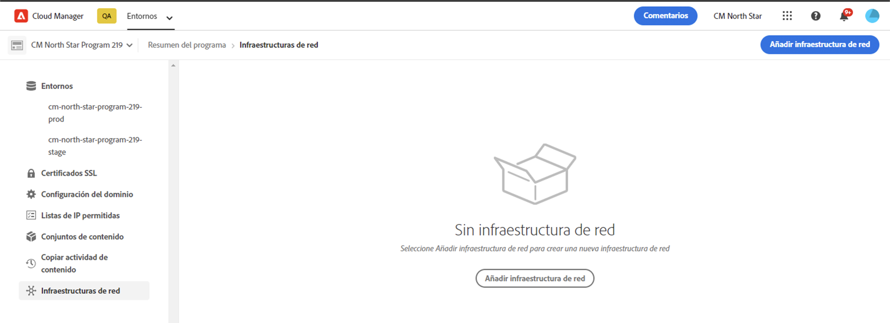

1. En el asistente **Agregar infraestructura de red**, seleccione **Salida de puerto flexible**.
1. En el menú desplegable **Región**, elija la región que desee y luego haga clic en **Continuar**.

   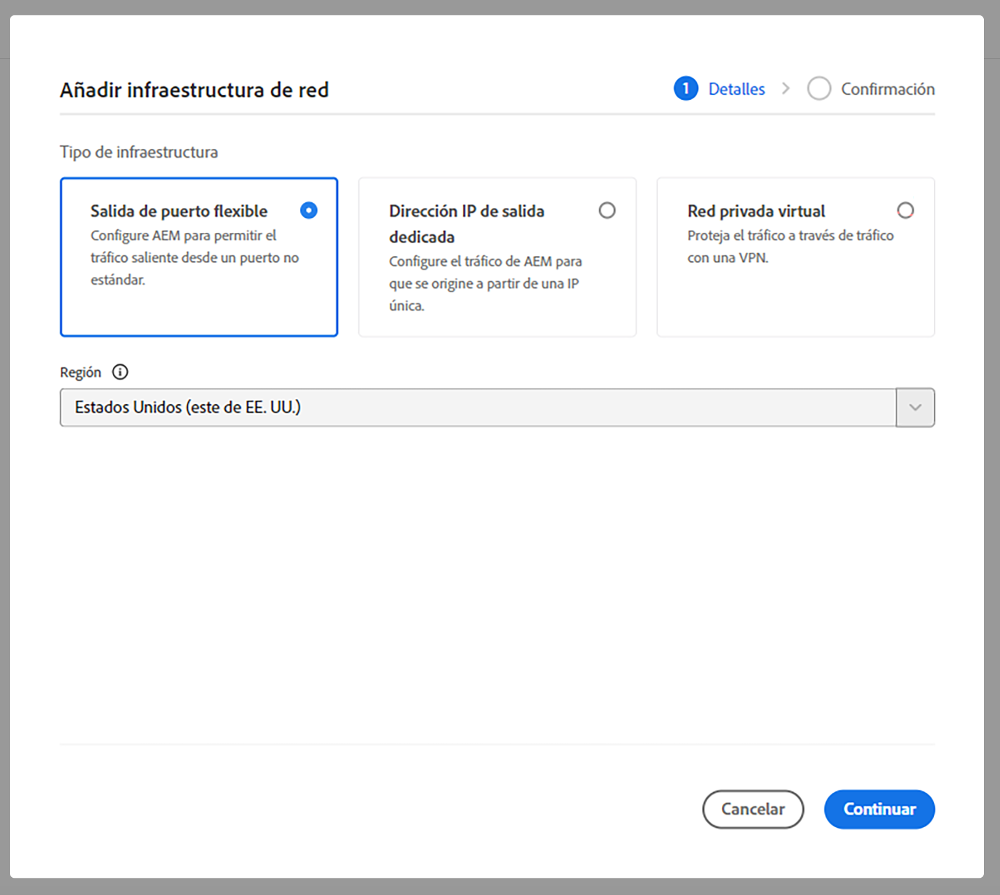

1. La pestaña **Confirmación** resume su selección y los pasos siguientes. Haga clic en **Guardar** para crear la infraestructura.

   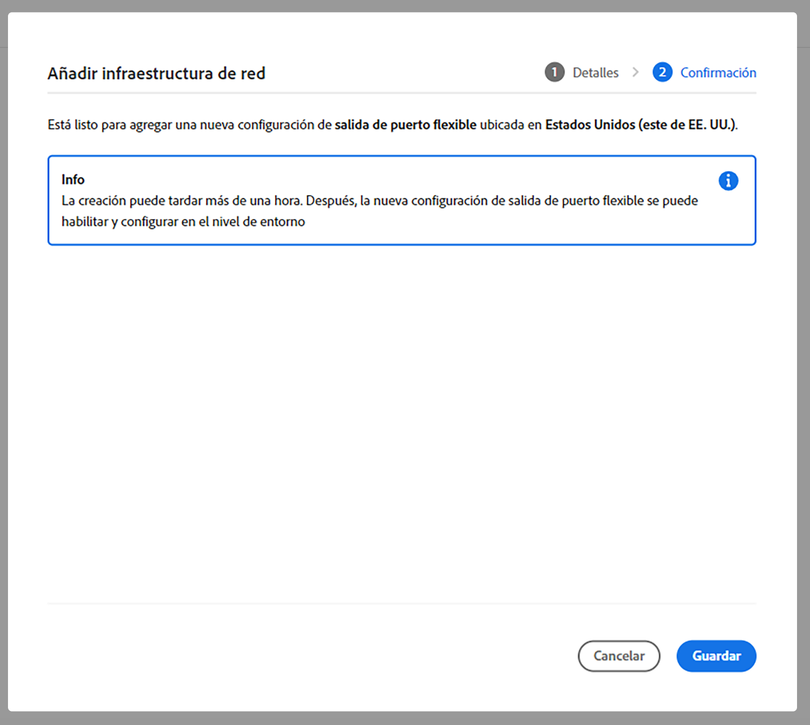

Aparece un nuevo registro debajo del encabezado **Infraestructura de red** en el panel lateral. Incluye detalles como el tipo de infraestructura, el estado, la región y los entornos en los que está habilitada.

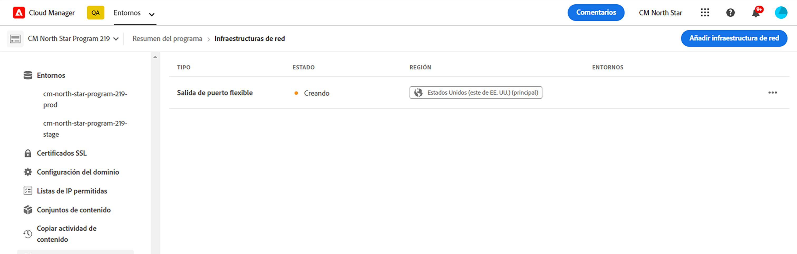

>[!NOTE]
>
>La creación de la infraestructura para la salida de puerto flexible puede tardar hasta una hora, tras lo cual se puede configurar en el nivel de entorno.

### Configuración de la API {#configuring-flexible-port-egress-provision-api}

Una vez por programa, el punto final de POST `/program/<programId>/networkInfrastructures` se invoca, pasando simplemente el valor de `flexiblePortEgress` para el parámetro `kind` y la región. El punto final responde con `network_id`, así como otra información, incluido el estado. 

Una vez realizada la llamada, la infraestructura de redes tarda aproximadamente 15 minutos en aprovisionarse. Una llamada al [punto final GET de infraestructura de red](https://developer.adobe.com/experience-cloud/cloud-manager/reference/api/#operation/getNetworkInfrastructure) de Cloud Manager mostraría el estado de **listo**.

>[!TIP]
>
>El conjunto completo de parámetros, la sintaxis exacta, así como información importante como qué parámetros no se pueden cambiar después, [se pueden consultar en los documentos de la API](https://developer.adobe.com/experience-cloud/cloud-manager/reference/api/#operation/createNetworkInfrastructure).

### Enrutamiento del tráfico {#flexible-port-egress-traffic-routing}

Para el tráfico HTTP o HTTPS que va a puertos que no sean 80 o 443, un proxy debe configurarse mediante las siguientes variables de entorno de host y puerto:

* para HTTP: `AEM_PROXY_HOST`/ `AEM_HTTP_PROXY_PORT ` (predeterminado: `proxy.tunnel:3128` en versiones de AEM &lt; 6094)
* para HTTPS: `AEM_PROXY_HOST`/ `AEM_HTTPS_PROXY_PORT ` (predeterminado: `proxy.tunnel:3128` en versiones de AEM &lt; 6094)

Por ejemplo, este es un ejemplo de código para enviar una solicitud a `www.example.com:8443`:

```java
String url = "www.example.com:8443"
String proxyHost = System.getenv().getOrDefault("AEM_PROXY_HOST", "proxy.tunnel");
int proxyPort = Integer.parseInt(System.getenv().getOrDefault("AEM_HTTPS_PROXY_PORT", "3128"));
HttpClient client = HttpClient.newBuilder()
      .proxy(ProxySelector.of(new InetSocketAddress(proxyHost, proxyPort)))
      .build();
 
HttpRequest request = HttpRequest.newBuilder().uri(URI.create(url)).build();
HttpResponse<String> response = client.send(request, BodyHandlers.ofString());
```

Si utiliza bibliotecas de red Java™ no estándar, configure los proxies mediante las propiedades anteriores para todo el tráfico.

El tráfico no HTTP/S con destinos a través de puertos declarados en el parámetro `portForwards` debe hacer referencia a una propiedad denominada `AEM_PROXY_HOST`, junto con el puerto asignado. Por ejemplo:

```java
DriverManager.getConnection("jdbc:mysql://" + System.getenv("AEM_PROXY_HOST") + ":53306/test");
```

La siguiente tabla describe el enrutamiento de tráfico:

<table>
<thead>
  <tr>
    <th>Tráfico</th>
    <th>Condición de destino</th>
    <th>Puerto</th>
    <th>Conexión</th>
    <th>Ejemplo de destino externo</th>
  </tr>
</thead>
<tbody>
  <tr>
    <td><b>Protocolo HTTP o HTTPS</b></td>
    <td>Tráfico HTTP/S estándar</td>
    <td>80 o 443</td>
    <td>Permitido</td>
    <td></td>
  </tr> 
  <tr>
    <td></td>
    <td>Tráfico no estándar (en otros puertos fuera de 80 o 443) a través del proxy HTTP configurado usando la variable de entorno y el número de puerto proxy siguientes. No declare el puerto de destino en el parámetro portForwards de la llamada API de Cloud Manager:<br><ul>
     <li>AEM_PROXY_HOST (predeterminado en `proxy.túnel` en versiones de AEM &lt; 6094)</li>
     <li>AEM_HTTPS_PROXY_PORT (de forma predeterminada al puerto 3128 en versiones de AEM &lt; 6094)</li>
    </ul>
    <td>Puertos fuera de 80 o 443</td>
    <td>Permitido</td>
    <td>example.com:8443</td>
  </tr>
  <tr>
    <td></td>
    <td>El tráfico no estándar (en otros puertos fuera de los puertos 80 o 443) que no utiliza el proxy HTTP</td>
    <td>Puertos fuera de 80 o 443</td>
    <td>Bloqueado</td>
    <td></td>
  </tr>
  <tr>
    <td><b>No HTTP o no HTTPS</b></td>
    <td>El cliente se conecta a la <code>AEM_PROXY_HOST</code> variable de entorno mediante un <code>portOrig</code> declarado en el parámetro de API <code>portForwards</code>.</td>
    <td>Cualquiera</td>
    <td>Permitido</td>
    <td><code>mysql.example.com:3306</code></td>
  </tr>
  <tr>
    <td></td>
    <td>Todo lo demás</td>
    <td>Cualquiera</td>
    <td>Bloqueado</td>
    <td><code>db.example.com:5555</code></td>
  </tr>
</tbody>
</table>

#### Configuración de Apache/Dispatcher {#apache-dispatcher}

La directiva `mod_proxy` del nivel de AEM Cloud Service Apache/Dispatcher se puede configurar con las propiedades descritas anteriormente.

```
ProxyRemote "http://example.com:8080" "http://${AEM_PROXY_HOST}:3128"
ProxyPass "/somepath" "http://example.com:8080"
ProxyPassReverse "/somepath" "http://example.com:8080"
```

```
SSLProxyEngine on //needed for https backends
 
ProxyRemote "https://example.com:8443" "http://${AEM_PROXY_HOST}:3128"
ProxyPass "/somepath" "https://example.com:8443"
ProxyPassReverse "/somepath" "https://example.com:8443"
```

## Dirección IP de salida dedicada {#dedicated-egress-ip-address}

Una dirección IP dedicada puede mejorar la seguridad al integrarse con proveedores de SaaS (como un proveedor CRM) u otras integraciones fuera de AEM as a Cloud Service que ofrecen una lista de permitidos de direcciones IP. Al añadir la dirección IP dedicada a la lista de permitidos, se garantiza que solo el tráfico de AEM Cloud Service pueda fluir al servicio externo. Este método se suma al tráfico de cualquier otra IP permitida.

La misma IP dedicada se aplica a todos los entornos de un programa y se aplica tanto a los servicios de Autor como de Publicación.

Sin la función de dirección IP dedicada habilitada, el tráfico de AEM as a Cloud Service fluye a través de un conjunto compartido de IP. Otros clientes de AEM as a Cloud Service utilizan estas IP.

La configuración de una dirección IP de salida dedicada es similar a la [salida de puerto flexible](#flexible-port-egress). La principal diferencia es que, después de la configuración, el tráfico siempre saldrá desde una IP única y dedicada. Para encontrar esa IP, utilice una resolución DNS para identificar la dirección IP asociada a `p{PROGRAM_ID}.external.adobeaemcloud.com`. No se espera que la dirección IP cambie, pero si necesita cambiarla en el futuro, se proporciona una notificación avanzada.

>[!TIP]
>
>Al decidir entre una salida de puerto flexible y una dirección IP de salida dedicada, elija una salida de puerto flexible si no se requiere una dirección IP específica. El motivo es que Adobe puede optimizar el rendimiento del tráfico de salida de puerto flexible.

>[!NOTE]
>
>Si se le suministró una IP de salida dedicada antes del 30 de septiembre de 2021, (es decir, antes de la versión de septiembre de 2021) su función de IP de salida dedicada solo admite los puertos HTTP y HTTPS.
>
>Este resultado incluye HTTP/1.1 y HTTP/2 cuando se cifran. Además, un extremo de salida dedicado puede hablar con cualquier destino solo a través de HTTP/HTTPS en los puertos 80/443 respectivamente.

>[!NOTE]
>
>Una vez creada, no se pueden editar los tipos de infraestructura de direcciones IP de salida dedicadas. La única manera de cambiar los valores de configuración es eliminarlos y volver a crearlos.

### Configuración de la IU {#configuring-dedicated-egress-provision-ui}

1. Inicie sesión en Cloud Manager en [my.cloudmanager.adobe.com](https://my.cloudmanager.adobe.com/) y seleccione la organización adecuada.

1. En la consola **[Mis programas](/help/implementing/cloud-manager/navigation.md#my-programs)**, seleccione el programa.

1. En la página **Información general del programa**, vaya a la página **Entornos** y seleccione **Infraestructura de red** en el panel izquierdo.

   

1. En el asistente **Agregar infraestructura de red** que se abre, haga clic en **Dirección IP de salida dedicada**.
1. En el menú desplegable **Región**, elija la región que desee y luego haga clic en **Continuar**.

   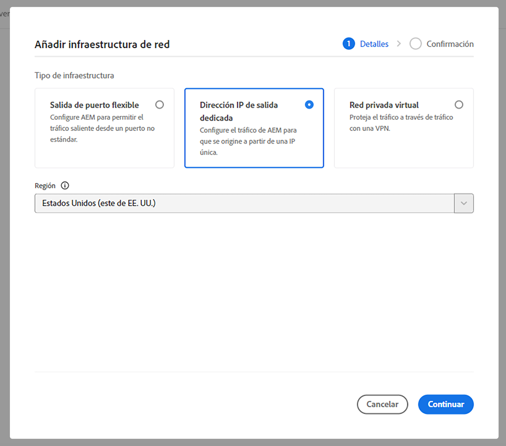

1. La pestaña **Confirmación** resume la selección y los pasos siguientes. Haga clic en **Guardar** para crear la infraestructura.

   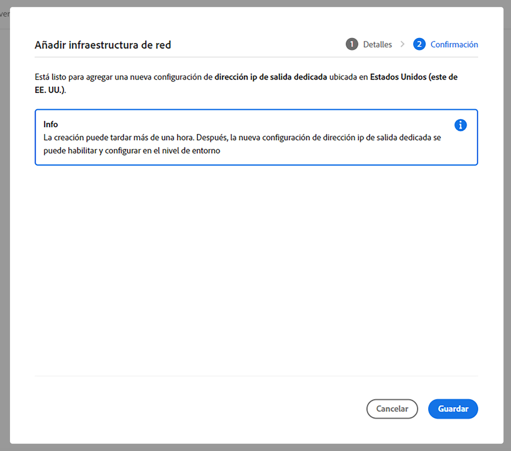

Aparece un nuevo registro debajo del encabezado **Infraestructura de red** en el panel lateral. Incluye detalles como el tipo de infraestructura, el estado, la región y los entornos en los que está habilitada.


>[!NOTE]
>
>La creación de la infraestructura para la salida de puerto flexible puede tardar hasta una hora, tras lo cual se puede configurar en el nivel de entorno.

### Configuración de la API {#configuring-dedicated-egress-provision-api}

Una vez por programa, el punto final de POST `/program/<programId>/networkInfrastructures` se invoca, pasando simplemente el valor de `dedicatedEgressIp` para el parámetro `kind` y la región. El punto final responde con `network_id`, así como otra información, incluido el estado. 

Una vez realizada la llamada, la infraestructura de redes tarda aproximadamente 15 minutos en aprovisionarse. Una llamada al [punto final GET de infraestructura de red](https://developer.adobe.com/experience-cloud/cloud-manager/reference/api/#operation/getNetworkInfrastructure) de Cloud Manager mostraría el estado de **listo**.

>[!TIP]
>
>El conjunto completo de parámetros, la sintaxis exacta, así como información importante como qué parámetros no se pueden cambiar después, [se pueden consultar en los documentos de la API](https://developer.adobe.com/experience-cloud/cloud-manager/reference/api/#operation/createNetworkInfrastructure).

### Enrutamiento del tráfico {#dedicated-egress-ip-traffic-routing}

El tráfico HTTP o HTTPS pasa a través de un proxy preconfigurado, siempre que utilicen las propiedades estándar del sistema Java™ para las configuraciones de proxy.

El tráfico no HTTP/S con destinos a través de puertos declarados en el parámetro `portForwards` debe hacer referencia a una propiedad denominada `AEM_PROXY_HOST`, junto con el puerto asignado. Por ejemplo:

```java
DriverManager.getConnection("jdbc:mysql://" + System.getenv("AEM_PROXY_HOST") + ":53306/test");
```

<table>
<thead>
  <tr>
    <th>Tráfico</th>
    <th>Condición de destino</th>
    <th>Puerto</th>
    <th>Conexión</th>
    <th>Ejemplo de destino externo</th>
  </tr>
</thead>
<tbody>
  <tr>
    <td><b>Protocolo HTTP o HTTPS</b></td>
    <td>Tráfico a Azure (*.windows.net) o servicios de Adobe</td>
    <td>Cualquiera</td>
    <td>A través de las IP del clúster compartido (no la IP dedicada)</td>
    <td>adobe.io<br>api.windows.net</td>
  </tr>
  <tr>
    <td></td>
    <td>El host que coincide con el parámetro <code>nonProxyHosts</code></td>
    <td>80 o 443</td>
    <td>A través de las IP del clúster compartido</td>
    <td></td>
  </tr>
  <tr>
    <td></td>
    <td>El host que coincide con el parámetro <code>nonProxyHosts</code></td>
    <td>Puertos fuera de 80 o 443</td>
    <td>Bloqueado</td>
    <td></td>
  </tr>
  <tr>
    <td></td>
    <td>A través de la configuración proxy HTTP, configurada de forma predeterminada para el tráfico HTTP que utiliza la biblioteca de cliente HTTP estándar de Java™</td>
    <td>Cualquiera</td>
    <td>A través de la IP de salida dedicada</td>
    <td></td>
  </tr>
  <tr>
    <td></td>
    <td>Omite la configuración de proxy HTTP (por ejemplo, si se elimina explícitamente de la biblioteca de cliente HTTP de Java™ estándar o si se utiliza una biblioteca Java™ que ignora la configuración de proxy estándar)</td>
    <td>80 o 443</td>
    <td>A través de las IP del clúster compartido</td>
    <td></td>
  </tr>
  <tr>
    <td></td>
    <td>Omite la configuración de proxy HTTP (por ejemplo, si se elimina explícitamente de la biblioteca de cliente HTTP de Java™ estándar o si se utiliza una biblioteca Java™ que ignora la configuración de proxy estándar)</td>
    <td>Puertos fuera de 80 o 443</td>
    <td>Bloqueado</td>
    <td></td>
  </tr>
  <tr>
    <td><b>No HTTP o no HTTPS</b></td>
    <td>El cliente se conecta a <code>AEM_PROXY_HOST</code> la variable env usando un <code>portOrig</code> declarado en el <code>portForwards</code> parámetro de la API</td>
    <td>Cualquiera</td>
    <td>A través de la IP de salida dedicada</td>
    <td><code>mysql.example.com:3306</code></td>
  </tr>
  <tr>
    <td></td>
    <td>Cualquier otra cosa</td>
    <td></td>
    <td>Bloqueado</td>
    <td></td>
  </tr>
</tbody>
</table>

### Uso de las funciones {#feature-usage}

La función es compatible con el código Java™ o bibliotecas que den lugar a tráfico saliente, siempre que utilicen las propiedades estándar del sistema Java™ para configuraciones de proxy. En la práctica, este enfoque debería incluir las bibliotecas más comunes.

A continuación se muestra un ejemplo de código:

```java
public JSONObject getJsonObject(String relativePath, String queryString) throws IOException, JSONException {
  String relativeUri = queryString.isEmpty() ? relativePath : (relativePath + '?' + queryString);
  URL finalUrl = endpointUri.resolve(relativeUri).toURL();
  URLConnection connection = finalUrl.openConnection();
  connection.addRequestProperty("Accept", "application/json");
  connection.addRequestProperty("X-API-KEY", apiKey);

  try (InputStream responseStream = connection.getInputStream(); Reader responseReader = new BufferedReader(new InputStreamReader(responseStream, Charsets.UTF_8))) {
    return new JSONObject(new JSONTokener(responseReader));
  }
}
```

Algunas bibliotecas requieren una configuración explícita para utilizar las propiedades estándar del sistema Java™ en las configuraciones de proxy.

Ejemplo que utiliza Apache HttpClient, que requiere llamadas explícitas a
[`HttpClientBuilder.useSystemProperties()`](https://hc.apache.org/httpcomponents-client-4.5.x/current/httpclient/apidocs/org/apache/http/impl/client/HttpClientBuilder.html) o usar
[`HttpClients.createSystem()`](https://hc.apache.org/httpcomponents-client-4.5.x/current/httpclient/apidocs/org/apache/http/impl/client/HttpClients.html#createSystem()):

```java
public JSONObject getJsonObject(String relativePath, String queryString) throws IOException, JSONException {
  String relativeUri = queryString.isEmpty() ? relativePath : (relativePath + '?' + queryString);
  URL finalUrl = endpointUri.resolve(relativeUri).toURL();

  HttpClient httpClient = HttpClientBuilder.create().useSystemProperties().build();
  HttpGet request = new HttpGet(finalUrl.toURI());
  request.setHeader("Accept", "application/json");
  request.setHeader("X-API-KEY", apiKey);
  HttpResponse response = httpClient.execute(request);
  String result = EntityUtils.toString(response.getEntity());
}
```

### Consideraciones sobre la depuración {#debugging-considerations}

Para validar que el tráfico realmente salga por la dirección IP dedicada esperada, compruebe los registros en el servicio de destino, si está disponible. De lo contrario, puede que sea útil utilizar un servicio de depuración como [https://ifconfig.me/ip](https://ifconfig.me/ip), que devuelve la dirección IP que realiza la llamada.

## Red privada virtual (VPN) {#vpn}

Una VPN permite conectarse a una infraestructura local o a un centro de datos desde las instancias de autor, publicación o vista previa. Esta capacidad puede resultar útil, por ejemplo, para proteger el acceso a una base de datos. También permite conectarse a proveedores de SaaS, como un proveedor CRM que admite VPN.

La mayoría de los dispositivos VPN con tecnología IPSec son compatibles. Consulte la información en la columna **Instrucciones de configuración de RouteBased** en [esta lista de dispositivos](https://learn.microsoft.com/es-es/azure/vpn-gateway/vpn-gateway-about-vpn-devices#devicetable). Configure el dispositivo como se describe en la tabla.

>[!NOTE]
>
>Las siguientes limitaciones se aplican a una infraestructura de VPN:
>
>* La compatibilidad se limita a una única conexión VPN
>* Los solucionadores de DNS deben aparecer en el espacio de direcciones de puerta de enlace para resolver los nombres de host privados.

### Configuración de la IU {#configuring-vpn-ui}

1. Inicie sesión en Cloud Manager en [my.cloudmanager.adobe.com](https://my.cloudmanager.adobe.com/) y seleccione la organización adecuada.

1. En la consola **[Mis programas](/help/implementing/cloud-manager/navigation.md#my-programs)**, seleccione el programa.

1. En la página **Información general del programa**, vaya a la página **Entornos** y seleccione **Infraestructura de red** en el panel izquierdo.

   

1. En el asistente **Añadir infraestructura de red** que se inicia, seleccione **Red privada virtual** y proporcione la información necesaria antes de hacer clic en **Continuar**.

   * **Región**: La región en la que se debe crear la infraestructura.
   * **Espacio de direcciones**: el espacio de direcciones solo puede constar de un CIDR /26 (64 direcciones IP) o un intervalo IP más grande en su propio espacio.
      * Este valor no se puede cambiar más adelante.
   * **Información de DNS**: una lista de solucionadores de DNS remotos.
      * Presione `Enter` después de escribir una dirección de servidor DNS para añadir otra.
      * Haga clic en `X` después de una dirección para quitarla.
   * **Clave compartida**: su clave previamente compartida VPN.
      * Seleccione **Mostrar clave compartida** para mostrar la clave y poder así comprobar su valor.

   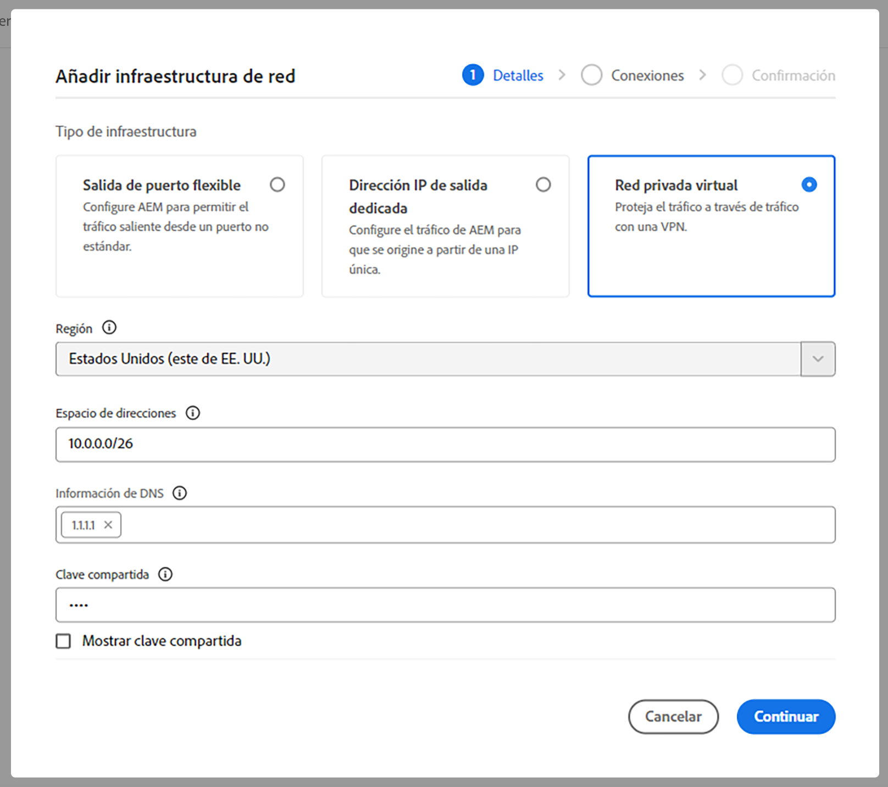

1. En la pestaña **Conexiones** del asistente, proporcione un **Nombre de conexión** para identificar su conexión VPN y haga clic en **Añadir conexión**.

   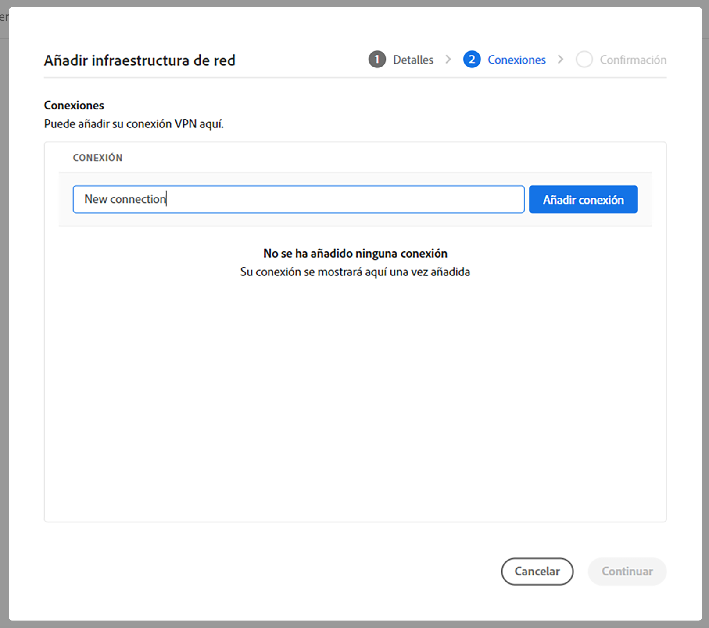

1. En el cuadro de diálogo **Agregar conexión**, defina su conexión VPN y haga clic en **Guardar**.

   * **Nombre de conexión**: un nombre descriptivo de su conexión VPN, que proporcionó en el paso anterior y que se puede actualizar aquí.
   * **Dirección** - La dirección IP del dispositivo VPN.
   * **Espacio de direcciones**: intervalos de direcciones IP para enrutar a través de la VPN.
      * Presione `Enter` después de introducir un intervalo para añadir otro.
      * Haga clic en `X` después de un intervalo para quitarlo.
   * **Política de seguridad IP**: ajuste los valores predeterminados según sea necesario

   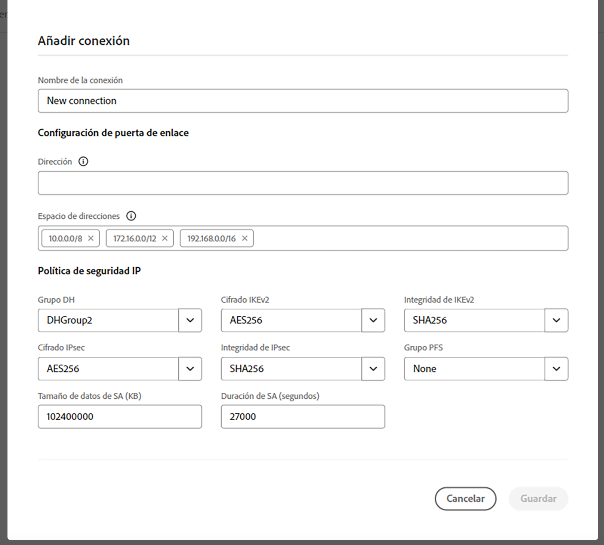

1. El cuadro de diálogo se cierra y vuelve a la ficha **Conexiones** del asistente. Haga clic en **Continuar**.

   

1. La pestaña **Confirmación** resume la selección y los pasos siguientes. Haga clic en **Guardar** para crear la infraestructura.

   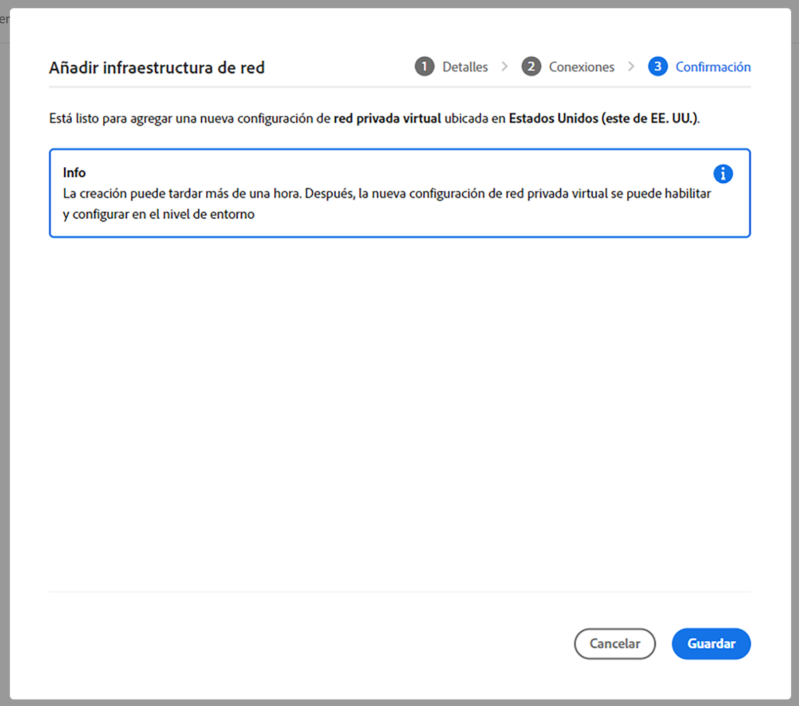

Aparece un nuevo registro debajo del encabezado **Infraestructura de red** en el panel lateral. Incluye detalles como el tipo de infraestructura, el estado, la región y los entornos en los que está habilitada.

### Configuración de la API {#configuring-vpn-api}

Una vez por programa, se invoca el punto final `/program/<programId>/networkInfrastructures` de POST. Pasa una carga útil de información de configuración. Esa información incluye el valor de **vpn** para el parámetro, región, espacio de direcciones `kind` (lista de CIDR; tenga en cuenta que este valor no se puede modificar más adelante), resolución de DNS (para resolver nombres en la red). También incluye información de conexión VPN, como la configuración de la puerta de enlace, la clave VPN compartida y la directiva de seguridad IP. El punto final responde con `network_id`, así como otra información, incluido el estado. 

Una vez realizada la llamada, la infraestructura de red tarda normalmente entre 45 y 60 minutos en aprovisionarse. Se puede llamar al método GET de la API para devolver el estado, que finalmente pasa de `creating` a `ready`. Consulte la documentación de la API para todos los estados.

>[!TIP]
>
>El conjunto completo de parámetros, la sintaxis exacta, así como información importante como qué parámetros no se pueden cambiar después, [se pueden consultar en los documentos de la API](https://developer.adobe.com/experience-cloud/cloud-manager/reference/api/#operation/createNetworkInfrastructure).

### Enrutamiento del tráfico {#vpn-traffic-routing}

La siguiente tabla describe el enrutamiento de tráfico.

<table>
<thead>
  <tr>
    <th>Tráfico</th>
    <th>Condición de destino</th>
    <th>Puerto</th>
    <th>Conexión</th>
    <th>Ejemplo de destino externo</th>
  </tr>
</thead>
<tbody>
  <tr>
    <td><b>Protocolo HTTP o HTTPS</b></td>
    <td>Tráfico a Azure o servicios de Adobe</td>
    <td>Cualquiera</td>
    <td>A través de las IP del clúster compartido (no la IP dedicada)</td>
    <td>adobe.io<br>api.windows.net</td>
  </tr>
  <tr>
    <td></td>
    <td>El host que coincide con el parámetro <code>nonProxyHosts</code></td>
    <td>80 o 443</td>
    <td>A través de las IP del clúster compartido</td>
    <td></td>
  </tr>
  <tr>
    <td></td>
    <td>El host que coincide con el parámetro <code>nonProxyHosts</code></td>
    <td>Puertos fuera de 80 o 443</td>
    <td>Bloqueado</td>
    <td></td>
  </tr>
  <tr>
    <td></td>
    <td>Si la IP se encuentra en el intervalo de espacio <i>dirección de puerta de enlace VPN</i> y a través de la configuración de proxy HTTP (configurada de forma predeterminada para el tráfico HTTP/S mediante la biblioteca de cliente HTTP estándar de Java™)</td>
    <td>Cualquiera</td>
    <td>A través de la VPN</td>
    <td><code>10.0.0.1:443</code><br>También puede ser un nombre de host.</td>
  </tr>
  <tr>
    <td></td>
    <td>Si la IP no cae en el intervalo <i>espacio de dirección de puerta de enlace VPN</i> y a través de la configuración de proxy HTTP (configurada de forma predeterminada para el tráfico HTTP/S mediante la biblioteca de cliente HTTP estándar de Java™)</td>
    <td>Cualquiera</td>
    <td>A través de la IP de salida dedicada</td>
    <td></td>
  </tr>
  <tr>
    <td></td>
    <td>Omite la configuración proxy HTTP (por ejemplo, si se elimina explícitamente de la biblioteca de cliente HTTP de Java™ estándar o si se utiliza una biblioteca Java™ que ignora la configuración proxy estándar)
</td>
    <td>80 o 443</td>
    <td>A través de las IP del clúster compartido</td>
    <td></td>
  </tr>
  <tr>
    <td></td>
    <td>Omite la configuración proxy HTTP (por ejemplo, si se elimina explícitamente de la biblioteca de cliente HTTP de Java™ estándar o si se utiliza una biblioteca Java™ que ignora la configuración proxy estándar)</td>
    <td>Puertos fuera de 80 o 443</td>
    <td>Bloqueado</td>
    <td></td>
  </tr>
  <tr>
    <td><b>No HTTP o no HTTPS</b></td>
    <td>Si la IP se encuentra en el intervalo <i>espacio de direcciones de puerta de enlace VPN</i> y el cliente se conecta a la variable env <code>AEM_PROXY_HOST</code> usando un <code>portOrig</code> declarado en el parámetro de API <code>portForwards</code></td>
    <td>Cualquiera</td>
    <td>A través de la VPN</td>
    <td><code>10.0.0.1:3306</code><br>También puede ser un nombre de host.</td>
  </tr>
  <tr>
    <td></td>
    <td>Si la IP se encuentra en el rango del <i>espacio de direcciones de la puerta del enlace de la VPN</i> y el cliente se conecta a la variable env <code>AEM_PROXY_HOST</code> usando un <code>portOrig</code> declarado en el parámetro de la API <code>portForwards</code></td>
    <td>Cualquiera</td>
    <td>A través de la IP de salida dedicada</td>
    <td></td>
  </tr>
  <tr>
    <td></td>
    <td>Cualquier otra cosa</td>
    <td>Cualquiera</td>
    <td>Bloqueado</td>
    <td></td>
  </tr>
</tbody>
</table>

### Dominios útiles para la configuración {#vpn-useful-domains-for-configuration}

El diagrama siguiente proporciona una representación visual de un conjunto de dominios e IP asociadas que son útiles para la configuración y el desarrollo. La tabla siguiente debajo del diagrama describe esos dominios y direcciones IP.


<table>
<thead>
  <tr>
    <th>Patrón de dominio</th>
    <th>Significado de la salida (de AEM)</th>
    <th>Significado del ingreso (a AEM)</th>
  </tr>
</thead>
<tbody>
  <tr>
    <td><code>p{PROGRAM_ID}.external.adobeaemcloud.com</code></td>
    <td>La dirección IP de salida dedicada para el tráfico que va a Internet en lugar de a través de redes privadas </td>
    <td>Las conexiones desde la VPN se mostrarían en la red de distribución de contenido (CDN) como procedentes de esta IP. Para permitir que solo las conexiones desde la VPN entren en AEM, configure Cloud Manager para permitir solo esta IP y bloquear todo lo demás. Consulte la sección Restringir el ingreso a conexiones VPN para obtener más información.</td>
  </tr>
  <tr>
    <td><code>p{PROGRAM_ID}.{REGION}-gateway.external.adobeaemcloud.com</code></td>
    <td>N/D</td>
    <td>IP de la puerta de enlace VPN en el lado AEM. Su equipo de ingeniería de redes puede utilizar esta IP para permitir únicamente conexiones VPN a su puerta de enlace VPN desde una dirección IP específica. </td>
  </tr>
</tbody>
</table>

## Habilitación de configuraciones de redes avanzadas en entornos {#enabling}

Cuando tenga configurada una opción de redes avanzadas para un programa, ya sea una [salida de puerto flexible](#flexible-port-egress), [dirección IP de salida dedicada](#dedicated-egress-ip-address) o [VPN](#vpn), para utilizarla, debe habilitarla en el nivel de entorno.

Cuando habilita una configuración de red avanzada para un entorno, también puede habilitar el reenvío de puertos opcional y los hosts no proxy. Los parámetros se pueden configurar por entorno para ofrecer flexibilidad.

* **Reenvío de puertos**: las reglas de reenvío de puertos deben declararse para cualquier puerto de destino que no sea 80/443, pero solo si no utiliza el protocolo http o https.
   * Las reglas de reenvío de puertos se definen especificando el conjunto de hosts de destino (nombres o IP y puertos).
   * La conexión de cliente que utiliza el puerto 80/443 a través de http/https debe seguir utilizando la configuración de proxy en su conexión para tener las propiedades de red avanzadas aplicadas a la conexión.
   * Para cada host de destino, los clientes deben asignar el puerto de destino deseado a un puerto de 30000 a 30999.
   * Las reglas de reenvío de puertos están disponibles para todos los tipos de redes avanzadas.

* **Hosts no proxy**: los hosts no proxy le permiten declarar un conjunto de hosts que deben enrutarse a través de un intervalo de direcciones IP compartidas en lugar de la IP dedicada.
   * Este método puede resultar útil, ya que la salida de tráfico a través de direcciones IP compartidas puede optimizarse aún más.
   * Los hosts no proxy solo están disponibles para la dirección IP de salida dedicada y los tipos de redes avanzadas VPN.

>[!NOTE]
>
>No puede habilitar una configuración de red avanzada para un entorno si el entorno está en el estado **Actualizando**.

### Habilitación del uso de la IU {#enabling-ui}

1. Inicie sesión en Cloud Manager en [my.cloudmanager.adobe.com](https://my.cloudmanager.adobe.com/) y seleccione la organización adecuada.

1. En la consola **[Mis programas](/help/implementing/cloud-manager/navigation.md#my-programs)**, seleccione el programa.

1. En la página **Información general del programa**, vaya a la pestaña **Entornos** y seleccione el entorno en el que desea habilitar la configuración de red avanzada bajo el encabezado **Entornos** en el panel izquierdo. A continuación, seleccione la pestaña **Configuración de red avanzada** del entorno seleccionado y haga clic en **Habilitar infraestructura de red**.

   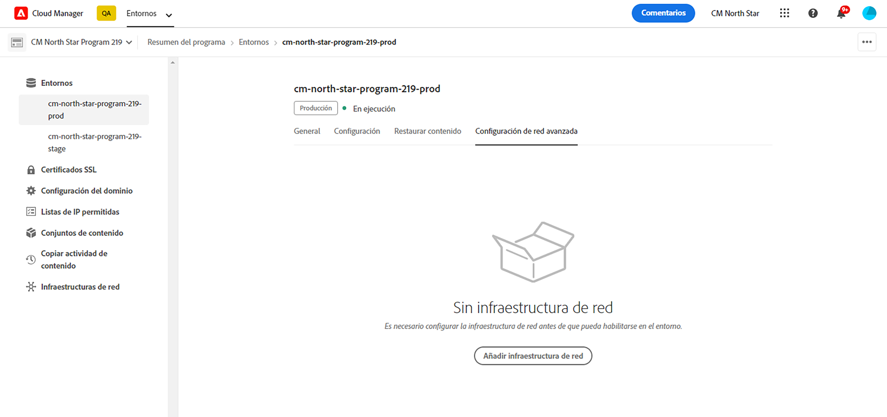

1. Se abre el cuadro de diálogo **Configurar red avanzada**.

1. En la pestaña **Hosts no proxy**, para las direcciones IP de salida dedicadas y las VPN, puede definir opcionalmente un conjunto de hosts. Estos hosts definidos deben enrutarse a través de un intervalo de direcciones IP compartidas en lugar de la IP dedicada, proporcionando el nombre de host en el campo **Host no proxy** y haciendo clic en **Añadir**.

   * El host se añade a la lista de hosts de la pestaña.
   * Repita este paso si desea añadir varios hosts.
   * Haga clic en la X a la derecha de la fila si desea quitar un host.
   * Esta pestaña no está disponible para configuraciones de salida de puerto flexibles.

   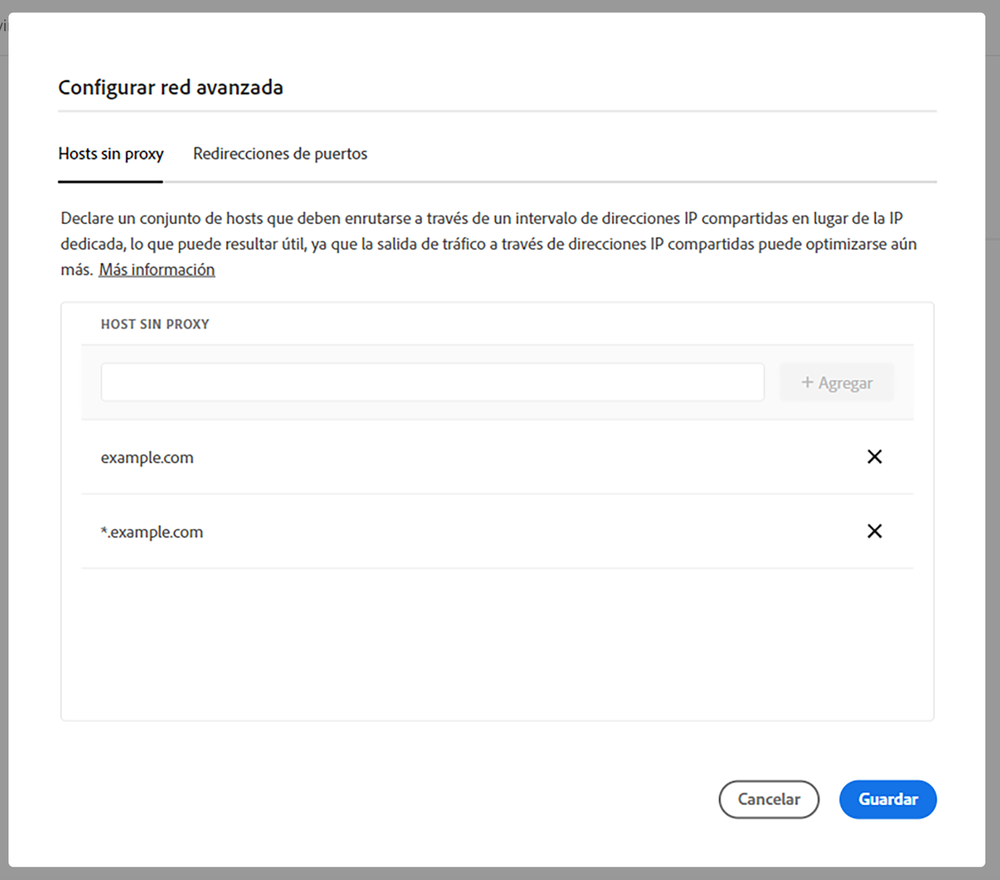

1. En la pestaña **Reenvíos de puerto** puede definir opcionalmente reglas de reenvío de puertos para cualquier puerto de destino que no sea 80/443 si no utiliza HTTP o HTTPS. Proporcione un **Nombre**, **Origen del puerto** y **Destino del puerto** y haga clic en **Añadir**.

   * La regla se añade a la lista de reglas de la pestaña.
   * Repita este paso si desea añadir varias reglas.
   * Haga clic en la X a la derecha de la fila si desea quitar una regla.

   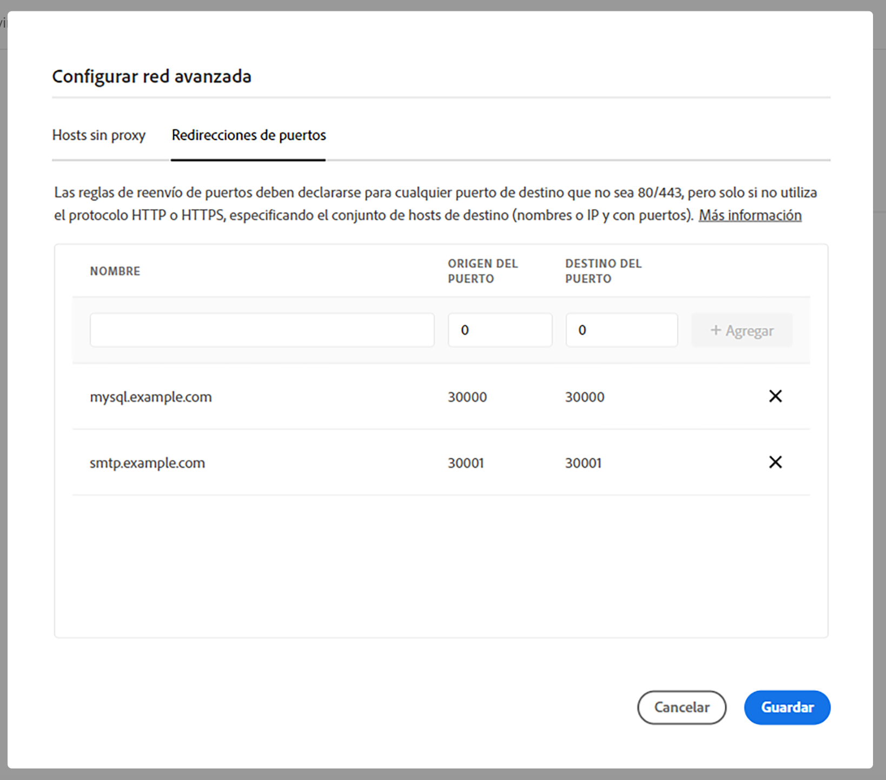

1. Haga clic en **Guardar** en el cuadro de diálogo para poder aplicar la configuración al entorno.

La configuración de redes avanzadas se aplica al entorno seleccionado. De nuevo en la pestaña **Entornos**, puede ver los detalles de la configuración aplicada al entorno seleccionado y su estado.

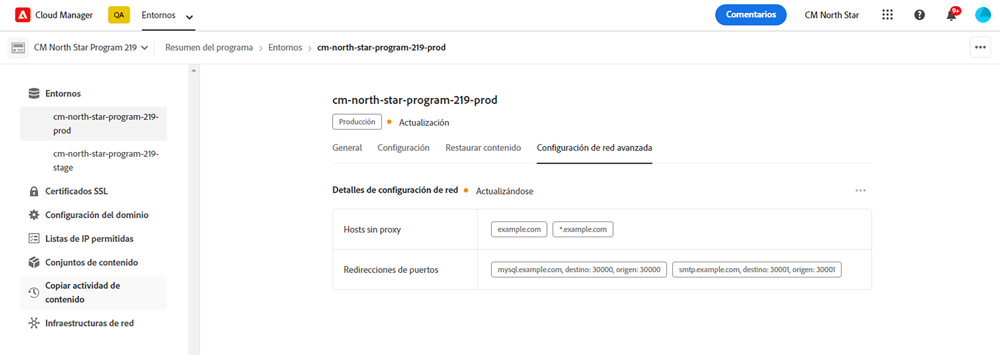

### Habilitación del uso de la API {#enabling-api}

Para habilitar una configuración de redes avanzadas para un entorno, el punto final `PUT /program/<program_id>/environment/<environment_id>/advancedNetworking` debe invocarse por entorno.

La API debe responder en solo unos segundos e indicar un estado de `updating`. Transcurridos unos 10 minutos, una llamada al punto final GET del entorno de Cloud Manager muestra un estado de `ready`, lo que indica que se ha aplicado la actualización al entorno.

Las reglas de reenvío de puertos por entorno se pueden actualizar invocando de nuevo el punto final final `PUT /program/{programId}/environment/{environmentId}/advancedNetworking` e incluyendo el conjunto completo de parámetros de configuración en lugar de un subconjunto.

Los tipos de redes avanzada VPN y direcciones IP de salida dedicadas admiten un parámetro `nonProxyHosts`. Esta compatibilidad le permite declarar un conjunto de hosts que deben enrutarse a través de un intervalo de direcciones IP compartidas en lugar de la IP dedicada. Las direcciones URL `nonProxyHost` pueden seguir los patrones de `example.com` o `*.example.com`, donde el comodín solo se admite al inicio del dominio.

Aunque no haya reglas de enrutamiento del tráfico del entorno (hosts u omisiones), debe seguir llamándose a `PUT /program/<program_id>/environment/<environment_id>/advancedNetworking`, solo con una carga útil vacía.

>[!TIP]
>
>El conjunto completo de parámetros, la sintaxis exacta, así como información importante como qué parámetros no se pueden cambiar después, [se pueden consultar en los documentos de la API](https://developer.adobe.com/experience-cloud/cloud-manager/reference/api/#operation/createNetworkInfrastructure).

## Edición y eliminación de configuraciones de redes avanzadas en entornos {#editing-deleting-environments}

Después de [habilitar las configuraciones de redes avanzadas en entornos](#enabling), puede actualizar los detalles de esas configuraciones o eliminarlas.

>[!NOTE]
>
>No puede editar la infraestructura de red si está en el estado **Creando**, **Actualizando** o **Eliminando**.

### Edición o eliminación mediante la IU {#editing-ui}

1. Inicie sesión en Cloud Manager en [my.cloudmanager.adobe.com](https://my.cloudmanager.adobe.com/) y seleccione la organización adecuada.

1. En la consola **[Mis programas](/help/implementing/cloud-manager/navigation.md#my-programs)**, seleccione el programa.

1. En la página **Información general del programa**, vaya a la pestaña **Entornos** y seleccione el entorno en el que desea habilitar la configuración de red avanzada bajo el encabezado **Entornos** en el panel izquierdo. A continuación, seleccione la pestaña **Configuración de red avanzada** del entorno seleccionado y haga clic en el botón de puntos suspensivos.

   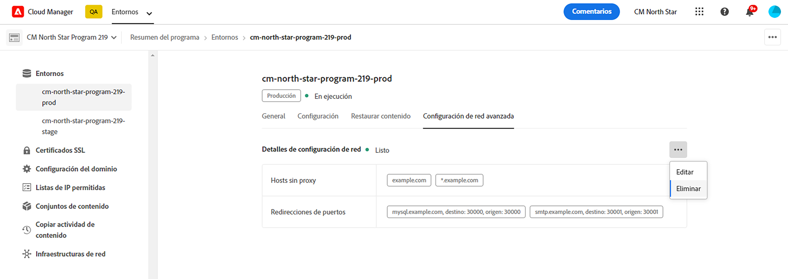

1. En el menú de puntos suspensivos seleccione **Editar** o **Eliminar**.

   * Si elige **Editar**, actualice la información según los pasos descritos en la sección anterior, [Habilitación del uso de la IU](#enabling-ui) y haga clic en **Guardar**.
   * Si elige **Eliminar**, confirme la eliminación en el cuadro de diálogo **Eliminar la configuración de red** con **Eliminar** o anule la acción con **Cancelar**.

Los cambios se reflejan en la pestaña **Entornos**.

### Edición o eliminación mediante la API {#editing-api}

Para desactivar la red avanzada para un entorno en particular, invoque `DELETE [/program/{programId}/environment/{environmentId}/advancedNetworking]()`. 

>[!TIP]
>
>El conjunto completo de parámetros, la sintaxis exacta, así como información importante como qué parámetros no se pueden cambiar después, [se pueden consultar en los documentos de la API](https://developer.adobe.com/experience-cloud/cloud-manager/reference/api/#operation/createNetworkInfrastructure).

## Edición y eliminación de la infraestructura de red de un programa {#editing-deleting-program}

Una vez creada la infraestructura de red para un programa, solo se pueden editar las propiedades limitadas. Si ya no lo necesita, puede eliminar la infraestructura de redes avanzadas de todo el programa.

>[!NOTE]
>
>Tenga en cuenta estas limitaciones a la hora de editar y eliminar la infraestructura de red:
>
>* Eliminar solo elimina la infraestructura si todos los entornos tienen deshabilitadas sus redes avanzadas.
>* No puede editar la infraestructura de red si está en el estado **Creando**, **Actualizando** o **Eliminando**.
>* Solo el tipo de infraestructura de redes avanzadas de la VPN se puede editar una vez creada y, a continuación, solo los campos limitados.
>* Por motivos de seguridad, la **Clave compartida** siempre se debe proporcionar al editar una infraestructura de redes avanzadas VPN, incluso si no está editando la clave en sí.

### Edición y eliminación con la IU {#delete-ui}

1. Inicie sesión en Cloud Manager en [my.cloudmanager.adobe.com](https://my.cloudmanager.adobe.com/) y seleccione la organización adecuada.

1. En la consola **[Mis programas](/help/implementing/cloud-manager/navigation.md#my-programs)**, seleccione el programa.

1. Desde la página **Resumen del programa**, vaya a la pestaña **Entornos**.
1. En el panel izquierdo, haga clic en **Infraestructura de red**.
1. Haga clic en el icono  junto a la infraestructura que desee eliminar.

   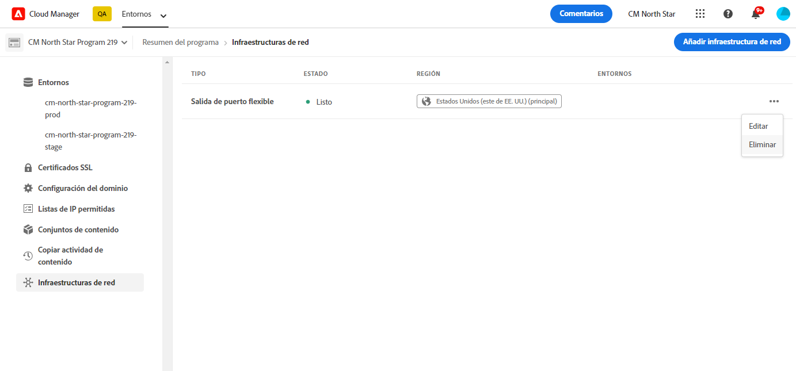

1. Haga clic en **Editar** o **Eliminar**.

1. Realice una de las siguientes acciones:

   * Si elige **Editar**, se abrirá el asistente **Editar infraestructura de red**. Edite según sea necesario siguiendo los pasos descritos al crear la infraestructura.

   * Si elige **Eliminar**, confirme la eliminación en el cuadro de diálogo **Eliminar configuración de red** con **Eliminar** o anule con **Cancelar**.

Los cambios se reflejan en la pestaña **Entornos**.

### Edición y eliminación con la API {#delete-api}

Hasta **eliminar** la infraestructura de red de un programa, invocar `DELETE /program/{program ID}/networkinfrastructure/{networkinfrastructureID}`.

## Cambio del tipo de infraestructura de redes avanzadas de un programa {#changing-program}

Solo es posible tener un tipo de infraestructura de red avanzada configurada para un programa a la vez. La infraestructura de red avanzada debe ser una salida de puerto flexible, una dirección IP de salida dedicada o una VPN.

Si decide que necesita otro tipo de infraestructura de redes avanzadas distinto del que ya ha configurado, debe eliminar el existente y crear uno nuevo. Haga lo siguiente:

1. [Elimine las redes avanzadas en todos los entornos](#editing-deleting-environments).
1. [Elimine la infraestructura de redes avanzadas](#editing-deleting-program).
1. Cree el tipo de infraestructura de redes avanzadas que ahora necesita: [salida de puerto flexible](#flexible-port-egress), [dirección IP de salida dedicada](#dedicated-egress-ip-address) o [VPN](#vpn).
1. [Rehabilite las redes avanzadas en el nivel de entorno](#enabling).

>[!WARNING]
>
> Como resultado de este procedimiento se obtiene un tiempo de inactividad de los servicios de redes avanzadas entre la eliminación y la recreación.
> Si el tiempo de inactividad puede causar un impacto comercial significativo, póngase en contacto con el servicio de atención al cliente para obtener ayuda, y describa lo que ya se ha creado y el motivo del cambio.

## Configuración de redes avanzadas para otras regiones de publicación {#advanced-networking-configuration-for-additional-publish-regions}

Cuando se agrega una región adicional a un entorno con una red avanzada ya configurada, el tráfico de la región de publicación adicional sigue las reglas existentes. De forma predeterminada, el tráfico coincidente se enruta a través de la región principal. Sin embargo, si la región principal deja de estar disponible, el tráfico de redes avanzadas se elimina si no se han habilitado las redes avanzadas en la región adicional. Si quiere optimizar la latencia y aumentar la disponibilidad en caso de que una de las regiones sufra una interrupción, es necesario habilitar las redes avanzadas de las regiones de publicación adicionales. En las siguientes secciones se describen dos escenarios diferentes.

>[!NOTE]
>
>Todas las regiones comparten la misma [configuración de redes avanzadas del entorno](https://developer.adobe.com/experience-cloud/cloud-manager/reference/api/#tag/Environment-Advanced-Networking-Configuration), por lo que no es posible enrutar el tráfico a diferentes destinos en función de la región desde la que sale el tráfico.

### Dirección IP de salida dedicada {#additional-publish-regions-dedicated-egress}

#### Las redes avanzadas ya están habilitadas en la región principal {#already-enabled}

Si ya se ha habilitado una configuración de redes avanzadas en la región principal, siga estos pasos:

1. Si ha bloqueado la infraestructura de modo que la dirección IP de AEM dedicada esté incluida en la lista de permitidos, se recomienda deshabilitar temporalmente cualquier regla de denegación de dicha infraestructura. Si omite este paso, la infraestructura denegará temporalmente las solicitudes de las direcciones IP de la nueva región. Este paso no es necesario si ha bloqueado la infraestructura mediante un nombre de dominio completo (FQDN), como `p1234.external.adobeaemcloud.com`. Todas las regiones de AEM reciben tráfico de red avanzado desde el mismo FQDN.
1. Cree la infraestructura de redes con alcance de programa para la región secundaria a través de una llamada del POST a la API Crear infraestructura de redes de Cloud Manager, tal como se describe en la documentación de redes avanzadas. La única diferencia en la configuración JSON de la carga útil en relación con la región principal es la propiedad de la región
1. Si necesita bloquear su infraestructura por dirección IP para permitir el tráfico de AEM, agregue las direcciones IP que corresponden a `p1234.external.adobeaemcloud.com`. Debe haber una por región.

#### Las redes avanzadas aún no están configuradas en ninguna región {#not-yet-configured}

El procedimiento es muy similar al de las instrucciones anteriores. Sin embargo, si el entorno de producción aún no se ha habilitado para las redes avanzadas, existe la oportunidad de probar la configuración habilitándola primero en un entorno de ensayo:

1. Cree una infraestructura de red para todas las regiones mediante una llamada de POST a la [API de Cloud Manager Create Network Infrastructure](https://developer.adobe.com/experience-cloud/cloud-manager/reference/api/#tag/Network-infrastructure/operation/createNetworkInfrastructure). La única diferencia en la configuración JSON de la carga útil en relación con la región principal es la propiedad region.
1. Para el entorno de ensayo, habilite y configure las redes avanzadas del ámbito del entorno ejecutando `PUT api/program/{programId}/environment/{environmentId}/advancedNetworking`. Para obtener más información, consulte la [Documentación de la API](https://developer.adobe.com/experience-cloud/cloud-manager/reference/api/#tag/Environment-Advanced-Networking-Configuration/operation/enableEnvironmentAdvancedNetworkingConfiguration).
1. Si es necesario, bloquee la infraestructura externa, preferiblemente mediante FQDN (por ejemplo, `p1234.external.adobeaemcloud.com`). De lo contrario, puede hacerlo con la dirección IP
1. Si el entorno de ensayo funciona según lo previsto, habilite y configure la configuración de redes avanzadas con un ámbito de entorno para producción.

#### VPN {#vpn-regions}

El procedimiento es casi idéntico al de las instrucciones de direcciones IP de salida dedicadas. La única diferencia es que la propiedad region está configurada de forma diferente a la región principal. Además, si lo desea, puede configurar el campo `connections.gateway`. La configuración puede enrutarse a un punto final VPN diferente operado por su organización, geográficamente más cerca de la nueva región.

## Resolución de problemas

Tenga en cuenta que los siguientes puntos se proporcionan como directrices informativas y abarcan prácticas recomendadas para la resolución de problemas. El objetivo de estas recomendaciones es ayudar a diagnosticar y resolver los problemas de forma eficaz.

### Agrupación de conexiones {#connection-pooling-advanced-networking}

La agrupación de conexiones es una técnica adaptada para crear y mantener un repositorio de conexiones, que están listas para su uso inmediato por cualquier hilo que las requiera. Se pueden encontrar numerosas técnicas de agrupación de conexiones en varias plataformas y recursos en línea, cada una con sus propias ventajas y consideraciones. Adobe anima a los clientes a investigar estas metodologías para identificar la más compatible con la arquitectura de su sistema.

La implementación de una estrategia adecuada de agrupación de conexiones es una medida proactiva para corregir una supervisión común en la configuración del sistema, que a menudo conduce a un rendimiento subóptimo. Al establecer correctamente un grupo de conexiones, Adobe Experience Manager (AEM) puede mejorar la eficacia de las llamadas externas. Este método no solo reduce el consumo de recursos, sino que también mitiga el riesgo de interrupciones en el servicio y disminuye la probabilidad de encontrar solicitudes fallidas al comunicarse con servidores de flujo ascendente.

En función de esta información, Adobe recomienda revisar la configuración actual de AEM. Considere también utilizar intencionalmente la agrupación de conexiones junto con su configuración de red avanzada. Administrar el número de conexiones paralelas y reducir las conexiones antiguas ayuda a optimizar el rendimiento de la red. Estas acciones reducen el riesgo de que los servidores proxy alcancen sus límites de conexión. Por lo tanto, esta implementación estratégica está diseñada para reducir la probabilidad de que las solicitudes no lleguen a los puntos finales externos.

#### Preguntas frecuentes sobre límites de conexión

Al utilizar redes avanzadas, el número de conexiones es limitado para garantizar la estabilidad entre entornos y evitar que los entornos más bajos agoten las conexiones disponibles.

Las conexiones tienen un límite de 1000 por instancia de AEM y las alertas se envían a los clientes cuando el número alcanza los 750.

##### ¿Se aplica el límite de conexiones solamente al tráfico saliente desde puertos no estándar o a todo el tráfico saliente?

El límite es solo para conexiones que utilizan red avanzada (salida en puertos no estándar, con IP de salida dedicada o VPN).

##### No parece haber un aumento significativo en el número de conexiones salientes. ¿Por qué se recibe la notificación ahora?

Si el cliente crea conexiones dinámicamente (por ejemplo, una o más para cada solicitud), un aumento en el tráfico puede provocar que las conexiones se disparen.

##### ¿Podría haberse producido una situación similar en el pasado sin activar una alerta?

Las alertas solo se envían cuando se alcanza el límite inferior.

##### ¿Qué sucede si se alcanza el límite máximo?

Cuando se alcanza el límite estricto, se pierden nuevas conexiones de salida de AEM a través de una red avanzada (salida en puertos no estándar, con IP de salida dedicada o VPN) para protegerse contra un ataque DoS.

##### ¿Se puede aumentar el límite?

No, tener un gran número de conexiones puede afectar negativamente y mucho al rendimiento y denegaciones de servicio en todos los pods y entornos.

##### ¿El sistema AEM cierra automáticamente las conexiones después de un determinado período de tiempo?

Sí, las conexiones se cierran en el nivel de JVM y en diferentes puntos de la infraestructura de red. Sin embargo, este flujo de trabajo es demasiado tarde para cualquier servicio de producción. Las conexiones deben cerrarse explícitamente cuando ya no sean necesarias o devolverse al grupo cuando se use la agrupación de conexiones. De lo contrario, el consumo de recursos es demasiado elevado y puede causar el agotamiento de los recursos.

##### Si se alcanza el límite máximo de conexiones, ¿afecta esto a las licencias y conlleva costes adicionales?

No, no hay ninguna licencia ni costes asociados a este límite. Es un límite técnico.

##### ¿Hasta qué punto se aproxima el uso actual al límite? ¿Cuál es el límite máximo permitido?

La alerta se activa cuando las conexiones superan las 750. El límite máximo es de 1000 conexiones por instancia de AEM.

##### ¿Se aplica este límite a las VPN?

Sí, el límite se aplica a las conexiones que usan redes avanzadas, incluidas las VPN.

##### ¿Sigue aplicándose el límite al utilizar una IP de salida dedicada?

Sí, el límite sigue siendo aplicable si se utiliza una IP de salida dedicada.
