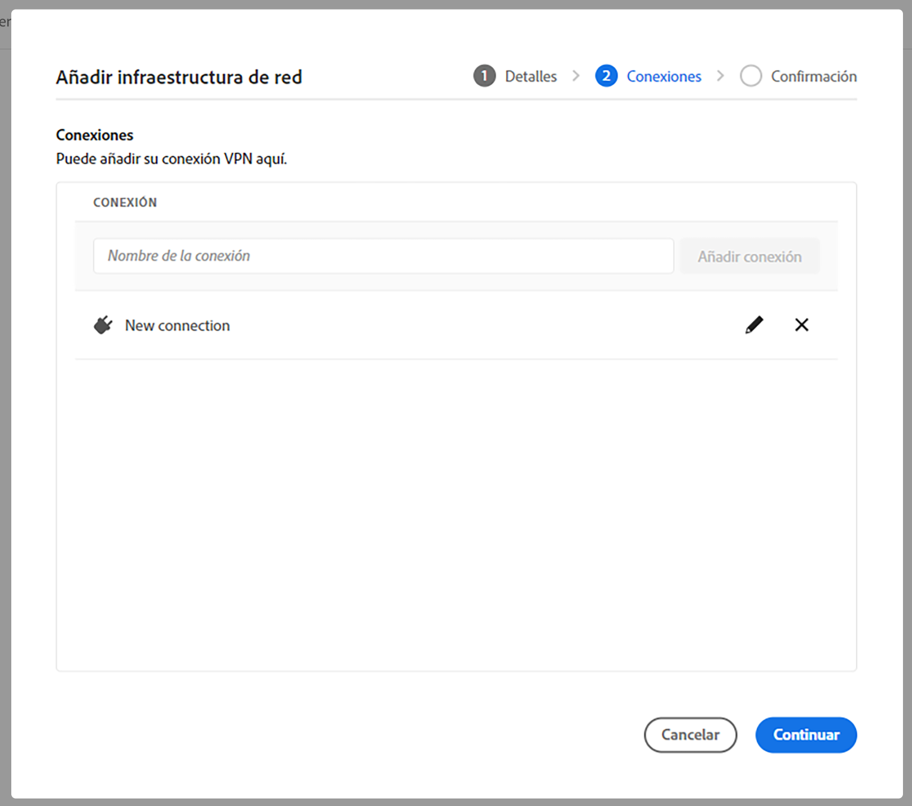

# Configurar la conexión avanzada para AEM as a Cloud Service {#configuring-advanced-networking}

AEM Este artículo presenta las diferentes funciones de red avanzadas en el as a Cloud Service de la red de la red, incluyendo el autoservicio y la provisión de API de VPN, puertos no estándar y direcciones IP de salida dedicadas.

>[!TIP]
>
>Además de esta documentación, también hay una serie de tutoriales diseñados para guiarle por cada una de las opciones avanzadas de red en [ubicación.](https://experienceleague.adobe.com/docs/experience-manager-learn/cloud-service/networking/advanced-networking.html?lang=es)

## Información general {#overview}

AEM as a Cloud Service ofrece las siguientes opciones avanzadas de red:

* [Salida de puerto flexible](#flexible-port-egress) AEM : configure los puertos as a Cloud Service para permitir el tráfico saliente desde puertos no estándar.
* [Dirección IP de salida dedicada](#dedicated-egress-ip-address) AEM : configure el tráfico de las direcciones IP as a Cloud Service para que se originen desde una dirección IP única.
* [Red privada virtual (VPN)](#vpn) AEM - Proteja el tráfico entre su infraestructura y el as a Cloud Service, si tiene una VPN.

En este artículo primero se describe cada una de estas opciones en detalle y por qué podría utilizarlas, antes de describir cómo se configuran mediante la interfaz de usuario de Cloud Manager y la API, y se concluye con algunos casos de uso avanzados.

>[!CAUTION]
>
>Si ya dispone de tecnología de salida dedicada heredada y desea configurar una de estas opciones avanzadas de red, [póngase en contacto primero con Atención al cliente de Adobe.](https://experienceleague.adobe.com/?support-solution=Experience+Manager&amp;lang=es#home)
>
>Si se intenta configurar una red avanzada con tecnología de salida heredada, la conectividad del sitio puede verse afectada.

### Requisitos y limitaciones {#requirements}

Al configurar funciones de red avanzadas, se aplican las siguientes restricciones.

* Un programa puede proporcionar una única opción de red avanzada (salida de puerto flexible, dirección IP de salida dedicada o VPN).
* La red avanzada no está disponible para [programas de zona protegida.](/help/implementing/cloud-manager/getting-access-to-aem-in-cloud/program-types.md)
* Un usuario en debe tener el **Administrador** para agregar y configurar la infraestructura de red en su programa.
* Debe crearse el entorno de producción antes de poder agregar la infraestructura de red en el programa.
* La infraestructura de red debe estar en la misma región que la región principal del entorno de producción.
   * En el caso de que su entorno de producción tenga [regiones de publicación adicionales,](/help/implementing/cloud-manager/manage-environments.md#multiple-regions) puede crear una infraestructura de red adicional que refleje cada región adicional.
   * No se le permitirá crear más infraestructura de red que el número máximo de regiones configuradas en su entorno de producción.
   * Puede definir tantas infraestructuras de red como regiones disponibles en el entorno de producción, pero la nueva infraestructura debe ser del mismo tipo que la infraestructura creada anteriormente.
   * Al crear varias infraestructuras, se le permite seleccionar únicamente aquellas regiones en las que no se ha creado una infraestructura de red avanzada.

### Configuración y activación de redes avanzadas {#configuring-enabling}

El uso de funciones de red avanzadas requiere dos pasos:

1. Configuración de la opción de red avanzada, si [salida de puerto flexible,](#flexible-port-egress) [dirección IP de salida dedicada,](#dedicated-egress-ip-address) o [VPN,](#vpn) primero debe realizarse en el nivel de programa.
1. Para poder utilizarla, la opción de red avanzada debe habilitarse en el nivel de entorno.

Ambos pasos se pueden realizar mediante la interfaz de usuario de Cloud Manager o la API de Cloud Manager.

* Al utilizar la interfaz de usuario de Cloud Manager, esto significa crear configuraciones de red avanzadas mediante un asistente a nivel de programa y, a continuación, editar cada entorno en el que desee habilitar la configuración.

* Al utilizar la API de Cloud Manager, la variable `/networkInfrastructures` El extremo de API se invoca en el nivel de programa para declarar el tipo deseado de red avanzada, seguido de una llamada a `/advancedNetworking` para cada entorno con el fin de habilitar la infraestructura y configurar parámetros específicos del entorno.

## Salida de puerto flexible {#flexible-port-egress}

Esta función de redes avanzadas le permite configurar AEM as a Cloud Service para enviar tráfico a través de puertos que no sean HTTP (puerto 80) y HTTPS (puerto 443), que están abiertos de forma predeterminada.

>[!TIP]
>
>Al decidir entre una salida de puerto flexible y una dirección IP de salida dedicada, se recomienda elegir una salida de puerto flexible si no se requiere una dirección IP específica, ya que Adobe puede optimizar el rendimiento del tráfico de salida de puerto flexible.

>[!NOTE]
>
>Una vez creada, no se pueden editar los tipos de infraestructura de salida de puerto flexible. La única manera de cambiar los valores de configuración es eliminarlos y volver a crearlos.

### Configuración de IU {#configuring-flexible-port-egress-provision-ui}

1. Inicie sesión en Cloud Manager en [my.cloudmanager.adobe.com](https://my.cloudmanager.adobe.com/) y seleccione la organización adecuada.

1. En el **[Mis programas](/help/implementing/cloud-manager/getting-access-to-aem-in-cloud/editing-programs.md#my-programs)** , seleccione el programa.

1. Desde el **Resumen del programa** , vaya a la página **Entornos** y seleccione **Infraestructura de red** en el panel izquierdo.

   

1. En el **Agregar infraestructura de red** Cuando se inicie el asistente, seleccione **Salida de puerto flexible** y la región donde debe crearse a partir del **Región** y toque o haga clic en **Continuar**.

   

1. El **Confirmación** resume la selección y los pasos siguientes. Haga clic o pulse **Guardar** para crear la infraestructura.

   

Aparece un nuevo registro debajo de **Infraestructura de red** encabezado en el panel lateral que incluye detalles del tipo de infraestructura, estado, región y entornos en los que se ha habilitado.


>[!NOTE]
>
>La creación de la infraestructura para la salida de puerto flexible puede tardar hasta una hora después de la cual se puede configurar en el nivel de entorno.

### Configuración de la API {#configuring-flexible-port-egress-provision-api}

Una vez por programa, el punto final de POST `/program/<programId>/networkInfrastructures` se invoca, pasando simplemente el valor de `flexiblePortEgress` para el parámetro `kind` y la región. El punto final responde con la variable `network_id`y otra información, incluido el estado.

Una vez realizada la llamada, la infraestructura de red tarda aproximadamente 15 minutos en aprovisionarse. Una llamada a la función de [extremo de GET de infraestructura de red](https://developer.adobe.com/experience-cloud/cloud-manager/reference/api/#operation/getNetworkInfrastructure) mostraría un estado de **ready**.

>[!TIP]
>
>El conjunto completo de parámetros, la sintaxis exacta y la información importante, como los parámetros que no se pueden cambiar posteriormente, [se puede consultar en la documentación de la API.](https://developer.adobe.com/experience-cloud/cloud-manager/reference/api/#operation/createNetworkInfrastructure)

### Enrutamiento del tráfico {#flexible-port-egress-traffic-routing}

Para el tráfico HTTP o HTTPS que va a puertos que no sean 80 o 443, un proxy debe configurarse mediante las siguientes variables de entorno de host y puerto:

* para HTTP: `AEM_PROXY_HOST` / `AEM_HTTP_PROXY_PORT ` (de forma predeterminada, `proxy.tunnel:3128` en versiones de AEM &lt; 6094)
* para HTTPS: `AEM_PROXY_HOST` / `AEM_HTTPS_PROXY_PORT ` (de forma predeterminada, `proxy.tunnel:3128` en versiones de AEM &lt; 6094)

Por ejemplo, este es un ejemplo de código para enviar una solicitud a `www.example.com:8443`:

```java
String url = "www.example.com:8443"
String proxyHost = System.getenv().getOrDefault("AEM_PROXY_HOST", "proxy.tunnel");
int proxyPort = Integer.parseInt(System.getenv().getOrDefault("AEM_HTTPS_PROXY_PORT", "3128"));
HttpClient client = HttpClient.newBuilder()
      .proxy(ProxySelector.of(new InetSocketAddress(proxyHost, proxyPort)))
      .build();
 
HttpRequest request = HttpRequest.newBuilder().uri(URI.create(url)).build();
HttpResponse<String> response = client.send(request, BodyHandlers.ofString());
```

Si utiliza bibliotecas de red Java no estándar, configure los proxies con las propiedades anteriores para todo el tráfico.

El tráfico no HTTP/S con destinos a través de puertos declarados en el parámetro `portForwards` debe hacer referencia a una propiedad denominada `AEM_PROXY_HOST`, junto con el puerto asignado. Por ejemplo:

```java
DriverManager.getConnection("jdbc:mysql://" + System.getenv("AEM_PROXY_HOST") + ":53306/test");
```

La siguiente tabla describe el enrutamiento de tráfico:

<table>
<thead>
  <tr>
    <th>Tráfico</th>
    <th>Condición de destino</th>
    <th>Puerto</th>
    <th>Conexión</th>
    <th>Ejemplo de destino externo</th>
  </tr>
</thead>
<tbody>
  <tr>
    <td><b>Protocolo HTTP o HTTPS</b></td>
    <td>Tráfico HTTP/S estándar</td>
    <td>80 o 443</td>
    <td>Permitido</td>
    <td></td>
  </tr> 
  <tr>
    <td></td>
    <td>Tráfico no estándar (en otros puertos fuera de 80 o 443) a través del proxy HTTP configurado usando la variable de entorno y el número de puerto proxy siguientes. No declare el puerto de destino en el parámetro portForwards de la llamada API de Cloud Manager:<br><ul>
     <li>AEM_PROXY_HOST (predeterminado en `proxy.túnel` en versiones de AEM &lt; 6094)</li>
     <li>AEM_HTTPS_PROXY_PORT (de forma predeterminada al puerto 3128 en versiones de AEM &lt; 6094)</li>
    </ul>
    <td>Puertos fuera de 80 o 443</td>
    <td>Permitido</td>
    <td>example.com:8443</td>
  </tr>
  <tr>
    <td></td>
    <td>El tráfico no estándar (en otros puertos fuera de los puertos 80 o 443) que no utiliza el proxy HTTP</td>
    <td>Puertos fuera de 80 o 443</td>
    <td>Bloqueado</td>
    <td></td>
  </tr>
  <tr>
    <td><b>No HTTP o no HTTPS</b></td>
    <td>El cliente se conecta a la <code>AEM_PROXY_HOST</code> variable de entorno mediante un <code>portOrig</code> declarado en el parámetro de API <code>portForwards</code>.</td>
    <td>Cualquiera</td>
    <td>Permitido</td>
    <td><code>mysql.example.com:3306</code></td>
  </tr>
  <tr>
    <td></td>
    <td>Todo lo demás</td>
    <td>Cualquiera</td>
    <td>Bloqueado</td>
    <td><code>db.example.com:5555</code></td>
  </tr>
</tbody>
</table>

#### Configuración de Apache/Dispatcher {#apache-dispatcher}

La directiva del nivel de AEM Cloud Service Apache/Dispatcher `mod_proxy` puede configurarse con las propiedades descritas anteriormente.

```
ProxyRemote "http://example.com:8080" "http://${AEM_PROXY_HOST}:3128"
ProxyPass "/somepath" "http://example.com:8080"
ProxyPassReverse "/somepath" "http://example.com:8080"
```

```
SSLProxyEngine on //needed for https backends
 
ProxyRemote "https://example.com:8443" "http://${AEM_PROXY_HOST}:3128"
ProxyPass "/somepath" "https://example.com:8443"
ProxyPassReverse "/somepath" "https://example.com:8443"
```

## Dirección IP de salida dedicada {#dedicated-egress-ip-address}

AEM Una dirección IP dedicada puede mejorar la seguridad al integrarse con proveedores de SaaS (como un proveedor CRM) u otras integraciones fuera de las redes as a Cloud Service que ofrecen una lista de permitidos de direcciones IP. Al añadir la dirección IP dedicada a la lista de permitidos, se garantiza que solo el tráfico de AEM Cloud Service del cliente pueda fluir al servicio externo. Esto se suma al tráfico de cualquier otra IP permitida.

La misma IP dedicada se aplica a todos los programas de su organización de Adobe y a todos los entornos de cada uno de sus programas. Se aplica tanto a los servicios de creación como de publicación.

AEM Si no se habilita la función de dirección IP dedicada, el tráfico proveniente de los flujos de tráfico as a Cloud Service AEM de la red de direcciones IP que se encuentran en un conjunto de direcciones IP compartidas con otros clientes as a Cloud Service de la red de.

La configuración de la dirección IP de salida dedicada es similar a [salida de puerto flexible.](#flexible-port-egress) La principal diferencia es que, después de la configuración, el tráfico siempre saldrá de una IP única y dedicada. Para encontrar esa IP, utilice una resolución DNS para identificar la dirección IP asociada a `p{PROGRAM_ID}.external.adobeaemcloud.com`. No se espera que la dirección IP cambie, pero si debe hacerlo, se proporciona una notificación avanzada.

>[!TIP]
>
>Al decidir entre una salida de puerto flexible y una dirección IP de salida dedicada, se recomienda elegir una salida de puerto flexible si no se requiere una dirección IP específica, ya que Adobe puede optimizar el rendimiento del tráfico de salida de puerto flexible.

>[!NOTE]
>
>Si se le ha proporcionado una IP de salida dedicada antes del 30 de septiembre de 2021 (es decir, antes de la versión de septiembre de 2021), su función de IP de salida dedicada solo admite puertos HTTP y HTTPS.
>
>Esto incluye HTTP/1.1 y HTTP/2 cuando se cifran. Además, un punto final de salida dedicado puede hablar con cualquier destino solo a través de HTTP/HTTPS en los puertos 80/443 respectivamente.

>[!NOTE]
>
>Una vez creada, no se pueden editar los tipos de infraestructura de direcciones IP de salida dedicadas. La única manera de cambiar los valores de configuración es eliminarlos y volver a crearlos.

>[!INFO]
>
>La capacidad de reenvío de Splunk no es posible desde una dirección IP de salida dedicada.

### Configuración de IU {#configuring-dedicated-egress-provision-ui}

1. Inicie sesión en Cloud Manager en [my.cloudmanager.adobe.com](https://my.cloudmanager.adobe.com/) y seleccione la organización adecuada.

1. En el **[Mis programas](/help/implementing/cloud-manager/getting-access-to-aem-in-cloud/editing-programs.md#my-programs)** , seleccione el programa.

1. Desde el **Resumen del programa** , vaya a la página **Entornos** y seleccione **Infraestructura de red** en el panel izquierdo.

   

1. En el **Agregar infraestructura de red** Cuando se inicie el asistente, seleccione **Dirección IP de salida dedicada** y la región donde debe crearse a partir del **Región** y toque o haga clic en **Continuar**.

   

1. El **Confirmación** resume la selección y los pasos siguientes. Haga clic o pulse **Guardar** para crear la infraestructura.

   

Aparece un nuevo registro debajo de **Infraestructura de red** encabezado en el panel lateral que incluye detalles del tipo de infraestructura, estado, región y entornos en los que se ha habilitado.


>[!NOTE]
>
>La creación de la infraestructura para la salida de puerto flexible puede tardar hasta una hora después de la cual se puede configurar en el nivel de entorno.

### Configuración de la API {#configuring-dedicated-egress-provision-api}

Una vez por programa, el punto final de POST `/program/<programId>/networkInfrastructures` se invoca, pasando simplemente el valor de `dedicatedEgressIp` para el parámetro `kind` y la región. El punto final responde con la variable `network_id`y otra información, incluido el estado.

Una vez realizada la llamada, la infraestructura de red tarda aproximadamente 15 minutos en aprovisionarse. Una llamada a la función de [extremo de GET de infraestructura de red](https://developer.adobe.com/experience-cloud/cloud-manager/reference/api/#operation/getNetworkInfrastructure) mostraría un estado de **ready**.

>[!TIP]
>
>El conjunto completo de parámetros, la sintaxis exacta y la información importante, como los parámetros que no se pueden cambiar posteriormente, [se puede consultar en la documentación de la API.](https://developer.adobe.com/experience-cloud/cloud-manager/reference/api/#operation/createNetworkInfrastructure)

### Enrutamiento del tráfico {#dedicated-egress-ip-traffic-routing}

El tráfico HTTP o HTTPS pasará a través de un proxy preconfigurado, siempre que utilicen propiedades estándar del sistema Java para las configuraciones de proxy.

El tráfico no HTTP/S con destinos a través de puertos declarados en el parámetro `portForwards` debe hacer referencia a una propiedad denominada `AEM_PROXY_HOST`, junto con el puerto asignado. Por ejemplo:

```java
DriverManager.getConnection("jdbc:mysql://" + System.getenv("AEM_PROXY_HOST") + ":53306/test");
```

<table>
<thead>
  <tr>
    <th>Tráfico</th>
    <th>Condición de destino</th>
    <th>Puerto</th>
    <th>Conexión</th>
    <th>Ejemplo de destino externo</th>
  </tr>
</thead>
<tbody>
  <tr>
    <td><b>Protocolo HTTP o HTTPS</b></td>
    <td>Tráfico a Azure o servicios de Adobe</td>
    <td>Cualquiera</td>
    <td>A través de las IP del clúster compartido (no la IP dedicada)</td>
    <td>adobe.io<br>api.windows.net</td>
  </tr>
  <tr>
    <td></td>
    <td>El host que coincide con el parámetro <code>nonProxyHosts</code></td>
    <td>80 o 443</td>
    <td>A través de las IP del clúster compartido</td>
    <td></td>
  </tr>
  <tr>
    <td></td>
    <td>El host que coincide con el parámetro <code>nonProxyHosts</code></td>
    <td>Puertos fuera de 80 o 443</td>
    <td>Bloqueado</td>
    <td></td>
  </tr>
  <tr>
    <td></td>
    <td>A través de la configuración de proxy HTTP, configurada de forma predeterminada para el tráfico HTTP que utiliza la biblioteca de cliente HTTP estándar de Java</td>
    <td>Cualquiera</td>
    <td>A través de la IP de salida dedicada</td>
    <td></td>
  </tr>
  <tr>
    <td></td>
    <td>Omite la configuración proxy HTTP (por ejemplo, si se elimina explícitamente de la biblioteca de cliente HTTP de Java estándar o si se utiliza una biblioteca Java que ignora la configuración proxy estándar)</td>
    <td>80 o 443</td>
    <td>A través de las IP del clúster compartido</td>
    <td></td>
  </tr>
  <tr>
    <td></td>
    <td>Omite la configuración proxy HTTP (por ejemplo, si se elimina explícitamente de la biblioteca de cliente HTTP de Java estándar o si se utiliza una biblioteca Java que ignora la configuración proxy estándar)</td>
    <td>Puertos fuera de 80 o 443</td>
    <td>Bloqueado</td>
    <td></td>
  </tr>
  <tr>
    <td><b>No HTTP o no HTTPS</b></td>
    <td>El cliente se conecta a <code>AEM_PROXY_HOST</code> la variable env usando un <code>portOrig</code> declarado en el <code>portForwards</code> parámetro de la API</td>
    <td>Cualquiera</td>
    <td>A través de la IP de salida dedicada</td>
    <td><code>mysql.example.com:3306</code></td>
  </tr>
  <tr>
    <td></td>
    <td>Cualquier otra cosa</td>
    <td></td>
    <td>Bloqueado</td>
    <td></td>
  </tr>
</tbody>
</table>

### Uso de las funciones {#feature-usage}

La función es compatible con el código Java o las bibliotecas que resultan en tráfico saliente, siempre que utilicen propiedades estándar del sistema Java para las configuraciones de proxy. En la práctica, esto debería incluir las bibliotecas más comunes.

A continuación se muestra un ejemplo de código:

```java
public JSONObject getJsonObject(String relativePath, String queryString) throws IOException, JSONException {
  String relativeUri = queryString.isEmpty() ? relativePath : (relativePath + '?' + queryString);
  URL finalUrl = endpointUri.resolve(relativeUri).toURL();
  URLConnection connection = finalUrl.openConnection();
  connection.addRequestProperty("Accept", "application/json");
  connection.addRequestProperty("X-API-KEY", apiKey);

  try (InputStream responseStream = connection.getInputStream(); Reader responseReader = new BufferedReader(new InputStreamReader(responseStream, Charsets.UTF_8))) {
    return new JSONObject(new JSONTokener(responseReader));
  }
}
```

Algunas bibliotecas requieren una configuración explícita para utilizar las propiedades estándar del sistema Java en las configuraciones de proxy.

Ejemplo con Apache HttpClient, que requiere llamadas explícitas a
[`HttpClientBuilder.useSystemProperties()`](https://hc.apache.org/httpcomponents-client-4.5.x/current/httpclient/apidocs/org/apache/http/impl/client/HttpClientBuilder.html) o usar
[`HttpClients.createSystem()`](https://hc.apache.org/httpcomponents-client-4.5.x/current/httpclient/apidocs/org/apache/http/impl/client/HttpClients.html#createSystem()):

```java
public JSONObject getJsonObject(String relativePath, String queryString) throws IOException, JSONException {
  String relativeUri = queryString.isEmpty() ? relativePath : (relativePath + '?' + queryString);
  URL finalUrl = endpointUri.resolve(relativeUri).toURL();

  HttpClient httpClient = HttpClientBuilder.create().useSystemProperties().build();
  HttpGet request = new HttpGet(finalUrl.toURI());
  request.setHeader("Accept", "application/json");
  request.setHeader("X-API-KEY", apiKey);
  HttpResponse response = httpClient.execute(request);
  String result = EntityUtils.toString(response.getEntity());
}
```

### Consideraciones sobre la depuración {#debugging-considerations}

Para validar que el tráfico realmente salga por la dirección IP dedicada esperada, compruebe los registros en el servicio de destino, si está disponible. De lo contrario, puede resultar útil llamar a un servicio de depuración como [https://ifconfig.me/IP](https://ifconfig.me/IP), que devolverá la dirección IP que realiza la llamada.

## Red privada virtual (VPN) {#vpn}

Una VPN permite conectarse a una infraestructura local o a un centro de datos desde las instancias de autor, publicación o vista previa. Esto puede resultar útil, por ejemplo, para proteger el acceso a una base de datos. AEM También permite conectarse a proveedores de SaaS, como un proveedor CRM que admite VPN o conectarse desde una red corporativa a instancia de autor, vista previa o publicación as a Cloud Service.

La mayoría de los dispositivos VPN con tecnología IPSec son compatibles. Consulte la información en la **Instrucciones de configuración de RouteBased** columna en [esta lista de dispositivos.](https://docs.microsoft.com/es-es/azure/vpn-gateway/vpn-gateway-about-vpn-devices#devicetable) Configure el dispositivo como se describe en la tabla.

>[!NOTE]
>
>Tenga en cuenta estas limitaciones para la infraestructura VPN:
>
>* La compatibilidad se limita a una única conexión VPN
>* La capacidad de reenvío de Splunk no es posible a través de una conexión VPN.
>* Los solucionadores de DNS deben aparecer en el espacio Dirección de puerta de enlace para resolver los nombres de host privados.

### Configuración de IU {#configuring-vpn-ui}

1. Inicie sesión en Cloud Manager en [my.cloudmanager.adobe.com](https://my.cloudmanager.adobe.com/) y seleccione la organización adecuada.

1. En el **[Mis programas](/help/implementing/cloud-manager/getting-access-to-aem-in-cloud/editing-programs.md#my-programs)** , seleccione el programa.

1. Desde el **Resumen del programa** , vaya a la página **Entornos** y seleccione **Infraestructura de red** en el panel izquierdo.

   

1. En el **Agregar infraestructura de red** Cuando se inicie el asistente, seleccione **Red privada virtual** y proporcione la información necesaria antes de tocar o hacer clic en **Continuar**.

   * **Región** - Esta es la región en la que se debe crear la infraestructura.
   * **Espacio de direcciones** : el espacio de direcciones solo puede ser un CIDR /26 (64 direcciones IP) o un intervalo IP más grande en el espacio de clientes.
      * Este valor no se puede cambiar más adelante.
   * **Información de DNS** - Esta es una lista de resolución de DNS remotos.
      * Prensa `Enter` después de escribir una dirección de servidor DNS para agregar otra.
      * Haga clic o pulse en `X` después de una dirección para eliminarla.
   * **Clave compartida** - Esta es su clave precompartida VPN.
      * Seleccionar **Mostrar clave compartida** para mostrar la clave y comprobar su valor.

   

1. En el **Conexiones** del asistente, proporcione un **Nombre de conexión** para identificar su conexión VPN y toque o haga clic en **Agregar conexión**.

   

1. En el **Agregar conexión** , defina su conexión VPN y toque o haga clic en **Guardar**.

   * **Nombre de conexión** - Este es un nombre descriptivo de su conexión VPN, que proporcionó en el paso anterior y se puede actualizar aquí.
   * **Dirección** - Dirección IP del dispositivo VPN.
   * **Espacio de direcciones** - Estos son los rangos de direcciones IP para enrutar a través de la VPN.
      * Prensa `Enter` después de introducir un intervalo para agregar otro.
      * Haga clic o pulse en `X` después de un intervalo para eliminarlo.
   * **Política de seguridad IP** - Ajuste los valores predeterminados según sea necesario

   

1. El cuadro de diálogo se cierra y vuelve a la **Conexiones** del asistente. Haga clic o pulse **Continuar**.

   

1. El **Confirmación** resume la selección y los pasos siguientes. Haga clic o pulse **Guardar** para crear la infraestructura.

   

Aparece un nuevo registro debajo de **Infraestructura de red** encabezado en el panel lateral que incluye detalles del tipo de infraestructura, estado, región y entornos en los que se ha habilitado.

### Configuración de la API {#configuring-vpn-api}

Una vez por programa, el POST `/program/<programId>/networkInfrastructures` se invoca el punto de conexión, pasando una carga útil de información de configuración que incluye: el valor de **vpn** para el `kind` parámetro, región, espacio de direcciones (lista de CIDR; tenga en cuenta que esto no se puede modificar más adelante), resolución de DNS (para resolver nombres en la red del cliente) e información de conexión VPN, como la configuración de puerta de enlace, la clave VPN compartida y la directiva de seguridad IP. El punto final responde con la variable `network_id`y otra información, incluido el estado.

Una vez realizada la llamada, la infraestructura de red tarda normalmente entre 45 y 60 minutos en aprovisionarse. Se puede llamar al método GET de la API para devolver el estado actual, que finalmente cambiará de `creating` a `ready`. Consulte la documentación de la API para todos los estados.

>[!TIP]
>
>El conjunto completo de parámetros, la sintaxis exacta y la información importante, como los parámetros que no se pueden cambiar posteriormente, [se puede consultar en la documentación de la API.](https://developer.adobe.com/experience-cloud/cloud-manager/reference/api/#operation/createNetworkInfrastructure)

### Enrutamiento del tráfico {#vpn-traffic-routing}

La siguiente tabla describe el enrutamiento de tráfico.

<table>
<thead>
  <tr>
    <th>Tráfico</th>
    <th>Condición de destino</th>
    <th>Puerto</th>
    <th>Conexión</th>
    <th>Ejemplo de destino externo</th>
  </tr>
</thead>
<tbody>
  <tr>
    <td><b>Protocolo HTTP o HTTPS</b></td>
    <td>Tráfico a Azure o servicios de Adobe</td>
    <td>Cualquiera</td>
    <td>A través de las IP del clúster compartido (no la IP dedicada)</td>
    <td>adobe.io<br>api.windows.net</td>
  </tr>
  <tr>
    <td></td>
    <td>El host que coincide con el parámetro <code>nonProxyHosts</code></td>
    <td>80 o 443</td>
    <td>A través de las IP del clúster compartido</td>
    <td></td>
  </tr>
  <tr>
    <td></td>
    <td>El host que coincide con el parámetro <code>nonProxyHosts</code></td>
    <td>Puertos fuera de 80 o 443</td>
    <td>Bloqueado</td>
    <td></td>
  </tr>
  <tr>
    <td></td>
    <td>Si la IP se encuentra en el intervalo de espacio <i>dirección de puerta de enlace VPN</i> y a través de la configuración de proxy HTTP (configurada de forma predeterminada para el tráfico HTTP/S que utiliza la biblioteca de cliente HTTP estándar de Java)</td>
    <td>Cualquiera</td>
    <td>A través de la VPN</td>
    <td><code>10.0.0.1:443</code><br>También puede ser un nombre de host.</td>
  </tr>
  <tr>
    <td></td>
    <td>Si la IP no se encuentra en el rango del <i>espacio de direcciones de la puerta del enlace de la VPN</i> ni a través de la configuración proxy HTTP (configurada de forma predeterminada para el tráfico http/s mediante la biblioteca de cliente HTTP estándar de Java)</td>
    <td>Cualquiera</td>
    <td>A través de la IP de salida dedicada</td>
    <td></td>
  </tr>
  <tr>
    <td></td>
    <td>Omite la configuración proxy HTTP (por ejemplo, si se elimina explícitamente de la biblioteca de cliente HTTP de Java estándar o si se utiliza la biblioteca Java que ignora la configuración proxy estándar)
</td>
    <td>80 o 443</td>
    <td>A través de las IP del clúster compartido</td>
    <td></td>
  </tr>
  <tr>
    <td></td>
    <td>Omite la configuración proxy HTTP (por ejemplo, si se elimina explícitamente de la biblioteca de cliente HTTP de Java estándar o si se utiliza la biblioteca Java que ignora la configuración proxy estándar)</td>
    <td>Puertos fuera de 80 o 443</td>
    <td>Bloqueado</td>
    <td></td>
  </tr>
  <tr>
    <td><b>No HTTP o no HTTPS</b></td>
    <td>Si la IP se encuentra en el intervalo <i>espacio de direcciones de puerta de enlace VPN</i> y el cliente se conecta a la variable env <code>AEM_PROXY_HOST</code> usando un <code>portOrig</code> declarado en el parámetro de API <code>portForwards</code></td>
    <td>Cualquiera</td>
    <td>A través de la VPN</td>
    <td><code>10.0.0.1:3306</code><br>También puede ser un nombre de host.</td>
  </tr>
  <tr>
    <td></td>
    <td>Si la IP se encuentra en el rango del <i>espacio de direcciones de la puerta del enlace de la VPN</i> y el cliente se conecta a la variable env <code>AEM_PROXY_HOST</code> usando un <code>portOrig</code> declarado en el parámetro de la API <code>portForwards</code></td>
    <td>Cualquiera</td>
    <td>A través de la IP de salida dedicada</td>
    <td></td>
  </tr>
  <tr>
    <td></td>
    <td>Cualquier otra cosa</td>
    <td>Cualquiera</td>
    <td>Bloqueado</td>
    <td></td>
  </tr>
</tbody>
</table>

### Dominios útiles para la configuración {#vpn-useful-domains-for-configuration}

El diagrama siguiente proporciona una representación visual de un conjunto de dominios e IP asociadas que son útiles para la configuración y el desarrollo. La tabla siguiente debajo del diagrama describe esos dominios y direcciones IP.


<table>
<thead>
  <tr>
    <th>Patrón de dominio</th>
    <th>Significado de la salida (de AEM)</th>
    <th>Significado del ingreso (a AEM)</th>
  </tr>
</thead>
<tbody>
  <tr>
    <td><code>p{PROGRAM_ID}.external.adobeaemcloud.com</code></td>
    <td>La dirección IP de salida dedicada para el tráfico que va a Internet en lugar de a través de redes privadas </td>
    <td>Las conexiones desde la VPN se mostrarían en la red de distribución de contenido (CDN) como procedentes de esta IP. Para permitir que solo las conexiones desde la VPN entren en AEM, configure Cloud Manager para permitir solo esta IP y bloquear todo lo demás. Consulte la sección Restringir el ingreso a conexiones VPN para obtener más información.</td>
  </tr>
  <tr>
    <td><code>p{PROGRAM_ID}.{REGION}-gateway.external.adobeaemcloud.com</code></td>
    <td>N/D</td>
    <td>IP de la puerta de enlace VPN en el lado AEM. El equipo de ingeniería de redes de un cliente puede utilizarlo para permitir únicamente conexiones VPN a su puerta de enlace VPN desde una dirección IP específica. </td>
  </tr>
  <tr>
    <td><code>p{PROGRAM_ID}.{REGION}.inner.adobeaemcloud.net</code></td>
    <td>IP del tráfico proveniente del lado AEM de la VPN al lado del cliente. Esto puede verse incluido en la lista de permitidos en la configuración del cliente para garantizar que las conexiones solo se puedan realizar desde AEM.</td>
    <td>Si el cliente desea permitir el acceso de VPN a AEM, debe configurar las entradas DNS CNAME para asignar el dominio personalizado <code>author-p{PROGRAM_ID}-e{ENVIRONMENT_ID}.adobeaemcloud.com</code> o <code>publish-p{PROGRAM_ID}-e{ENVIRONMENT_ID}.adobeaemcloud.com</code> a esto.</td>
  </tr>
</tbody>
</table>

### Restricción de VPN a conexiones de ingesta {#restrict-vpn-to-ingress-connections}

Si desea permitir solo el acceso VPN a AEM, las listas de permitidos de entorno se pueden configurar en Cloud Manager para que solo la IP definida por `p{PROGRAM_ID}.external.adobeaemcloud.com` pueda hablar con el entorno. Esto se puede hacer de la misma manera que cualquier otra lista de permitidos basada en IP en Cloud Manager.

Si las reglas deben basarse en rutas, utilice directivas HTTP estándar en el nivel de Dispatcher para denegar o permitir determinadas IP. Deben asegurarse de que las rutas deseadas no se puedan almacenar en caché en la CDN para que la solicitud siempre llegue al origen.

#### Ejemplo de configuración Httpd {#httpd-example}

```
Order deny,allow
Deny from all
Allow from 192.168.0.1
Header always set Cache-Control private
```

## Habilitar configuraciones de red avanzadas en entornos {#enabling}

Una vez configurada una opción de red avanzada para un programa, ya sea [salida de puerto flexible,](#flexible-port-egress) [dirección IP de salida dedicada,](#dedicated-egress-ip-address) o [VPN,](#vpn) para utilizarlo, debe habilitarlo en el nivel de entorno.

Al habilitar una configuración de red avanzada para un entorno, puede habilitar el reenvío de puertos opcional y los hosts no proxy. Los parámetros se pueden configurar por entorno para ofrecer flexibilidad.

* **Reenvío de puertos** - Las reglas de reenvío de puertos deben declararse para cualquier puerto de destino que no sea 80/443, pero solo si no utiliza el protocolo http o https.
   * Las reglas de reenvío de puertos se definen especificando el conjunto de hosts de destino (nombres o IP, y puertos).
   * La conexión de cliente que utiliza el puerto 80/443 a través de http/https debe seguir utilizando la configuración de proxy en su conexión para que se apliquen a la conexión las propiedades de red avanzada.
   * Para cada host de destino, los clientes deben asignar el puerto de destino deseado a un puerto desde 30000 hasta 30999.
   * Las reglas de reenvío de puertos están disponibles para todos los tipos de red avanzados.

* **Hosts no proxy** : Los hosts no proxy le permiten declarar un conjunto de hosts que deben enrutarse a través de un intervalo de direcciones IP compartidas en lugar de la IP dedicada.
   * Esto puede resultar útil, ya que la salida de tráfico a través de direcciones IP compartidas puede optimizarse aún más.
   * Los hosts no proxy solo están disponibles para los tipos de red avanzada de VPN y direcciones IP de salida dedicadas.

>[!NOTE]
>
>No puede habilitar una configuración de red avanzada para un entorno si el entorno está en la **Actualizando** estado.

### Habilitar el uso de la IU {#enabling-ui}

1. Inicie sesión en Cloud Manager en [my.cloudmanager.adobe.com](https://my.cloudmanager.adobe.com/) y seleccione la organización adecuada.

1. En el **[Mis programas](/help/implementing/cloud-manager/getting-access-to-aem-in-cloud/editing-programs.md#my-programs)** , seleccione el programa.

1. Desde el **Resumen del programa** , vaya a la página **Entornos** y seleccione el entorno en el que desea habilitar la configuración avanzada de red en la pestaña **Entornos** encabezado en el panel izquierdo. A continuación, seleccione la **Configuración de red avanzada** del entorno seleccionado y toque o haga clic en **Habilitar la infraestructura de red**.

   

1. El **Configuración de redes avanzadas** se abre.

1. En el **Hosts no proxy** para direcciones IP de salida dedicadas y VPN, puede definir opcionalmente un conjunto de hosts, que deben enrutarse a través de un intervalo de direcciones IP compartidas en lugar de la IP dedicada, proporcionando el nombre de host en la pestaña **Host no proxy** y al tocar o hacer clic en **Añadir**.

   * El host se añade a la lista de hosts de la pestaña.
   * Repita este paso para agregar varios hosts.
   * Toque o haga clic en la X a la derecha de la fila para eliminar un host.
   * Esta pestaña no está disponible para configuraciones de salida de puerto flexibles.

   

1. En el **Reenvíos de puerto** , puede definir opcionalmente reglas de reenvío de puertos para cualquier puerto de destino que no sea 80/443 si no utiliza HTTP o HTTPS. Proporcione un **Nombre**, **Puerto orig**, y **Destino de puerto** y toque o haga clic en **Añadir**.

   * La regla se añade a la lista de reglas de la pestaña.
   * Repita este paso para agregar varias reglas.
   * Toque o haga clic en la X a la derecha de la fila para eliminar una regla.

   

1. Haga clic o pulse **Guardar** en el cuadro de diálogo para aplicar la configuración al entorno.

La configuración avanzada de red se aplica al entorno seleccionado. De nuevo en el **Entornos** , puede ver los detalles de la configuración aplicada al entorno seleccionado y su estado.


### Activación de mediante la API {#enabling-api}

Para habilitar una configuración de red avanzada para un entorno, la variable `PUT /program/<program_id>/environment/<environment_id>/advancedNetworking` el punto de conexión debe invocarse por entorno.

La API debe responder en solo unos segundos, indicando un estado de `updating` y después de unos 10 minutos, una llamada al punto de conexión GET de entorno de Cloud Manager mostraría un estado de `ready`, con lo que indica que se ha aplicado la actualización al entorno.

Las reglas de reenvío de puertos por entorno se pueden actualizar invocando la variable `PUT /program/{programId}/environment/{environmentId}/advancedNetworking` extremo, e incluir el conjunto completo de parámetros de configuración, en lugar de un subconjunto.

Los tipos de red avanzada VPN y direcciones IP de salida dedicadas admiten un `nonProxyHosts` parámetro. Esto permite declarar un conjunto de hosts que deben enrutarse a través de un intervalo de direcciones IP compartidas en lugar de la IP dedicada. Las direcciones URL `nonProxyHost` pueden seguir los patrones de `example.com` o `*.example.com`, donde el comodín solo se admite al inicio del dominio.

Aunque no haya reglas de enrutamiento de tráfico de entorno (hosts o bypass), `PUT /program/<program_id>/environment/<environment_id>/advancedNetworking` debe llamarse, solo con una carga útil vacía.

>[!TIP]
>
>El conjunto completo de parámetros, la sintaxis exacta y la información importante, como los parámetros que no se pueden cambiar posteriormente, [se puede consultar en la documentación de la API.](https://developer.adobe.com/experience-cloud/cloud-manager/reference/api/#operation/createNetworkInfrastructure)

## Edición y eliminación de configuraciones de red avanzadas en entornos {#editing-deleting-environments}

Después [permitir la configuración avanzada de redes en entornos,](#enabling) puede actualizar los detalles de esas configuraciones o eliminarlas.

>[!NOTE]
>
>No puede editar la infraestructura de red si tiene el estado **Creando**, **Actualizando**, o **Eliminando**.

### Edición o eliminación mediante la IU {#editing-ui}

1. Inicie sesión en Cloud Manager en [my.cloudmanager.adobe.com](https://my.cloudmanager.adobe.com/) y seleccione la organización adecuada.

1. En el **[Mis programas](/help/implementing/cloud-manager/getting-access-to-aem-in-cloud/editing-programs.md#my-programs)** , seleccione el programa.

1. Desde el **Resumen del programa** , vaya a la página **Entornos** y seleccione el entorno en el que desea habilitar la configuración avanzada de red en la pestaña **Entornos** encabezado en el panel izquierdo. A continuación, seleccione la **Configuración de red avanzada** del entorno seleccionado y toque o haga clic en el botón de puntos suspensivos.

   

1. En el menú de los tres puntos seleccione **Editar** o **Eliminar**.

   * Si elige **Editar**, actualice la información según los pasos descritos en la sección anterior, [Habilitar el uso de la IU,](#enabling-ui) y toque o haga clic en **Guardar**.
   * Si elige **Eliminar**, confirme la eliminación en el **Eliminar configuración de red** diálogo con **Eliminar** o cancelar con **Cancelar**.

Los cambios se reflejarán en el **Entornos** pestaña.

### Edición o eliminación mediante la API {#editing-api}

Para eliminar la red avanzada para un entorno en particular, invoque `DELETE [/program/{programId}/environment/{environmentId}/advancedNetworking]()`.

>[!TIP]
>
>El conjunto completo de parámetros, la sintaxis exacta y la información importante, como los parámetros que no se pueden cambiar posteriormente, [se puede consultar en la documentación de la API.](https://developer.adobe.com/experience-cloud/cloud-manager/reference/api/#operation/createNetworkInfrastructure)

## Edición y eliminación de la infraestructura de red de un programa {#editing-deleting-program}

Una vez creada la infraestructura de red para un programa, solo se pueden editar las propiedades limitadas. Si ya no lo necesita, puede eliminar la infraestructura de red avanzada de todo el programa.

>[!NOTE]
>
>Tenga en cuenta estas limitaciones para editar y eliminar la infraestructura de red:
>
>* Eliminar solo eliminará la infraestructura si todos los entornos tienen deshabilitadas sus redes avanzadas.
>* No puede editar la infraestructura de red si tiene el estado **Creando**, **Actualizando**, o **Eliminando**.
>* Solo el tipo de infraestructura de red avanzada VPN se puede editar una vez creada y, a continuación, solo campos limitados.
>* Por motivos de seguridad, la variable **Clave compartida** siempre se debe proporcionar al editar una infraestructura de red avanzada VPN, incluso si no está editando la clave en sí.

### Edición y eliminación con la interfaz de usuario {#delete-ui}

1. Inicie sesión en Cloud Manager en [my.cloudmanager.adobe.com](https://my.cloudmanager.adobe.com/) y seleccione la organización adecuada

1. En el **[Mis programas](/help/implementing/cloud-manager/getting-access-to-aem-in-cloud/editing-programs.md#my-programs)** , seleccione el programa.

1. Desde el **Resumen del programa** , vaya a la página **Entornos** y seleccione **Infraestructura de red** encabezado en el panel izquierdo. A continuación, toque o haga clic en el botón de puntos suspensivos situado junto a la infraestructura que desea eliminar.

   

1. En el menú de los tres puntos seleccione **Editar** o **Eliminar**.

1. Si elige **Editar**, el **Editar infraestructura de red** se abre el asistente. Edite según sea necesario siguiendo los pasos descritos al crear la infraestructura.

1. Si elige **Eliminar**, confirme la eliminación en el **Eliminar configuración de red** diálogo con **Eliminar** o cancelar con **Cancelar**.

Los cambios se reflejarán en el **Entornos** pestaña.

### Edición y eliminación con la API {#delete-api}

Hasta **eliminar** la infraestructura de red de un programa, invocar `DELETE /program/{program ID}/networkinfrastructure/{networkinfrastructureID}`.

## Cambio del tipo de infraestructura de red avanzada de un programa {#changing-program}

Solo es posible tener un tipo de infraestructura de red avanzada configurada para un programa a la vez, ya sea salida de puerto flexible, dirección IP de salida dedicada o VPN.

Si decide que necesita otro tipo de infraestructura de red avanzada distinto del que ya ha configurado, debe eliminar el existente y crear uno nuevo. Siga este procedimiento:

1. [Elimine la red avanzada en todos los entornos.](#editing-deleting-environments)
1. [Elimine la infraestructura de red avanzada.](#editing-deleting-program)
1. Cree el tipo de infraestructura de red avanzada que ahora necesita: [salida de puerto flexible,](#flexible-port-egress) [dirección IP de salida dedicada,](#dedicated-egress-ip-address) o [VPN.](#vpn)
1. [Reactivar las redes avanzadas en el nivel de entorno.](#enabling)

>[!WARNING]
>
> Este procedimiento resultará en un tiempo de inactividad de los servicios avanzados de red entre la eliminación y la recreación
> Si el tiempo de inactividad puede causar un impacto comercial significativo, póngase en contacto con el servicio de atención al cliente para obtener ayuda, describiendo lo que ya se ha creado y el motivo del cambio.

## Configuración de redes avanzadas para regiones de publicación adicionales {#advanced-networking-configuration-for-additional-publish-regions}

Cuando se añade una región adicional a un entorno que ya tiene configuradas redes avanzadas, el tráfico de la región de publicación adicional que coincida con las reglas de redes avanzadas se enrutará de forma predeterminada a través de la región principal. Sin embargo, si la región principal deja de estar disponible, el tráfico de redes avanzadas se elimina si no se han habilitado las redes avanzadas en la región adicional. Si quiere optimizar la latencia y aumentar la disponibilidad en caso de que una de las regiones sufra una interrupción, es necesario habilitar las redes avanzadas para las regiones de publicación adicionales. En las siguientes secciones se describen dos escenarios diferentes.

>[!NOTE]
>
>Todas las regiones comparten la misma [configuración de redes avanzadas del entorno](https://developer.adobe.com/experience-cloud/cloud-manager/reference/api/#tag/Environment-Advanced-Networking-Configuration), por lo que no es posible enrutar el tráfico a diferentes destinos en función de la región desde la que sale el tráfico.

### Dirección IP de salida dedicada {#additional-publish-regions-dedicated-egress}

#### Las redes avanzadas ya están habilitadas en la región principal {#already-enabled}

Si ya se ha habilitado una configuración de redes avanzadas en la región principal, siga estos pasos:

1. Si ha bloqueado la infraestructura de modo que la dirección IP de AEM dedicada esté incluida en la lista de permitidos, se recomienda deshabilitar temporalmente cualquier regla de denegación de dicha infraestructura. Si no es así, su propia infraestructura denegará las solicitudes de las direcciones IP de la nueva región durante un breve período. Tenga en cuenta que esto no es necesario si ha bloqueado la infraestructura mediante el nombre de dominio completo (FQDN), (`p1234.external.adobeaemcloud.com`, por ejemplo), ya que que todas las regiones de AEM reciben tráfico de redes avanzadas desde el mismo FQDN
1. Cree la infraestructura de redes con alcance de programa para la región secundaria a través de una llamada del POST a la API Crear infraestructura de redes de Cloud Manager, tal como se describe en la documentación de redes avanzadas. La única diferencia en la configuración JSON de la carga útil en relación con la región principal es la propiedad de la región
1. Si su infraestructura debe estar bloqueada por IP para permitir el tráfico de AEM, añada las IP que coincidan `p1234.external.adobeaemcloud.com`. Debe haber una por región.

#### Las redes avanzadas aún no están configuradas en ninguna región {#not-yet-configured}

El procedimiento es muy similar al de las instrucciones anteriores. Sin embargo, si el entorno de producción aún no se ha habilitado para las redes avanzadas, existe la oportunidad de probar la configuración habilitándola primero en un entorno de ensayo:

1. Cree una infraestructura de redes para todas las regiones mediante la llamada de POST a la [API Crear infraestructura de red de Cloud Manager](https://developer.adobe.com/experience-cloud/cloud-manager/reference/api/#tag/Network-infrastructure/operation/createNetworkInfrastructure). La única diferencia en la configuración JSON de la carga útil en relación con la región principal es la propiedad de la región.
1. Para el entorno de ensayo, habilite y configure las redes avanzadas del ámbito del entorno ejecutando `PUT api/program/{programId}/environment/{environmentId}/advancedNetworking`. Para obtener más información, consulte la documentación de la API [aquí](https://developer.adobe.com/experience-cloud/cloud-manager/reference/api/#tag/Environment-Advanced-Networking-Configuration/operation/enableEnvironmentAdvancedNetworkingConfiguration)
1. Si es necesario, bloquee la infraestructura externa, preferiblemente mediante FQDN (por ejemplo, `p1234.external.adobeaemcloud.com`). De lo contrario, puede hacerlo con la dirección IP
1. Si el entorno de ensayo funciona según lo previsto, habilite y configure la configuración de redes avanzadas con un ámbito de entorno para producción.

#### VPN {#vpn-regions}

El procedimiento es casi idéntico al de las instrucciones de direcciones IP de salida dedicadas. La única diferencia es que, además de que la propiedad de la región se configura de forma diferente desde la región principal, el campo `connections.gateway` se puede configurar de forma opcional para enrutarse a un punto final VPN diferente operado por su organización, tal vez geográficamente más cerca de la nueva región.
