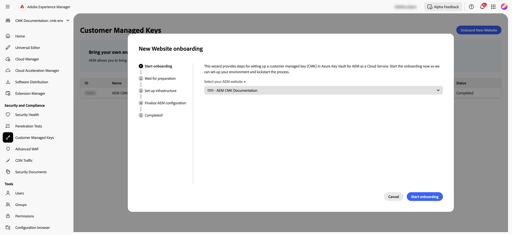

# Configuración de claves administradas por el cliente para AEM as a Cloud Service {#customer-managed-keys-for-aem-as-a-cloud-service}

AEM as a Cloud Service almacena actualmente datos de cliente en Azure Blob Storage y MongoDB, utilizando claves de cifrado administradas por el proveedor de forma predeterminada para proteger los datos. Aunque esta configuración satisface las necesidades de seguridad de muchas organizaciones, las empresas de sectores regulados o las que requieren mayor seguridad para sus datos pueden buscar un mayor control sobre sus prácticas de cifrado. En el caso de las organizaciones que dan prioridad a la seguridad de los datos, al cumplimiento normativo y a la posibilidad de administrar sus claves de cifrado, la solución CMK (Claves administradas por el cliente) ofrece una mejora esencial.

## Problema resuelto {#the-problem-being-solved}

Las claves administradas por el proveedor pueden suponer problemas para las empresas que requieren privacidad e integridad adicionales. Si no tienen el control sobre la administración de claves, las organizaciones se enfrentan a desafíos a la hora de cumplir los requisitos de conformidad, implementar políticas de seguridad personalizadas y garantizar una total seguridad de los datos.

La introducción de claves administradas por el cliente (CMK) soluciona estos problemas al otorgar a los clientes de AEM el control total de sus claves de cifrado. Mediante la autenticación a través de Microsoft Entra ID (anteriormente Azure Active Directory), AEM CS se conecta de forma segura a Azure Key Vault del cliente, lo que les permite administrar el ciclo de vida de sus claves de cifrado, abarcando la creación, rotación y revocación de claves.

CMK ofrece varias ventajas:

* **Controlar datos y cifrado de aplicaciones:** intensifique la seguridad con el control directo de su aplicación de AEM y las claves de cifrado de datos.
* **Aumentar la confidencialidad y la integridad:** reduzca la posibilidad de accesos inadvertidos y la divulgación de datos confidenciales o privados con una administración completa del cifrado.
* **Compatibilidad con Azure Key Vault:** el uso de Azure Key Vault permite el almacenamiento de claves, el procesamiento de operaciones secretas y la realización de rotaciones de claves.

Al adoptar CMK, los clientes pueden aumentar el control sobre sus prácticas de seguridad y cifrado de datos, mejorando el cumplimiento y reduciendo los riesgos, todo ello mientras siguen disfrutando de las opciones de escalabilidad y la flexibilidad que ofrece AEM CS.

AEM as a Cloud Service le permite traer sus propias claves de cifrado para cifrar datos en reposo. Esta guía proporciona los pasos necesarios para configurar una clave administrada por el cliente (CMK) en Azure Key Vault para AEM as a Cloud Service.

>[!WARNING]
>
>Después de configurar CMK, no podrá volver a las claves administradas por el sistema. Es su responsabilidad administrar sus claves de forma segura y proporcionar acceso a Key Vault, la clave y la aplicación CMK dentro de Azure para evitar la pérdida de acceso a sus datos.

También se le guiará a través de los siguientes pasos para crear y configurar la infraestructura necesaria:

1. Configurar su entorno
1. Obtener un ID de aplicación de Adobe
1. Crear un nuevo grupo de recursos
1. Creación de un almacén de claves
1. Conceder acceso de Adobe al almacén de claves
1. Crear una clave de cifrado

Deberá compartir la dirección URL del almacén de claves, el nombre de la clave de cifrado y la información sobre el almacén de claves con Adobe.

## Configurar su entorno {#setup-your-environment}

La interfaz de línea de comandos (CLI) de Azure es el único requisito de esta guía. Si todavía no tiene instalada la CLI de Azure, siga las instrucciones de instalación oficiales [aquí](https://learn.microsoft.com/es-es/cli/azure/install-azure-cli).

Antes de continuar con el resto de esta guía, inicie sesión en su CLI con `az login`.

>[!NOTE]
>
>Aunque esta guía utiliza la CLI de Azure, es posible realizar las mismas operaciones a través de la consola de Azure. Si prefiere usar la consola de Azure, utilice los comandos siguientes como referencia.


## Iniciar el proceso de configuración de CMK para AEM as a Cloud Service {#request-cmk-for-aem-as-a-cloud-service}

Debe solicitar la configuración de claves administradas por el cliente (CMK) para su entorno de AEM as a Cloud Service a través de la interfaz de usuario de. Para ello, vaya a la interfaz de usuario de AEM Home Security, en la sección **Claves administradas por el cliente**.
A continuación, puede iniciar el proceso de incorporación haciendo clic en el botón **Iniciar incorporación**.




## Obtener un ID de aplicación de Adobe {#obtain-an-application-id-from-adobe}

Después de iniciar el proceso de incorporación, Adobe proporcionará un ID de aplicación adicional. Este ID de aplicación es necesario para el resto de la guía y se utilizará para crear una entidad de seguridad de servicio que permita a Adobe acceder a su almacén de claves. Si todavía no tiene un ID de aplicación, debe esperar hasta que Adobe lo proporcione.


Una vez completada la solicitud, podrá ver el ID de la aplicación en la interfaz de usuario de CMK.


## Crear un nuevo grupo de recursos {#create-a-new-resource-group}

Cree un nuevo grupo de recursos en la ubicación que desee.

```powershell
# Choose a location and a name for the resource group.
$location="<AZURE LOCATION>"
$resourceGroup="<RESOURCE GROUP>"

# Create the resource group.
az group create --location $location --resource-group $resourceGroup
```

Si ya dispone de un grupo de recursos, no dude en utilizarlo en su lugar. En el resto de esta guía, la ubicación del grupo de recursos y su nombre se identifican con `$location` y `$resourceGroup`, respectivamente.

## Crear un almacén de claves {#create-a-key-vault}

Deberá crear un almacén de claves que contenga la clave de cifrado. El almacén de claves debe tener habilitada la protección contra depuración. La protección contra depuración es necesaria para cifrar datos en reposo desde otros servicios de Azure. El acceso a la red pública debe estar habilitado para garantizar que los servicios de Adobe puedan acceder al almacén de claves.

>[!IMPORTANT]
>La creación de Key Vault con el acceso a la red pública desactivado exige que todas las operaciones relacionadas con Key Vault, como la creación o rotación de claves, se ejecuten desde un entorno que tenga acceso de red a KeyVault, por ejemplo, una VM que pueda acceder a KeyVault.

```powershell
# Reuse this information from the previous step.
$location="<AZURE LOCATION>"
$resourceGroup="<RESOURCE GROUP>"

# Choose a name for the key vault.
$keyVaultName="<KEY VAULT NAME>"

# Create the key vault.
az keyvault create `
  --location $location `
  --resource-group $resourceGroup `
  --name $keyVaultName `
  --default-action=Allow `
  --enable-purge-protection `
  --enable-rbac-authorization `
  --public-network-access Enabled
```

## Conceder a Adobe acceso al almacén de claves {#grant-adobe-access-to-the-key-vault}

En este paso permitirá que Adobe acceda a su almacén de claves a través de una aplicación Entra. Adobe debería haber proporcionado ya el ID de la aplicación Entra.

En primer lugar, debe crear una entidad de seguridad de servicio adjunta a la aplicación Entra y asignarle los roles **Key Vault Reader** y **Key Vault Crypto User**. Las funciones se limitan al almacén de claves creado en esta guía.

```powershell
# Reuse this information from the previous steps.
$resourceGroup="<RESOURCE GROUP>"
$keyVaultName="<KEY VAULT NAME>"

# The application ID is provided by Adobe.
$appId="<APPLICATION ID>"

# Retrieve the ID of the key vault.
$keyVaultId=(az keyvault show --resource-group $resourceGroup --name $keyVaultName --query id --output tsv)

# Create a new service principal.
$servicePrincipalId=(az ad sp create --id $appId --query id --out tsv)

# Assign the roles to the service principal.
az role assignment create --assignee $servicePrincipalId --role "Key Vault Reader" --scope $keyVaultId
az role assignment create --assignee $servicePrincipalId --role "Key Vault Crypto User" --scope $keyVaultId
```

## Crear una clave de cifrado {#create-an-encryption-key}

Por último, puede crear una clave de cifrado en el almacén de claves. Tenga en cuenta que necesitará la función **Key Vault Crypto Officer** para completar este paso. Si el usuario que ha iniciado sesión no dispone de esta función, póngase en contacto con el administrador del sistema para que se la otorgue o pida a alguien que ya la tenga que complete este paso por usted.

Se requiere acceso de red al almacén de claves para crear la clave de cifrado. En primer lugar, compruebe que puede acceder al almacén de claves y continúe con la creación de la clave:

```powershell
# Reuse this information from the previous steps.
$keyVaultName="<KEY VAULT NAME>"

# Choose a name for your key.
$keyName="<KEY NAME>"

# Create the key.
az keyvault key create --vault-name $keyVaultName --name $keyName
```

## Compartir la información de Key Vault {#share-the-key-vault-information}

En este punto, ya está todo listo. Solo necesita compartir información necesaria a través de la interfaz de usuario de CMK, que iniciará el proceso de configuración del entorno.

```powershell
# Reuse this information from the previous steps.
$resourceGroup="<RESOURCE GROUP>"
$keyVaultName="<KEY VAULT NAME>"

# Retrieve the URL of your key vault.
$keyVaultUri=(az keyvault show --name $keyVaultName `
    --resource-group $resourceGroup `
    --query properties.vaultUri `
    --output tsv)

# In addition we would need the tenantId and the subscriptionId in order to setup the connection.
$tenantId=(az keyvault show --name $keyVaultName `
    --resource-group $resourceGroup `
    --query properties.tenantId `
    --output tsv)
$subscriptionId="<Subscription ID>"
```
Proporcione esta información en la interfaz de usuario de CMK:


## Implicaciones de la revocación del acceso a claves {#implications-of-revoking-key-access}

La revocación o deshabilitación del acceso a Key Vault, a la clave o a la aplicación CMK puede causar interrupciones significativas, que incluyan cambios de última hora en las operaciones de la plataforma. Una vez deshabilitadas estas claves, los datos de la plataforma pueden volverse inaccesibles y cualquier operación posterior que dependa de estos datos dejará de funcionar. Es crucial comprender completamente las repercusiones posteriores antes de realizar cambios en las configuraciones clave.

Si decide revocar el acceso de la plataforma a sus datos, puede hacerlo eliminando la función de usuario asociada a la aplicación desde Key Vault en Azure.

## Pasos siguientes {#next-steps}

Una vez que haya proporcionado la información necesaria en la interfaz de usuario de CMK, Adobe iniciará el proceso de configuración para su entorno de AEM as a Cloud Service. Este proceso puede tardar un poco y se le notificará una vez que se haya completado.


## Completar la configuración de CMK {#complete-the-cmk-setup}

Una vez completado el proceso de configuración, podrá ver el estado de la configuración de CMK en la interfaz de usuario. También puede ver el almacén de claves y la clave de cifrado.


## Preguntas y asistencia {#questions-and-support}

Póngase en contacto con nosotros si tiene alguna pregunta, consulta o necesita ayuda con la configuración de claves administradas por el cliente para AEM as a Cloud Service. El Soporte de Adobe puede ayudarle con cualquier pregunta que pueda tener.
