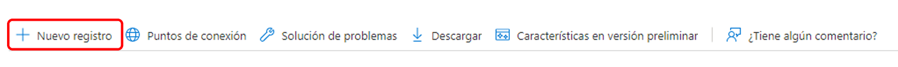

# Compatibilidad con OAuth2 para el servicio de correo {#oauth2-support-for-the-mail-service}

AEM as a Cloud Service ofrece compatibilidad con OAuth2 para su servicio de correo integrado, con el fin de permitir que las organizaciones se adhieran a los requisitos de correo electrónico seguros.

Puede configurar OAuth para varios proveedores de correo electrónico. A continuación se proporcionan instrucciones paso a paso para configurar el servicio de correo de AEM para autenticarse mediante OAuth2 con Outlook de Microsoft® Office 365. Otros proveedores se pueden configurar de manera similar.

Para obtener más información sobre el servicio de correo de AEM as a Cloud Service, consulte [Envío de correos electrónicos](/help/implementing/developing/introduction/development-guidelines.md#sending-email).

## Microsoft® Outlook {#microsoft-outlook}

1. Vaya a [https://portal.azure.com/](https://portal.azure.com/) e inicie sesión.
1. Busque **Azure Active Directory** en la barra de búsqueda y haga clic en el resultado. También puede navegar directamente a [https://portal.azure.com/#blade/Microsoft_AAD_IAM/ActiveDirectoryMenuBlade/Overview](https://portal.azure.com/#blade/Microsoft_AAD_IAM/ActiveDirectoryMenuBlade/Overview)
1. Haga clic en **Registro de aplicaciones** > **Nuevo registro**.

   

1. Rellene la información según sus necesidades y haga clic en **Registro**.
1. Vaya a la aplicación creada y seleccione **Permisos de API**.
<!-- Alexandru: removing as a result of CQDOC-20609 
1. Click **Add Permission** > **Graph Permission** > **Delegated Permissions**. -->
1. Seleccione los siguientes permisos para su aplicación y haga clic en **Añadir permiso**:

   >[!NOTE]
   >
   >La configuración de los permisos puede evolucionar con el tiempo. Trabaje con Microsoft® si estos no funcionan de acuerdo con lo previsto.

   * `https://outlook.office.com/SMTP.Send`
   * `openid`
   * `offline_access`
   * `email`
   * `profile`
1. Vaya a **Autenticación** > **Añadir una plataforma** > **Web** y en la sección **Redirección de URL**, añada las siguientes direcciones URL: una con barra diagonal y otra sin:
   * `http://localhost/`
   * `http://localhost`
1. Pulse **Configurar** después de añadir cada URL y configurar los ajustes según sus necesidades.
1. A continuación, vaya a **Certificados y secretos**, haga clic en **Nuevo secreto de cliente** y siga los pasos que aparecen en la pantalla para crear un secreto. Asegúrese de tomar nota de este secreto para utilizarlo posteriormente.
1. Pulse **Información general** en el panel izquierdo y copie los valores de **ID de aplicación (cliente)** y **ID de directorio (inquilino)** para su posterior uso.

Para recapitular, utilice la siguiente información para configurar OAuth2 para el servicio de correo en el lado AEM:

* La URL de autenticación, que se construye con el ID del inquilino. Tiene este formulario: `https://login.microsoftonline.com/<tenantID>/oauth2/v2.0/authorize`
* La URL del token, que se construye con el ID del inquilino. Tiene este formulario: `https://login.microsoftonline.com/<tenantID>/oauth2/v2.0/token`
* La URL de actualización, que se construye con el ID del inquilino. Tiene este formulario: `https://login.microsoftonline.com/<tenantID>/oauth2/v2.0/token`
* El ID de cliente
* El secreto del cliente

### Generación del token de actualización {#generating-the-refresh-token}

A continuación, genere el token de actualización, que forma parte de la configuración OSGi en un paso posterior, haciendo lo siguiente:

1. Abra la siguiente URL en el explorador después de reemplazar `clientID` y `tenantID` con los valores específicos de su cuenta:

   ```
   https://login.microsoftonline.com/%3ctenantID%3e/oauth2/v2.0/authorize?client_id=%3cclientId%3e&response_type=code&redirect_uri=http://localhost&response_mode=query&scope=https://outlook.office.com/SMTP.Send%20email%20openid%20profile%20offline_access&state=12345`
   ```

1. Cuando se le pida, conceda el permiso.
1. La dirección URL se redirecciona a una nueva ubicación, construida con este formato:

   ```
   http://localhost/?code=<code>&state=12345&session_state=4f984c6b-cc1f-47b9-81b2-66522ea83f81#`
   ```

1. Copie el valor de `<code>` en el ejemplo anterior.
1. Utilice el siguiente comando cURL para obtener el refreshToken. Reemplace tenantID, clientID y clientSecret con los valores de su cuenta y el valor de `<code>`:

   ```
   curl --location --request POST 'https://login.microsoftonline.com/<tenantId>/oauth2/v2.0/token' \
   --header 'Content-Type: application/x-www-form-urlencoded' \
   --header 'Cookie: buid=0.ARgAep0nU49DzUGmoP2wnvyIkcQjsx26HEpOnvHS0akqXQgYAAA.AQABAAEAAAD--DLA3VO7QrddgJg7Wevry9XPJSKbGVlPt5NWYxLtTl3K1W0LwHXelrffApUo_K02kFrkvmGm94rfBT94t25Zq4bCd5IM3yFOjWb3V22yDM7-rl112sLzbBQBRCL3QAAgAA; esctx=AQABAAAAAAD--DLA3VO7QrddgJg7Wevr4a8wBjYcNbBXRievdTOd15caaeAsQdXeBAQA3tjVQaxmrOXFGkKaE7HBzsJrzA-ci4RRpor-opoo5gpGLh3pj_iMZuqegQPEb1V5sUVQV8_DUEbBv5YFV2eczS5EAhLBAwAd1mHx6jYOL8LwZNDFvd2-MhVXwPd6iKPigSuBxMogAA; x-ms-gateway-slice=estsfd; stsservicecookie=estsfd; fpc=Auv6lTuyAP1FuOOCfj9w0U_5vR5dAQAAALDXP9gOAAAAwIpkkQEAAACT2T_YDgAAAA' \
   --data-urlencode 'client_id=<clientID>' \
   --data-urlencode 'scope=https://outlook.office.com/SMTP.Send email openid profile offline_access' \
   --data-urlencode 'redirect_uri=http://localhost' \
   --data-urlencode 'grant_type=authorization_code' \
   --data-urlencode 'client_secret=<clientSecret>' \
   --data-urlencode 'code=<code>'
   ```

1. Tome nota de refreshToken y accessToken.

### Validación de tokens {#validating-the-tokens}

Antes de configurar OAuth en el lado de AEM, asegúrese de validar accessToken y refreshToken con el siguiente procedimiento:

1. Genere el accessToken utilizando el refreshToken producido en el procedimiento anterior utilizando el siguiente curl, reemplazando los valores de `<client_id>`, `<client_secret>` y `<refreshToken>`:

   ```
   curl --location --request POST 'https://login.microsoftonline.com/<tenetId>/oauth2/v2.0/token' \
   --header 'Content-Type: application/x-www-form-urlencoded' \
   --header 'Cookie: buid=0.ARgAep0nU49DzUGmoP2wnvyIkcQjsx26HEpOnvHS0akqXQgYAAA.AQABAAEAAAD--DLA3VO7QrddgJg7Wevry9XPJSKbGVlPt5NWYxLtTl3K1W0LwHXelrffApUo_K02kFrkvmGm94rfBT94t25Zq4bCd5IM3yFOjWb3V22yDM7-rl112sLzbBQBRCL3QAAgAA; esctx=AQABAAAAAAD--DLA3VO7QrddgJg7Wevr4a8wBjYcNbBXRievdTOd15caaeAsQdXeBAQA3tjVQaxmrOXFGkKaE7HBzsJrzA-ci4RRpor-opoo5gpGLh3pj_iMZuqegQPEb1V5sUVQV8_DUEbBv5YFV2eczS5EAhLBAwAd1mHx6jYOL8LwZNDFvd2-MhVXwPd6iKPigSuBxMogAA; x-ms-gateway-slice=estsfd; stsservicecookie=estsfd; fpc=Auv6lTuyAP1FuOOCfj9w0U_IezHLAQAAAPeNSdgOAAAA' \
   --data-urlencode 'client_id=<client_id>' \
   --data-urlencode 'scope=https://outlook.office.com/SMTP.Send email openid profile offline_access' \
   --data-urlencode 'redirect_uri=http://localhost' \
   --data-urlencode 'grant_type=refresh_token' \
   --data-urlencode 'client_secret=<client_secret>' \
   --data-urlencode 'refresh_token=<refreshToken>'
   ```

1. Envíe un correo utilizando el accessToken para poder ver si funciona correctamente.

>[!NOTE]
>
> Puede obtener la colección de la API Postman desde [esta ubicación](https://learn.microsoft.com/es-es/entra/identity-platform/v2-oauth2-auth-code-flow).
>
> Consulte la [documentación de MSFT OAuth ](https://learn.microsoft.com/es-ES/exchange/client-developer/legacy-protocols/how-to-authenticate-an-imap-pop-smtp-application-by-using-oauth)para obtener más información.

### Integración con AEM as a Cloud Service {#integration-with-aem-as-a-cloud-service}

1. Cree un archivo de propiedad OSGi llamado `com.day.cq.mailer.oauth.impl.OAuthConfigurationProviderImpl.cfg.json` en `/apps/<my-project>/osgiconfig/config` con la siguiente sintaxis:

   ```
   {
       authUrl: "<Authorization Url>",
       tokenUrl: "<Token Url>",
       clientId: "<clientID>",
       clientSecret: "$[secret:SECRET_SMTP_OAUTH_CLIENT_SECRET]",
       scopes: [
          "scope1",
          "scope2"
       ],
       authCodeRedirectUrl: "http://localhost",
       refreshUrl: "<Refresh token Url>",
       refreshToken: "$[secret:SECRET_SMTP_OAUTH_REFRESH_TOKEN]"
   }
   ```

1. Complete `authUrl`, `tokenUrl` y `refreshURL` construyéndolos como se describe en la sección anterior.
1. Añada los siguientes ámbitos a la configuración:

   >[!NOTE]
   >
   >Los ámbitos pueden evolucionar con el tiempo. Trabaje con Microsoft® si estos no funcionan de acuerdo con lo previsto.

   * `https://outlook.office.com/SMTP.Send`
   * `openid`
   * `offline_access`
   * `email`
   * `profile`
1. Cree un archivo de propiedad OSGi `called com.day.cq.mailer.DefaultMailService.cfg.json`
en `/apps/<my-project>/osgiconfig/config` con la siguiente sintaxis: `smtp.host` y `smtp.port` reflejan la configuración avanzada de red, tal como se describe en la sección [Tutorial del servicio de correo electrónico](https://experienceleague.adobe.com/es/docs/experience-manager-learn/cloud-service/networking/examples/email-service).

   ```
   {
    "smtp.host": "$[env:AEM_PROXY_HOST;default=proxy.tunnel]",
    "smtp.user": "<user account that logged into get the oauth tokens>",
    "smtp.password": "value not used",
    "smtp.port": 30465,
    "from.address": "<from address used for sending>",
    "smtp.ssl": false,
    "smtp.starttls": true,
    "smtp.requiretls": true,
    "debug.email": false,
    "oauth.flow": true
   }
   ```

1. Para Outlook, el valor de configuración de `smtp.host` es `smtp.office365.com`
1. Durante el tiempo de ejecución, pase los secretos `refreshToken values` y `clientSecret` mediante la [API de variables de Cloud Manager](/help/implementing/deploying/configuring-osgi.md#setting-values-via-api) o utilizando [Cloud Manager para añadir variables](/help/implementing/cloud-manager/environment-variables.md). Los valores de las variables `SECRET_SMTP_OAUTH_REFRESH_TOKEN` y `SECRET_SMTP_OAUTH_CLIENT_SECRET` deben definirse.

### Solución de problemas {#troubleshooting}

Si el servicio de correo no funciona correctamente, en la mayoría de los casos debe volver a generar el `refreshToken` como se ha descrito anteriormente, pasando el nuevo valor a través de la API de Cloud Manager. El nuevo valor tarda unos minutos en implementarse.
