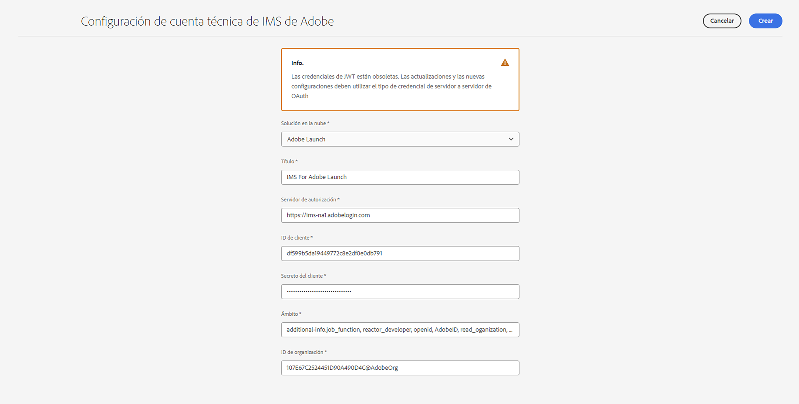
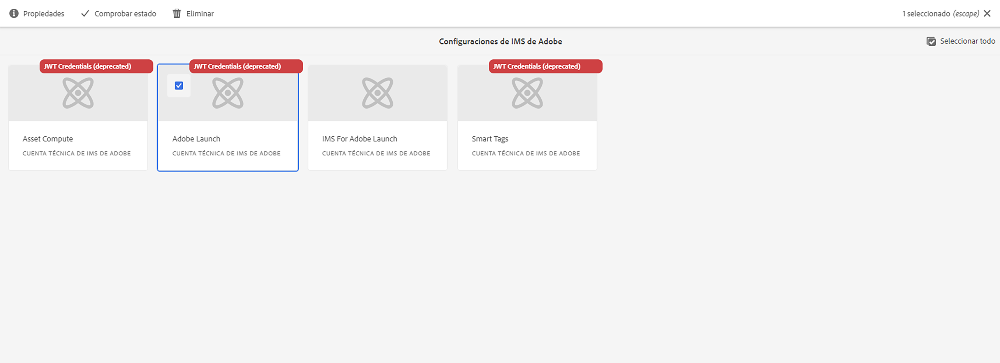
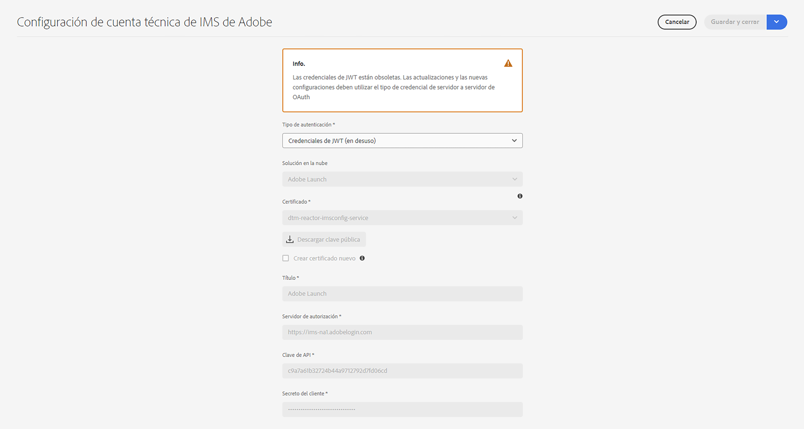
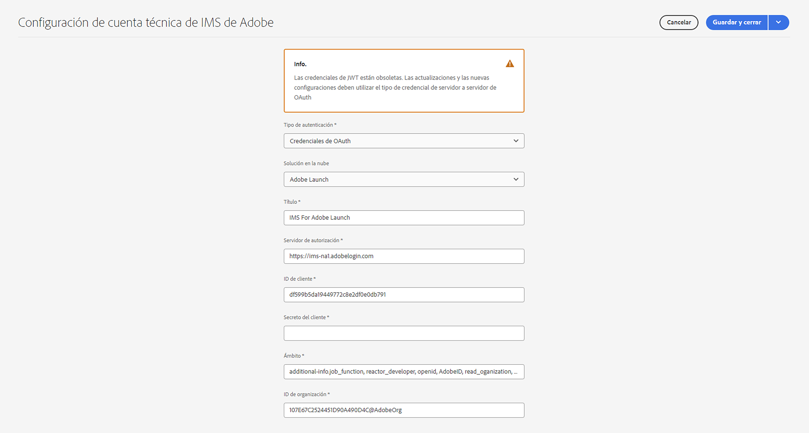

# Configuración de las integraciones de IMS para AEM as a Cloud Service {#setting-up-ims-integrations-for-aemaacs}

>[!NOTE]
>
>Las configuraciones de JWT aprovisionadas automáticamente no deben migrarse manualmente, ya que Adobe las gestionará automáticamente.

Adobe Experience Manager (AEM) as a Cloud Service se puede integrar con muchas otras soluciones de Adobe. Por ejemplo, Adobe Target y Adobe Analytics, entre otras.

Las integraciones utilizan una integración de IMS configurada con S2S OAuth.

* Una vez que haya creado lo siguiente:

   * [las credenciales en Developer Console](#credentials-in-the-developer-console)

* Puede avanzar con lo siguiente:

   * Crear una (nueva) [Configuración de OAuth](#creating-oauth-configuration)

   * [Migrar una configuración JWT existente a una configuración de OAuth.](#migrating-existing-JWT-configuration-to-oauth)

>[!CAUTION]
>
>Anteriormente, las configuraciones se hacían con las [credenciales JWT que ahora están en desuso en Adobe Developer Console](/help/security/jwt-credentials-deprecation-in-adobe-developer-console.md).
>
>Estas configuraciones ya no se pueden crear ni actualizar, pero sí migrar a las configuraciones de OAuth.

## Credenciales en Developer Console {#credentials-in-the-developer-console}

Como primer paso, debe configurar las credenciales de OAuth en Adobe Developer Console.

Para obtener detalles sobre cómo hacer esto, consulte la documentación de Developer Console, según lo que necesite:

* Información general:

   * [Autenticación de servidor a servidor](https://developer.adobe.com/developer-console/docs/guides/authentication/ServerToServerAuthentication/)

* Creación de una nueva credencial de OAuth:

   * [Guía de implementación de credenciales de servidor a servidor de OAuth](https://developer.adobe.com/developer-console/docs/guides/authentication/ServerToServerAuthentication/implementation)

* Migración de una credencial JWT existente a una credencial de OAuth:

   * [Migración de una credencial de cuenta de servicio (JWT) a una credencial de servidor a servidor de OAuth](https://developer.adobe.com/developer-console/docs/guides/authentication/ServerToServerAuthentication/migration/)

Por ejemplo:

## Creación de una configuración de OAuth {#creating-oauth-configuration}

Para crear una nueva integración de Adobe IMS con OAuth, haga lo siguiente:

1. En AEM, navegue hasta **Herramientas**, **Seguridad**, **Integración de IMS de Adobe**.

1. Seleccione **Crear**.

1. Complete la configuración en función de los detalles de [Developer Console](https://developer.adobe.com/developer-console/docs/guides/authentication/ServerToServerAuthentication/implementation). Por ejemplo:

   

1. **Guarde** los cambios.

## Migración de una configuración JWT existente a una configuración de OAuth {#migrating-existing-JWT-configuration-to-oauth}

Para migrar una integración de IMS de Adobe existente basada en las credenciales de JWT, haga lo siguiente:

>[!NOTE]
>
>Este ejemplo muestra una configuración de IMS de Launch.

1. En AEM, navegue hasta **Herramientas**, **Seguridad**, **Integración de IMS de Adobe**.

1. Seleccione la configuración JWT que debe migrarse. Las configuraciones JWT se marcan con la advertencia **Credenciales de JWT (en desuso)**.

1. Seleccione **Propiedades**.

   

1. La configuración se abre como de solo lectura:

   

1. Seleccione **OAuth** en la lista desplegable **Tipo de autenticación**:

   

1. Se actualizarán las propiedades disponibles. Utilice los detalles de Developer Console para completarlos:

   

1. Use **Guardar y cerrar** para conservar las actualizaciones.
Cuando vuelva a la consola, la advertencia **Credenciales de JWT (en desuso)** habrá desaparecido.
