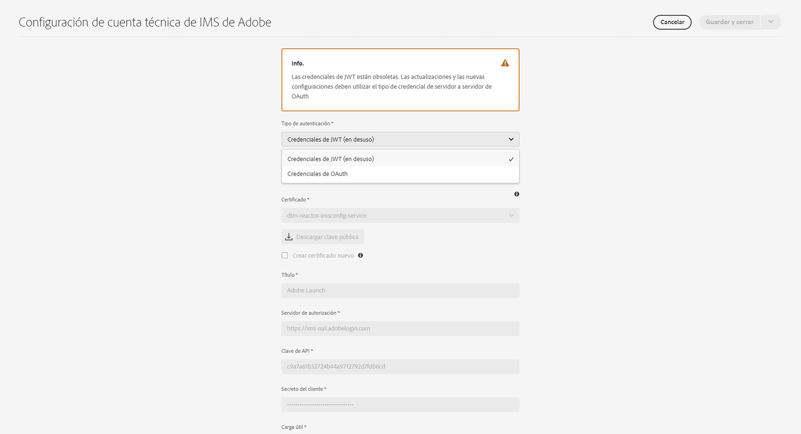

# AEM as a Cloud Service Configuración de integraciones de IMS para la creación de {#setting-up-ims-integrations-for-aemaacs}

Adobe Experience Manager AEM () as a Cloud Service se puede integrar con muchas otras soluciones de Adobe. Por ejemplo, Adobe Target, Adobe Analytics y otros.

Las integraciones utilizan una integración de IMS, configurada con S2S OAuth.

* Una vez creado:

   * [Credenciales en Developer Console](#credentials-in-the-developer-console)

* A continuación, puede:

   * Crear un (nuevo) [Configuración de OAuth](#creating-oauth-configuration)

   * [Migración de una configuración JWT existente a una configuración de OAuth](#migrating-existing-JWT-configuration-to-oauth)

>[!CAUTION]
>
>Anteriormente, las configuraciones se realizaban con [Las credenciales de JWT ahora están sujetas a desaprobación en la consola de Adobe Developer](/help/security/jwt-credentials-deprecation-in-adobe-developer-console.md).
>
>Estas configuraciones ya no se pueden crear ni actualizar, pero se pueden migrar a configuraciones de OAuth.

## Credenciales en Developer Console {#credentials-in-the-developer-console}

Como primer paso, debe configurar las credenciales de OAuth en la consola de Adobe Developer.

Para obtener más información sobre cómo hacerlo, consulte la documentación de Developer Console, según sus necesidades:

* Información general:

   * [Autenticación de servidor a servidor](https://developer.adobe.com/developer-console/docs/guides/authentication/ServerToServerAuthentication/)

* Creación de una nueva credencial de OAuth:

   * [Guía de implementación de credenciales de servidor a servidor de OAuth](https://developer.adobe.com/developer-console/docs/guides/authentication/ServerToServerAuthentication/implementation/)

* Migración de una credencial JWT existente a una credencial OAuth:

   * [Migración de la credencial de cuenta de servicio (JWT) a la credencial de servidor a servidor OAuth](https://developer.adobe.com/developer-console/docs/guides/authentication/ServerToServerAuthentication/migration/)

Por ejemplo:

## Creación de una configuración de OAuth {#creating-oauth-configuration}

Para crear una nueva integración de Adobe IMS con OAuth:

1. AEM En, navegue hasta **Herramientas**, **Seguridad**, **Integración de IMS de Adobe**.

1. Seleccione **Crear**.

1. Complete la configuración en función de los detalles de la [Developer Console](https://developer.adobe.com/developer-console/docs/guides/authentication/ServerToServerAuthentication/implementation/). Por ejemplo:

   

1. **Guardar** sus cambios.

## Migración de una configuración JWT existente a una configuración de OAuth {#migrating-existing-JWT-configuration-to-oauth}

Para migrar una integración de Adobe IMS existente basada en credenciales de JWT:

>[!NOTE]
>
>Este ejemplo muestra una configuración de IMS de Launch.

1. AEM En, navegue hasta **Herramientas**, **Seguridad**, **Integración de IMS de Adobe**.

1. Seleccione la configuración JWT que debe migrarse. Las configuraciones de JWT se marcan con la advertencia **Credenciales de JWT (obsoletas)**.

1. Seleccionar **Propiedades**:

   

1. La configuración se abrirá como de solo lectura:

   

1. Seleccionar **OAuth** desde el **Tipo de autenticación** desplegable:

   

1. Se actualizarán las propiedades disponibles. Utilice los datos de Developer Console para completarlos:

   

1. Uso **Guardar y cerrar** para mantener las actualizaciones.
Cuando vuelva a la consola, el **Credenciales de JWT (obsoletas)** la advertencia desaparecerá.