# Vista principal para la administración de permisos {#principal-view-for-permissions-management}

## Información general {#overview}

AEM presenta la Administración de permisos para usuarios y grupos. La funcionalidad principal sigue siendo la misma que la IU clásica, pero es más fácil de usar y eficiente.

## Acceso a la IU {#accessing-the-ui}

Se accede a la nueva administración de permisos basada en la interfaz de usuario a través de la tarjeta Permisos en Seguridad, como se muestra a continuación:

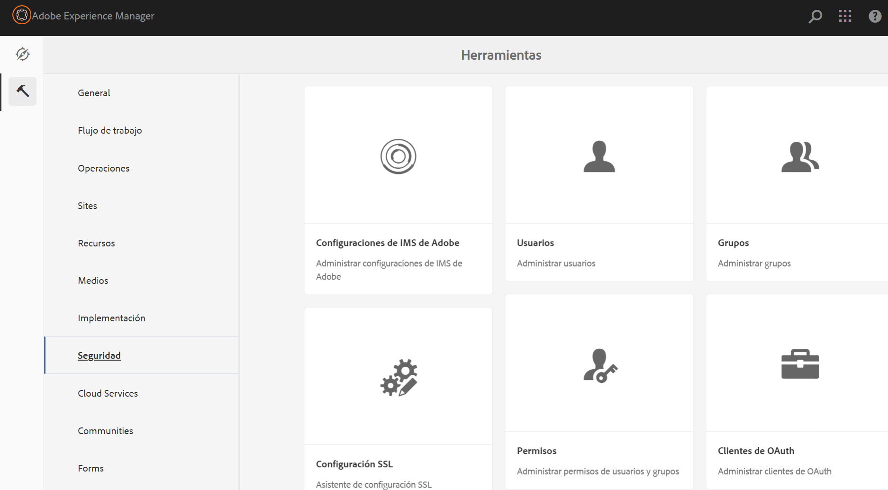

La nueva vista facilita la visualización de todo el conjunto de privilegios y restricciones para un principal determinado en todas las rutas en las que se han concedido permisos explícitamente. Esto elimina la necesidad de ir a

CRXDE para administrar privilegios y restricciones avanzados. Se ha consolidado en la misma vista.

Hay un filtro que permite al usuario seleccionar el tipo de principales para ver **usuarios**, **grupos** o **todos** y buscar cualquier principal **.**

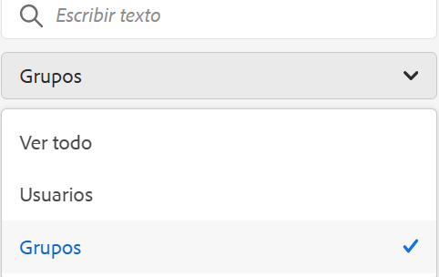

## Visualización de permisos para una entidad principal {#viewing-permissions-for-a-principal}

El marco de la izquierda permite a los usuarios desplazarse hacia abajo para encontrar cualquier principal o buscar un grupo o un usuario en función del filtro seleccionado, como se muestra a continuación:

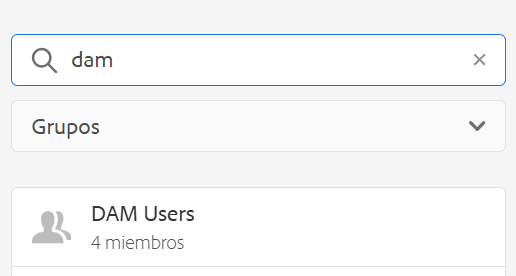

Al hacer clic en el nombre, se muestran los permisos asignados a la derecha. El panel de permisos muestra la lista de entradas de control de acceso en rutas específicas junto con las restricciones configuradas.

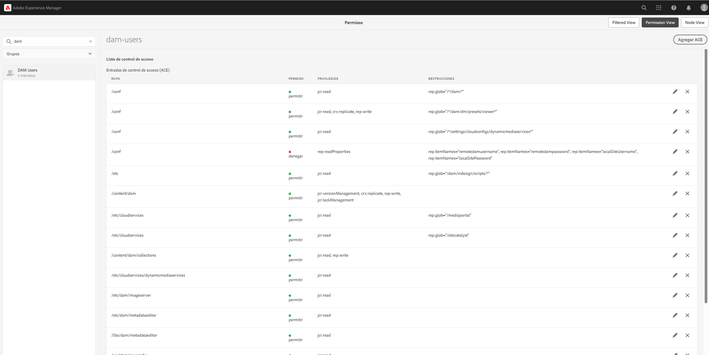

## Agregar una nueva entrada de control de acceso para una entidad principal {#adding-new-access-control-entry-for-a-principal}

Se pueden agregar nuevos permisos agregando una Entrada de control de acceso. Simplemente haga clic en el botón Agregar ACE.

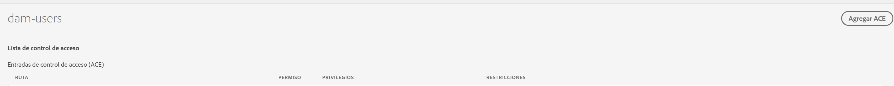

Esto abre la ventana que se muestra a continuación. El siguiente paso es elegir una ruta en la que se debe configurar el permiso.

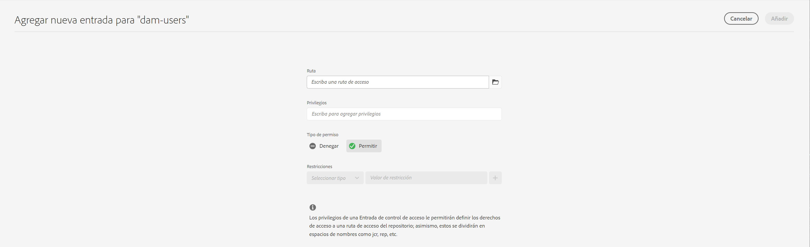

Aquí se selecciona una ruta donde puede configurar un permiso para **dam-users**:

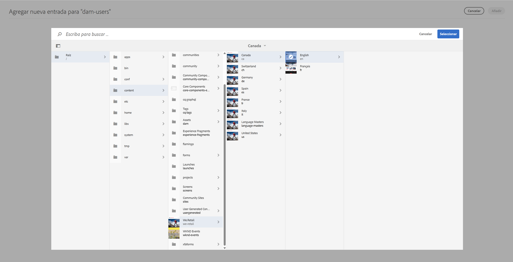

Una vez seleccionada la ruta de acceso, el flujo de trabajo vuelve a esta pantalla, donde el usuario puede seleccionar uno o más de los privilegios de las áreas de nombres disponibles (como `jcr`, `rep` o `crx`), como se muestra a continuación.

Los privilegios se pueden añadir buscando en el campo de texto y seleccionando a continuación en la lista.

>[!NOTE]
>
>Para obtener una lista completa de privilegios y descripciones, consulte [Administración de derechos de usuario, grupo y acceso](https://experienceleague.adobe.com/es/docs/experience-manager-65/content/security/user-group-ac-admin#access-right-management).

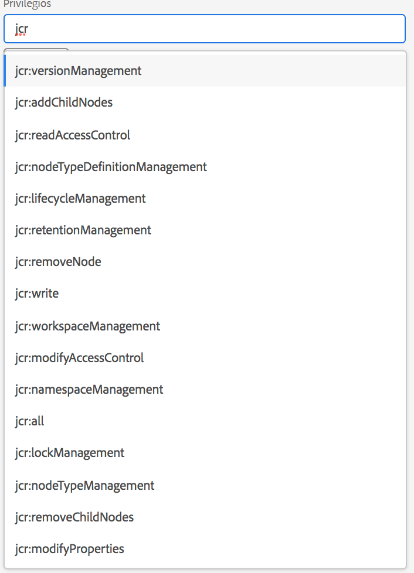 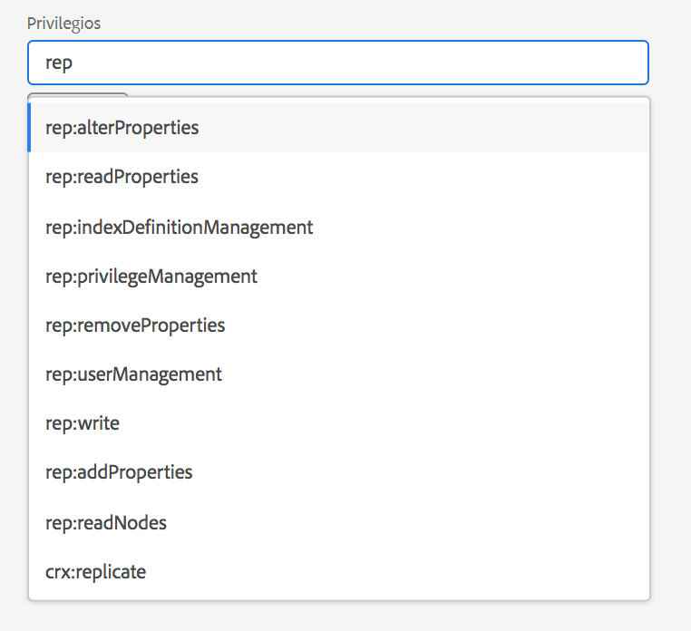

Una vez seleccionada la lista de privilegios, el usuario puede elegir el Tipo de permiso : Denegar o Permitir, como se muestra a continuación.

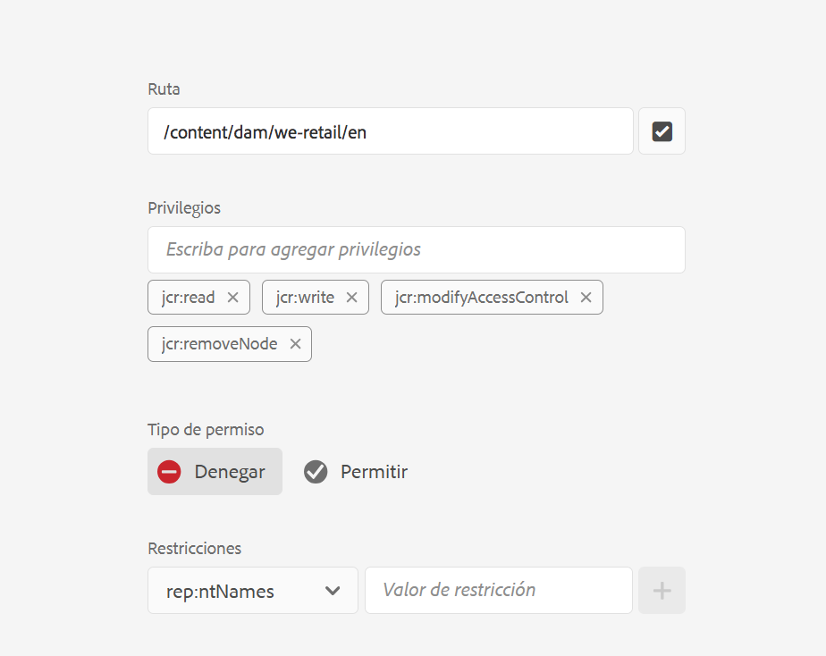 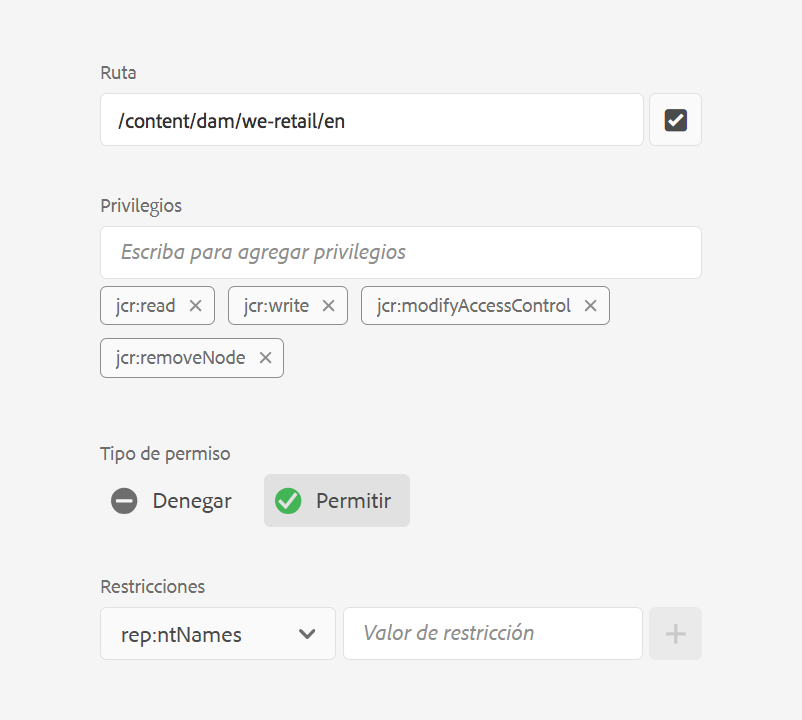

## Uso de restricciones {#using-restrictions}

Además de la lista de privilegios y el Tipo de permiso en una ruta determinada, esta pantalla también le permite agregar restricciones para el control de acceso específico, como se muestra a continuación:

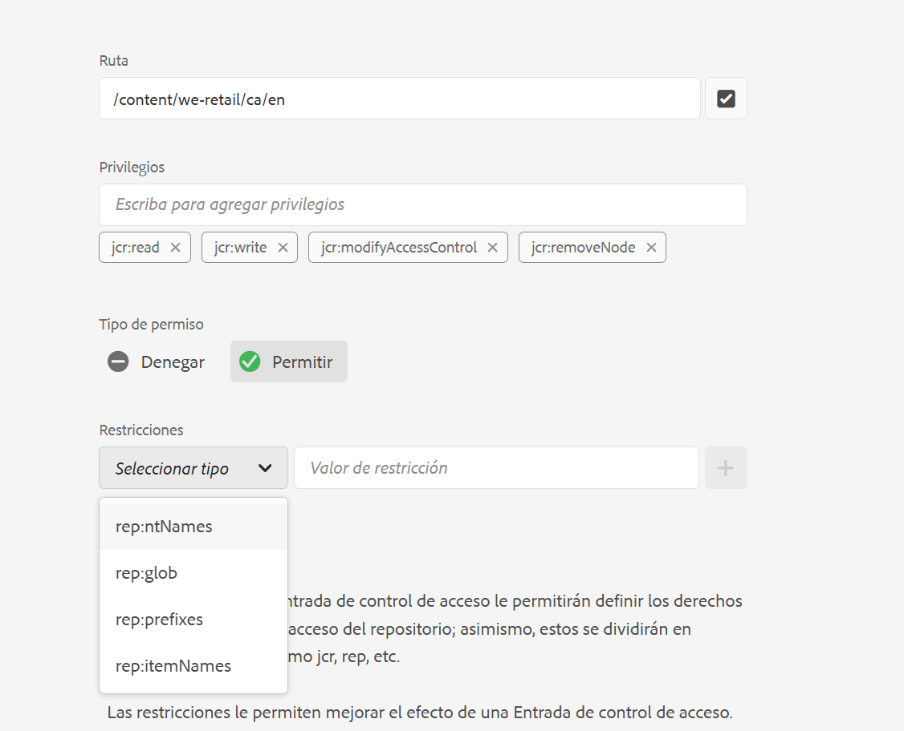

>[!NOTE]
>
>Para obtener más información sobre el significado de cada restricción, consulte [la documentación de Jackrabbit Oak](https://jackrabbit.apache.org/oak/docs/security/authorization/restriction.html?lang=es).

Las restricciones se pueden agregar como se muestra a continuación eligiendo el tipo de restricción, introduciendo el valor y pulsando el icono **+**.

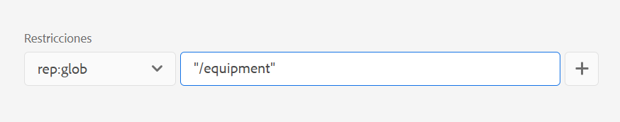 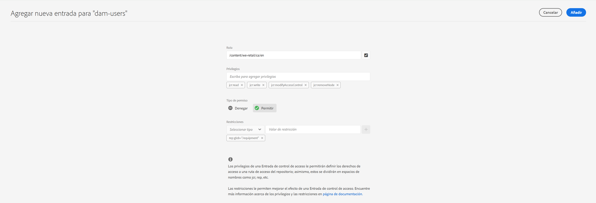

La nueva ACE se refleja en la Lista de control de acceso como se muestra a continuación. Tenga en cuenta que `jcr:write` es un privilegio agregado que incluye `jcr:removeNode` que se agregó anteriormente, pero no se muestra a continuación como cubierto en `jcr:write`.

## Edición de ACE {#editing-aces}

Las entradas de control de acceso se pueden editar seleccionando un principal y eligiendo el elemento ACE que desea editar.

Por ejemplo, aquí puede editar la siguiente entrada para **dam-users** haciendo clic en el icono de lápiz a la derecha:

La pantalla de edición se muestra con las entradas de control de acceso configuradas preseleccionadas, que se pueden eliminar haciendo clic en el icono en forma de cruz junto a ellas o se pueden añadir nuevos privilegios para la ruta dada, como se muestra a continuación.

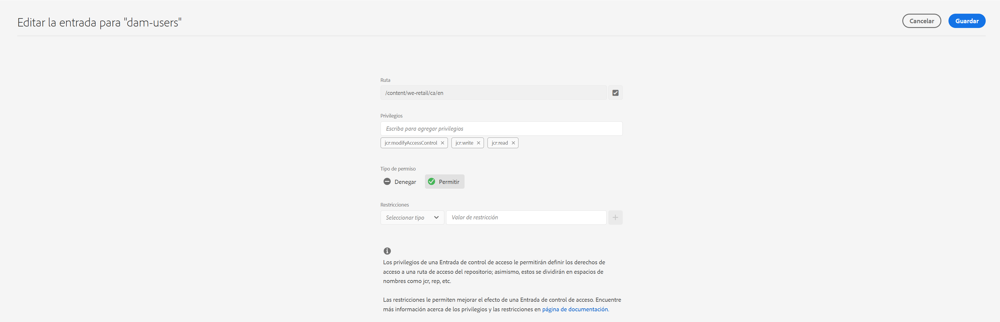

Aquí se agrega el privilegio `addChildNodes` para **dam-users** en la ruta dada.

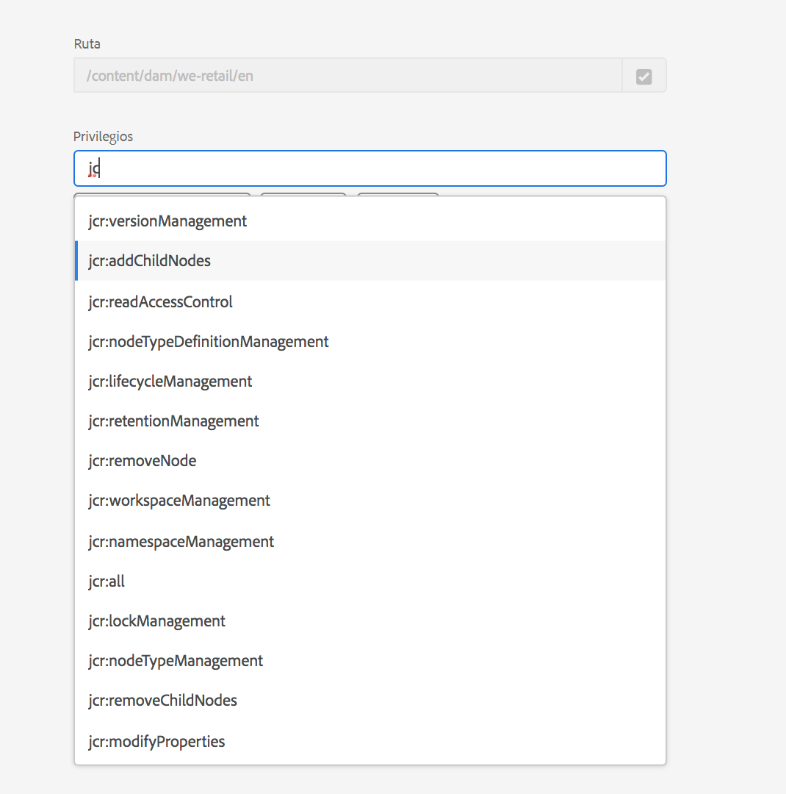

Los cambios se pueden guardar haciendo clic en el botón **Guardar** de la parte superior derecha, y se reflejan en los nuevos permisos para **dam-users**, como se muestra a continuación:

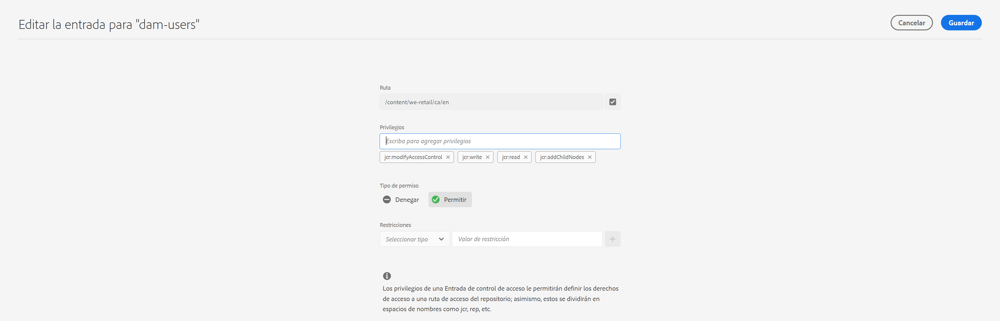

## Eliminación de ACE {#deleting-aces}

Las entradas de control de acceso se pueden eliminar para eliminar todos los permisos otorgados a una entidad de seguridad en una ruta específica. El icono X situado junto a ACE puede utilizarse para eliminarlo, como se muestra a continuación:

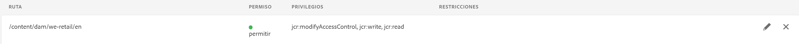 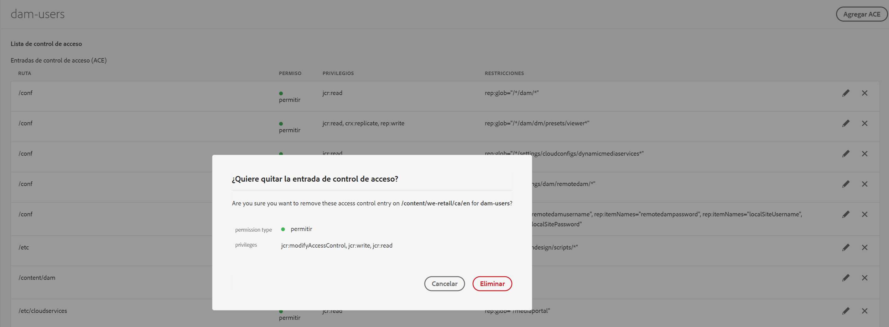

## Vista de permisos {#permissions-view}

### Vista de permisos de IU táctil {#touch-ui-permisions-view}

Los administradores necesitan un control y una visibilidad más granulares de las asignaciones de permisos en el nivel de nodo para una mejor seguridad y administración dentro de AEM. Anteriormente, solo estaba disponible una vista de permisos basada en principales, lo que limita la capacidad de ver cómo se aplican las ACL a nodos específicos o vistas filtradas. El nuevo nodo y la vista filtrada proporcionan una perspectiva detallada y contextualizada de las asignaciones de permisos, lo que permite una mejor administración y auditoría de las configuraciones de seguridad. Esta función mejora la supervisión administrativa y simplifica la administración de permisos, mejora la seguridad, reduce las configuraciones incorrectas y optimiza los controles de acceso de los usuarios en AEM.

Puede acceder a la vista de la IU táctil de permisos haciendo clic en **Herramientas - Seguridad - Permisos**, como se muestra a continuación:

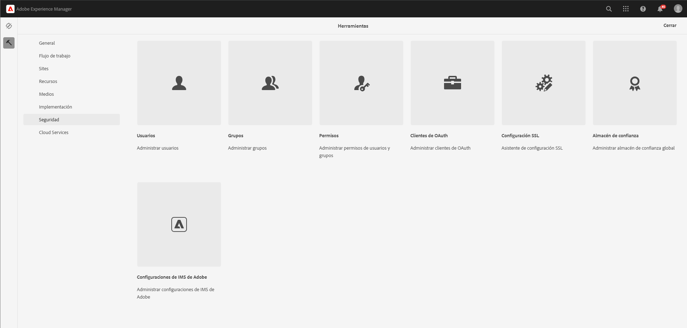

Una vez que inicie la vista Permisos, puede hacer clic en **Vista de nodo** o **Vista filtrada** en la esquina superior derecha de la pantalla según sus preferencias de visualización.

#### Vista de nodo

En esta vista, las ACL se presentan para cada nodo (ruta) individual. Proporciona información sobre:

ACL locales para el nodo seleccionado.
ACL efectivos, que incluyen ACL aplicados a cada nodo principal hasta la raíz (&quot;/&quot;).
Los usuarios tienen la opción de agregar, quitar o actualizar ACL. Cuando se hace clic en una ruta, el panel izquierdo muestra sus tareas secundarias, mientras que el lado derecho presenta una vista de tabla de todas las ACL asociadas con esa ruta.

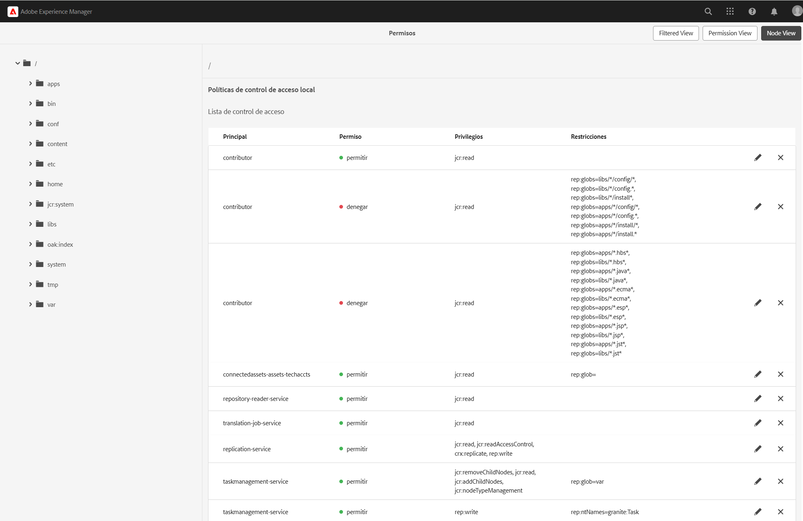

#### Vista filtrada

Esta vista permite a los usuarios buscar de forma eficaz permisos en una ruta y principales especificados. En esta vista, los usuarios pueden determinar fácilmente el tipo de permisos otorgados a un grupo de principales para la ruta seleccionada.
Además, la vista filtrada proporciona perspectivas sobre las ACL efectivas. Muestra las ACL asociadas al nodo principal de la ruta seleccionada, teniendo en cuenta el principal seleccionado y cualquier principal común.

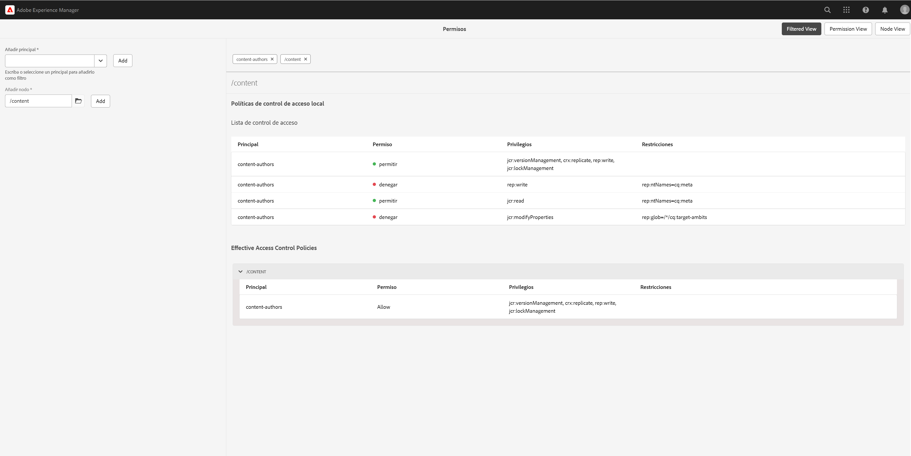

### La Vista Permisos del Explorador del repositorio {#the-repository-browser-permissions-view}

También se puede acceder a la vista de permisos a través de [Explorador del repositorio](/help/implementing/developing/tools/repository-browser.md).

Puede acceder a él mediante:

1. Abra Developer Console, haga clic en la ficha **Explorador de repositorios** y, a continuación, en **abrir Explorador de repositorios**

   

1. Una vez en el Explorador del repositorio, haga clic en la ficha **Permisos**

   

**Nota**: para ver los permisos, se requieren derechos de administrador. Siga los pasos mencionados [aquí](/help/implementing/developing/tools/repository-browser.md#navigate-the-hierarchy-navigate-the-hierarchy) para obtener acceso a los permisos.

## Combinaciones de privilegios de IU clásica {#classic-ui-privilege-combinations}

La nueva interfaz de usuario de permisos utiliza explícitamente el conjunto básico de privilegios en lugar de combinaciones predefinidas que no reflejan realmente los privilegios subyacentes exactos que se concedieron.

Causó confusión sobre qué se está configurando exactamente. En la tabla siguiente se muestra la asignación entre las combinaciones de privilegios de la IU clásica a los privilegios reales que las constituyen:

<table>
 <tbody>
  <tr>
   <th>Combinaciones de privilegios de IU clásica</th>
   <th>Privilegio de IU de permisos</th>
  </tr>
  <tr>
   <td>Lectura</td>
   <td><code>jcr:read</code></td>
  </tr>
  <tr>
   <td>Modificar</td>
   <td>
<code>jcr:modifyProperties</code>
 
<code>jcr:lockManagement</code>
 
<code>jcr:versionManagement</code>
 </td>
  </tr>
  <tr>
   <td>Crear</td>
   <td>
<code>jcr:addChildNodes</code>
 
<code>jcr:nodeTypeManagement</code>
 </td>
  </tr>
  <tr>
   <td>Eliminar</td>
   <td>
<code>jcr:removeNode</code>
 
<code>jcr:removeChildNodes</code>
 </td>
  </tr>
  <tr>
   <td>Leer ACL</td>
   <td><code>jcr:readAccessControl</code></td>
  </tr>
  <tr>
   <td>Editar ACL</td>
   <td><code>jcr:modifyAccessControl</code></td>
  </tr>
  <tr>
   <td>Replicar</td>
   <td><code>crx:replicate</code></td>
  </tr>
 </tbody>
</table>
