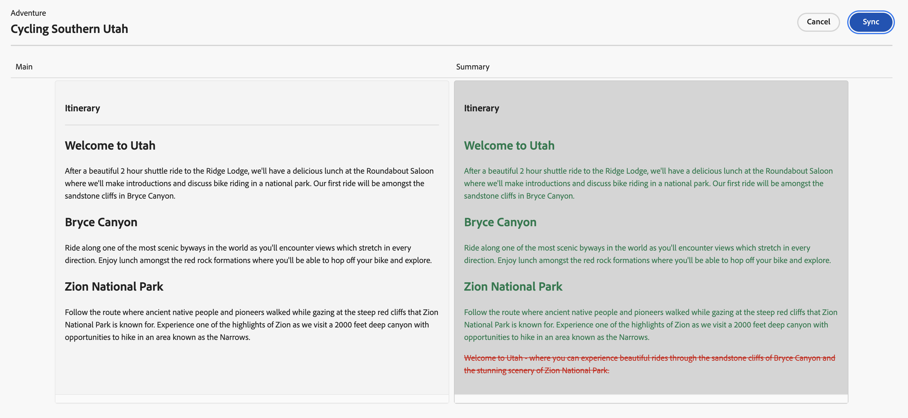
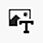
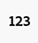

# Creación de fragmentos de contenido {#authoring-content-fragments}

La creación de los fragmentos de contenido se centra en la entrega sin encabezado y en la creación de páginas.

Hay dos editores disponibles para los fragmentos de contenido. El editor se describe en esta sección:

* se ha desarrollado para la entrega de contenido sin encabezado (aunque se puede utilizar en todos los casos)
* está disponible en la consola **Fragmentos de contenido**

Este editor proporciona lo siguiente:

* [Guardado automático](#saving-autosaving) para evitar la pérdida accidental de ediciones.
* [Carga de recursos en línea como referencias de contenido](#reference-images), sin tener que cargarlos primero en Asset DAM.
* [Generar variaciones](#generate-variations-ai) para usar la IA generativa con el fin de acelerar la creación de contenido en función de los mensajes.
* [Vista previa](#preview-content-fragment) de la experiencia procesada por el fragmento de contenido.
* Capacidad para [publicar](#publish-content-fragment) y [cancelar la publicación](#unpublish-content-fragment) del editor.
* Capacidad para [ver y abrir copias de idioma asociadas](#view-language-copies) en el editor.
* Capacidad para [ver detalles de la versión](#view-version-history) en el editor. También puede revertir a una versión seleccionada.
* Capacidad para [ver y abrir referencias principales](#view-parent-references).
* Una vista jerárquica del fragmento de contenido y sus referencias, usando el [árbol de estructura](#structure-tree).

>[!WARNING]
>
>El editor que se describe en esta sección está *solamente* disponible en [Unified Shell](/help/overview/aem-cloud-service-on-unified-shell.md); por lo tanto, *en línea* Adobe Experience Manager (AEM) as a Cloud Service, no es una instancia local.

## Editor de fragmentos de contenido {#content-fragment-editor}

Cuando abra el Editor de fragmentos de contenido por primera vez, verá cuatro áreas principales:

* barra de herramientas superior: para obtener información clave y acciones
   * un vínculo a la consola Fragmento de contenido (icono de Inicio)
   * información sobre el modelo y la carpeta
   * vínculos a [vista previa (si el patrón de URL de vista previa predeterminado está configurado para el modelo)](/help/sites-cloud/administering/content-fragments/managing-content-fragment-models.md#model-properties)
   * [Publicar](#publish-content-fragment) y [Cancelar la publicación](#unpublish-content-fragment) acciones
   * una opción para mostrar todo **Referencias principales** (icono de vínculo)
   * el fragmento **[Estado](/help/sites-cloud/administering/content-fragments/managing.md#statuses-content-fragments)** y la información guardada por última vez
   * un conmutador para cambiar al editor original (basado en recursos)

     >[!WARNING]
     >
     >El editor original se abre en la misma pestaña. No se recomienda tener ambos editores abiertos al mismo tiempo.

* panel izquierdo: muestra las **[Variaciones](#variations)** para el fragmento de contenido y sus **Campos**:
   * estos vínculos se pueden usar para [navegar por la estructura del fragmento de contenido](#navigate-structure)
* panel derecho: presenta las fichas [mostrando las propiedades (metadatos) y etiquetas](#view-properties-tags), información sobre [historial de versiones](#view-version-history) e información relacionada con cualquier [copia de idioma](#view-language-copies)
   * en **Propiedades** puede actualizar la pestaña **Título** y **Descripción** para el fragmento o **Variación**
   * En la ficha **Comentarios** puede agregar y leer comentarios para ayudarle a colaborar con otros autores
* panel central: muestra los campos y el contenido reales de la variación seleccionada
   * permite editar el contenido
      * cuando se configura (como múltiple) en el modelo, varios tipos de datos le permiten **agregar** instancias del campo correspondiente
   * si los campos **Marcador de pestaña** se definen dentro del modelo, se mostrarán aquí y:
      * se puede utilizar para navegar
      * se mostrarán horizontalmente o como una lista desplegable

  >[!NOTE]
  >
  >Según las definiciones del modelo subyacente, los campos pueden estar sujetos a ciertos tipos de [Validación](/help/assets/content-fragments/content-fragments-models.md#validation).

## Navegar por la estructura de fragmentos de contenido {#navigate-structure}

Un solo fragmento de contenido;

* Consta de dos niveles:

   * **[Variaciones](#variations)** del fragmento de contenido
   * **Campos** - definidos por el modelo de fragmento de contenido y usados por cada variación

* Puede contener diversas referencias.

### Variaciones y campos {#variations-and-fields}

En el panel izquierdo puede ver lo siguiente:

* la lista de **[variaciones](#variations)** que se han creado para este fragmento:
   * **Principal** es la variación que está presente cuando se crea por primera vez el fragmento de contenido; puede agregar otras más adelante
   * puede utilizar Generate Variations(#generate-variations) para utilizar una plantilla basada en mensajes que Adobe ha creado para un caso de uso específico.
   * también puede [crear una variación](#create-variation)
* los **campos** dentro del fragmento y sus variaciones:
   * el icono indica [Tipo de datos](/help/sites-cloud/administering/content-fragments/content-fragment-models.md#data-types)
   * el texto es el nombre del campo
   * juntos, proporcionan un vínculo directo al contenido del campo en el panel central (para la variación actual)

### Seguir vínculos {#follow-links}

En varias partes del editor puede ver el icono de vínculo. Este icono se puede utilizar para abrir el elemento mostrado; por ejemplo, un modelo de fragmento de contenido, una referencia principal o un fragmento al que se hace referencia:

### Árbol de estructura {#structure-tree}

Abra la pestaña **Árbol de estructura** de la barra de herramientas del editor para mostrar la estructura jerárquica del fragmento de contenido y sus referencias. Utilice los iconos de vínculo para desplazarse a las referencias.

>[!NOTE]
>
>Consulte [Análisis de la estructura de fragmentos de contenido: árbol de estructura](/help/sites-cloud/administering/content-fragments/analysis.md#structure-tree) para obtener más información.

## Guardado y guardado automático {#saving-autosaving}

<!-- CHECK: cannot be saved, no undo, redo -->

Con cada actualización que realice, el fragmento de contenido se guardará automáticamente. La última vez que se guardó se muestra en la barra de herramientas superior.

## Variaciones {#variations}

[Las variaciones](/help/sites-cloud/administering/content-fragments/overview.md#main-and-variations) son una característica importante de los fragmentos de contenido de AEM. Permiten crear y editar copias del contenido de **Main** para usarlas en canales y escenarios específicos, lo que hace que la entrega de contenido sin encabezado y la creación de páginas sean aún más flexibles.

Desde el editor puede:

* [Crear variaciones](#create-variation) del contenido **Principal**

* [Use Generar variaciones AI](#generate-variations-ai) para usar IA generativa y usar una plantilla basada en mensajes que Adobe ha creado para un caso de uso específico.

* Seleccione la variación necesaria para editar el contenido

* [Cambie el nombre de la variación](#rename-variation)

* [Eliminar una variación](#delete-variation)

### Crear una variación {#create-variation}

Para crear una variación del fragmento de contenido:

1. En el panel izquierdo, seleccione el **signo más** (**Crear variación**) que está a la derecha de **Variaciones**.

   >[!NOTE]
   >
   >Después de crear la primera variación, las variaciones existentes se enumerarán en el mismo panel.

   

1. En el cuadro de diálogo, escriba un **Título** para su variación y una **Descripción** si lo desea:

   

1. **Crear** la variación. Aparece en la lista.

### Cambiar nombre de variación {#rename-variation}

Para cambiar el nombre de una **variación**:

1. Seleccione la variación requerida.

1. Abra la pestaña **Propiedades** en el panel derecho.

1. Actualice la variación **Title**.

1. Pulse **Devolver** o desplácese a otro campo para guardar automáticamente el cambio. El título se actualiza en el panel **Variaciones** de la izquierda.

### Creación de variaciones utilizando GenAI con Generar variaciones {#generate-variations-ai}

Utilice Variaciones generativas para aprovechar la IA generativa y acelerar la creación de contenido.

Abra el Editor de fragmentos de contenido para buscar el punto de entrada para Generar variaciones.

Consulte [Generar variaciones: integradas en editores de AEM](/help/generative-ai/generate-variations-integrated-editor.md) para obtener más información.

### Eliminar una variación {#delete-variation}

Para eliminar una variación del fragmento de contenido:

    >[!NOTE]
    >
    >No puede eliminar **Main**.

1. Seleccione la opción Variación.

1. En el panel **Variación**, seleccione el icono Eliminar (Papelera):

   

1. Se abre un cuadro de diálogo. Seleccione **Eliminar** para confirmar la acción.

## Editar campos de texto multilínea: texto sin formato o Markdown {#edit-multi-line-text-fields-plaintext-markdown}

**[Los campos de texto multilínea](/help/sites-cloud/administering/content-fragments/content-fragment-models.md#data-types)** pueden tener uno de los tres formatos siguientes:

* Texto sin formato
* [Markdown](/help/sites-cloud/administering/content-fragments/markdown.md)
* [Texto enriquecido](#edit-multi-line-text-fields-rich-text)

Los campos definidos como Texto sin formato o Markdown tienen un cuadro de texto simple, sin opciones de formato (en pantalla):

## Editar campos de texto multilínea: texto enriquecido {#edit-multi-line-text-fields-rich-text}

Hay varias características disponibles para los campos de **[Texto multilínea](/help/sites-cloud/administering/content-fragments/content-fragment-models.md#data-types)** definidos como **Texto enriquecido**:

* Edite el contenido:
   * Deshacer/Rehacer
   * Pegar/pegar como texto
   * Copiar
   * Seleccionar formato de párrafo
   * Crear/administrar tabla
   * Dar formato al texto; negrita, cursiva, subrayado, color
   * Establecer alineación de párrafo
   * Crear/administrar listas; con viñetas, numeradas
   * Aplicar sangría al texto; disminuir, aumentar
   * Borrar formato actual
   * Insertar vínculos
   * Seleccionar e insertar referencias a recursos de imagen
   * Añadir caracteres especiales
* [Editor de pantalla completa](#full-screen-editor-rich-text): alternar entre pantalla completa y flujo de entrada
* [Estadísticas](#statistics-rich-text)
* [Comparar y sincronizar](#compare-and-synchronize-rich-text)

Por ejemplo:

>[!NOTE]
>
>Los campos de texto multilínea también están indicados por el [icono](#fields-datatypes-icons) apropiado en el panel **Campos**.

### Editor de pantalla completa: texto enriquecido {#full-screen-editor-rich-text}

El editor de pantalla completa ofrece las mismas opciones de edición que cuando está en flujo, pero ofrece más espacio para el texto.

Por ejemplo:

### Estadísticas - Texto enriquecido {#statistics-rich-text}

La acción **Statistics** muestra un rango de información sobre el texto en un campo de varias líneas.

Por ejemplo:

### Comparar y sincronizar: texto enriquecido {#compare-and-synchronize-rich-text}

La acción **Comparar** está disponible para los campos de varias líneas cuando tiene una **variación** abierta.

Esto abre el campo Multi line en pantalla completa y:

* muestra el contenido tanto de **Main** como de la **Variación** actual en paralelo, con las diferencias resaltadas

* las diferencias se indican mediante el color:

   * verde indica el contenido añadido (a la variación)
   * rojo indica que el contenido se ha eliminado (de la variación)
   * azul indica texto reemplazado

* proporciona la acción **Sync**, que sincroniza el contenido de **Main** con la variación actual

   * si **Main** se ha actualizado, entonces estos cambios se transferirán a la variación
   * si la variación se ha actualizado, el contenido de **Principal** sobrescribirá estos cambios

  >[!CAUTION]
  >
  >La sincronización solo está disponible para copiar los cambios *de **Principal**a la variación*.
  >
  >No está disponible como opción la transferencia de cambios *de una variación a **Principal***.

Por ejemplo, en un escenario en el que el contenido de la variación se había reescrito completamente, una sincronización reemplazará ese nuevo contenido con el contenido de **Main**:

## Administrar referencias {#manage-references}

### Referencias a fragmentos {#fragment-references}

[Las referencias a fragmento](/help/sites-cloud/administering/content-fragments/content-fragment-models.md#fragment-reference-nested-fragments) se pueden usar para:

* [crear una referencia a un fragmento de contenido existente](#create-reference-existing-content-fragment)
* [cree un fragmento de contenido y, a continuación, haga referencia a él](#create-reference-content-fragment)

#### Crear una referencia a un fragmento de contenido existente {#create-reference-existing-content-fragment}

Para crear una referencia a un fragmento de contenido existente:

1. Seleccione el campo.
1. Seleccione **Agregar fragmento existente**.
1. Seleccione el fragmento requerido en el selector de fragmentos.

   >[!NOTE]
   >
   >Solo se le permite seleccionar un fragmento a la vez.

#### Crear un fragmento de contenido y hacer referencia a {#create-reference-content-fragment}

También puede [seleccionar **Crear nuevo fragmento** para abrir el cuadro de diálogo **Crear**](/help/sites-cloud/administering/content-fragments/managing.md#creating-a-content-fragment). Una vez creado, se hará referencia a este fragmento.

### Referencias de contenidos {#content-references}

[Las referencias de contenido](/help/sites-cloud/administering/content-fragments/content-fragment-models.md#content-reference) se usan para hacer referencia a otros tipos de contenido de AEM, como imágenes, páginas y fragmentos de experiencias.

#### Imágenes de referencia {#reference-images}

En **Referencia de contenido** campos puede:

* recursos de referencia que ya existen en su repositorio local
* recursos de referencia que residen en un repositorio remoto
* cargar recursos directamente en el campo; esto evita la necesidad de usar la consola **Assets** para cargar

  >[!NOTE]
  >
  >Para cargar directamente una imagen en el campo **Referencia de contenido**, **debe**:
  >
  >* tiene una **Ruta raíz** definida (en el [Modelo de fragmento de contenido](/help/sites-cloud/administering/content-fragments/content-fragment-models.md#content-reference)). Esto especifica dónde se almacenará la imagen.
  >* incluir **Image** en la lista de tipos de contenido aceptados

##### Assets local de referencia {#reference-local-assets}

Para hacer referencia a un recurso local, puede:

* arrastre y suelte el nuevo archivo de recurso directamente (por ejemplo, desde el sistema de archivos) en el campo **Referencia de contenido**
* usa la acción **Agregar recurso** y, a continuación, selecciona **Examinar Assets** o **Cargar** para abrir el selector apropiado que debes usar:

  

##### Assets remoto de referencia {#reference-remote-assets}

Para hacer referencia a recursos remotos:

1. Especifique el **Repositorio** remoto al buscar recursos:

   

2. Después de seleccionarla, la ubicación se puede ver en la información del recurso:

   

###### Assets remoto: limitaciones {#remote-assets-limitations}

Existen algunas limitaciones al hacer referencia a recursos remotos:

* Solo hay [recursos aprobados](/help/assets/approve-assets.md) disponibles para referencia en un repositorio de recursos remoto.

* Si se elimina un recurso al que se hace referencia del repositorio remoto, se producirá una referencia de contenido dañada.

* Todos los repositorios de recursos de entrega a los que el usuario tiene acceso están disponibles para su selección, la lista disponible no se puede limitar.

* Tanto la instancia de AEM como las instancias del repositorio de recursos remoto deben tener la misma versión.

* No se exponen metadatos de recursos mediante la API de administración o la API de envío. Debe utilizar la API de metadatos del recurso para recuperar los detalles de los metadatos del recurso:

   * los metadatos de recursos individuales: [https://developer.adobe.com/experience-cloud/experience-manager-apis/api/stable/assets/delivery/#operation/getAssetMetadata](https://developer.adobe.com/experience-cloud/experience-manager-apis/api/stable/assets/delivery/#operation/getAssetMetadata)

   * obtener información de metadatos masiva mediante la API de búsqueda (experimental): [https://developer.adobe.com/experience-cloud/experience-manager-apis/api/stable/assets/delivery/#operation/search](https://developer.adobe.com/experience-cloud/experience-manager-apis/api/stable/assets/delivery/#operation/search)

>[!NOTE]
>
>Consulte también la [API de AEM GraphQL para su uso con fragmentos de contenido: Dynamic Media para la compatibilidad con recursos OpenAPI (Assets remoto)](/help/headless/graphql-api/content-fragments.md#dynamic-media-for-openapi-asset-support)

#### Páginas de referencia {#reference-pages}

Para agregar referencias a páginas de AEM, fragmentos de experiencias u otros tipos de contenido:

1. Seleccione **Agregar ruta de acceso de contenido**.

1. Añada la ruta requerida en el campo de entrada.

1. Confirme con **Agregar**.

>[!NOTE]
>
>No debe utilizarse para referencias a:
>
>* Fragmentos de contenido: usar una [referencia de fragmento](#fragment-references)
>* Imágenes: usar [Imágenes de referencia](#reference-images)

### Ver referencias principales {#view-parent-references}

Al seleccionar el icono de vínculo en la barra de herramientas superior, se abre una lista de todas las referencias principales.

Por ejemplo:

Se abre una ventana con todas las referencias relacionadas. Para abrir una referencia, seleccione el nombre, el título o el icono de vínculo.

Por ejemplo:

## Ver propiedades y etiquetas {#view-properties-tags}

En la pestaña Propiedades del panel derecho, se pueden ver las propiedades (metadatos) y las etiquetas. Las propiedades pueden ser las siguientes:

* para el **Fragmento de contenido** - si **Principal** está seleccionado actualmente
* para una **variación** específica

### Editar propiedades y etiquetas {#edit-properties-tags}

En la pestaña Propiedades (panel derecho), también puede editar:

* **Título**
* **Descripción**
* **Etiquetas**: usando la lista desplegable o el cuadro de diálogo de selección

  

### Abra el modelo de fragmento de contenido {#open-content-fragment-model}

Cuando haya seleccionado **Principal**, el nombre del modelo de fragmento de contenido subyacente se mostrará en la sección de propiedades. Al seleccionar el icono de vínculo, se abre el modelo en una pestaña independiente.

Por ejemplo:

## Ver el historial de versiones {#view-version-history}

En la pestaña **Historial de versiones** del panel derecho, se muestran los detalles de las versiones actuales y anteriores:

>[!NOTE]
>
>Se crea una nueva versión cuando se publica el fragmento de contenido.

### Comparar versión {#compare-version}

Para un fragmento de contenido, puede comparar una versión anterior con la versión actual.

Para comparar una versión anterior con la actual:

1. Seleccione el icono de tres puntos junto a la versión.

1. Seleccione **Comparar**.

Esto abre una vista que muestra las diferencias entre la versión actual del contenido y la versión anterior seleccionada del fragmento de contenido. En el menú desplegable **Variaciones con cambios**, puede seleccionar ver las diferencias en el contenido principal o en el contenido de una variación.

Las diferencias se indican por color:

* Verde: indica el contenido añadido (a la versión actual)
* Rojo: indica el contenido eliminado (de la versión actual)

### Volver a esta versión {#revert-version}

Puede volver a cualquier versión.

Para volver a una versión específica:

1. Seleccione el icono de tres puntos junto a la versión.

1. Selecciona **Revertir**.

## Ver las copias de idioma {#view-language-copies}

En la pestaña **Propiedades de idioma** se muestran los detalles de cualquier copia de idioma relacionada. Al seleccionar un icono de vínculo, se abre la copia en una pestaña independiente.

Por ejemplo:

>[!NOTE]
>
>Para obtener más información sobre cómo traducir un fragmento de contenido y crear copias de idioma, consulte el [Recorrido de traducción sin encabezado de AEM](/help/journey-headless/translation/overview.md).

## Comentarios sobre el fragmento {#commenting-on-your-fragment}

Para permitirle colaborar en el producto y en el contexto, la pestaña **Comentarios** del panel derecho proporciona las siguientes capacidades:

* Añadir un nuevo comentario
* Etiquetar usuarios específicos en un comentario
   * Recibirán una notificación, con un vínculo para abrir el fragmento directamente
* Le gusta un comentario existente
* Responder a un comentario
* Dar formato a los comentarios; el formato básico está disponible
* Realizar una búsqueda de texto mediante los comentarios existentes
* Editar un comentario existente
* Eliminar comentarios

>[!NOTE]
>
>Estos comentarios no están visibles como [Anotaciones en el editor original](/help/assets/content-fragments/content-fragments-managing.md#annotating-a-content-fragment), ni en la [Cronología de la consola Assets](/help/assets/content-fragments/content-fragments-managing.md#timeline-for-content-fragments).

## Previsualización del fragmento {#preview-content-fragment}

El editor de fragmentos de contenido proporciona a los autores la opción de previsualizar sus ediciones en una aplicación de front-end externa.

Para utilizar esta función, primero debe:

* Trabaje con su equipo de TI para configurar la aplicación de front-end externa que procesará el fragmento de contenido consumiendo su salida JSON.
* Cuando se configura la aplicación de front-end externa, el **Patrón de URL de vista previa predeterminado** debe definirse como una [propiedad del modelo de fragmento de contenido apropiado](/help/sites-cloud/administering/content-fragments/managing-content-fragment-models.md#model-properties).

Una vez definida la dirección URL, el botón **Vista previa** está activo. Puede seleccionar este botón para iniciar la aplicación externa (en una pestaña independiente) para procesar el fragmento de contenido.

## Publicación del fragmento {#publish-content-fragment}

Puede **publicar** su fragmento en:

* Previsualizar instancia
* Instancia de publicación

Puede publicar el fragmento desde el editor o desde la consola. Consulte [Publicación y vista previa de un fragmento](/help/sites-cloud/administering/content-fragments/managing.md#publishing-and-previewing-a-fragment) para obtener información detallada.

## Cancelar la publicación del fragmento {#unpublish-content-fragment}

También puedes **Cancelar la publicación** de tu fragmento desde:

* Previsualizar instancia
* Instancia de publicación

Puede cancelar la publicación del fragmento desde el editor o desde la consola. Consulte [Cancelar la publicación de un fragmento](/help/sites-cloud/administering/content-fragments/managing.md#unpublishing-a-fragment) para obtener información detallada.

## Campos, tipos de datos e iconos {#fields-datatypes-icons}

El panel **Campos** enumera todos los campos dentro del fragmento de contenido. El icono indica **[Tipo de datos](/help/sites-cloud/administering/content-fragments/content-fragment-models.md#data-types)**:

<table style="table-layout:auto">
 <tbody>
  <tr>
   <td>
<b>Texto de línea única</b>
 </td>
   <td>
  
</td>
  </tr>
  <tr>
   <td>
<b>Texto multilínea</b>
 </td>
   <td>
  
</td>
  </tr>
  <tr>
   <td>
<b>Número</b>
 </td>
   <td>
  
</td>
  </tr>
  <tr>
   <td>
<b>Booleano</b>
 </td>
   <td>
  
</td>
  </tr>
  <tr>
   <td>
<b>Fecha y hora</b>
 </td>
   <td>
  
</td>
  </tr>
  <tr>
   <td>
<b>Lista desglosada</b>
 </td>
   <td>
  
</td>
  </tr>
  <tr>
   <td>
<b>Etiquetas</b>
 </td>
   <td>
  
</td>
  </tr>
  <tr>
   <td>
<b>Referencia de contenido</b>
 </td>
   <td>
  
</td>
  </tr>
  <tr>
   <td>
<b>Referencia al fragmento</b>
 </td>
   <td>
  
</td>
  </tr>
  <tr>
   <td>
<b>Objeto JSON</b>
 </td>
   <td>
  
</td>
  </tr>
  <tr>
   <td>
<b>Marcador de posición de pestaña</b>

Aunque no esté representado por un icono real, en el panel izquierdo aparece <b>Marcador de tabulación</b>.  También se representa en el panel central, ya sea horizontalmente como se muestra o en una lista desplegable (cuando hay demasiados para mostrar horizontalmente).
 </td>
   <td>
  
</td>
  </tr>
 </tbody>
</table>

## Es bueno saber {#good-to-know}

* Para editar un fragmento de contenido, necesita [los permisos adecuados](/help/implementing/developing/extending/content-fragments-customizing.md#asset-permissions). Si tiene algún problema, póngase en contacto con el administrador del sistema.

  Por ejemplo, si no tiene permisos de `edit`, el editor será de solo lectura.

* Un modelo de fragmento de contenido puede definir con frecuencia campos de datos llamados **Title** y **Description**. Si estos campos existen, son campos definidos por el usuario y se pueden actualizar en el *panel central* al editar el fragmento.

  El fragmento de contenido y sus variaciones también tienen campos de metadatos (propiedades de variación) llamados **Title** y **Description**. Estos campos son parte integral de cualquier fragmento de contenido y se definen inicialmente al crear el fragmento. Se pueden actualizar en el *panel derecho* al editar el fragmento.

* Consulte la documentación de Assets para obtener información completa acerca del [editor de fragmentos de contenido original](/help/assets/content-fragments/content-fragments-variations.md); está disponible tanto en la consola de **Assets** como en la consola de **fragmentos de contenido**.

* El equipo del proyecto puede personalizar el editor si es necesario. Consulte [Personalización de la consola y el editor de fragmentos de contenido](/help/implementing/developing/extending/content-fragments-console-and-editor.md) para obtener más información.
