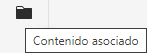
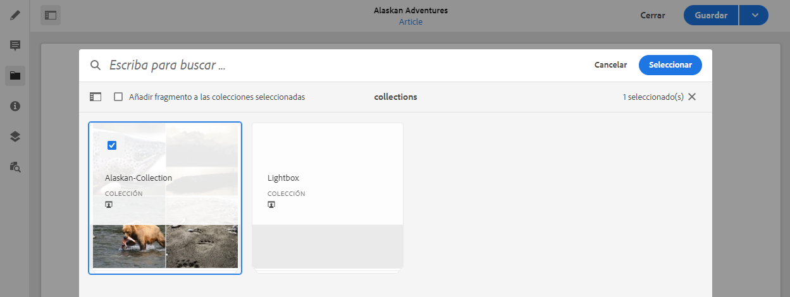
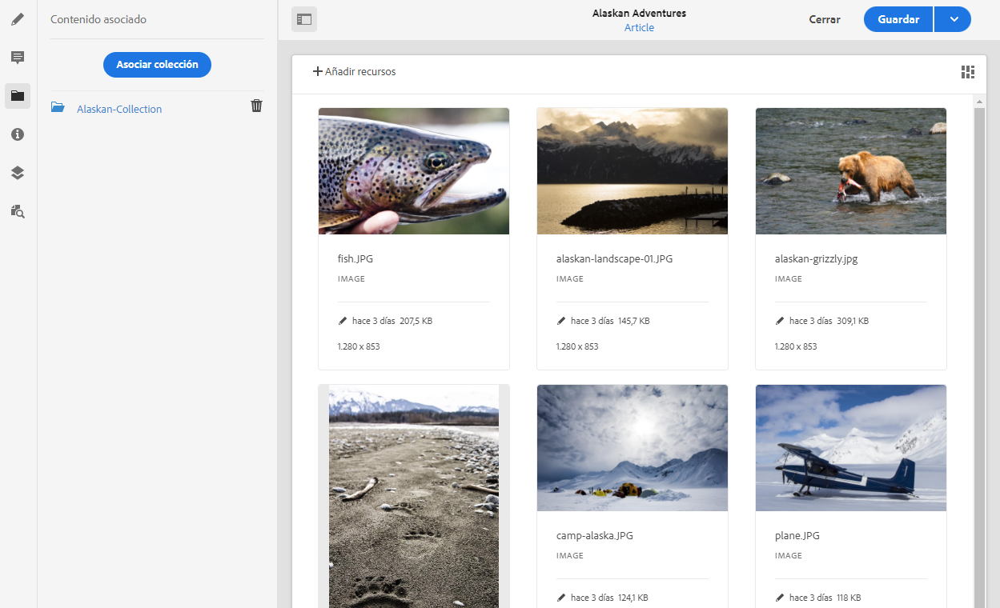

# Contenido asociado{#associated-content}

<!--
hide: yes
index: no
hidefromtoc: yes
-->

La funcionalidad de contenido asociado de AEM proporciona la conexión para que los recursos se puedan utilizar de forma opcional con el fragmento cuando se añada a una página de contenido al [proporcionar una serie de recursos a los que acceder al utilizar el fragmento de contenido en una página.](/help/sites-cloud/authoring/fundamentals/content-fragments.md#using-associated-content) Al mismo tiempo reduce el tiempo necesario para buscar el recurso adecuado. Esto también proporciona flexibilidad para la entrega de contenido sin encabezado.

## Adición de contenido asociado {#adding-associated-content}

>[!NOTE]
>
>Hay varios métodos para agregar [recursos visuales (p. ej., imágenes)](/help/sites-cloud/administering/content-fragments/content-fragments.md#fragments-with-visual-assets) al fragmento y/o página.

Para realizar la asociación, primero debe [agregar los recursos multimedia a una colección](/help/assets/manage-collections.md). Una vez hecho esto, puede hacer lo siguiente:

1. Abrir el fragmento y seleccionar **Contenido asociado** en el panel lateral.

   

1. Dependiendo de si alguna colección ya se ha asociado o no, seleccione:

   * **Asociar contenido**: la primera colección asociada
   * **Asociar colección**: las colecciones asociadas ya están configuradas

1. Seleccione la colección requerida.

   Si lo desea, puede agregar el fragmento a la colección seleccionada; esto ayuda al seguimiento.

   

1. Confirmar (con **Seleccionar**). La colección se enumera como asociada.

   

## Edición de contenido asociado {#editing-associated-content}

Una vez asociada una colección, puede hacer lo siguiente:

* **Quitar** la asociación.
* **Agregar recursos** a una colección.
* Seleccione un recurso para realizar más acciones.
* Editar el recurso.
