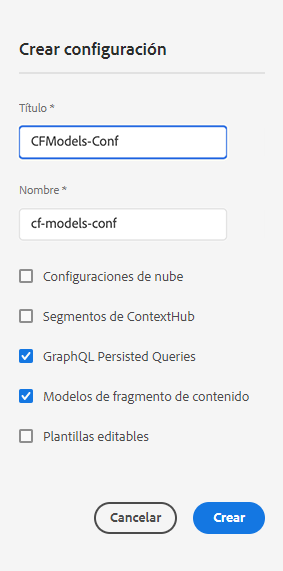

# Fragmentos de contenido: explorador de configuración{#content-fragments-configuration-browser}

<!--
hide: yes
index: no
hidefromtoc: yes
-->

Obtenga información sobre cómo habilitar una funcionalidad de fragmento de contenido específica en el Explorador de configuración.

## Habilitación de la funcionalidad de fragmento de contenido para la instancia {#enable-content-fragment-functionality-instance}

Antes de usar fragmentos de contenido, debe usar el **Explorador de configuración** para habilitar lo siguiente:

* **Modelos de fragmentos de contenido**: obligatorio
* **Consultas persistentes de GraphQL**: opcional

>[!CAUTION]
>
>Si no habilita **Modelos de fragmentos de contenido**:
>
>* La opción **Crear** no está disponible para crear modelos.
>* No puede [seleccionar la configuración de Sites para crear el punto final relacionado](/help/headless/graphql-api/graphql-endpoint.md).

Para habilitar la funcionalidad de fragmento de contenido, debe hacer lo siguiente:

* Habilitar el uso de la funcionalidad de fragmento de contenido mediante el Explorador de configuración
* Aplicar la configuración a la carpeta de Assets

### Habilitación de la funcionalidad de fragmento de contenido en el Explorador de configuración {#enable-content-fragment-functionality-in-configuration-browser}

Para utilizar determinadas [funcionalidades de fragmentos de contenido](#creating-a-content-fragment-model), primero **debe** habilitarlas mediante el **Explorador de configuración**:

>[!NOTE]
>
>Para obtener más información, consulte también [Explorador de configuración](/help/implementing/developing/introduction/configurations.md#using-configuration-browser).

>[!NOTE]
>
>[Subconfiguraciones](/help/implementing/developing/introduction/configurations.md#configuration-resolution) (una configuración anidada dentro de otra configuración) es totalmente compatible para su uso con fragmentos de contenido, modelos de fragmentos de contenido y consultas de GraphQL.
>
>Solo tenga en cuenta lo siguiente:
>
>
>* Después de crear modelos en una subconfiguración, NO es posible mover o copiar el modelo a otra subconfiguración.
>
>* Un punto final de GraphQL (aún) se basa en una configuración principal (raíz).
>
>* Las consultas persistentes se guardan (aún) de forma relevante para la configuración principal (raíz).

1. Vaya a **Herramientas**, **General**, luego abra el **Explorador de configuración**.

1. Use **Crear** para abrir el cuadro de diálogo, donde:

   1. Especifique un **Título**.
   1. El **nombre** se convierte en el nombre de nodo en el repositorio.
      * Se genera automáticamente en función del título y se ajusta según las [convenciones de nomenclatura de AEM](/help/implementing/developing/introduction/naming-conventions.md).
      * Puede ajustarlo si es necesario.
   1. Para habilitar su uso, seleccione
      * **Modelos de fragmentos de contenido**
      * **Consultas persistentes de GraphQL**

      

1. Seleccione **Crear** para guardar la definición.

<!-- 1. Select the location appropriate to your website. -->

### Aplicar la configuración a la carpeta {#apply-the-configuration-to-your-folder}

Cuando la configuración **global** está habilitada para la funcionalidad de fragmentos de contenido, se aplica a cualquier carpeta de recursos, a la que se puede acceder a través de la consola **Recursos**.

Para utilizar otras configuraciones (es decir, excluyendo la global) con una carpeta de Recursos comparable, debe definir la conexión. Para ello, seleccione la **configuración** adecuada en la pestaña **Cloud Services** de las **Propiedades de carpeta** de la carpeta correspondiente.

