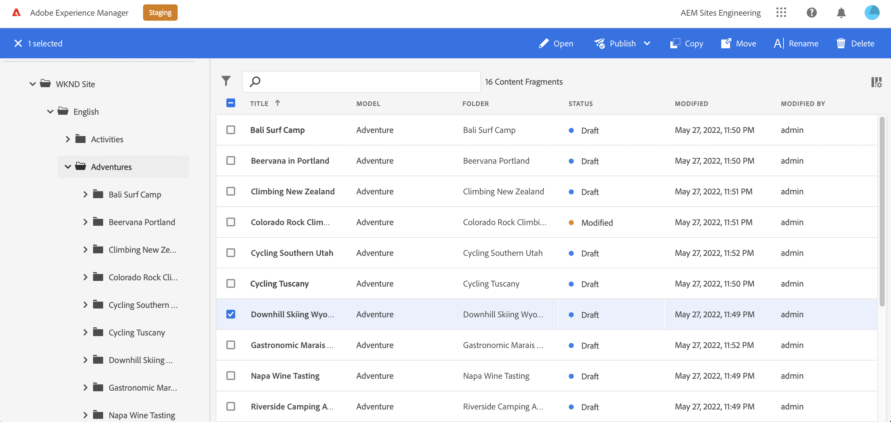
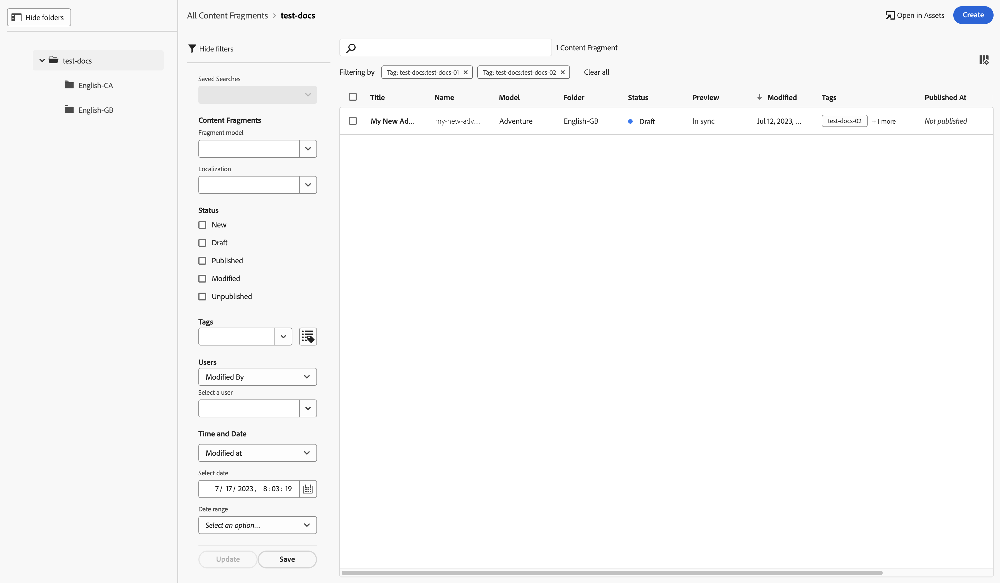

# Consola Fragmentos de contenido  {#content-fragments-console}

Descubra cómo la consola Fragmentos de contenido optimiza el acceso a los fragmentos de contenido, lo que le ayuda a crearlos, buscarlos y administrarlos mediante acciones administrativas como publicarlos, cancelar la publicación o copiarlos.

La consola Fragmentos de contenido está dedicada a administrar, buscar y crear fragmentos de contenido. Se ha optimizado para su uso en un contexto sin encabezado, pero también se utiliza al crear fragmentos de contenido para su uso en la creación de páginas.

>[!NOTE]
>
>Esta consola solo muestra los fragmentos de contenido. No muestra otros tipos de recursos, como imágenes y vídeos.

>[!NOTE]
>
>Actualmente, se puede acceder a los fragmentos de contenido mediante:
>
>* esta consola **Fragmentos de contenido**
>* la consola **Recursos**: consulte [Administración de fragmentos de contenido](/help/assets/content-fragments/content-fragments-managing.md)

>[!NOTE]
>
>Una selección de los [métodos abreviados de teclado están disponibles para su uso en esta consola](/help/sites-cloud/administering/content-fragments/content-fragments-console-keyboard-shortcuts.md).

>[!NOTE]
>
>El equipo del proyecto puede personalizar la consola si es necesario. Consulte [Personalización de la consola Fragmentos de contenido](/help/implementing/developing/extending/content-fragment-console-customizing.md) para obtener más información.

Se puede acceder directamente a la consola Fragmentos de contenido desde el nivel superior de la navegación global:

## Estructura y gestión básicas de la consola {#basic-structure-handling-content-fragments-console}

La selección **Fragmentos de contenido** abrirá la consola en una pestaña nueva.

Aquí se pueden ver tres áreas principales:

* La barra de herramientas superior
   * Proporciona funcionalidad AEM estándar
   * También muestra su organización IMS
* El panel izquierdo
   * Aquí puede ocultar o mostrar el árbol de carpetas
   * Puede seleccionar una rama específica del árbol
   * Se puede cambiar el tamaño para mostrar carpetas anidadas
* Panel principal/derecho, desde aquí puede hacer lo siguiente:
   * Consultar la lista de todos los fragmentos de contenido en la rama seleccionada del árbol:
      * La ubicación se indica mediante las rutas de exploración; también se pueden usar para cambiar la ubicación.
      * Se mostrarán los fragmentos de contenido de la carpeta seleccionada y todas las carpetas secundarias.:
         * [Varios campos de información](#selectuse-available-columns) acerca de un fragmento de contenido para proporcionar vínculos; según el campo, pueden realizar lo siguiente:
            * Abrir el fragmento correspondiente en el editor
            * Mostrar información sobre referencias
            * Mostrar información sobre las versiones de idioma del fragmento
      * Al utilizar el ratón sobre los encabezados de columna, se mostrará un selector de acciones desplegable y controles deslizantes de anchura. Esto le permite lograr lo siguiente:
         * Ordenar: seleccione la acción adecuada, ya sea ascendente o descendente.
Así se ordenará toda la tabla según esa columna. La ordenación solo está disponible en las columnas adecuadas.
         * Cambiar el tamaño de la columna: mediante los controles deslizantes de acción o de anchura

## Acciones {#actions}

Dentro de la consola hay una serie de acciones que puede utilizar, ya sea directamente o después de seleccionar un fragmento específico:

* Varias acciones son directas [disponible desde la consola](#available-actions)
* Puede [seleccione uno o varios fragmentos de contenido para mostrar las acciones adecuadas](#actions-selected-content-fragment)

### Acciones (no seleccionadas) {#actions-unselected}

Ciertas acciones están disponibles desde la consola, sin seleccionar un fragmento de contenido específico:

* **[Crear](/help/sites-cloud/administering/content-fragments/content-fragments-managing.md#creating-a-content-fragment)** un nuevo fragmento de contenido
* [Filtrar](#filtering-fragments) los fragmentos de contenido de acuerdo con una selección de predicados y guardar el filtro para uso futuro
* [Buscar](#searching-fragments) los fragmentos de contenido
* [Personalice la vista de tabla para mostrar columnas de información seleccionadas](#select-available-columns)
* Use **Abrir en Recursos** para abrir directamente la ubicación actual en la consola **Recursos**

   >[!NOTE]
   >
   >La consola **Recursos** se utiliza para acceder a recursos como imágenes, vídeos, etc.  Se puede acceder a esta consola:
   >
   >* usando el vínculo **Abrir en Recursos** (en la consola Fragmentos de contenido)
   >* directamente desde el panel de navegación global

### Acciones para un fragmento de contenido (seleccionado) {#actions-selected-content-fragment}

Si se selecciona un fragmento específico, se abrirá una barra de herramientas centrada en las acciones disponibles para dicho fragmento. También puede seleccionar varios fragmentos: la selección de acciones se ajustará en consecuencia.

* **Abrir**
* **Publicación** (y **Cancelar la publicación**)
* **Copiar**
* **Mover**
* **Cambiar nombre**
* **Eliminar**

>[!NOTE]
>
>Acciones como Publicar, Cancelar la publicación, Eliminar, Mover, Cambiar el nombre, Copiar, activar un trabajo asincrónico. El progreso de ese trabajo se puede monitorizar a través de la interfaz de usuario de trabajos asincrónicos de AEM.

## La información proporcionada sobre sus fragmentos de contenido {#information-content-fragments}

El panel principal/derecho (vista de tabla) de la consola proporciona una amplia gama de información sobre los Fragmentos de contenido. Algunos elementos también proporcionan vínculos directos a otras acciones o información:

* **Nombre**
   * Proporciona un vínculo para abrir el fragmento en el editor.
* **Modelo**
   * Proporciona un vínculo para abrir el fragmento en el editor.
* **Carpeta**
   * Proporciona un vínculo para abrir la carpeta en la consola.
Al pasar el ratón por encima del nombre de la carpeta, se muestra la ruta JCR.
* **Estado**
   * Solo información
* **Modificado**
   * Solo información
* **Modificado por**
   * Solo información
* **Publicado en**
   * Solo información
* **Publicado por**
   * Solo información
* **Referido por**

   * Proporciona un vínculo que abre un cuadro de diálogo con todas las referencias principales de ese fragmento; incluida la referencia a Fragmentos de contenido, Fragmentos de experiencias y páginas. Para abrir una referencia específica, haga clic en **Título** en el cuadro de diálogo.

      

* **Idioma**

   * Indica la configuración regional del fragmento de contenido, junto con el número total de configuraciones regionales o copias de idioma asociadas al fragmento de contenido.

      

      * Pulse o haga clic en el recuento para abrir un cuadro de diálogo que muestre todas las copias de idioma. Para abrir una copia de idioma específica, haga clic en **Título** en el cuadro de diálogo.

         

## Seleccionar las columnas disponibles {#select-available-columns}

Al igual que con otras consolas, puede configurar las columnas que son visibles y están disponibles para la acción:

Se mostrará una lista de columnas que puede ocultar o mostrar:

## Filtrado de fragmentos {#filtering-fragments}

El panel Filtro ofrece lo siguiente:

* una selección de predicados; se pueden seleccionar uno o más predicados y combinarlos para crear el filtro
* la oportunidad de **Guardar** su configuración
* la opción recuperar un filtro de búsqueda guardada para reutilizarlo

### Filtrado rápido {#fast-filtering}

También puede seleccionar un predicado haciendo clic en un valor de columna específico de la lista. Puede seleccionar uno o más valores para combinar predicados.

Por ejemplo, seleccione **Publicado** en la columna **Estado**:

>[!NOTE]
>
>El filtrado rápido solo es compatible con las columnas **Modelo**, **Estado**, **Modificado por** y **Publicado por**.

Cuando se seleccione, aparecerá como un predicado de filtro y la lista se filtrará según corresponda:

## Búsqueda de fragmentos {#searching-fragments}

El cuadro de búsqueda admite la búsqueda de texto completo. Introducción de los términos de búsqueda en el cuadro de búsqueda:

Proporcionará los resultados seleccionados:

El cuadro de búsqueda también proporciona acceso rápido a **Fragmentos de contenido recientes** y **Búsquedas guardadas**:

