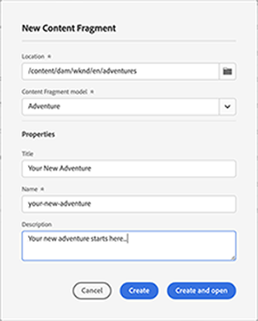

# Consola Fragmentos de contenido  {#content-fragments-console}

Descubra cómo la consola Fragmentos de contenido optimiza el acceso a los fragmentos de contenido, lo que le ayuda a crearlos, buscarlos y administrarlos mediante acciones administrativas como publicarlos, cancelar la publicación o copiarlos.

La consola Fragmentos de contenido está dedicada a administrar, buscar y crear fragmentos de contenido. Se ha optimizado para su uso en un contexto sin encabezado, pero también se utiliza al crear fragmentos de contenido para su uso en la creación de páginas.

>[!NOTE]
>
>Esta consola solo muestra los fragmentos de contenido. No muestra otros tipos de recursos, como imágenes y vídeos.

>[!NOTE]
>
>Actualmente, se puede acceder a los fragmentos de contenido mediante:
>
>* this **Fragmentos de contenido** consola
>* el **Recursos** consola: consulte [Administración de fragmentos de contenido](/help/assets/content-fragments/content-fragments-managing.md)

Se puede acceder directamente a la consola Fragmentos de contenido desde el nivel superior de la navegación global:

Selección **Fragmentos de contenido** abrirá la consola en una pestaña nueva.

Aquí se pueden ver tres áreas principales:

* La barra de herramientas superior
   * Proporciona funcionalidad AEM estándar
   * También muestra su organización IMS
* El panel izquierdo
   * Aquí puede ocultar o mostrar el árbol de carpetas
   * Puede seleccionar una rama específica del árbol
* Panel principal/derecho: desde aquí puede:
   * Consulte la lista de todos los fragmentos de contenido en la rama seleccionada del árbol
      * La ubicación se indica mediante las rutas de exploración; también se pueden usar para cambiar la ubicación
      * Se mostrarán los fragmentos de contenido de la carpeta seleccionada y todas las carpetas secundarias
         * Varios campos de información sobre un fragmento de contenido proporcionan vínculos; esto puede abrir el fragmento apropiado en el editor
      * Puede seleccionar un encabezado de columna para ordenar la tabla según esa columna; volver a seleccionar para alternar entre ascendente y descendente
   * **[Crear](#creating-new-content-fragment)** un nuevo fragmento de contenido
   * [Filtro](#filtering-fragments) los fragmentos de contenido de acuerdo con una selección de predicados y guarde el filtro para uso futuro
   * [Buscar](#searching-fragments) los fragmentos de contenido
   * Personalice la vista de tabla para mostrar columnas de información seleccionadas
   * Uso **Abrir en Assets** para abrir directamente la ubicación actual en la **Recursos** consola.

      >[!NOTE]
      >
      >La variable **Recursos** La consola se utiliza para acceder a recursos como imágenes, vídeos, etc.  Se puede acceder a esta consola:
      >
      >* usando la variable **Abrir en Assets** vínculo (en la consola Fragmentos de contenido)
      >* directamente desde el panel de navegación global

Si se selecciona un fragmento específico, se abrirá una barra de herramientas centrada en las acciones disponibles para dicho fragmento. También puede seleccionar varios fragmentos: la selección de acciones se ajustará en consecuencia.

## Creación de un nuevo fragmento de contenido {#creating-new-content-fragment}

Selección **Crear** abre la compacta **Nuevo fragmento de contenido** diálogo:

## Filtrado de fragmentos {#filtering-fragments}

El panel Filtro ofrece:

* una selección de predicados que se pueden seleccionar y combinar
* la oportunidad de **Guardar** su configuración
* la opción recuperar un filtro de búsqueda guardado para reutilizarlo

## Búsqueda de fragmentos {#searching-fragments}

El cuadro de búsqueda admite la búsqueda de texto completo. Introducción de los términos de búsqueda en el cuadro de búsqueda:

Proporcionará los resultados seleccionados:

El cuadro de búsqueda también proporciona acceso rápido a **Fragmentos de contenido recientes** y **Búsquedas guardadas**:

