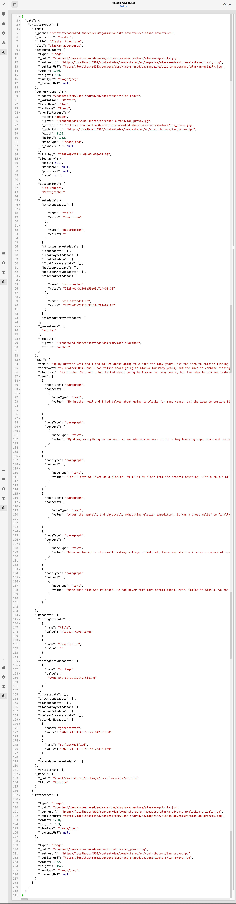

# Previsualización: representación JSON {#preview-json-representation}

Al desarrollar los modelos para fragmentos de contenido como parte de su implementación sin encabezado de AEM, es posible que desee ver la salida JSON de muestra para un fragmento de contenido, según un modelo. Por ejemplo, para hacerse una idea del aspecto que tendrá el resultado final. Esto podría resultar útil al validar la estructura JSON del modelo, quizá con contenido de muestra predeterminado por tipo de datos.

Uso del icono **Vista previa**:

Puede ver la representación JSON del fragmento actual. Por ejemplo:

