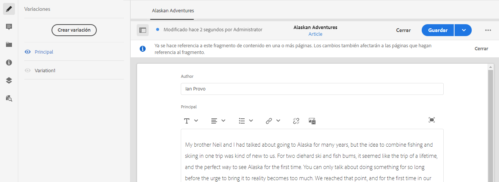
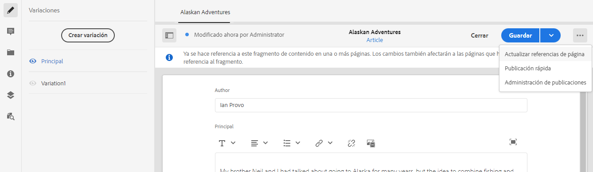
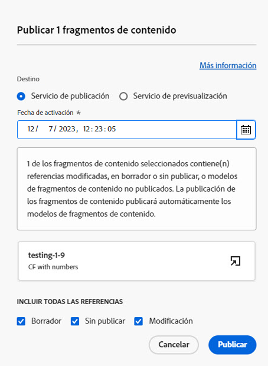
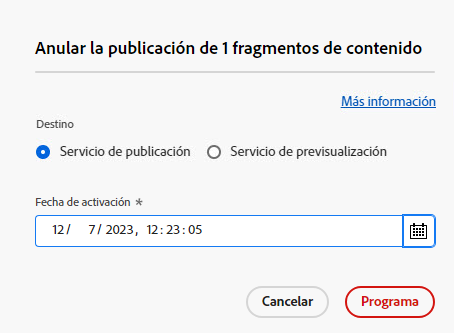
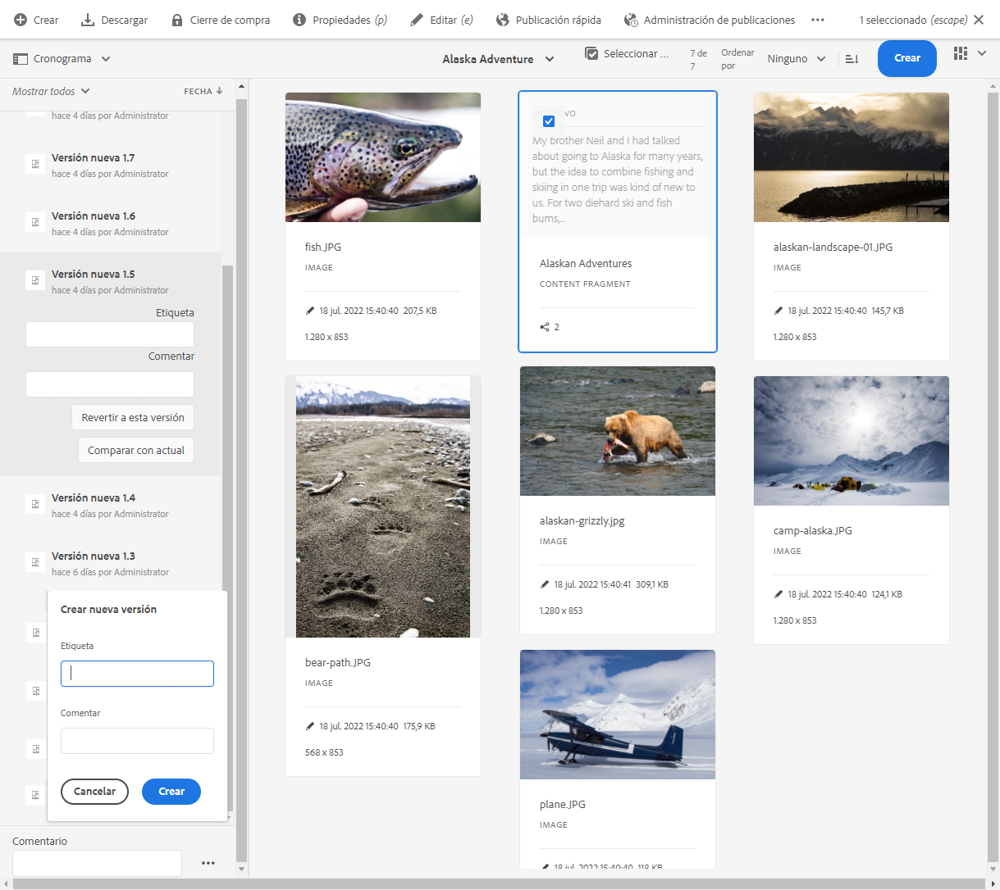
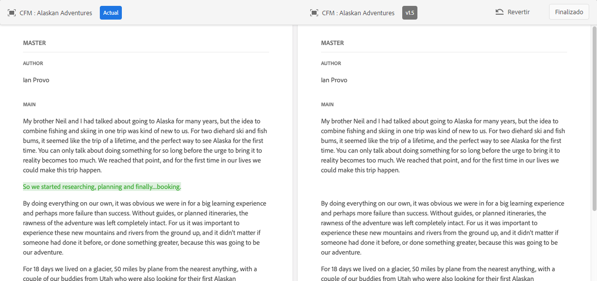

# Administrar fragmentos de contenido {#managing-content-fragments}

<!--
hide: yes
index: no
hidefromtoc: yes
-->

Aprenda a utilizar la consola **Fragmentos de contenido** para administrar los fragmentos de contenido AEM. Pueden utilizarse para la creación de páginas o como base del contenido sin encabezado.

Después de definir los [Modelos de fragmento de contenido](#creating-a-content-model) puede utilizarlas para [crear los fragmentos de contenido](#creating-a-content-fragment).

El [Editor de fragmentos de contenido](#opening-the-fragment-editor) proporciona varios [modos](#modes-in-the-content-fragment-editor) para permitirle lo siguiente:

* [Editar el contenido](#editing-the-content-of-your-fragment) y [administrar variaciones](#creating-and-managing-variations-within-your-fragment)
* [Anotar el fragmento](/help/sites-cloud/administering/content-fragments/content-fragments-variations.md#annotating-a-content-fragment)
* [Asociar contenido al fragmento](#associating-content-with-your-fragment)
* [Configuración de los metadatos](#viewing-and-editing-the-metadata-properties-of-your-fragment)
* [Ver el árbol de la estructura](/help/sites-cloud/administering/content-fragments/content-fragments-structure-tree.md)
* [Previsualización de la representación JSON](/help/sites-cloud/administering/content-fragments/content-fragments-json-preview.md)

>[!NOTE]
>
>Se pueden utilizar fragmentos de contenido:
>
>* al crear páginas; consulte [Creación de páginas con fragmentos de contenido](/help/sites-cloud/authoring/fundamentals/content-fragments.md).
>* para [Entrega de contenido sin encabezado mediante fragmentos de contenido con GraphQL](/help/sites-cloud/administering/content-fragments/content-fragments-graphql.md).

>[!NOTE]
>
>Los fragmentos de contenido se almacenan como **Recursos**. Se administran principalmente desde la consola **Fragmentos de contenido**, pero también se puede administrar desde la consola [Recursos](/help/assets/content-fragments/content-fragments-managing.md).

## La consola Fragmentos de contenido {#content-fragments-console}

La consola Fragmentos de contenido proporciona acceso directo a los fragmentos y a las tareas relacionadas. Para obtener más información detallada, consulte:

* [Estructura básica y administración de la consola Fragmentos de contenido](/help/sites-cloud/administering/content-fragments/content-fragments-console.md#basic-structure-handling-content-fragments-console)

* [La información proporcionada sobre sus fragmentos de contenido](/help/sites-cloud/administering/content-fragments/content-fragments-console.md#information-content-fragments)

* [Acciones para un fragmento de contenido en la consola Fragmentos de contenido](/help/sites-cloud/administering/content-fragments/content-fragments-console.md#actions-selected-content-fragment)

* [Personalización de columnas disponible en la consola Fragmentos de contenido](/help/sites-cloud/administering/content-fragments/content-fragments-console.md#select-available-columns)

* [Buscar y filtrar en la consola Fragmentos de contenido](/help/sites-cloud/administering/content-fragments/content-fragments-console.md#filtering-fragments)

## Creación de fragmentos de contenido {#creating-content-fragments}

### Creación de un modelo de contenido {#creating-a-content-model}

Los [Modelos de fragmento de contenido](/help/sites-cloud/administering/content-fragments/content-fragments-models.md) se pueden habilitar y crear, antes de crear fragmentos de contenido con contenido estructurado.

### Creación de un fragmento de contenido {#creating-a-content-fragment}

Crear un fragmento de contenido:

1. En la consola **Fragmentos de contenido**, seleccione **Crear** (parte superior derecha).

   >[!NOTE]
   >
   >Para que la ubicación del nuevo fragmento esté predefinida, puede desplazarse a la carpeta en la que desee crear el fragmento o especificar la ubicación durante el proceso de creación.

1. Se abre el cuadro de diálogo **Nuevo fragmento de contenido** desde donde puede especificar lo siguiente:

   * **Ubicación**: se completa automáticamente con la ubicación actual, pero puede seleccionar una ubicación diferente si es necesario
   * **Modelo de fragmento de contenido**: seleccione el modelo que desea utilizar como base del fragmento en la lista desplegable
   * **Título**
   * **Nombre**: se completa automáticamente en función del **Título**, pero puede editarlo si es necesario
   * **Descripción**

   

1. Seleccione **Crear** o **Crear y abrir** para mantener la definición.

## Estados de los fragmentos de contenido {#statuses-content-fragments}

Durante su existencia, un fragmento de contenido puede tener varios estados, como se muestra en la [consola Fragmentos de contenido](/help/sites-cloud/administering/content-fragments/content-fragments-console.md):

* **Nuevo**
Se ha creado un nuevo fragmento de contenido, pero nunca se ha editado o abierto en el editor de fragmentos de contenido.
* **Borrador**
Alguien ha editado o abierto el fragmento de contenido (nuevo) en el Editor de fragmentos de contenido, pero aún no se ha publicado.
* **Publicado**
El fragmento de contenido se ha publicado.
* **Modificado**
El fragmento de contenido se ha editado después de publicarse (pero antes de publicar la modificación).
* **Sin publicar**
Se canceló la publicación del fragmento de contenido.

## Apertura del editor de fragmentos {#opening-the-fragment-editor}

Abra el fragmento para su edición:

>[!CAUTION]
>
>Para editar un fragmento de contenido, son necesarios [los permisos adecuados](/help/implementing/developing/extending/content-fragments-customizing.md#asset-permissions). Si tiene algún problema, póngase en contacto con el administrador del sistema.

1. Utilice la consola **Fragmentos de contenido** para desplazarse a la ubicación del fragmento de contenido.
1. Abra el fragmento para editarlo, seleccionando el fragmento y **Abrir** en la barra de herramientas.

1. Se abrirá el editor de fragmentos. Realice los cambios según sea necesario:

   

1. Después de realizar los cambios, utilice **Guardar**, **Guardar y cerrar** o **Cerrar** según sea necesario.

   >[!NOTE]
   >
   >**Guardar y cerrar** está disponible a través de la lista desplegable **Guardar**.

   >[!NOTE]
   >
   >Tanto **Guardar y Cerrar** como **Cerrar** le sacarán del editor; consulte [Guardar, Cerrar y Versiones](#save-close-and-versions) para obtener información completa sobre cómo funcionan ambas opciones para los fragmentos de contenido.

## Modos y acciones en el editor de fragmentos de contenido {#modes-actions-content-fragment-editor}

Hay varios modos y acciones disponibles en el Editor de fragmentos de contenido.

### Modos en el editor de fragmentos de contenido {#modes-in-the-content-fragment-editor}

Desplácese por los distintos modos utilizando los iconos del panel lateral:

* Variaciones: [Edición del contenido](#editing-the-content-of-your-fragment) y [Administración de variaciones](#creating-and-managing-variations-within-your-fragment)

* [Anotaciones](/help/sites-cloud/administering/content-fragments/content-fragments-variations.md#annotating-a-content-fragment)
* [Contenido asociado](#associating-content-with-your-fragment)
* [Metadatos](#viewing-and-editing-the-metadata-properties-of-your-fragment)
* [Árbol de estructura](/help/sites-cloud/administering/content-fragments/content-fragments-structure-tree.md)
* [Previsualizar](/help/sites-cloud/administering/content-fragments/content-fragments-json-preview.md)

### Acciones de barra de herramientas en el editor de fragmentos de contenido {#toolbar-actions-in-the-content-fragment-editor}

Algunas funciones de la barra de herramientas superior están disponibles en varios modos:

* Se muestra un mensaje cuando ya se hizo referencia al fragmento en una página de contenido. Puede **Cerrar** el mensaje.

* El panel lateral puede ocultarse o mostrarse utilizando el icono **Alternar panel lateral**.

* Debajo del nombre del fragmento puede ver el nombre del [Modelo de fragmento de contenido](/help/sites-cloud/administering/content-fragments/content-fragments-models.md) que se utiliza para crear el fragmento actual:

   * El nombre también es un vínculo que abrirá el editor de modelos.

* Ver el estado del fragmento; por ejemplo, información sobre cuándo se creó, modificó o publicó. El estado también está codificado por colores:

   * **Nuevo**: gris
   * **Borrador**: azul
   * **Publicado**: verde
   * **Modificado**: naranja
   * **Desactivado**: rojo

* **Guardar** proporciona acceso a la opción **Guardar y cerrar**.

* Los tres puntos (**...**) proporcionan acceso a acciones adicionales:
   * **Actualizar referencias de página**
      * Esto actualiza cualquier referencia de página.
   * **[Publicación rápida](/help/assets/manage-publication.md#quick-publish)**
   * **[Administrar publicación](/help/assets/manage-publication.md#manage-publication)**

<!--
This updates any page references and ensures that the Dispatcher is flushed as required. -->

## Guardar, cerrar y versiones {#save-close-and-versions}

>[!NOTE]
>
>Las versiones también pueden ser [creadas, comparadas y revertidas desde la cronología](/help/sites-cloud/administering/content-fragments/content-fragments-managing.md#timeline-for-content-fragments).

El editor tiene varias opciones:

* **Guardar** y **Guardar y cerrar**

   * **Guardar** guardará los cambios más recientes y permanecerá en el editor.
   * **Guardar y cerrar** guardará los cambios más recientes y cerrará el editor.

  >[!CAUTION]
  >
  >Para editar un fragmento de contenido, son necesarios [los permisos adecuados](/help/implementing/developing/extending/content-fragments-customizing.md#asset-permissions). Si tiene algún problema, póngase en contacto con el administrador del sistema.

  >[!NOTE]
  >
  >Es posible permanecer en el editor, realizando una serie de cambios, antes de guardar.

  >[!CAUTION]
  >
  >Además de guardar los cambios, las acciones actualizan también las referencias y garantizan que Dispatcher se vacíe según sea necesario. Estos cambios pueden tardar un tiempo en procesarse. Debido a esto, puede haber un impacto en el rendimiento de un sistema grande/complejo/con gran carga.
  >
  >Tenga esto en cuenta al utilizar **Guardar y cerrar** y, a continuación, reintroduzca rápidamente el editor de fragmentos para realizar y guardar más cambios.

* **Cerrar**

  Saldrá del editor sin guardar los cambios más recientes (es decir, realizados desde el último **Guardar**).

Al editar el fragmento de contenido, AEM crea automáticamente versiones para garantizar que el contenido anterior se pueda restaurar si cancela los cambios (mediante **Cerrar** sin guardar):

1. Cuando se abre un fragmento de contenido para editarlo, AEM comprueba la existencia del token basado en cookies que indica si existe una *sesión de edición*:

   1. Si se encuentra el token, el fragmento se considera parte de la sesión de edición existente.
   2. Si el token *no* está disponible y el usuario empieza a editar contenido, se crea una versión y se envía un token para esta nueva sesión de edición al cliente, donde se guarda en una cookie.

2. Mientras que haya una sesión de edición *activa*, el contenido que se está editando se guarda automáticamente cada 600 segundos (valor predeterminado).

   >[!NOTE]
   >
   >El intervalo de guardado automático se puede configurar usando el mecanismo `/conf`.
   >
   >Valor predeterminado, consulte:
   >  `/libs/settings/dam/cfm/jcr:content/autoSaveInterval`

3. Si el usuario cancela la edición, se restaura la versión creada al principio de la sesión de edición y se elimina el token para finalizar la sesión de edición.
4. Si el usuario selecciona **Guardar** las ediciones, los elementos/variaciones actualizados se mantienen y se elimina el token para finalizar la sesión de edición.

## Edición del contenido del fragmento {#editing-the-content-of-your-fragment}

Una vez que haya abierto el fragmento, puede usar la pestaña [Variaciones](/help/sites-cloud/administering/content-fragments/content-fragments-variations.md) para crear el contenido.

## Creación y administración de variaciones dentro del fragmento {#creating-and-managing-variations-within-your-fragment}

Una vez creado el contenido principal, puede crear y administrar, [Variaciones](/help/sites-cloud/administering/content-fragments/content-fragments-variations.md) de ese contenido.

## Asociación del contenido al fragmento {#associating-content-with-your-fragment}

También puede [asociar contenido](/help/sites-cloud/administering/content-fragments/content-fragments-assoc-content.md) con un fragmento. Esto proporciona una conexión para que los recursos (es decir, las imágenes) se puedan utilizar (opcionalmente) con el fragmento cuando se añada a una página de contenido.

## Visualización y edición de los metadatos (propiedades) del fragmento {#viewing-and-editing-the-metadata-properties-of-your-fragment}

Puede ver y editar las propiedades de un fragmento utilizando la pestaña [Metadatos](/help/sites-cloud/administering/content-fragments/content-fragments-metadata.md).

## Publicación y previsualización de un fragmento {#publishing-and-previewing-a-fragment}

Puede publicar los fragmentos de contenido en:

* el **[Servicio de publicación](/help/overview/architecture.md#runtime-architecture)**: para acceso público y completo

* el **[Servicio de previsualización](/help/overview/architecture.md#runtime-architecture)**: para previsualizar el contenido antes de la disponibilidad completa

  >[!CAUTION]
  >
  Publicación de fragmentos de contenido en el **Servicio de previsualización** solo está disponible desde la [consola Fragmentos de contenido](/help/sites-cloud/administering/content-fragments/content-fragments-console.md); usando la acción **Publicar**.

  >[!NOTE]
  >
  Para obtener más información sobre los entornos de previsualización, consulte lo siguiente:
  >
  * [Administrar entornos](/help/implementing/cloud-manager/manage-environments.md#access-preview-service)
  * [Configuración de OSGi para el nivel de vista previa](/help/implementing/preview-tier/preview-tier-configuring-osgi.md#configuring-osgi-settings-for-the-preview-tier)
  * [Depuración de la vista previa mediante Developer Console](/help/implementing/preview-tier/preview-tier-configuring-osgi.md#debugging-preview-using-the-developer-console)

Para publicar los fragmentos de contenido con la opción **Publicar** en la barra de herramientas de la [consola Fragmentos de contenido](/help/sites-cloud/administering/content-fragments/content-fragments-console.md#actions-selected-content-fragment):

>[!CAUTION]
>
Si el fragmento se basa en un modelo, debe asegurarse de que [el modelo se ha publicado](/help/sites-cloud/administering/content-fragments/content-fragments-models.md#publishing-a-content-fragment-model).
>
Si publica un fragmento de contenido para el que el modelo aún no se ha publicado, la lista de selección lo indica y el modelo se publica con el fragmento.

1. Seleccione uno o varios fragmentos de la lista.

1. En la barra de herramientas, seleccione **Publicar** y, a continuación, una de las siguientes opciones para abrir el cuadro de diálogo correspondiente:

   * **Ahora**: seleccione la opción **Servicio de publicación** o **Servicio de previsualización**; después de la confirmación, el fragmento se publica inmediatamente
   * **Programación**: además del servicio requerido, también puede seleccionar la fecha y la hora de publicación del fragmento

   Si es necesario, se le solicita que especifique las referencias para publicar. De forma predeterminada, las referencias también se publican en el servicio de previsualización para garantizar que no haya ninguna interrupción en el contenido.
Por ejemplo, para una solicitud de publicación programada:
   

1. Confirme la acción de publicación.

También puede publicar en el **Servicio de publicación** desde el [Editor de fragmentos de contenido](#toolbar-actions-in-the-content-fragment-editor) utilizando:
* **Publicación rápida**
* **Administrar publicación**

>[!NOTE]
>
Además, cuando [publique una página que utiliza el fragmento](/help/sites-cloud/authoring/fundamentals/content-fragments.md#publishing), este se enumera en las referencias de página.

>[!CAUTION]
>
Después de publicar un fragmento o de hacer referencia al mismo, AEM muestra una advertencia cuando un autor abra el fragmento para editarlo de nuevo. Se advierte al autor de que los cambios en el fragmento también afectarán a las páginas a las que se hace referencia.

## Cancelación de la publicación de un fragmento {#unpublishing-a-fragment}

Para cancelar la publicación de fragmentos de contenido, seleccione uno o varios fragmentos y, a continuación, **Cancelar la publicación** en la barra de herramientas de la [Consola Fragmentos de contenido](/help/sites-cloud/administering/content-fragments/content-fragments-console.md#actions-selected-content-fragment). Puede seleccionar **Ahora** o **Programado**.

Cuando se abra el cuadro de diálogo correspondiente, puede seleccionar el servicio adecuado:

>[!NOTE]
>
La acción **Cancelar la publicación** solo está visible cuando los fragmentos publicados estén disponibles.

>[!CAUTION]
>
Si ya se hace referencia al fragmento desde otro fragmento o desde una página, verá un mensaje de advertencia y será necesario para confirmar que desea continuar.

## Eliminación de un fragmento {#deleting-a-fragment}

Para eliminar un fragmento:

1. En la consola **Fragmentos de contenido** vaya a la ubicación del fragmento de contenido.
2. Seleccione el fragmento.

   >[!NOTE]
   >
   La acción **Eliminar** no se encuentra disponible como Acción rápida.

3. En la barra de herramientas, seleccione **Eliminar**.
4. Confirme la acción **Eliminar**.

   >[!CAUTION]
   >
   Si ya se hace referencia al fragmento a partir de otro fragmento o página, verá un mensaje de advertencia y será necesario para confirmar que desea continuar con la **eliminación forzada**. El fragmento y su componente de fragmento de contenido se eliminan de cualquier página de contenido.

## Búsqueda de referencias principales de su fragmento {#parent-references-fragment}

Se puede acceder a los detalles de las referencias principales desde la columna **Referencias** de la [Consola Fragmentos de contenido](/help/sites-cloud/administering/content-fragments/content-fragments-console.md#information-content-fragments).

## Búsqueda de copias de idioma del fragmento {#language-copies-fragment}

Se puede acceder a los detalles de las copias de idioma desde la columna **Idioma** de la [Consola Fragmentos de contenido](/help/sites-cloud/administering/content-fragments/content-fragments-console.md#information-content-fragments).

## Cronología de los fragmentos de contenido {#timeline-for-content-fragments}

>[!NOTE]
>
Esta funcionalidad solo está disponible en la consola **Recursos**

Además de las opciones estándar, [Cronología](/help/assets/manage-digital-assets.md#timeline) proporciona información y acciones específicas para fragmentos de contenido:

* Ver información sobre versiones, comentarios y anotaciones
* Acciones para las versiones

   * **[Revertir a esta versión](#reverting-to-a-version)** (seleccione un fragmento existente y, a continuación, una versión específica)

   * **[Comparar con actual](#comparing-fragment-versions)** (seleccione un fragmento existente y, a continuación, una versión específica)

   * Agregue una **Etiqueta** o un **Comentario** (seleccione un fragmento existente y, a continuación, una versión específica)

   * **Guardar como versión** (seleccione un fragmento existente y, a continuación, la flecha hacia arriba en la parte inferior de la cronología)

* Acciones para anotaciones

   * **Eliminar**

>[!NOTE]
>
Los comentarios son lo siguiente:
>
* De funcionalidad estándar para todos los recursos
* Realizados en la cronología
* Relacionados con el recurso de fragmento
>
Las anotaciones (para fragmentos de contenido) son lo siguiente:
>
* Introducidas en el editor de fragmentos
* Específicas para un segmento seleccionado de texto dentro del fragmento
>

Por ejemplo:

## Comparación de versiones de fragmento {#comparing-fragment-versions}

>[!NOTE]
>
Esta funcionalidad solo está disponible en la consola **Recursos**

La acción **Comparar con actual** está disponible en la [Cronología](/help/sites-cloud/administering/content-fragments/content-fragments-managing.md#timeline-for-content-fragments) después de seleccionar una versión específica.

Se abre lo siguiente:

* el **Actual** (última) versión (izquierda)

* la versión seleccionada **v&lt;*x.y*>** (derecha)

Se mostrarán una al lado de la otra, donde:

* Se resaltan todas las diferencias

   * Texto eliminado en rojo
   * Texto insertado en verde
   * Texto reemplazado en azul

* El icono de pantalla completa permite abrir cualquiera de las versiones por su cuenta; a continuación, vuelva a la vista paralela
* Puede **Revertir** a la versión específica
* **Listo** le devolverá a la consola

>[!NOTE]
>
No se puede editar el contenido del fragmento al comparar fragmentos.

## Reversión a una versión  {#reverting-to-a-version}

>[!NOTE]
>
Esta funcionalidad solo está disponible en la consola **Recursos**

Puede volver a una versión específica del fragmento:

* Directamente desde la [Cronología](/help/sites-cloud/administering/content-fragments/content-fragments-managing.md#timeline-for-content-fragments).

  Seleccione la versión requerida y, a continuación, la acción **Revertir a esta versión**.

* Mientras [compara una versión con la versión actual](/help/sites-cloud/administering/content-fragments/content-fragments-managing.md#comparing-fragment-versions) puede **Revertir** a la versión seleccionada.
