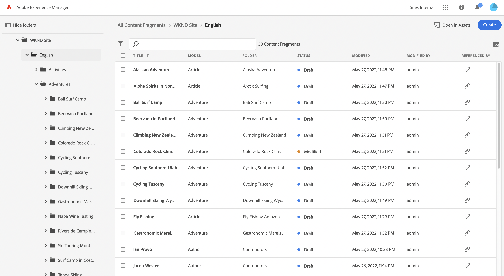
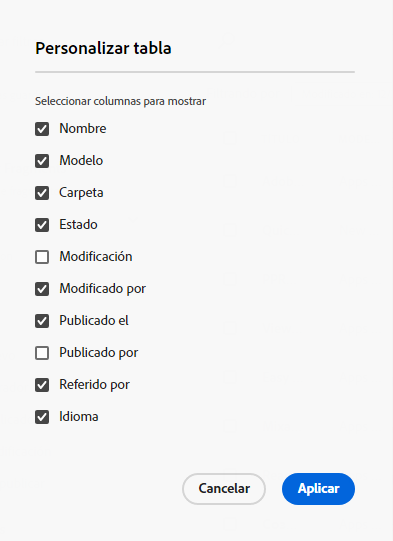

# Administrar fragmentos de contenido {#managing-content-fragments}

Aprenda a utilizar la variable **Fragmentos de contenido** para administrar los fragmentos de contenido AEM. Pueden utilizarse para la creación de páginas o como base del contenido sin encabezado.

Después de definir el [Modelos de fragmento de contenido](#creating-a-content-model) puede utilizarlas para [crear los fragmentos de contenido](#creating-a-content-fragment).

La variable [Editor de fragmentos de contenido](#opening-the-fragment-editor) proporciona varias [modos](#modes-in-the-content-fragment-editor) para permitirle:

* [Editar el contenido](#editing-the-content-of-your-fragment) y [administrar variaciones](#creating-and-managing-variations-within-your-fragment)
* [Anotar el fragmento](/help/sites-cloud/administering/content-fragments/content-fragments-variations.md#annotating-a-content-fragment)
* [Asociar contenido al fragmento](#associating-content-with-your-fragment)
* [Configuración de los metadatos](#viewing-and-editing-the-metadata-properties-of-your-fragment)
* [Ver el árbol de estructura](/help/sites-cloud/administering/content-fragments/content-fragments-structure-tree.md)
* [Vista previa de la representación JSON](/help/sites-cloud/administering/content-fragments/content-fragments-json-preview.md)

>[!NOTE]
>
>Se pueden utilizar fragmentos de contenido:
>
>* al crear páginas; see [Creación de páginas con fragmentos de contenido](/help/sites-cloud/authoring/fundamentals/content-fragments.md).
>* para [Entrega de contenido sin objetivos mediante fragmentos de contenido con GraphQL](/help/sites-cloud/administering/content-fragments/content-fragments-graphql.md).

>[!NOTE]
>
>Los fragmentos de contenido se almacenan como **Recursos**. Se administran principalmente desde el **Fragmentos de contenido** consola, pero también se puede administrar desde la **Recursos** consola.

## Creación de fragmentos de contenido {#creating-content-fragments}

### Creación de un modelo de contenido {#creating-a-content-model}

[Modelos de fragmento de contenido](/help/sites-cloud/administering/content-fragments/content-fragments-models.md) se puede habilitar y crear, antes de crear fragmentos de contenido con contenido estructurado.

### Creación de un fragmento de contenido {#creating-a-content-fragment}

Para crear un fragmento de contenido:

1. En el **Fragmentos de contenido** consola, seleccione **Crear** (parte superior derecha).

   >[!NOTE]
   >
   >Para que la ubicación del nuevo fragmento esté predefinida, puede desplazarse a la carpeta en la que desee crear el fragmento o especificar la ubicación durante el proceso de creación.

1. La variable **Nuevo fragmento de contenido** se abrirá el cuadro de diálogo, desde donde puede especificar:

   * **Ubicación** : esto se completará automáticamente con la ubicación actual, pero puede seleccionar una ubicación diferente si es necesario
   * **Modelo de fragmento de contenido** - seleccione el modelo que desea utilizar como base del fragmento en la lista desplegable
   * **Título**
   * **Nombre** - se completará automáticamente en función del **Título**, pero puede editarlo si es necesario
   * **Descripción**

   

1. Select **Crear** o **Crear y abrir** para mantener la definición.

## Acciones para un fragmento de contenido en la consola Fragmentos de contenido {#actions-content-fragment-console}

En el **Fragmentos de contenido** para sus fragmentos de contenido desde la barra de herramientas:

* **Abrir en Assets**
* **Crear**
* La variable **Referenciado por** también proporciona un vínculo directo para mostrar todas las referencias principales de ese fragmento; incluida la referencia a fragmentos de contenido, fragmentos de experiencias y páginas.
* Al pasar el ratón por encima del nombre de la carpeta, se mostrará la ruta JCR.

Después de seleccionar el fragmento, están disponibles todas las acciones apropiadas:

* **Abra**
* **Publicación** (y **Cancelar la publicación**)
* **Copiar**
* **Mover**
* **Cambiar nombre**
* **Eliminar**

>[!NOTE]
>
>Acciones como Publicar, Cancelar la publicación, Eliminar, Mover, Cambiar el nombre, Copiar, déclencheur de un trabajo asincrónico. El progreso de ese trabajo se puede monitorizar a través de la interfaz de usuario de trabajos asincrónicos de AEM.

## Personalización de la vista en la consola Fragmentos de contenido {#viewing-content-fragment-console}

La consola muestra información sobre los fragmentos de contenido, en la carpeta actual y en todas las carpetas secundarias.

Puede personalizar la información que se muestra mediante el **Personalizar tabla** icono:

Se abrirá la variable **Personalizar tabla** en el que puede seleccionar o deseleccionar las columnas disponibles:

## Buscar y filtrar en la consola Fragmentos de contenido {#search-filter-content-fragment-console}

Puede buscar o filtrar los fragmentos de contenido que se mostrarán en la consola.

Puede hacer lo siguiente:

* seleccione la carpeta requerida
* seleccione los filtros con la variable **Mostrar filtros** y utilice el cuadro de búsqueda en paralelo:

Hay una selección de filtros disponibles:

Los filtros y la combinación de búsqueda también se pueden guardar para referencia posterior.

## Apertura del editor de fragmentos {#opening-the-fragment-editor}

Para abrir el fragmento para editarlo:

>[!CAUTION]
>
>Para editar un fragmento de contenido, es necesario [los permisos adecuados](/help/implementing/developing/extending/content-fragments-customizing.md#asset-permissions). Póngase en contacto con el administrador del sistema si tiene problemas.

1. Utilice la variable **Fragmentos de contenido** para desplazarse a la ubicación del fragmento de contenido.
1. Abra el fragmento para editarlo, seleccionando el fragmento y **Apertura** en la barra de herramientas.

1. Se abrirá el editor de fragmentos. Realice los cambios según sea necesario:

   

1. Después de realizar los cambios, utilice **Guardar**, **Guardar y cerrar** o **Cerrar** según sea necesario.

   >[!NOTE]
   >
   >**Guardar y cerrar** está disponible a través de la variable **Guardar** lista desplegable.

   >[!NOTE]
   >
   >Ambas **Guardar y cerrar** y **Cerrar** salga del editor (consulte [Guardar, cerrar y versiones](#save-close-and-versions) para obtener información completa sobre cómo funcionan las distintas opciones para los fragmentos de contenido.

## Modos y acciones en el editor de fragmentos de contenido {#modes-actions-content-fragment-editor}

Hay varios modos y acciones disponibles en el Editor de fragmentos de contenido.

### Modos en el editor de fragmentos de contenido {#modes-in-the-content-fragment-editor}

Desplácese por los distintos modos utilizando los iconos del panel lateral:

* Variaciones: [Edición del contenido](#editing-the-content-of-your-fragment) y [Administración de variaciones](#creating-and-managing-variations-within-your-fragment)

* [Anotaciones](/help/sites-cloud/administering/content-fragments/content-fragments-variations.md#annotating-a-content-fragment)
* [Contenido asociado](#associating-content-with-your-fragment)
* [Metadatos](#viewing-and-editing-the-metadata-properties-of-your-fragment)
* [Árbol de estructura](/help/sites-cloud/administering/content-fragments/content-fragments-structure-tree.md)
* [Vista previa](/help/sites-cloud/administering/content-fragments/content-fragments-json-preview.md)

### Acciones de barra de herramientas en el editor de fragmentos de contenido {#toolbar-actions-in-the-content-fragment-editor}

Algunas funciones de la barra de herramientas superior están disponibles en varios modos:

* Se mostrará un mensaje cuando ya se haga referencia al fragmento en una página de contenido. Puede **Cerrar** el mensaje.

* El panel lateral puede ocultarse o mostrarse utilizando la variable **Alternar panel lateral** icono.

* Debajo del nombre del fragmento puede ver el nombre del [Modelo de fragmento de contenido](/help/sites-cloud/administering/content-fragments/content-fragments-models.md) se utiliza para crear el fragmento actual:

   * El nombre también es un vínculo que abrirá el editor de modelos.

* Ver el estado del fragmento; por ejemplo, información sobre cuándo se creó, modificó o publicó. El estado también está codificado por colores:

   * **Nuevo**: gris
   * **Borrador**: azul
   * **Publicado**: green
   * **Modificado**: naranja
   * **Desactivado**: rojo

* **Guardar** proporciona acceso al **Guardar y cerrar** .

* Los tres puntos (**...**) proporciona acceso a acciones adicionales:
   * **Actualizar referencias de página**
      * Esto actualiza cualquier referencia de página.
   * **[Publicación rápida](#publishing-and-referencing-a-fragment)**
   * **[Administrar publicación](#publishing-and-referencing-a-fragment)**

<!--
This updates any page references and ensures that the Dispatcher is flushed as required. -->

## Guardar, cerrar y versiones {#save-close-and-versions}

>[!NOTE]
>
>Las versiones también pueden [creada, comparada y revertida desde la línea de tiempo](/help/sites-cloud/administering/content-fragments/content-fragments-managing.md#timeline-for-content-fragments).

El editor tiene varias opciones:

* **Guardar** y **Guardar y cerrar**

   * **Guardar** guardará los cambios más recientes y permanecerá en el editor.
   * **Guardar y cerrar** guardará los cambios más recientes y cerrará el editor.

   >[!CAUTION]
   >
   >Para editar un fragmento de contenido, es necesario [los permisos adecuados](/help/implementing/developing/extending/content-fragments-customizing.md#asset-permissions). Póngase en contacto con el administrador del sistema si tiene problemas.

   >[!NOTE]
   >
   >Es posible permanecer en el editor, realizando una serie de cambios, antes de guardar.

   >[!CAUTION]
   >
   >Además de guardar los cambios, las acciones actualizan también las referencias y garantizan que Dispatcher se vacíe según sea necesario. Estos cambios pueden tardar un tiempo en procesarse. Debido a esto, puede haber un impacto en el rendimiento de un sistema grande/complejo/con gran carga.
   >
   >Tenga esto en cuenta al utilizar **Guardar y cerrar** y, a continuación, reintroduciendo rápidamente el editor de fragmentos para realizar y guardar más cambios.

* **Cerrar**

   Saldrá del editor sin guardar los cambios más recientes (es decir, realizados desde la última **Guardar**).

Al editar el fragmento de contenido AEM crea automáticamente versiones para garantizar que el contenido anterior se pueda restaurar si cancela los cambios (mediante **Cerrar** sin guardar):

1. Cuando se abre un fragmento de contenido para editarlo, AEM comprueba la existencia del token basado en cookies que indica si se ha *editar sesión* existe:

   1. Si se encuentra el token, el fragmento se considera parte de la sesión de edición existente.
   2. Si el token es *not* y el usuario empieza a editar contenido, se crea una versión y se envía un token para esta nueva sesión de edición al cliente, donde se guarda en una cookie.

2. Mientras que hay un *active* editar sesión, el contenido que se está editando se guarda automáticamente cada 600 segundos (valor predeterminado).

   >[!NOTE]
   >
   >El intervalo de guardado automático se puede configurar usando la variable `/conf` mecanismo.
   >
   >Valor predeterminado, consulte:
   >  `/libs/settings/dam/cfm/jcr:content/autoSaveInterval`

3. Si el usuario cancela la edición, se restaura la versión creada al principio de la sesión de edición y se elimina el token para finalizar la sesión de edición.
4. Si el usuario selecciona **Guardar** las ediciones, los elementos/variaciones actualizados se mantienen y se elimina el token para finalizar la sesión de edición.

## Edición del contenido del fragmento {#editing-the-content-of-your-fragment}

Una vez que haya abierto el fragmento, puede usar la variable [Variaciones](/help/sites-cloud/administering/content-fragments/content-fragments-variations.md) para crear el contenido.

## Creación y administración de variaciones dentro del fragmento {#creating-and-managing-variations-within-your-fragment}

Una vez creado el contenido principal, puede crear y administrar, [Variaciones](/help/sites-cloud/administering/content-fragments/content-fragments-variations.md) de ese contenido.

## Asociación del contenido al fragmento {#associating-content-with-your-fragment}

También puede [asociar contenido](/help/sites-cloud/administering/content-fragments/content-fragments-assoc-content.md) con un fragmento. Esto proporciona una conexión para que los recursos (es decir, las imágenes) se puedan utilizar (opcionalmente) con el fragmento cuando se añada a una página de contenido.

## Visualización y edición de los metadatos (propiedades) del fragmento {#viewing-and-editing-the-metadata-properties-of-your-fragment}

Puede ver y editar las propiedades de un fragmento utilizando la variable [Metadatos](/help/sites-cloud/administering/content-fragments/content-fragments-metadata.md) pestaña .

## Publicación y referencia de un fragmento {#publishing-and-referencing-a-fragment}

>[!CAUTION]
Si el fragmento se basa en un modelo, debe asegurarse de que la variable [se ha publicado el modelo](/help/sites-cloud/administering/content-fragments/content-fragments-models.md#publishing-a-content-fragment-model).
Si publica un fragmento de contenido para el que el modelo aún no se ha publicado, una lista de selección lo indicará y el modelo se publicará con el fragmento.

Los fragmentos de contenido deben publicarse para su uso en el entorno de publicación. Esto se realiza mediante la funcionalidad estándar de Assets

* En el **Publicación** en la barra de herramientas de la [Consola Fragmentos de contenido](#actions-content-fragment-console)
   * **Ahora** - después de la confirmación, el fragmento se publica inmediatamente
   * **Programación** - puede seleccionar la fecha y la hora de publicación del fragmento

   Si es necesario, se le pedirá que especifique la variable **Fecha de activación** y que hacen referencia a la publicación. Por ejemplo:
   

* En el [Editor de fragmentos de contenido](#toolbar-actions-in-the-content-fragment-editor)
   * [**Publicación rápida**](/help/assets/manage-publication.md#quick-publish)
   * [**Administrar publicación**](/help/assets/manage-publication.md#manage-publication)

Además, cuando [publicar una página que utilice el fragmento](/help/sites-cloud/authoring/fundamentals/content-fragments.md#publishing); el fragmento se enumerará en las referencias de página.

>[!CAUTION]
Después de publicar un fragmento o de hacer referencia a él, AEM mostrará una advertencia cuando un autor abra el fragmento para editarlo de nuevo. Esto sirve para advertir que los cambios en el fragmento también afectarán a las páginas a las que se hace referencia.

## Cancelación de la publicación de un fragmento {#unpublishing-a-fragment}

Para cancelar la publicación de fragmentos de contenido, seleccione uno o varios fragmentos y, a continuación, **Cancelar la publicación**.

>[!NOTE]
La variable **Cancelar la publicación** la acción estará visible cuando los fragmentos publicados estén disponibles.

>[!CAUTION]
Si ya se hace referencia al fragmento desde otro fragmento o desde una página, verá un mensaje de advertencia y será necesario para confirmar que desea continuar.

## Eliminación de un fragmento {#deleting-a-fragment}

Para eliminar un fragmento:

1. En el **Fragmentos de contenido** consola vaya a la ubicación del fragmento de contenido.
2. Seleccione el fragmento.

   >[!NOTE]
   La variable **Eliminar** acción no está disponible como acción rápida.

3. Select **Eliminar** en la barra de herramientas.
4. Confirme el **Eliminar** acción.

   >[!CAUTION]
   Si ya se hace referencia al fragmento desde otro fragmento o desde una página, verá un mensaje de advertencia y será necesario para confirmar que desea continuar con un **Forzar eliminación**. El fragmento, junto con su componente de fragmento de contenido, se eliminará de cualquier página de contenido.

## Cronología de los fragmentos de contenido {#timeline-for-content-fragments}

>[!NOTE]
Esta funcionalidad solo está disponible en la **Recursos** consola

Además de las opciones estándar, [Cronología](/help/assets/manage-digital-assets.md#timeline) proporciona información y acciones específicas para fragmentos de contenido:

* Ver información sobre versiones, comentarios y anotaciones
* Acciones para las versiones

   * **[Revertir a esta versión](#reverting-to-a-version)** (seleccione un fragmento existente y, a continuación, una versión específica)

   * **[Comparar con actual](#comparing-fragment-versions)** (seleccione un fragmento existente y, a continuación, una versión específica)

   * Agregue un **Etiqueta** y/o **Comentario** (seleccione un fragmento existente y, a continuación, una versión específica)

   * **Guardar como versión** (seleccione un fragmento existente y, a continuación, la flecha hacia arriba en la parte inferior de la línea de tiempo)

* Acciones para anotaciones

   * **Eliminar**

>[!NOTE]
Los comentarios son:
* Funcionalidad estándar para todos los recursos
* Se ha realizado en la línea de tiempo
* Relacionado con el recurso de fragmento
>
Las anotaciones (para fragmentos de contenido) son:
* Introducido en el editor de fragmentos
* Específico para un segmento seleccionado de texto dentro del fragmento
>

Por ejemplo:

## Comparación de versiones de fragmento {#comparing-fragment-versions}

>[!NOTE]
Esta funcionalidad solo está disponible en la **Recursos** consola

La variable **Comparar con actual** está disponible en la [Cronología](/help/sites-cloud/administering/content-fragments/content-fragments-managing.md#timeline-for-content-fragments) después de seleccionar una versión específica.

Se abrirá:

* el **Actual** (última versión) (izquierda)

* la versión seleccionada **v&lt;*x.y*>** (derecha)

Se mostrarán una al lado de la otra, donde:

* Se resaltan todas las diferencias

   * Texto eliminado: rojo
   * Texto insertado - verde
   * Texto reemplazado - azul

* El icono de pantalla completa le permite abrir cualquiera de las versiones por su cuenta; a continuación, vuelva a la vista paralela
* Puede **Revertir** a la versión específica
* **Listo** le devolverá a la consola

>[!NOTE]
No se puede editar el contenido del fragmento al comparar fragmentos.

## Reversión a una versión  {#reverting-to-a-version}

>[!NOTE]
Esta funcionalidad solo está disponible en la **Recursos** consola

Puede volver a una versión específica del fragmento:

* Directamente desde el [Cronología](/help/sites-cloud/administering/content-fragments/content-fragments-managing.md#timeline-for-content-fragments).

   Seleccione la versión requerida y, a continuación, la **Revertir a esta versión** acción.

* While [comparación de una versión con la versión actual](/help/sites-cloud/administering/content-fragments/content-fragments-managing.md#comparing-fragment-versions) puede **Revertir** a la versión seleccionada.

