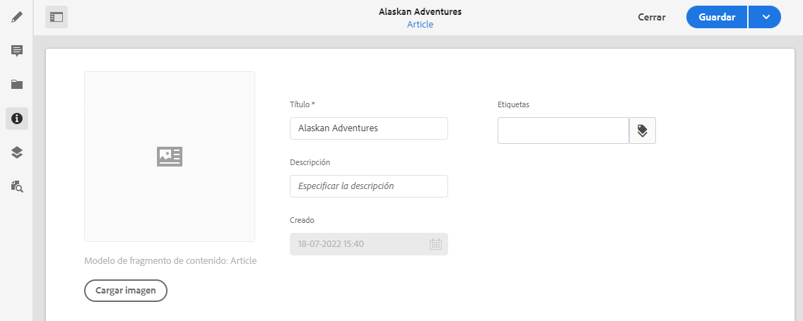

# Metadatos: Propiedades del fragmento {#metadata-fragment-properties}

<!--
hide: yes
index: no
hidefromtoc: yes
-->

Consulte cómo puede ver y editar las propiedades de metadatos de los fragmentos de contenido de AEM.

## Edición de propiedades/metadatos {#editing-properties-meta-data}

Puede ver y editar los metadatos (propiedades) de los fragmentos de contenido:

1. En la consola **Recursos** vaya a la ubicación del fragmento de contenido.
2. O bien, haga lo siguiente:

   * Seleccione [**Ver propiedades** para abrir los cuadros de diálogo](/help/assets/manage-digital-assets.md#editing-properties). Una vez abierto para su visualización, también puede editarlo.
   * Abra el fragmento de contenido para editarlo y, a continuación, seleccione **Metadatos** del panel lateral.

   

3. La pestaña **Básico** proporciona opciones que puede ver o editar:

   * Miniatura, para la que puede **Cargar imagen**
   * **Modelo de fragmento de contenido** indica el modelo utilizado para crear el fragmento actual
   * **Título**
   * **Descripción**
   * **Etiquetas**
      * Las [Etiquetas](/help/sites-cloud/authoring/features/tags.md) son especialmente potentes a la hora de organizar los fragmentos, ya que se pueden utilizar para la clasificación de contenido y la taxonomía. Las etiquetas se pueden utilizar para encontrar contenido (mediante etiquetas) y aplicar operaciones por lotes.
Por ejemplo, puede etiquetar fragmentos relevantes como “lanzamiento de Navidad” para permitir solo explorarlos como un subconjunto o copiarlos para usarlos con otro lanzamiento futuro en una nueva carpeta.

        >[!NOTE]
        >
        >Las **etiquetas** también se pueden añadir cuando se [crea el contenido de Variación](/help/assets/content-fragments/content-fragments-variations.md#authoring-your-content) y cuándo [se crean variaciones](/help/assets/content-fragments/content-fragments-variations.md#creating-a-variation).

   * **Creado** (solo visualización)

   Por ejemplo:
   
