# Variaciones: Crear contenido de fragmentos{#variations-authoring-fragment-content}

<!--
hide: yes
index: no
hidefromtoc: yes
-->

[Variaciones](/help/sites-cloud/administering/content-fragments/content-fragments.md#constituent-parts-of-a-content-fragment) son una característica importante de fragmentos de contenido de AEM, ya que le permiten crear y editar copias del contenido principal para su uso en canales específicos o escenarios, lo que hace que la creación de páginas y la entrega de contenido sin encabezado sean aún más flexibles.

En la pestaña **Variaciones** puede hacer lo siguiente:

* [Introducir el contenido](#authoring-your-content) para el fragmento,
* [Crear y administrar variaciones](#managing-variations) del contenido **Principal**,

Realizar una serie de acciones diferentes en función del tipo de datos que se esté editando; por ejemplo:

* [Insertar recursos visuales en el fragmento](#inserting-assets-into-your-fragment) (imágenes)

* Seleccionar entre [Texto enriquecido](#rich-text), [Texto sin formato](#plain-text) y [Markdown](#markdown) para editar

* [Cargar contenido](#uploading-content)

* [Ver estadísticas clave](#viewing-key-statistics) (acerca del texto multilínea)

* [Resumir texto](#summarizing-text)

* [Sincronizar variaciones con contenido principal](#synchronizing-with-master)

>[!CAUTION]
>
>Después de publicar un fragmento o de hacer referencia a él, AEM mostrará una advertencia cuando un autor abra el fragmento para editarlo de nuevo. Esto sirve para advertir que los cambios en el fragmento también afectarán a las páginas a las que se hace referencia.

## Creación de contenido {#authoring-your-content}

Cuando abra el fragmento de contenidos para editarlo, la pestaña **Variaciones** se abre de forma predeterminada. Aquí puede crear el contenido, para Principal o cualquier variación que tenga. El fragmento estructurado contiene varios campos, de varios tipos de datos, que se definieron en el modelo de contenido.

Por ejemplo:

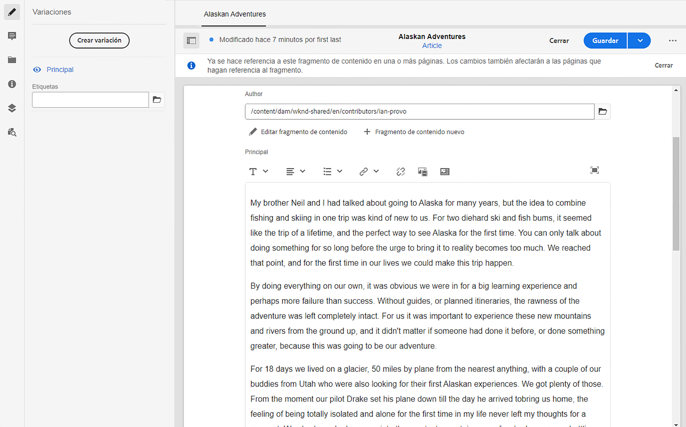

Puede hacer lo siguiente:

* Edite el contenido directamente en la pestaña de **Variaciones**; cada tipo de datos proporciona diferentes opciones de edición, por ejemplo:

   * para los campos **Texto de varias líneas** también puede abrir los campos [editor de pantalla completa](#full-screen-editor) a:

      * seleccione el [Formato](#formats)
      * consulte más opciones de edición (para formato de [Texto enriquecido](#rich-text))
      * acceder a una amplia gama de [acciones](#actions)

   * Para los campos **Referencia a fragmento** la opción [Editar fragmento de contenido](#fragment-references-edit-content-fragment) puede estar disponible, dependiendo de la definición del modelo.

* Asignar **Etiquetas** a la variación actual; las etiquetas se pueden añadir, actualizar y eliminar

   * Las [Etiquetas](/help/sites-cloud/authoring/features/tags.md) son especialmente potentes a la hora de organizar los fragmentos, ya que se pueden utilizar para la clasificación de contenido y la taxonomía. Las etiquetas se pueden utilizar para encontrar contenido (mediante etiquetas) y aplicar operaciones por lotes.

      * Si busca una etiqueta, se devolverá el fragmento con la variación etiquetada resaltada.
      * Las etiquetas de variación también se pueden utilizar para agrupar variaciones para un perfil específico de la red de distribución de contenido (CDN) (para el almacenamiento en caché de CDN), en lugar de utilizar el nombre de variación.

     Por ejemplo, puede etiquetar fragmentos relevantes como “lanzamiento de Navidad” para permitir solo explorarlos como un subconjunto o copiarlos para usarlos con otro lanzamiento futuro en una nueva carpeta.

  >[!NOTE]
  >
  >**Etiquetas** también se puede añadir (a la variación **Principal**) como parte de los [Metadatos](/help/sites-cloud/administering/content-fragments/content-fragments-metadata.md)

* [Crear y administrar variaciones](#managing-variations) del contenido **Principal.**

### Editor de pantalla completa {#full-screen-editor}

Al editar un campo de texto multilínea, puede abrir el editor de pantalla completa; toque o haga clic dentro del texto real y, a continuación, seleccione el siguiente icono de acción:

Se abrirá el editor de texto de pantalla completa:

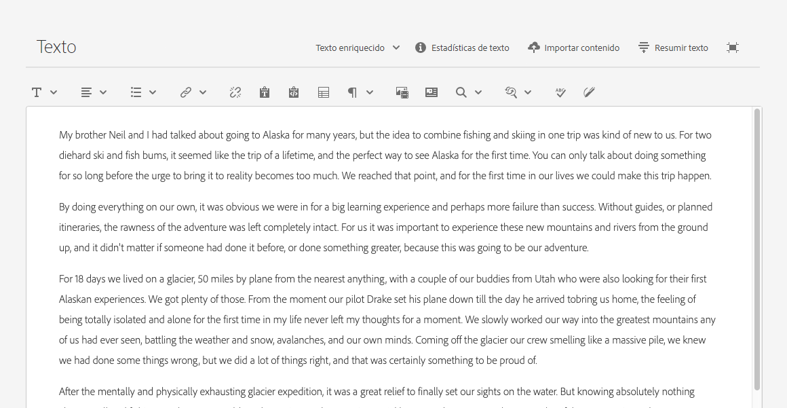

El editor de texto de pantalla completa proporciona lo siguiente:

* Acceso a varias [acciones](#actions)
* Según el [formato](#formats), opciones de formato adicionales ([Texto enriquecido](#rich-text))

### Acciones {#actions}

También están disponibles las siguientes acciones (para todas los [formatos](#formats)) cuando el editor de pantalla completa (es decir, texto multilínea) está abierto:

* Seleccione el [formato](#formats) ([Texto enriquecido](#rich-text), [Texto sin formato,](#plain-text) [Markdown](#markdown))

* [Cargar contenido](#uploading-content)

* [Mostrar estadísticas de texto](#viewing-key-statistics)

* [Sincronizar con Principal](#synchronizing-with-master) (al editar una variación)

* [Resumir texto](#summarizing-text)

### Formatos {#formats}

Las opciones para editar texto multilínea dependen del formato seleccionado:

* [Texto enriquecido](#rich-text)
* [Texto sin formato](#plain-text)
* [Markdown](#markdown)

El formato se puede seleccionar cuando se usa el editor de pantalla completa.

### Texto enriquecido {#rich-text}

La edición de texto enriquecido le permite dar formato:

* Negrita
* Cursiva
* Subrayado
* Alineación: izquierda, centro, derecha
* Lista con viñetas
* Lista numerada
* Sangría: aumentar, disminuir
* Crear/romper hipervínculos
* Pegar texto/desde Word
* Insertar una tabla
* Estilo de párrafo: Párrafo, Encabezado 1/2/3
* [Insertar recurso](#inserting-assets-into-your-fragment)
* Abra el editor de pantalla completa, donde están disponibles las siguientes opciones de formato:
   * Búsqueda
   * Buscar/Reemplazar
   * Corrector ortográfico
   * [Anotaciones](/help/sites-cloud/administering/content-fragments/content-fragments-variations.md#annotating-a-content-fragment)
* [Insertar fragmento de contenido](#inserting-content-fragment-into-your-fragment); disponible cuando su campo **Texto de varias líneas** está configurado con **Permitir referencia a fragmento**.

Las [acciones](#actions) también son accesibles desde el editor de pantalla completa.

### Texto sin formato {#plain-text}

El texto sin formato permite introducir rápidamente el contenido sin aplicar formato ni marcar la información. También puede abrir el editor de pantalla completa para obtener más [acciones](#actions).

>[!CAUTION]
>
>Si selecciona **Texto sin formato**, puede perder cualquier formato, marca o recurso que haya insertado en **Texto enriquecido** o **Marcado**.

### Markdown {#markdown}

>[!NOTE]
>
>Para obtener información completa, consulte la documentación [Markdown](/help/sites-cloud/administering/content-fragments/content-fragments-markdown.md).

Esto permite dar formato al texto mediante markdown. Puede definir lo siguiente:

* Encabezados
* Párrafos y saltos de línea
* Vínculos
* Imágenes
* Comillas de bloque
* Listas
* Énfasis
* Bloques de código
* Secuencias de escape de barra invertida

También puede abrir el editor de pantalla completa para obtener más [acciones](#actions).

>[!CAUTION]
>
>Si cambia entre **Texto enriquecido** y **Markdown**, puede que se produzcan efectos inesperados con Comillas de bloque y Bloques de código, ya que estos dos formatos pueden tener diferencias en la forma en que se gestionan.

### Referencias a fragmento {#fragment-references}

Si el modelo de fragmento de contenido contiene referencias a fragmento, es posible que los autores de los fragmentos tengan opciones adicionales:

* [Editar fragmento de contenido](#fragment-references-edit-content-fragment)
* [Fragmento de contenido nuevo](#fragment-references-new-content-fragment)

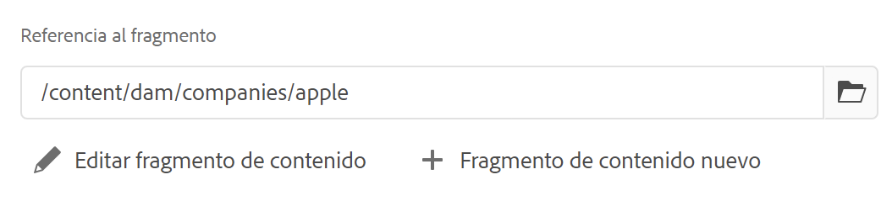

#### Editar fragmento de contenido {#fragment-references-edit-content-fragment}

La opción **Editar fragmento de contenido** abrirá ese fragmento en una nueva pestaña de editor (en la misma pestaña de explorador).

Volver a seleccionar la pestaña original (por ejemplo, **Little Pony Inc.**), cerrará esta pestaña secundaria (en este caso, **Adam Smith**).

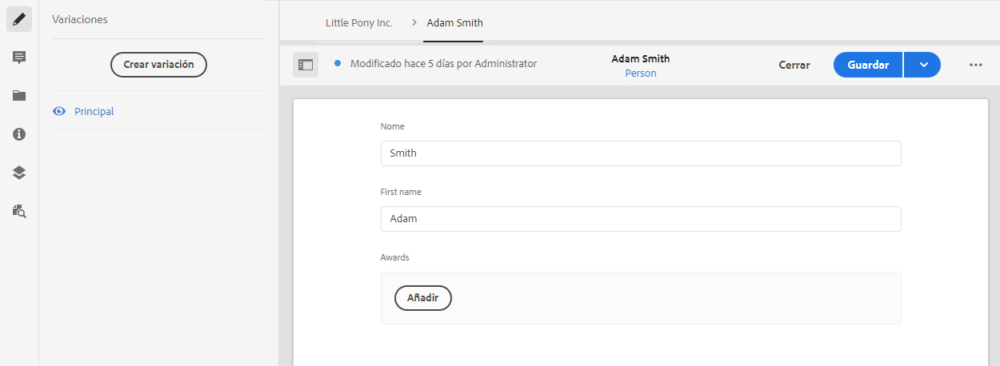

#### Fragmento de contenido nuevo {#fragment-references-new-content-fragment}

La opción **Nuevo fragmento de contenido** le permite crear un fragmento completamente nuevo. Para conseguirlo, se abrirá en el editor una variación del asistente para crear fragmentos de contenido.

A continuación, podrá crear un nuevo fragmento mediante lo siguiente:

1. Ir a y seleccionar la carpeta requerida.
1. Seleccionar **Siguiente**.
1. Especificación de propiedades; por ejemplo, **Título**.
1. Selección **Crear**.
1. Finalmente:
   1. **Listo**:
      * vuelve (al fragmento original)
      * hace referencia al nuevo fragmento
   1. **Abrir**:
      * hace referencia al nuevo fragmento
      * abre el nuevo fragmento para editarlo en una nueva pestaña del explorador

### Visualización de estadísticas clave {#viewing-key-statistics}

Cuando el editor de pantalla completa está abierto, la acción **Estadísticas de texto** mostrará un rango de información sobre el texto.

Por ejemplo:

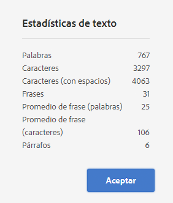

### Carga de contenido {#uploading-content}

Para facilitar el proceso de creación de fragmentos de contenido, puede cargar texto preparado en un editor externo y añadirlo directamente al fragmento.

### Texto de resumen {#summarizing-text}

El texto de resumen está diseñado para ayudar a los usuarios a reducir la longitud de su texto a un número predefinido de palabras, manteniendo al mismo tiempo los puntos clave y el significado general.

>[!NOTE]
>
>A un nivel más técnico, el sistema mantiene las frases que califica como que proporcionan la *mejor relación entre densidad y singularidad de la información* según algoritmos específicos.

>[!CAUTION]
>
>El fragmento de contenido debe tener una carpeta de idioma válida (código ISO) como antecesor; se utiliza para determinar el modelo de idioma que se va a utilizar.
>
>Por ejemplo, `en/` como en la siguiente ruta:
>
>  `/content/dam/my-brand/en/path-down/my-content-fragment`

>[!CAUTION]
>
El inglés está disponible de forma predeterminada.
>
Otros idiomas están disponibles como Paquetes de modelo de idioma desde Distribución de software:
>
* [Francés(fr)](https://experience.adobe.com/#/downloads/content/software-distribution/en/aem.html?package=/content/software-distribution/en/details.html/content/dam/aem/public/adobe/packages/cq630/product/smartcontent-model-fr)
* [Alemán(de)](https://experience.adobe.com/#/downloads/content/software-distribution/en/aem.html?package=/content/software-distribution/en/details.html/content/dam/aem/public/adobe/packages/cq630/product/smartcontent-model-de)
* [Italiano(it)](https://experience.adobe.com/#/downloads/content/software-distribution/en/aem.html?package=/content/software-distribution/en/details.html/content/dam/aem/public/adobe/packages/cq630/product/smartcontent-model-it)
* [Español(es)](https://experience.adobe.com/#/downloads/content/software-distribution/en/aem.html?package=/content/software-distribution/en/details.html/content/dam/aem/public/adobe/packages/cq630/product/smartcontent-model-es)
>

1. Seleccione **Principal** o la variación requerida.
1. Abra el editor de pantalla completa.

1. Seleccione **Resumir texto** en la barra de herramientas.

   

1. Especifique el número de palabras objetivo y seleccione **Inicio**:
1. El texto original se muestra en paralelo con el resumen propuesto:

   * Las frases que se eliminen se resaltan en rojo y se tachan.
   * Haga clic en cualquier frase resaltada para mantenerla en el contenido resumido.
   * Haga clic en cualquier frase no resaltada para que la eliminen.

1. Seleccione **Resumen** para confirmar los cambios.

1. El texto original se muestra en paralelo con el resumen propuesto:

   * Las frases que se eliminen se resaltan en rojo y se tachan.
   * Haga clic en cualquier frase resaltada para mantenerla en el contenido resumido.
   * Haga clic en cualquier frase no resaltada para que la eliminen.
   * Se muestran las estadísticas de resumen: **Real** y **Objetivo**-
   * Puede **Previsualizar** los cambios.

   

### Anotación de un fragmento de contenido {#annotating-a-content-fragment}

Para realizar anotaciones en un fragmento:

1. Seleccione **Principal** o la variación requerida.

1. Abra el editor de pantalla completa.

1. El icono **Anotar** está disponible en la barra de herramientas superior. Si es necesario, puede seleccionar el texto.

   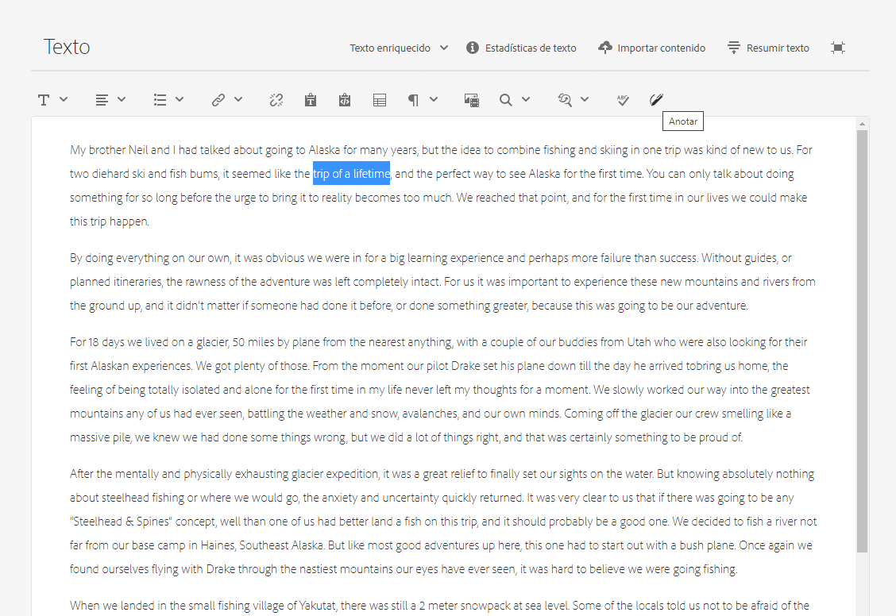

1. Se abrirá un cuadro de diálogo: Aquí puede introducir la anotación.

   

1. Seleccione **Aplicar** en el cuadro de diálogo.

   

   Si la anotación se aplicó al texto seleccionado, el texto permanecerá resaltado.

   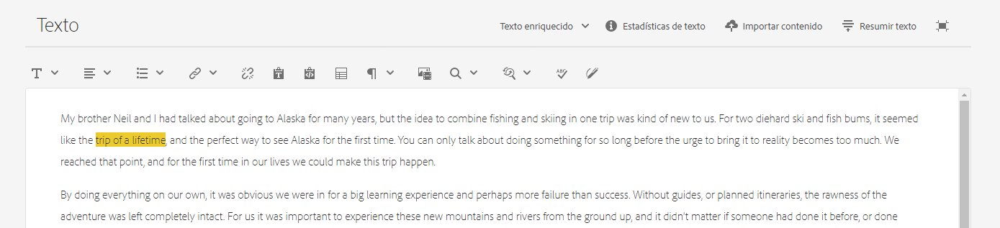

1. Cierre el editor de pantalla completa y las anotaciones se seguirán resaltando. Si se selecciona, se abrirá un cuadro de diálogo para que pueda editar la anotación más adelante.

1. Seleccione **Guardar**.

1. Cierre el editor de pantalla completa y las anotaciones se seguirán resaltando. Si se selecciona, se abrirá un cuadro de diálogo para que pueda editar la anotación más adelante.

   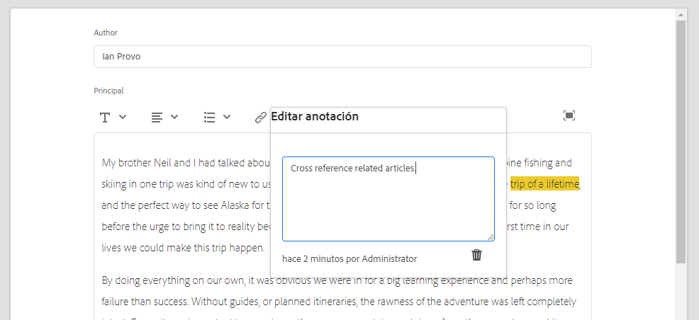

### Visualización, Edición, Eliminación de anotaciones {#viewing-editing-deleting-annotations}

Anotaciones:

* Se indican mediante el resaltado en el texto, tanto en pantalla completa como en modo normal del editor. Los detalles completos de una anotación se pueden ver, editar o eliminar haciendo clic en el texto resaltado, que reabrirá el cuadro de diálogo.

  >[!NOTE]
  >
  Se proporciona un selector desplegable si se han aplicado varias anotaciones a un texto.

* Cuando se elimina todo el texto al que se aplicó la anotación, también se elimina la anotación.

* Se puede enumerar y eliminar seleccionando la pestaña **Anotaciones** en el editor de fragmentos.

  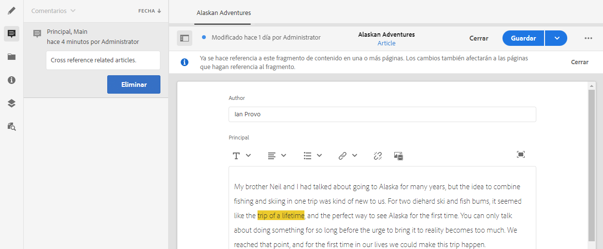

* Se puede ver y eliminar en [Cronología](/help/sites-cloud/administering/content-fragments/content-fragments-managing.md#timeline-for-content-fragments) para el fragmento seleccionado.

### Inserción de recursos en el fragmento {#inserting-assets-into-your-fragment}

Para facilitar el proceso de creación de fragmentos de contenido, puede agregar [Recursos](/help/assets/manage-digital-assets.md) (imágenes) directamente al fragmento.

Se agregan a la secuencia de párrafo del fragmento sin ningún formato; el formato se puede realizar cuando [se utiliza/se hace referencia al fragmento en una página](/help/sites-cloud/authoring/fundamentals/content-fragments.md).

>[!CAUTION]
>
Estos recursos no se pueden mover ni eliminar en una página de referencia; esto debe hacerse en el editor de fragmentos.
>
Sin embargo, el formato del recurso (por ejemplo, su tamaño) debe realizarse en el [editor de páginas](/help/sites-cloud/authoring/fundamentals/content-fragments.md). La representación del recurso en el editor de fragmentos se realiza exclusivamente para crear el flujo de contenido.

>[!NOTE]
>
Hay varios métodos para agregar [imágenes](/help/sites-cloud/administering/content-fragments/content-fragments.md#fragments-with-visual-assets) al fragmento o página.

1. Coloque el cursor en la posición en la que desee agregar la imagen.
1. Utilice el icono **Insertar recurso** para abrir el cuadro de diálogo de búsqueda.

   

1. En el cuadro de diálogo puede hacer lo siguiente:

   * vaya al recurso necesario en DAM
   * buscar el recurso en DAM

   Una vez localizado, seleccione el recurso necesario haciendo clic en la miniatura.

1. Utilice **Seleccionar** para agregar el recurso al sistema de párrafos del fragmento de contenido en la ubicación actual.

   >[!CAUTION]
   >
   Si, después de agregar un recurso, cambia el formato a:
   >
   * **Texto sin formato**: el recurso se pierde completamente del fragmento.
   * **Marcado**: el recurso no es visible, pero permanece allí cuando vuelva a **Texto enriquecido**.

### Inserción de un fragmento de contenido en el fragmento {#inserting-content-fragment-into-your-fragment}

Para facilitar el proceso de creación de fragmentos de contenido, también puede agregar otro fragmento de contenido al fragmento.

Se agregan como referencia en la ubicación actual del fragmento.

>[!NOTE]
>
Esta opción está disponible cuando su **Texto de varias líneas** está configurado con **Permitir referencia a fragmento**.

>[!CAUTION]
>
Estos recursos no se pueden mover ni eliminar en una página de referencia; esto debe hacerse en el editor de fragmentos.
>
Sin embargo, el formato del recurso (por ejemplo, su tamaño) debe realizarse en el [editor de páginas](/help/sites-cloud/authoring/fundamentals/content-fragments.md). La representación del recurso en el editor de fragmentos se realiza exclusivamente para crear el flujo de contenido.

>[!NOTE]
>
Hay varios métodos para agregar [imágenes](/help/sites-cloud/administering/content-fragments/content-fragments.md#fragments-with-visual-assets) al fragmento o página.

1. Coloque el cursor en la posición en la que desee agregar el fragmento.
1. Utilice el icono **Insertar fragmento de contenido** para abrir el cuadro de diálogo de búsqueda.

   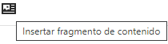

1. En el cuadro de diálogo puede hacer lo siguiente:

   * vaya al fragmento requerido en la carpeta Assets
   * buscar el fragmento

   Una vez localizado, seleccione el fragmento requerido haciendo clic en la miniatura.

1. Use **Seleccionar** para agregar una referencia al fragmento de contenido seleccionado al fragmento de contenido actual (en la ubicación actual).

   >[!CAUTION]
   >
   Si, después de agregar una referencia a otro fragmento, cambia el formato a:
   >
   * **Texto sin formato**: la referencia se pierde completamente del fragmento.
   * **Markdown**: la referencia se mantendrá.

## Administración de variaciones {#managing-variations}

[!CONTEXTUALHELP]
id="aemcloud_sites_contentfragments_variations"
title="Variaciones: Crear contenido de fragmentos"
abstract="Aprenda cómo hacer variaciones de contenido para utilizarlas con canales específicos."
additional-url="https://video.tv.adobe.com/v/333295/?captions=spa" text="Variaciones de fragmentos de contenido"

### Creación de una variación {#creating-a-variation}

Las variaciones le permiten tomar el contenido **principal** y variar según el propósito (si es necesario).

Para crear una nueva variación, haga lo siguiente:

1. Abra el fragmento y asegúrese de que el panel lateral esté visible.
1. Seleccione **Variaciones** en la barra de iconos del panel lateral.
1. Seleccione **Crear variación**.
1. Se abrirá un cuadro de diálogo, especifique el **Título** y la **Descripción** de la nueva variación.
1. Seleccione **Agregar**; el fragmento **Principal** se copia en la nueva variación, que ahora está abierta para [editar](#editing-a-variation).

   >[!NOTE]
   >
   Al crear una variación nueva, siempre es **Principal** que se copia, no la variación que está abierta actualmente.

   >[!NOTE]
   >
   Al crear una nueva variación, todas las **Etiquetas** asignadas actualmente a la variación **Principal** se copian en la nueva variación.

### Edición de una variación {#editing-a-variation}

Puede realizar cambios en el contenido de la variación después de lo siguiente:

* [Creación de la variación](#creating-a-variation).
* Abra un fragmento existente y, a continuación, seleccione la variación necesaria en el panel lateral.

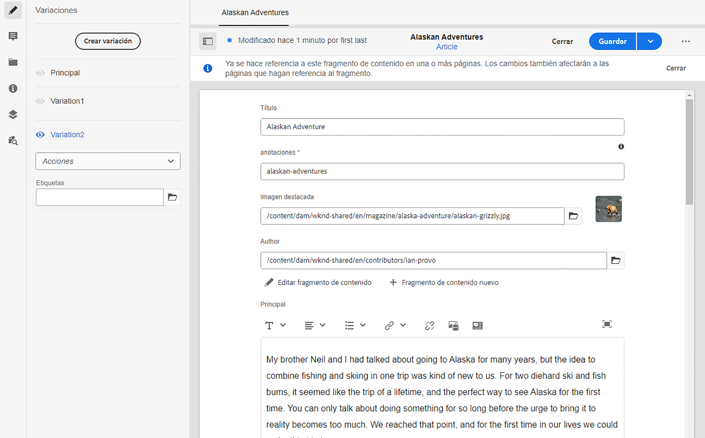

### Cambio del nombre de una variación {#renaming-a-variation}

Para cambiar el nombre de una variación existente:

1. Abra el fragmento y seleccione **Variaciones** en el panel lateral.
1. Seleccione la variación requerida.
1. Seleccione **Cambiar nombre** del menú desplegable **Acciones**.

1. Introduzca el nuevo **Título** o **Descripción** en el cuadro de diálogo resultante.

1. Confirme la acción **Cambiar nombre**.

>[!NOTE]
>
Esto solo afecta a la variación **Título**.

### Eliminación de una variación {#deleting-a-variation}

Para eliminar una variación existente, haga esto:

1. Abra el fragmento y seleccione **Variaciones** en el panel lateral.
1. Seleccione la variación requerida.
1. Seleccione **Eliminar** del menú desplegable **Acciones**.

1. Confirme la acción **Eliminar** en el cuadro de diálogo.

>[!NOTE]
>
No puede eliminar **Principal**.

### Sincronización con Principal {#synchronizing-with-master}

**Principal** es una parte integral de un fragmento de contenido y por definición contiene la copia principal del contenido, mientras que las variaciones contienen versiones individuales actualizadas y adaptadas de ese contenido. Cuando Principal se actualiza, es posible que estos cambios también sean relevantes para las variaciones y, por lo tanto, deban propagarse a ellas.

Al editar una variación, tiene acceso a la acción para sincronizar el elemento actual de la variación con Principal. Esto permite copiar automáticamente los cambios realizados en Principal en la variación requerida.

>[!CAUTION]
>
La sincronización solo está disponible para copiar cambios *de **Principal**a la variación*.
>
Solo se sincroniza el elemento actual de la variación.
>
La sincronización solo funciona en el tipo de datos de **texto de varias líneas**.
>
No está disponible como opción la transferencia de cambios *de una variación **a Principal***.

1. Abra el fragmento de contenido en el editor de fragmentos. Asegúrese de que **Principal** se ha editado.

1. Seleccione una variación específica y, a continuación, la acción de sincronización adecuada desde:

   * el selector desplegable **Acciones**, **Sincronizar elemento actual con principal**

     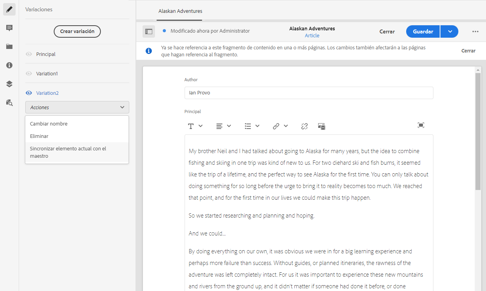

   * la barra de herramientas del editor de pantalla completa: **Sincronizar con principal**

     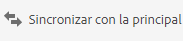

1. Principal y la variación se muestran en paralelo:

   * verde indica el contenido añadido (a la variación)
   * rojo indica que el contenido se ha eliminado (de la variación)
   * azul indica texto reemplazado

   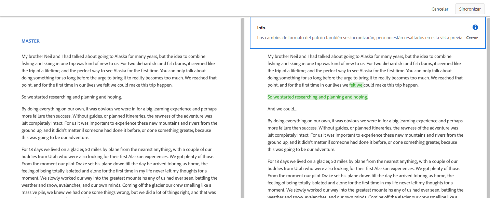

1. Seleccione **Sincronizar**: se actualiza y se muestra la variación.
