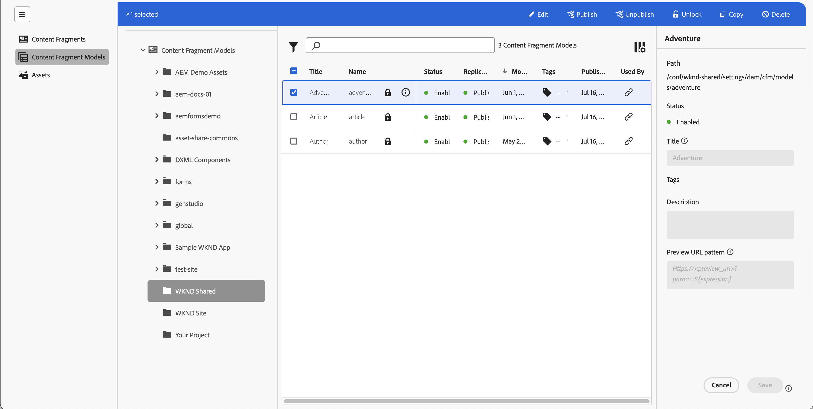

# Administración de los modelos de fragmento de contenido {#managing-content-fragment-models}

Desde la consola de fragmentos de contenido puede administrar los modelos de fragmentos de contenido y, a continuación, [abrir el editor](/help/sites-cloud/administering/content-fragments/content-fragment-models.md) para definir la estructura.

Los modelos de fragmentos de contenido de Adobe Experience Manager (AEM) as a Cloud Service definen la estructura del contenido de sus [fragmentos de contenido](/help/sites-cloud/administering/content-fragments/overview.md). Estos fragmentos se pueden utilizar como base para el contenido sin encabezado o para la creación de páginas.

>[!NOTE]
>
>Tenga en cuenta las [Prácticas recomendadas](/help/sites-cloud/administering/content-fragments/overview.md#best-practices) al trabajar con los modelos de fragmentos de contenido y los fragmentos de contenido.

>[!NOTE]
>
>Esta página cubre la sección de la consola que (solo) muestra los modelos de fragmentos de contenido. Para ver otros paneles, consulte:
>
>* [Administrar fragmentos de contenido](/help/sites-cloud/administering/content-fragments/managing.md)
>* [Visualización y administración de Assets en la consola Fragmentos de contenido](/help/sites-cloud/administering/content-fragments/assets-content-fragments-console.md)

>[!NOTE]
>
>Los fragmentos de contenido se almacenan como **Recursos**. Los modelos de fragmentos de contenido se administran principalmente desde la consola **Fragmentos de contenido**, pero también se pueden administrar desde la consola [Assets](/help/assets/content-fragments/content-fragments-managing.md) y la opción [Modelos de fragmentos de contenido](/help/assets/content-fragments/content-fragments-models.md) disponible en **Herramientas** - **General**.

## Cómo trabajar con modelos de fragmentos de contenido {#how-to-work-with-content-fragment-models}

Como descripción general muy rápida, para trabajar con los modelos de fragmentos de contenido puede hacer lo siguiente:

1. [Habilite la funcionalidad de modelos de fragmentos de contenido para la instancia.](/help/sites-cloud/administering/content-fragments/setup.md)
1. [Crear](#creating-a-content-fragment-model) su modelo de fragmento de contenido.
   * En este punto también puede **Habilitar** el modelo (para usarlo al crear fragmentos de contenido).
1. [Defina](/help/sites-cloud/administering/content-fragments/content-fragment-models.md#defining-your-content-fragment-model) la estructura de su modelo.
1. [Habilite el modelo de fragmento de contenido](#enabling-a-content-fragment-model), si no lo ha hecho ya.
1. [Permita los modelos de fragmentos de contenido en las carpetas de recursos necesarias](#allowing-content-fragment-models-assets-folder) configurando **Políticas**.

## Estructura básica y administración de modelos de fragmentos de contenido en la consola {#basic-structure-handling-content-fragment-models-console}

Puede usar el panel del extremo izquierdo de la consola [Fragmentos de contenido](/help/sites-cloud/administering/content-fragments/overview.md#content-fragments-console) para seleccionar **Modelos de fragmentos de contenido** como tipo de recurso para ver, examinar y administrar:

Se abrirá la vista para modelos de fragmentos de contenido:

Aquí se pueden ver tres áreas principales:

* La barra de herramientas superior
   * Proporciona funcionalidad AEM estándar
   * Muestra su organización IMS
   * Proporciona varias [acciones](#actions-unselected), que pueden [cambiar al seleccionar uno o más modelos](#actions-selected-content-fragment-models)
* El panel izquierdo
   * Muestra las [rutas de acceso a todas las configuraciones](/help/sites-cloud/administering/content-fragments/setup.md#enable-content-fragment-functionality-configuration-browser) enumeradas como carpetas
   * Aquí puede ocultar o mostrar el árbol de carpetas
   * Puede seleccionar una carpeta específica del árbol
   * Se puede cambiar el tamaño para mostrar carpetas anidadas (subconfiguraciones)
   * Además de los modelos de fragmentos de contenido, puede ver [fragmentos de contenido](/help/sites-cloud/administering/content-fragments/managing.md) o [Assets](/help/sites-cloud/administering/content-fragments/assets-content-fragments-console.md); también puede comprimir o expandir los vínculos a los paneles
* Panel principal/derecho, desde aquí puede hacer lo siguiente:
   * Consulte la lista de todos los modelos de fragmento de contenido que se encuentran en la carpeta seleccionada:
      * Se mostrarán los modelos de fragmento de contenido de la carpeta seleccionada y todas las subcarpetas:
         * La ubicación se indica mediante las rutas de exploración; también se pueden utilizar para cambiar la ubicación:
      * [Se muestra información sobre cada modelo](#information-content-fragment-models)
         * [Puede seleccionar qué columnas mostrar](#select-columns-console)
      * [Varios campos de información](#information-content-fragment-models) acerca de un modelo de fragmento de contenido proporcionan vínculos; según el campo, pueden:
         * Abra el modelo adecuado en el editor
         * Mostrar información sobre la ruta a la configuración
         * Mostrar información sobre el estado del modelo
      * [Algunos otros campos de información](#information-content-fragments) acerca de un modelo de fragmento de contenido se pueden usar para [Filtrado rápido](#fast-filtering):
         * Seleccione un valor en la columna y se aplicará inmediatamente como filtro
         * Se admite el filtrado rápido para las columnas **Modificado por**, **Publicado por** y **Estado**.
      * Al utilizar el ratón sobre los encabezados de columna, se mostrará un selector de acciones desplegable y controles deslizantes de anchura. Esto le permite lograr lo siguiente:
         * Ordenar: seleccione la acción adecuada, ya sea ascendente o descendente.
Así se ordenará toda la tabla según esa columna. La ordenación solo está disponible en las columnas adecuadas.
         * Cambiar el tamaño de la columna: mediante los controles deslizantes de acción o de anchura
      * Seleccione uno o más modelos para realizar más [acción](#actions-selected-content-fragment-models)
   * Abrir el [panel Filtro](#filter-content-fragment-models)
   * Hay una selección de [métodos abreviados de teclado](/help/sites-cloud/administering/content-fragments/keyboard-shortcuts.md) disponibles para usar en esta consola

## La información proporcionada sobre los modelos de fragmentos de contenido {#information-content-fragment-models}

El panel principal/derecho (vista de tabla) de la consola proporciona una amplia gama de información sobre los modelos de fragmentos de contenido. Algunos elementos también proporcionan vínculos directos a otras acciones o información:

* **Nombre**
   * Proporciona un vínculo para abrir el modelo en el editor.
* **Bloqueado** (icono de candado)
   * Cuando el modelo está bloqueado, esto se indica con un icono de candado.
* **Ruta**
   * Proporciona la ruta de acceso como vínculo para abrir la configuración en la consola.
Al pasar el puntero por encima del nombre de la carpeta, se muestra la ruta JCR.
* **Estado**
   * Solo información.
   * Se puede usar para [Filtrado rápido](#fast-filtering)
* **Estado de replicación**
   * Solo información.
   * Se puede usar para [Filtrado rápido](#fast-filtering).
* **Vista previa**
   * Solo información.
* **Modificado En**
   * Solo información.
   * Se puede usar para [Filtrado rápido](#fast-filtering).
* **Modificado por**
   * Solo información.
   * Se puede usar para [Filtrado rápido](#fast-filtering).
* **Etiquetas**
   * Solo información.
   * Abre un cuadro de diálogo que muestra todas las etiquetas relacionadas con el modelo.
   * Se puede usar para [Filtrado rápido](#fast-filtering).
* **Publicado en**
   * Solo información.
   * Se puede usar para [Filtrado rápido](#fast-filtering).
* **Publicado por**
   * Solo información.
   * Se puede usar para [Filtrado rápido](#fast-filtering).
* **Utilizado por**
   * Abre un cuadro de diálogo que enumera los fragmentos de contenido basados en el modelo. La lista proporciona vínculos para permitirle abrir directamente fragmentos.

## Propiedades de modelo {#model-properties}

Al seleccionar un modelo específico, se muestran las propiedades de dicho modelo (tal como se definen al [crear el modelo](#creating-a-content-fragment-model)). Si el modelo no está **Bloqueado**, se podrán actualizar algunos elementos. También puede usar el icono de información (junto al modelo **Title**) para abrir y cerrar este panel de información.

* **[Ruta](/help/sites-cloud/administering/content-fragments/setup.md#enable-content-fragment-functionality-configuration-browser)**
* **[Estado](#enabling-a-content-fragment-model)**
* **Título**
* **Etiquetas**
* **Descripción**
* **[Patrón de URL de vista previa](/help/sites-cloud/administering/content-fragments/preview.md#preview-url-pattern)**

<!-- CHECK: currently under FT -->
<!--
* **GraphQL**
  Define names relevant for GraphQL.
  Changing the GraphQL API Name, or Query field names will impact client applications.
  * **API Name**
    Represents the GraphQL type and query field names in the GraphQL schema.
  * **Single Query Field Name**
    Represents the GraphQL single query field name in the GraphQL schema.
  * **Multiple Query Field Name**
    Represents the GraphQL multiple query field name in the GraphQL schema.
-->

## Acciones {#actions}

Una vez seleccionada una carpeta (en el panel izquierdo), hay una serie de acciones que puede utilizar, ya sea directamente o después de seleccionar un modelo específico:

* Varias acciones están [disponibles desde la consola](#actions-unselected) directamente
* Puede [seleccionar uno o más modelos de fragmento de contenido para mostrar las acciones adecuadas](#actions-selected-content-fragment)

### Acciones (sin seleccionar) {#actions-unselected}

Ciertas acciones están disponibles desde la consola, después de seleccionar una carpeta, pero sin seleccionar un modelo de fragmento de contenido específico:

* **[Crear](#creating-a-content-fragment-model)** un nuevo modelo (vacío)

### Acciones para un modelo de fragmento de contenido en la consola Fragmentos de contenido {#actions-selected-content-fragment-models}

Al seleccionar un modelo específico, se abre una barra de herramientas centrada en las acciones disponibles para dicho modelo. También puede seleccionar varios modelos: las acciones disponibles se ajustarán en consecuencia.

* **[Editar](/help/sites-cloud/administering/content-fragments/content-fragment-models.md)** para definir el modelo de fragmento de contenido.
* **[Publicar](#publishing-a-content-fragment-model)** y **[Cancelar la publicación](#unpublishing-a-content-fragment-model)** en los niveles [Publicar](/help/implementing/cloud-manager/manage-environments.md#environment-types) o [Vista previa](/help/implementing/cloud-manager/manage-environments.md#access-preview-service).
* **Bloquear**/**Desbloquear** para controlar si un usuario tiene permiso para modificar el modelo.
* **Copia** tu modelo.
* **[Habilitar](#enabling-a-content-fragment-model)**/**[Deshabilitar](#disabling-a-content-fragment-model)** para controlar si un usuario puede crear fragmentos de contenido basados en este modelo.

Al seleccionar un solo modelo, también se muestran las [propiedades del modelo](#properties) en el panel derecho.

## Seleccionar columnas mostradas en la consola {#select-columns-console}

Al igual que con otras consolas, puede configurar las columnas que son visibles y están disponibles para la acción:

Se mostrará una lista de columnas que puede ocultar o mostrar:

## Filtrar modelos de fragmentos de contenido {#filter-content-fragment-models}

El panel Filtro ofrece lo siguiente:

* una selección de predicados;
   * incluyendo campos de estado, etiquetas, usuarios, entre otros
   * se pueden seleccionar uno o más predicados y combinarlos para crear el filtro

<!--
* the opportunity to **Save** your filter
* the option to retrieve a saved search filter for reuse
-->

Una vez seleccionadas, se muestran las opciones **Filtrado por** (en la parte superior del panel principal). Se pueden anular las selecciones desde allí. Por ejemplo:

### Filtrado rápido {#fast-filtering}

También puede seleccionar un predicado haciendo clic en un valor de columna específico de la lista. Puede seleccionar uno o más valores para combinar predicados.

Por ejemplo, seleccione **Habilitado** en la columna **Estado**. Una vez seleccionado, esto se mostrará como un predicado de filtro y la lista se filtrará en consecuencia.

>[!NOTE]
>
>El filtrado rápido solo se admite para las columnas **Status**, **Modificado por**, **Tags** y **Publicado por**.

>[!NOTE]
>
>El Filtrado rápido funciona de la misma manera que para [Fragmentos de contenido](/help/sites-cloud/administering/content-fragments/managing.md#fast-filtering) en la consola.

## Creación de un modelo de fragmento de contenido {#creating-a-content-fragment-model}

1. Vaya a la carpeta adecuada para su [configuración o subconfiguración](/help/sites-cloud/administering/content-fragments/setup.md).
1. Use **Crear** para abrir el cuadro de diálogo.

   >[!CAUTION]
   >
   >La opción **Crear** solo estará disponible:
   >
   >* Si se ha habilitado el uso de [modelos de fragmentos de contenido](/help/sites-cloud/administering/content-fragments/setup.md)
   >* cuando haya seleccionado la carpeta en la que desea crear el modelo.

1. Seleccione la **ruta** a la configuración y especifique el **nombre**.

   >[!NOTE]
   >
   >La configuración se rellenará automáticamente con la configuración actual (la carpeta en la que se encuentra actualmente).
   >
   >También puede cambiar la configuración haciendo clic en el icono de la carpeta.

   También puede definir varias propiedades:

   * **Título**
Si escribe primero el **Título**, a partir de ahí se generará **Nombre**.
   * una **descripción**
   * **Habilitar modelo** para [habilitar el modelo](#enabling-disabling-a-content-fragment-model)

   >[!NOTE]
   >
   >Consulte [Modelo de fragmento de contenido: propiedades](#model-properties) para obtener información detallada.

   

1. Use **Crear** para guardar el modelo vacío o **Crear y abrir**.

### Habilitación de un modelo de fragmento de contenido {#enabling-a-content-fragment-model}

Una vez creado un modelo, debe activarse para que:

* Está disponible para su selección al crear un fragmento de contenido.
* Se pueda hacer referencia a él desde un modelo de fragmento de contenido.
* Esté disponible para GraphQL y por lo tanto, se genere el esquema.

Puede **habilitar** un modelo:

* Al crear un nuevo modelo
   * Se muestra una opción en el cuadro de diálogo.
* Cuando un modelo se ha **deshabilitado** específicamente
   * Cuando se selecciona el modelo requerido, la acción **Enable** está disponible en la barra de herramientas superior.

### Desactivación de un modelo de fragmento de contenido {#disabling-a-content-fragment-model}

Un modelo también se puede desactivar para que:

* El modelo ya no esté disponible como base para la creación de *nuevos* fragmentos de contenido.
* Sin embargo:
   * El esquema de GraphQL se siga generando y aún se pueda consultar (para evitar afectar a la API de JSON).
   * Cualquier fragmento de contenido basado en el modelo se puede consultar y devolver desde el extremo de GraphQL.
* Ya no se puede hacer referencia al modelo, pero las referencias existentes no se tocan y aún se pueden consultar y devolver desde el extremo GraphQL.

Para deshabilitar un modelo marcado como **Habilitado**, usa la opción **Deshabilitar** de:

* La barra de herramientas superior, cuando se selecciona el Modelo requerido.

## Permitir modelos de fragmento de contenido en la carpeta de recursos {#allowing-content-fragment-models-assets-folder}

Para implementar el control de contenido, puede configurar las **Directivas** en la carpeta Recursos para controlar qué modelos de fragmento de contenido están permitidos para la creación de fragmentos en esa carpeta.

>[!NOTE]
>
>El mecanismo es similar a [permitir plantillas de página](/help/sites-cloud/authoring/page-editor/templates.md#allowing-a-template-author) para una página, y sus elementos secundarios, en propiedades avanzadas de una página.

Para configurar las **Directivas** para **Modelos de fragmento de contenido permitidos**:

1. Navegar y abrir **Propiedades** para la carpeta de recursos necesaria.

1. Abra la pestaña **Directivas**, donde puede configurar lo siguiente:

   * **Heredado de`<folder>`**

     Las directivas se heredan automáticamente al crear nuevas carpetas secundarias; la directiva se puede reconfigurar (y la herencia se rompe) si las subcarpetas necesitan permitir modelos diferentes de la carpeta principal.

   * **Modelos de fragmento de contenido permitidos por ruta**

     Se pueden permitir varios modelos.

   * **Modelos de fragmento de contenido permitidos por etiquetas**

     Se pueden permitir varios modelos.

   

1. **Guardar** cualquier cambio.

Los modelos de fragmento de contenido permitidos para una carpeta se resuelven de la siguiente manera:

* Las **Directivas** para los **Modelos de fragmento de contenido permitidos**.
* Si está vacío, intente determinar la directiva utilizando las reglas de herencia.
* Si la cadena de herencia no proporciona un resultado, consulte la configuración de **Cloud Services** para esa carpeta (primero directamente y luego mediante herencia).
* Si ninguno de los anteriores proporciona ningún resultado, no hay modelos permitidos para esa carpeta.

## Eliminación de un modelo de fragmento de contenido {#deleting-a-content-fragment-model}

>[!CAUTION]
>
>La eliminación de un modelo de fragmento de contenido puede afectar a los fragmentos dependientes.

Para eliminar un modelo de fragmento de contenido:

1. Vaya a y seleccione el Modelo de fragmento de contenido. Puede seleccionar varios modelos.

1. En la barra de herramientas, seleccione **Eliminar**.

   >[!NOTE]
   >
   >Si se hace referencia al modelo, se envía una advertencia para que pueda realizar las acciones adecuadas.

## Publicación de un modelo de fragmento de contenido {#publishing-a-content-fragment-model}

Los modelos de fragmento de contenido deben publicarse cuando se publican fragmentos de contenido dependientes, o antes de hacerlo.

Para publicar un modelo de fragmento de contenido:

1. Vaya a y seleccione el Modelo de fragmento de contenido. Puede seleccionar varios modelos.

1. Seleccione **Publicar** en la barra de herramientas.

1. En el cuadro de diálogo Publicar, seleccione **Destino**:

   * **Servicio de publicación**
   * **Servicio de vista previa**

1. Se iniciará el flujo de trabajo para publicar los modelos seleccionados y sus referencias. El estado publicado se muestra en la consola.

## Cancelación de la publicación de un modelo de fragmento de contenido {#unpublishing-a-content-fragment-model}

Los modelos de fragmento de contenido se pueden cancelar si ningún fragmento hace referencia a ellos.

Para cancelar la publicación de un modelo de fragmento de contenido:

1. Vaya a y seleccione el Modelo de fragmento de contenido.
El estado publicado se indica en la consola.

1. Seleccione **Cancelar publicación** en la barra de herramientas.

1. En el cuadro de diálogo Cancelar la publicación, seleccione **Destino**:

   * **Servicio de publicación**
   * **Servicio de vista previa**

1. Se iniciará el flujo de trabajo para cancelar la publicación de los modelos seleccionados y sus referencias. El estado de cancelación de publicación se muestra en la consola.

Si intenta cancelar la publicación de un modelo que actualmente utiliza uno o varios fragmentos, se muestra una advertencia de error. El mensaje sugiere que verifique el panel [Referencias](/help/sites-cloud/authoring/basic-handling.md#references) para investigar más a fondo:

## Modelos de fragmento de contenido bloqueados {#locked-content-fragment-models}

Esta función le permite controlar si un modelo se puede actualizar, pero también proporciona control para los modelos de fragmento de contenido que se han publicado.

### Desafíos {#the-challenge}

* Los modelos de fragmentos de contenido determinan el esquema de las consultas de GraphQL en AEM.

   * Los esquemas de GraphQL de AEM se crean en cuanto se genera un modelo de fragmento de contenido y pueden existir en entornos de creación y publicación.

   * Los esquemas en la publicación son los más críticos, ya que proporcionan la base para la entrega en directo de contenido de fragmento de contenido en formato JSON.

* Pueden producirse problemas cuando se modifican los modelos de fragmento de contenido o, dicho de otro modo, se editan. Esto significa que el esquema cambia, lo que a su vez puede afectar a las consultas de GraphQL existentes.

* La adición de nuevos campos a un modelo de fragmento de contenido no debería (normalmente) tener ningún efecto perjudicial. Sin embargo, si se modifican los campos de datos existentes (por ejemplo, su nombre) o se eliminan las definiciones de campos, las consultas de GraphQL existentes se romperán al solicitar estos campos.

### Requisitos {#the-requirements}

* Para concienciar a los usuarios sobre los riesgos que se plantean al editar modelos que ya se utilizan para la entrega de contenido en directo (es decir, modelos que se han publicado).

* Además, para evitar cambios no deseados.

Cualquiera de estos criterios podría generar consultas si se vuelven a publicar los modelos modificados.

### Solución {#the-solution}

Para solucionar estos problemas, los modelos de fragmentos de contenido son *bloqueados* en modo de SOLO LECTURA en el autor, tan pronto como se hayan publicado. Este estado está indicado por **Bloqueado**.

Cuando el modelo es **Bloqueado** (en modo de SOLO LECTURA), puede ver el contenido y la estructura de los modelos, pero no puede editarlos.

Puede administrar modelos **Bloqueados** desde la consola o desde el editor de modelos:

* Consola

  Desde la consola, puede administrar el modo de SOLO LECTURA con las acciones **Desbloquear** y **Bloquear** de la barra de herramientas.

   * Puede **Desbloquear** un modelo para habilitar las ediciones.

     Si seleccionas **Desbloquear** se mostrará una advertencia y debes confirmar la acción **Desbloquear**.

     A continuación, puede abrir el modelo para editarlo.

   * También puede **Bloquear** el modelo después.
   * Volver a publicar el modelo inmediatamente lo devuelve al modo **Bloqueado** (SOLO LECTURA).

* Editor de modelo

   * Cuando abra un modelo bloqueado, se le avisará y se le presentarán tres acciones: **Cancelar**, **Ver solo lectura**, **Editar**.

   * Si selecciona **Ver solo lectura**, podrá ver el contenido y la estructura del modelo.

   * Si seleccionas **Editar**, puedes editar y guardar tus actualizaciones:

     

     >[!NOTE]
     >
     >Puede que todavía haya una advertencia en la parte superior, pero es cuando el modelo ya está siendo utilizado por fragmentos de contenido existentes.

   * **Cancelar** le devuelve a la consola.
