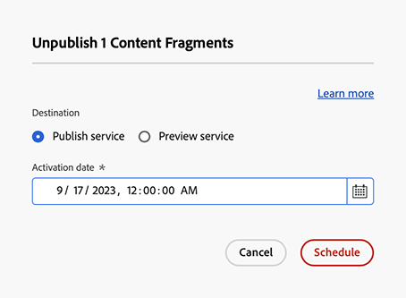
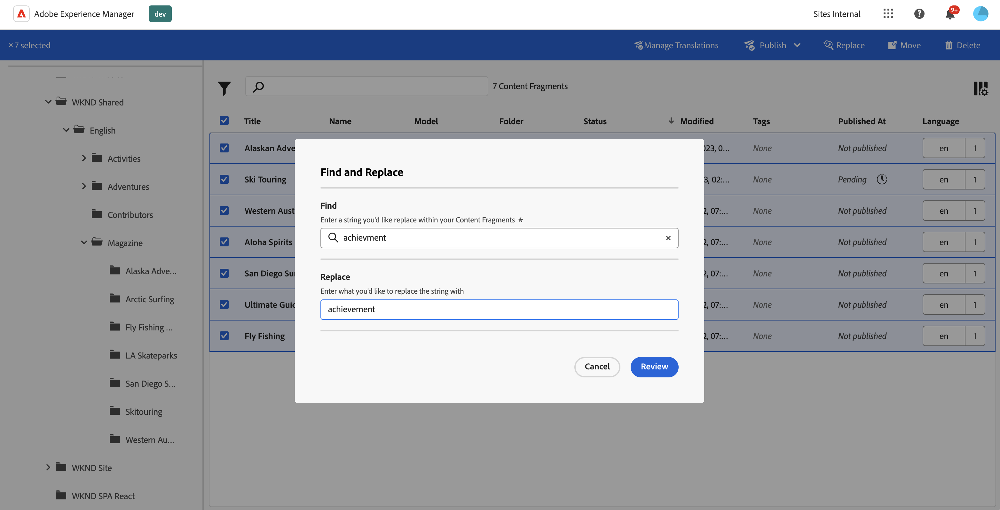
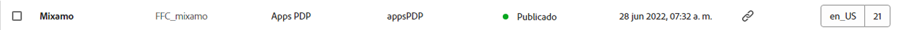
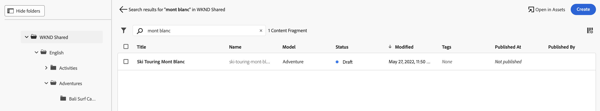

# Administración de los fragmentos de contenido {#managing-content-fragments}

Obtenga información sobre cómo administrar su **Fragmentos de contenido** en Adobe Experience Manager AEM () as a Cloud Service, desde el [Consola Fragmentos de contenido](#content-fragments-console), y [Editor de fragmentos de contenido](/help/sites-cloud/administering/content-fragments/authoring.md#content-fragment-editor). Estos fragmentos de contenido se pueden utilizar como base del contenido sin encabezado o para la creación de páginas.

>[!NOTE]
>
>El equipo del proyecto puede personalizar la consola y el editor si es necesario. Consulte [Personalización de la consola y el editor de fragmentos de contenido](/help/implementing/developing/extending/content-fragments-console-and-editor.md) para obtener más información.

Después de definir su [Modelos de fragmento de contenido](#creating-a-content-model) puede utilizarlas para lo siguiente:

* [Creación de fragmentos de contenido](#creating-a-content-fragment).
* A continuación, abra [Editor de fragmentos de contenido](#opening-the-fragment-editor) hasta [Crear el contenido y administrar las variaciones](#editing-the-content-of-your-fragment).
* [Administrar etiquetas](#manage-tags)
* [Ver y editar las propiedades (metadatos)](#viewing-and-editing-properties)
* [Ver el árbol de la estructura](/help/sites-cloud/administering/content-fragments/authoring.md#structure-tree)

>[!NOTE]
>
>Se pueden utilizar fragmentos de contenido:
>
>* para [Entrega de contenido sin encabezado mediante fragmentos de contenido con GraphQL](/help/sites-cloud/administering/content-fragments/content-delivery-with-graphql.md),
>* al crear páginas; consulte [Creación de páginas con fragmentos de contenido](/help/sites-cloud/authoring/fundamentals/content-fragments.md).

>[!NOTE]
>
>Los fragmentos de contenido se almacenan como **Recursos**. Se administran principalmente desde la consola **Fragmentos de contenido**, pero también se puede administrar desde la consola [Recursos](/help/assets/content-fragments/content-fragments-managing.md).

## La consola Fragmentos de contenido {#content-fragments-console}

La consola Fragmentos de contenido está dedicada a administrar, buscar y crear fragmentos de contenido. Se ha optimizado para su uso en un contexto sin encabezado, pero también se utiliza al crear fragmentos de contenido para su uso en la creación de páginas.

La consola Fragmentos de contenido proporciona acceso directo a los fragmentos y a las tareas relacionadas. Se puede acceder directamente a la consola desde el nivel superior de la navegación global.

Para obtener más información detallada, consulte:

* [Estructura básica y administración de la consola Fragmentos de contenido](#basic-structure-handling-content-fragments-console)

* [La información proporcionada sobre sus fragmentos de contenido](#information-content-fragments)

* [Acciones para un fragmento de contenido en la consola Fragmentos de contenido](#actions-selected-content-fragment)

* [Seleccionar columnas mostradas en la consola](#select-columns-console)

* [Buscar y filtrar en la consola Fragmentos de contenido](#filtering-fragments)

* Una selección de [métodos abreviados del teclado](/help/sites-cloud/administering/content-fragments/keyboard-shortcuts.md) están disponibles para su uso en esta consola

>[!NOTE]
>
>Esta consola solo muestra los fragmentos de contenido. No muestra otros tipos de recursos, como imágenes y vídeos.

>[!CAUTION]
>
>Esta consola es *solamente* disponible en el as a Cloud Service en línea de Adobe Experience Manager AEM ().

### Estructura y gestión básicas de la consola {#basic-structure-handling-content-fragments-console}

Seleccionar **Fragmentos de contenido** abre la consola en una nueva pestaña.

Aquí se pueden ver tres áreas principales:

* La barra de herramientas superior
   * Proporciona funcionalidad AEM estándar
   * También muestra su organización IMS
   * Proporciona varios [acciones](#actions-unselected)
* El panel izquierdo
   * Aquí puede ocultar o mostrar el árbol de carpetas
   * Puede seleccionar una rama específica del árbol
   * Se puede cambiar el tamaño para mostrar carpetas anidadas
* Panel principal/derecho, desde aquí puede hacer lo siguiente:
   * Consulte la lista de todos los fragmentos de contenido en la rama seleccionada del árbol:
      * Se mostrarán los fragmentos de contenido de la carpeta seleccionada y todas las carpetas secundarias:
         * La ubicación se indica mediante las rutas de exploración; también se pueden utilizar para cambiar la ubicación:
      * [Se muestra información sobre cada fragmento](#information-content-fragments)
         * [Puede seleccionar qué columnas mostrar](#select-columns-console)
      * [Varios campos de información](#information-content-fragments) acerca de un fragmento de contenido para proporcionar vínculos; según el campo, pueden realizar lo siguiente:
         * Abrir el fragmento correspondiente en el editor
         * Mostrar información sobre referencias
         * Mostrar información sobre las versiones de idioma del fragmento
      * [Otros campos de información](#information-content-fragments) acerca de un fragmento de contenido se puede utilizar para lo siguiente: [Filtrado rápido](#fast-filtering):
         * Seleccione un valor en la columna y se aplique inmediatamente como filtro
         * Se admite el filtrado rápido para **Modelo**, **Estado**, **Modificado por**, **Etiquetas** y **Publicado por** columnas.
      * Al utilizar el ratón sobre los encabezados de columna, se mostrará un selector de acciones desplegable y controles deslizantes de anchura. Esto le permite lograr lo siguiente:
         * Ordenar: seleccione la acción adecuada, ya sea ascendente o descendente.
Así se ordenará toda la tabla según esa columna. La ordenación solo está disponible en las columnas adecuadas.
         * Cambiar el tamaño de la columna: mediante los controles deslizantes de acción o de anchura
      * Seleccione uno o varios fragmentos para obtener más información [acción](#actions-selected-content-fragment)
   * Utilice el [Buscar](#searching-fragments) caja
   * Abra el [Panel Filtro](#filtering-fragments)

### Acciones {#actions}

Dentro de la consola hay una serie de acciones que puede utilizar, ya sea directamente o después de seleccionar un fragmento específico:

* Varias acciones están [disponibles desde la consola](#actions-unselected) directamente
* Puede [seleccionar uno o varios fragmentos de contenido para mostrar las acciones disponibles](#actions-selected-content-fragment)

#### Acciones (sin seleccionar) {#actions-unselected}

Algunas acciones están disponibles desde la consola, sin seleccionar un fragmento de contenido específico:

* **[Crear](#creating-a-content-fragment)** un nuevo fragmento de contenido
* [Filtrar](#filtering-fragments) los fragmentos de contenido de acuerdo con una selección de predicados y guardar el filtro para uso futuro
* [Buscar](#searching-fragments) los fragmentos de contenido
* [Personalice la vista de tabla para mostrar columnas de información seleccionadas](#select-columns-console)
* Use **Abrir en Recursos** para abrir directamente la ubicación actual en la consola **Recursos**

  >[!NOTE]
  >
  >El **Assets** La consola de se utiliza para acceder a recursos como imágenes, vídeos, etc.  Se puede acceder a esta consola:
  >
  >* usando el vínculo **Abrir en Recursos** (en la consola Fragmentos de contenido)
  >* directamente desde el global **Navegación** cristal

#### Acciones para un fragmento de contenido (seleccionado) {#actions-selected-content-fragment}

Al seleccionar un fragmento específico, se abre una barra de herramientas centrada en las acciones disponibles para dicho fragmento. También puede seleccionar varios fragmentos: la selección de acciones se ajustará en consecuencia.

* **[Abrir en nuevo editor](#editing-the-content-of-your-fragment)**
* **[Abrir](/help/assets/content-fragments/content-fragments-variations.md)** (en el editor original)
* **[Publicación](#publishing-and-previewing-a-fragment)** (y **[Cancelar la publicación](#unpublishing-a-fragment)**)
* **[Administrar etiquetas](#manage-tags)**
* **[Copiar](/help/assets/manage-digital-assets.md)**
* **[Mover](/help/assets/manage-digital-assets.md)**
* **[Cambiar nombre](/help/assets/manage-digital-assets.md)**
* **[Eliminar](#deleting-a-fragment)**
* **[Reemplazar](#find-and-replace)**

>[!NOTE]
>
>Uso **Abrir** para abrir el fragmento seleccionado en la *original* editor.

>[!NOTE]
>
>Acciones como Publicar, Cancelar la publicación, Eliminar, Mover, Cambiar el nombre y Copiar cada déclencheur en un trabajo asincrónico. El progreso de ese trabajo se puede monitorizar a través de la interfaz de usuario de trabajos asincrónicos de AEM.

### La información proporcionada sobre sus fragmentos de contenido {#information-content-fragments}

El panel principal/derecho (vista de tabla) de la consola proporciona una amplia gama de información sobre los Fragmentos de contenido. Algunos elementos también proporcionan vínculos directos a otras acciones o información:

* **Nombre**
   * Proporciona un vínculo para abrir el fragmento en el editor.
* **Modelo**
   * Solo información.
   * Se puede utilizar para [Filtrado rápido](#fast-filtering)
* **Carpeta**
   * Proporciona un vínculo para abrir la carpeta en la consola.
Al pasar el ratón por encima del nombre de la carpeta, se muestra la ruta JCR.
* **Estado**
   * Solo información.
   * Se puede utilizar para [Filtrado rápido](#fast-filtering)
* **Vista previa**
   * Solo información:
      * **Sincronizado**: el fragmento de contenido está sincronizado con los servicios de **Autor** y **Previsualización**.
      * **Fuera de sincronización**: el fragmento de contenido no está sincronizado con los servicios de **Autor** y **Previsualización**. Es necesario **Publicar** para **Previsualizar** para garantizar que las dos instancias vuelvan a estar sincronizadas.
      * en blanco: El fragmento de contenido no existe en el servicio de **Previsualización**.
* **Modificado**
   * Solo información.
* **Modificado por**
   * Solo información.
   * Se puede utilizar para [Filtrado rápido](#fast-filtering).
* **Etiquetas**
   * Solo información.
   * Muestra todas las etiquetas relacionadas con el fragmento de contenido; tanto Principal como cualquier variación.
   * Se puede utilizar para [Filtrado rápido](#fast-filtering).
* **Publicado en**
   * Solo información.
* **Publicado por**
   * Solo información.
   * Se puede utilizar para [Filtrado rápido](#fast-filtering).
* **Referido por**:
   * Proporciona un vínculo que abre un cuadro de diálogo con todas las [referencias principales](#parent-references-fragment)  de ese fragmento; incluida la referencia a fragmentos de contenido, fragmentos de experiencias y páginas. Para abrir una referencia específica, haga clic en **Título** en el cuadro de diálogo.

     

* **Idioma**: indique cualquier [Idioma](#language-copies-fragment) Copias

   * Indica la configuración regional del fragmento de contenido, junto con el número total de eventos locales/[Idioma](#language-copies-fragment)  copias asociadas al fragmento de contenido.

     

   * Seleccione el recuento para abrir un cuadro de diálogo que muestre todas las copias de idioma. Para abrir una copia de idioma específica, haga clic en **Título** en el cuadro de diálogo.

     

## Creación de fragmentos de contenido {#creating-content-fragments}

Antes de crear el fragmento de contenido, se debe crear el modelo de fragmento de contenido subyacente.

### Creación de un modelo de contenido {#creating-a-content-model}

[Modelos de fragmento de contenido](/help/sites-cloud/administering/content-fragments/content-fragment-models.md) debe habilitarse y crearse antes de crear fragmentos de contenido con contenido estructurado.

### Creación de un fragmento de contenido {#creating-a-content-fragment}

Crear un fragmento de contenido:

1. En la consola **Fragmentos de contenido**, seleccione **Crear** (parte superior derecha).

   >[!NOTE]
   >
   >Para que la ubicación del nuevo fragmento esté predefinida, puede desplazarse a la carpeta en la que desee crear el fragmento o especificar la ubicación durante el proceso de creación.

1. El **Fragmento de contenido nuevo** se abre, desde donde puede especificar lo siguiente:

   * **Ubicación** - Completado automáticamente con la ubicación actual, pero puede seleccionar una ubicación diferente si es necesario.
   * **Modelo de fragmento de contenido** : seleccione el modelo que desea utilizar como base del fragmento en la lista desplegable.
   * **Título**
   * **Nombre** - Completado automáticamente en función de **Título**, pero puede editarlo si es necesario.
   * **Descripción**

   

1. Seleccione **Crear** o **Crear y abrir** para mantener la definición.

## Estados de los fragmentos de contenido {#statuses-content-fragments}

Durante su existencia, un fragmento de contenido puede tener varios estados, como se muestra en la variable [Consola de fragmento de contenido](/help/sites-cloud/administering/content-fragments/managing.md#content-fragments-console) y [Editor de fragmentos de contenido](/help/sites-cloud/administering/content-fragments/authoring.md):

* **Nuevo** (gris) Se ha creado un nuevo fragmento de contenido, pero no tiene contenido, ya que nunca se ha editado ni abierto en el editor de fragmentos de contenido.
* **Borrador** (azul) Alguien ha editado o abierto el fragmento de contenido (nuevo) en el Editor de fragmentos de contenido, pero aún no se ha publicado.
* **Publicado** (verde) El fragmento de contenido se ha publicado.
* **Modificado** (naranja) El fragmento de contenido se ha editado después de publicarse (pero antes de publicar la modificación).
* **Sin publicar** (rojo) Se ha cancelado la publicación del fragmento de contenido.

## Edición del contenido del fragmento (y variaciones) {#editing-the-content-of-your-fragment}

>[!IMPORTANT]
>
>Para obtener información detallada, [consulte Creación de fragmentos de contenido](/help/sites-cloud/administering/content-fragments/authoring.md)

Abra el fragmento para su edición:

1. Utilice la consola **Fragmentos de contenido** para desplazarse a la ubicación del fragmento de contenido.
1. Abra el fragmento para editarlo, seleccionando el fragmento y, a continuación, **Abrir en nuevo editor** en la barra de herramientas.

1. Se abrirá el editor de fragmentos. Seleccione el **Variación** puede realizar los cambios según sea necesario (se guardarán automáticamente):

   

## Ver y administrar etiquetas {#manage-tags}

Desde la consola Fragmentos de contenido puede ver cualquier etiqueta aplicada en la variable **Etiquetas** después de asegurarse de que [se muestra la columna](#select-columns-console).

### Administración de etiquetas (consola) {#manage-tags-console}

Para administrar las etiquetas:

1. Vaya a la consola Fragmento de contenido.
1. Seleccione un fragmento de contenido.
1. Seleccionar **Administrar etiquetas** en la barra de herramientas.
1. Utilice el selector de etiquetas para seleccionar las etiquetas que desea aplicar o quitar:

   

1. **Guardar** actualizaciones. Esto le devolverá a la consola.

### Visualización y edición de etiquetas (editor) {#viewing-and-editing-tags}

También puede ver y editar las etiquetas aplicadas a un fragmento utilizando [Propiedades](/help/sites-cloud/administering/content-fragments/authoring.md) pestaña del editor. La información mostrada difiere entre **Principal** y cualquiera **Variaciones**.

## Visualización y edición de propiedades (Editor) {#viewing-and-editing-properties}

Puede ver y editar las propiedades (metadatos) de un fragmento utilizando [Propiedades](/help/sites-cloud/administering/content-fragments/authoring.md) pestaña del editor. La información mostrada difiere entre **Principal** y cualquiera **Variaciones**.

## Publicación y previsualización de un fragmento {#publishing-and-previewing-a-fragment}

Puede publicar los fragmentos de contenido en:

* el **[Servicio de publicación](/help/headless/deployment/architecture.md)**: para acceso público y completo

* el **[Servicio de previsualización](/help/headless/deployment/architecture.md)**: para previsualizar el contenido antes de la disponibilidad completa

  >[!CAUTION]
  >
  >Publicación de fragmentos de contenido en **Servicio de previsualización** solo está disponible desde la consola Fragmentos de contenido; se utiliza la variable **Publish** acción.

  >[!NOTE]
  >
  >Para obtener más información sobre los entornos de vista previa, consulte lo siguiente:
  >
  >* [Administrar entornos](/help/implementing/cloud-manager/manage-environments.md#access-preview-service)
  >* [Configuración de OSGi para el nivel de vista previa](/help/implementing/preview-tier/preview-tier-configuring-osgi.md#configuring-osgi-settings-for-the-preview-tier)
  >* [Depuración de la vista previa mediante Developer Console](/help/implementing/preview-tier/preview-tier-configuring-osgi.md#debugging-preview-using-the-developer-console)

>[!CAUTION]
>
>Si el fragmento se basa en un modelo, debe asegurarse de que [el modelo se ha publicado](/help/sites-cloud/administering/content-fragments/content-fragment-models.md#publishing-a-content-fragment-model).
>
>Si publica un fragmento de contenido para el que el modelo aún no se ha publicado, la lista de selección lo indicará y el modelo se publicará con el fragmento.

### Publicación {#publishing}

Puede publicar los fragmentos de contenido mediante la variable **Publish** opción de:

* la barra de herramientas de [Consola Fragmentos de contenido](#actions-selected-content-fragment)

   * Seleccione uno o varios fragmentos de la lista.

* la barra de herramientas de [Editor de fragmentos de contenido](/help/sites-cloud/administering/content-fragments/authoring.md#content-fragment-editor)

Después de seleccionar el **Publish** acción:

1. Seleccione cualquiera de las siguientes opciones para abrir el cuadro de diálogo correspondiente:

   * **Ahora**: seleccione la opción **Servicio de publicación**, o el **Servicio de previsualización**; después de la confirmación, el fragmento se publicará inmediatamente
   * **Programación**: además del servicio requerido, también puede seleccionar la fecha y la hora de publicación del fragmento

1. Proporcione todos los detalles en el cuadro de diálogo. Por ejemplo, para una solicitud de publicación programada:

   

   >[!NOTE]
   >
   >Si es necesario, se le solicitará que especifique las referencias para publicar. De forma predeterminada, las referencias también se publican en el servicio de previsualización para garantizar que no haya ninguna interrupción en el contenido.

1. Confirme la acción de publicación.

Después de la publicación, el estado del fragmento se actualiza y es visible en el editor y la consola. Si ha especificado una publicación programada, se mostrará información.

>[!NOTE]
>
>Además, cuando [publique una página que utiliza el fragmento](/help/sites-cloud/authoring/fundamentals/content-fragments.md#publishing); el fragmento se enumerará en las referencias de página.

## Cancelación de la publicación de un fragmento {#unpublishing-a-fragment}

Puede cancelar la publicación de fragmentos de contenido:

* la barra de herramientas de [Consola Fragmentos de contenido](#actions-selected-content-fragment)

   * Seleccione uno o varios fragmentos de la lista.

* la barra de herramientas de [Editor de fragmentos de contenido](/help/sites-cloud/administering/content-fragments/authoring.md#content-fragment-editor)

En ambos casos, seleccione **Cancelar publicación** en la barra de herramientas, seguido de **Ahora** o **Programado**.

Cuando se abra el cuadro de diálogo correspondiente, puede seleccionar el servicio adecuado:

>[!NOTE]
>
>La acción **Cancelar la publicación** solo estará visible cuando los fragmentos publicados estén disponibles.

>[!CAUTION]
>
>Si ya se hace referencia al fragmento desde otro fragmento o desde una página, verá un mensaje de advertencia y será necesario para confirmar que desea continuar.

## Buscar y reemplazar {#find-and-replace}

El **Reemplazar** La acción está disponible (en la barra de herramientas superior) para buscar y reemplazar el texto especificado en los fragmentos de contenido seleccionados.

Antes del reemplazo, se comprueban los criterios de validación y se le informa de cualquier conflicto, lo que le permite cambiar la cadena de reemplazo o reemplazar únicamente las instancias validadas.

>[!NOTE]
>
>La acción de buscar y reemplazar solo se puede realizar en un máximo de 20 fragmentos de contenido seleccionados (a la vez).
>
>Si selecciona más de 20 fragmentos de contenido, verá el mensaje **No se puede encontrar y reemplazar**.

## Eliminación de un fragmento {#deleting-a-fragment}

Para eliminar un fragmento:

1. En la consola **Fragmentos de contenido** vaya a la ubicación del fragmento de contenido.
1. Seleccione el fragmento.
1. En la barra de herramientas, seleccione **Eliminar**.
1. Confirme la acción **Eliminar**.

>[!NOTE]
>
>El **Eliminar** no está disponible para fragmentos que se hayan publicado, primero se debe cancelar su publicación.

## Búsqueda de referencias principales de su fragmento {#parent-references-fragment}

Se puede acceder a los detalles de las referencias principales desde el

* **Referencias** de la consola Fragmentos de contenido
* el [vínculo de referencias principales en la barra de herramientas superior del editor de fragmentos de contenido](/help/sites-cloud/administering/content-fragments/authoring.md#view-parent-references)

Ambos proporcionan un vínculo que abre un cuadro de diálogo con todas las referencias principales de ese fragmento; incluida la referencia a fragmentos de contenido, fragmentos de experiencias y páginas. Para abrir una referencia específica, haga clic en **Título**, o el icono de vínculo, en el cuadro de diálogo.

Por ejemplo:

## Búsqueda de copias de idioma del fragmento {#language-copies-fragment}

Se puede acceder a los detalles de las copias de idioma desde:

* el **Idioma** de la columna [Consola Fragmentos de contenido](#information-content-fragments)
* el [Pestaña Copias de idioma del editor de fragmentos de contenido](/help/sites-cloud/administering/content-fragments/authoring.md#view-language-copies)

El icono indica la configuración regional del fragmento de contenido, junto con el número total de configuraciones regionales o copias de idioma asociadas al fragmento de contenido. Por ejemplo, desde la consola:

Seleccione el recuento para abrir un cuadro de diálogo que muestre todas las copias de idioma. Para abrir una copia de idioma específica, haga clic en **Título** en el cuadro de diálogo.

## Seleccionar columnas mostradas en la consola {#select-columns-console}

Al igual que con otras consolas, puede configurar las columnas que son visibles y están disponibles para la acción:

Se mostrará una lista de columnas que puede ocultar o mostrar:

## Filtrado de fragmentos {#filtering-fragments}

El panel Filtro ofrece lo siguiente:

* una selección de predicados;
   * incluyendo modelos de fragmentos de contenido, localización, etiquetas, campos de estado, entre otros
   * se pueden seleccionar uno o más predicados y combinarlos para crear el filtro
* la oportunidad de **Guardar** su configuración
* la opción recuperar un filtro de búsqueda guardada para reutilizarlo

Una vez seleccionada, la variable **Filtrado por** Las opciones de se muestran (debajo del cuadro Buscar ). Se pueden anular las selecciones desde allí. Por ejemplo:

### Filtrado rápido {#fast-filtering}

También puede seleccionar un predicado haciendo clic en un valor de columna específico de la lista. Puede seleccionar uno o más valores para combinar predicados.

Por ejemplo, seleccione **Publicado** en la columna **Estado**:

>[!NOTE]
>
>El filtrado rápido solo es compatible con **Modelo**, **Estado**, **Modificado por**, **Etiquetas**, y **Publicado por** columnas.

Cuando se seleccione, aparecerá como un predicado de filtro y la lista se filtrará según corresponda:

## Búsqueda de fragmentos {#searching-fragments}

El cuadro de búsqueda admite la búsqueda de texto completo. Introducción de los términos de búsqueda en el cuadro de búsqueda:

Proporcionará los resultados seleccionados:

El cuadro de búsqueda también proporciona acceso rápido a **Fragmentos de contenido recientes** y **Búsquedas guardadas**:

