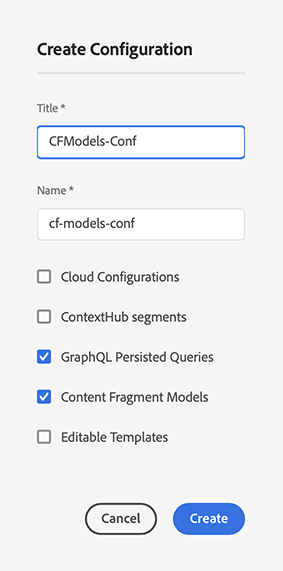

# Fragmentos de contenido: configuración {#content-fragments-setup}

Los fragmentos de contenido de Adobe Experience Manager (AEM) as a Cloud Service le permiten preparar contenido listo para usar en varias ubicaciones y en varios canales. Esto es ideal para la entrega sin encabezado y la creación de páginas.

Para habilitar la instancia para la funcionalidad de fragmento de contenido, debe habilitar lo siguiente:

* **Modelos de fragmentos de contenido**: obligatorio

  >[!CAUTION]
  >
  >Si no habilita **Modelos de fragmentos de contenido**:
  >
  >* la opción **Crear** no estará disponible para crear modelos.
  >* no podrá [seleccionar la configuración de Sites para crear el punto de conexión relacionado](/help/headless/graphql-api/graphql-endpoint.md).

* **Consultas persistentes de GraphQL**: opcional

La configuración de la instancia ha finalizado:

* al [habilitar la funcionalidad en el Explorador de configuración](#enable-content-fragment-functionality-configuration-browser)
* a continuación, [aplicando la configuración a sus carpetas individuales de Assets](#apply-the-configuration-to-your-folder)

>[!TIP]
>
>Los fragmentos de contenido se pueden [publicar en Edge Delivery Services.](https://www.aem.live/developer/content-fragment-overlay)

## Habilitar la funcionalidad de fragmento de contenido en el explorador de configuración {#enable-content-fragment-functionality-configuration-browser}

Para usar la funcionalidad de fragmento de contenido, de los modelos de fragmento de contenido y de las consultas persistentes de GraphQL, **debe** habilitarlos primero a través de **Explorador de configuración**:

>[!NOTE]
>
>Para obtener más información, consulte [Explorador de configuración](/help/implementing/developing/introduction/configurations.md#using-configuration-browser).

>[!NOTE]
>
>[Subconfiguraciones](/help/implementing/developing/introduction/configurations.md#configuration-resolution) (una configuración anidada dentro de otra configuración) es totalmente compatible para su uso con fragmentos de contenido, modelos de fragmentos de contenido y consultas de GraphQL.
>
>Solo tenga en cuenta lo siguiente:
>
>* Después de crear modelos en una subconfiguración, NO es posible mover o copiar el modelo a otra subconfiguración.
>
>* Un extremo de GraphQL (aún) se basará en una configuración principal (raíz).
>
>* Las consultas persistentes se guardarán (aún) de forma relevante para la configuración principal (raíz).

1. Vaya a **Herramientas**, **General**, luego abra el **Explorador de configuración**.

1. Use **Crear** para abrir el cuadro de diálogo, donde:

   1. Especifique un **Título**.
   1. Tras la creación, **Name** se convierte en el nombre de nodo en el repositorio.
Puede introducir un nombre. Si deja el campo en blanco, se generará automáticamente basándose en el título y, a continuación, se ajustará según [las convenciones de nomenclatura de AEM](/help/implementing/developing/introduction/naming-conventions.md); puede ajustar el resultado si es necesario.
   1. Para habilitar su uso, seleccione
      * **Modelos de fragmentos de contenido**
      * **Consultas persistentes de GraphQL**

      

1. Seleccione **Crear** para guardar la definición.

## Aplicar la configuración a la carpeta {#apply-the-configuration-to-your-folder}

Cuando la configuración **global** está habilitada para la funcionalidad de fragmento de contenido, se aplica a cualquier carpeta de Assets, accesible a través de la consola **Assets**.

Para utilizar otras configuraciones (excluyendo, por lo tanto, las globales) con una carpeta de Assets comparable, debe definir la conexión. Para ello, seleccione la **configuración** adecuada en la ficha **Cloud Services** de las **propiedades de carpeta** de la carpeta apropiada.

