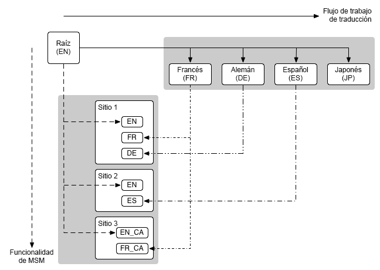

# Traducción y Administrador de varios sitios {#msm-and-translation}

Las herramientas de traducción y Administrador de varios sitios integradas de Adobe Experience Manager simplifican la localización del contenido.

* El Administrador de varios sitios (MSM) y sus funciones de Live Copy le permiten utilizar el mismo contenido del sitio en varias ubicaciones, a la vez que permiten variaciones:
   * [Reutilización del contenido: administrador de varios sitios y Live Copy](msm/overview.md)
* La traducción permite automatizar la traducción del contenido de la página para crear y mantener sitios web multilingües:
   * [Traducción de contenido para sitios multilingües](translation/overview.md)

Estas dos funciones se pueden combinar para adaptarse a los sitios web que son [multinacionales y multilingües](#multinational-and-multilingual-sites).

>[!TIP]
>
>Si acaba de empezar a traducir contenido, consulte el [Recorrido de traducción de Sites](/help/journey-sites/translation/overview.md). Es una ruta guiada a través de la traducción del contenido de AEM Sites mediante herramientas de traducción potentes de AEM; ideal si no tiene experiencia en traducción o en AEM.

## Sitios multinacionales y multilingües {#multinational-and-multilingual-sites}

Puede crear contenido de forma eficaz para sitios multinacionales y multilingües mediante el uso combinado de Administrador de varios sitios y el flujo de trabajo de traducción.

Normalmente, se crea un sitio principal en un idioma y para un país específico y, a continuación, se utiliza ese contenido como base para los demás sitios, y se traduce lo que sea necesario.

1. [Traduzca](translation/overview.md) el sitio principal a diferentes idiomas.
1. Use el [Administrador de varios sitios](msm/overview.md) para lo siguiente:
   1. Reutilice el contenido del sitio principal y sus traducciones para crear sitios para otros países y culturas.
   1. Cuando sea necesario, desasocie elementos de Live Copies para añadir detalles de localización.

>[!TIP]
>
>Limite el uso del Administrador de varios sitios al contenido en un idioma.
>
>Por ejemplo, use el sitio principal en inglés para crear la versión en inglés de las páginas para los EE. UU., Canadá, Reino Unido, etc. A continuación, utilice el francés principal para crear la versión en francés de las páginas para Francia, Suiza, Canadá, etc.

El diagrama siguiente ilustra cómo se cruzan los conceptos principales (pero no muestra todos los niveles/elementos implicados):

En este escenario, y en otros comparables, MSM no administra las diferentes versiones lingüísticas como tal.

* [MSM](msm/overview.md) administra la implementación del contenido traducido de un modelo (es decir, un maestro global) en Live Copies (es decir, los sitios locales), dentro de los límites de un idioma.
* Las funciones de integración de [traducciones](translation/overview.md) de AEM, junto con los servicios de administración de traducciones de terceros, administran los diferentes idiomas y traducen el contenido a estos.

Para casos de uso más avanzados, también se puede usar MSM en los idiomas principales.

>[!TIP]
>
>Para todos los casos de uso, se recomienda leer las siguientes prácticas recomendadas:
>
>* [Prácticas recomendadas para MSM](msm/best-practices.md)
>* [Prácticas recomendadas para la traducción](translation/best-practices.md)
