# Creación y sincronización de Live Copies {#creating-and-synchronizing-live-copies}

Puede crear una Live Copy a partir de una página o configuración de modelo para reutilizar ese contenido en el sitio. Administre la herencia y la sincronización, puede controlar cómo se propagan los cambios al contenido.

## Administración de configuraciones de modelo {#managing-blueprint-configurations}

Una configuración de modelo identifica un sitio web existente que desea usar como fuente para una o varias páginas de Live Copy.

>[!TIP]
>
>Las configuraciones del modelo permiten insertar cambios en el contenido en Live Copies. Consulte [Live Copies: configuraciones de origen, modelos y modelo](overview.md#source-blueprints-and-blueprint-configurations).

Al crear una configuración de modelo, se selecciona una plantilla que define la estructura interna del modelo. La plantilla de modelo predeterminada supone que el sitio web de origen tiene las siguientes características:

* El sitio web tiene una página raíz.
* Las páginas secundarias inmediatas de la raíz son ramas de idioma del sitio web. Al crear una Live Copy, los idiomas se presentan como contenido opcional para incluirlos en la copia.
* La raíz de cada rama de idioma tiene una o más páginas secundarias. Al crear una Live Copy, se presentan las páginas secundarias para que pueda incluirlas en la Live Copy.

>[!NOTE]
>
>Una estructura diferente requiere una plantilla de modelo diferente.

Después de crear la configuración de modelo, configure las siguientes propiedades:

* **Nombre**: Nombre de la configuración del modelo
* **Ruta de origen**: Ruta de la página raíz del sitio que está utilizando como origen (modelo)
* **Descripción**. (Opcional) Descripción de la configuración del modelo, que aparece en la lista de configuraciones de modelo para elegir al crear un sitio

Cuando se utiliza la configuración del modelo, puede asociarla con una configuración de despliegue que determina cómo se sincronizan las Live Copies del origen/modelo. Consulte [Especificación de las configuraciones de despliegue que se van a utilizar](live-copy-sync-config.md#specifying-the-rollout-configurations-to-use).

### Creación y edición de configuraciones de modelo {#creating-editing-blueprint-configurations}

Las configuraciones del modelo se consideran datos inmutables y, como tales, no se pueden editar durante la ejecución. Por este motivo, cualquier cambio en la configuración debe implementarse mediante Git utilizando la canalización CI/CD.

Encontrará más información en el artículo [Cambios importantes en Adobe Experience Manager (AEM) as a Cloud Service](/help/release-notes/aem-cloud-changes.md).

Los siguientes pasos están disponibles para un administrador en una instancia de desarrollo local solo para fines de prueba y desarrollo. Estas opciones no están disponibles en ninguna instancia de nube AEMaaCS.

#### Creación de una configuración de modelo localmente {#creating-a-blueprint-configuration}

Para crear una configuración de modelo:

1. [Navegar](/help/sites-cloud/authoring/basic-handling.md#global-navigation) al menú **Herramientas** y, a continuación, seleccione el menú **Sitios**.
1. Seleccione **Modelos** para abrir la consola **Configuraciones del modelo**:

   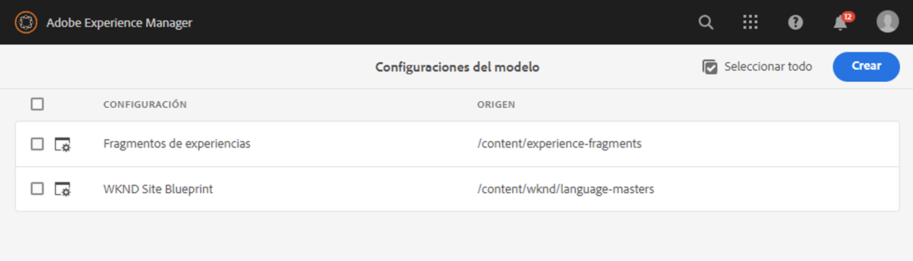

1. Seleccione **Crear**.
1. Seleccione la plantilla de modelo y, a continuación, **Siguiente** para continuar.
1. Seleccione la página de origen que se utilizará como modelo; a continuación, **Siguiente** para continuar.
1. Definir:

   * **Título**: título obligatorio para el modelo.
   * **Descripción**: una descripción opcional para proporcionar más detalles.

1. **Crear** creará la configuración del modelo en función de su especificación.

### Edición o eliminación de una configuración de modelo localmente{#editing-or-deleting-a-blueprint-configuration}

Puede editar o eliminar una configuración de modelo existente:

1. [Navegar](/help/sites-cloud/authoring/basic-handling.md#global-navigation) al menú **Herramientas** y, a continuación, seleccione el menú **Sitios**.
1. Seleccione **Modelos** para abrir la consola **Configuraciones del modelo**:

   

1. Seleccione la configuración del modelo necesaria: las acciones adecuadas están disponibles en la barra de herramientas:

   * **Propiedades**; puede utilizarlo para ver y luego editar las propiedades de la configuración.
   * **Eliminar**

## Creación de una Live Copy {#creating-a-live-copy}

Existen varias formas de crear una Live Copy.

### Creación de la Live Copy de una página {#creating-a-live-copy-of-a-page}

Puede crear una Live Copy de cualquier página o rama. Al crear la Live Copy, puede especificar las configuraciones de despliegue que se utilizarán para sincronizar el contenido:

* Las configuraciones de despliegue seleccionadas se aplican a la página de Live Copy y a sus páginas secundarias.
* Si no especifica ninguna configuración de despliegue, MSM determina qué configuraciones de despliegue usar. Consulte [Especificación de la configuración de despliegue que se va a utilizar](live-copy-sync-config.md#specifying-the-rollout-configurations-to-use).

Puede crear una Live Copy de cualquier página:

* Páginas a las que se hace referencia mediante una [configuración de modelo](#creating-a-blueprint-configuration)
* Y páginas que no tienen conexión con una configuración
* Live Copy dentro de las páginas de otra Live Copy ([Live Copies anidadas](overview.md#nested-live-copies))

La única diferencia es que la disponibilidad del comando **Despliegue** en las páginas de origen/modelo depende de si una configuración de modelo hace referencia al origen:

* Si crea la Live Copy a partir de una página de origen a la que **se** hace referencia en una configuración de modelo, el comando Despliegue está disponible en las páginas de origen/modelo.
* Si crea una Live Copy a partir de una página de origen que **no es** en una configuración de modelo, el comando Despliegue no estará disponible en las páginas de origen/modelo.

Para crear una Live Copy:

1. En la consola **Sites**, seleccione **Crear** y luego **Live Copy**.

   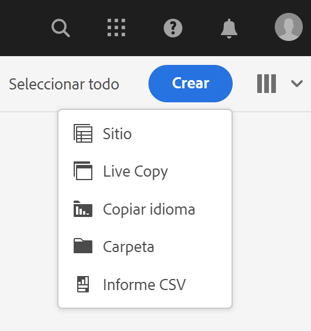

1. Seleccione la página de origen y luego seleccione **Siguiente**. Por ejemplo:

   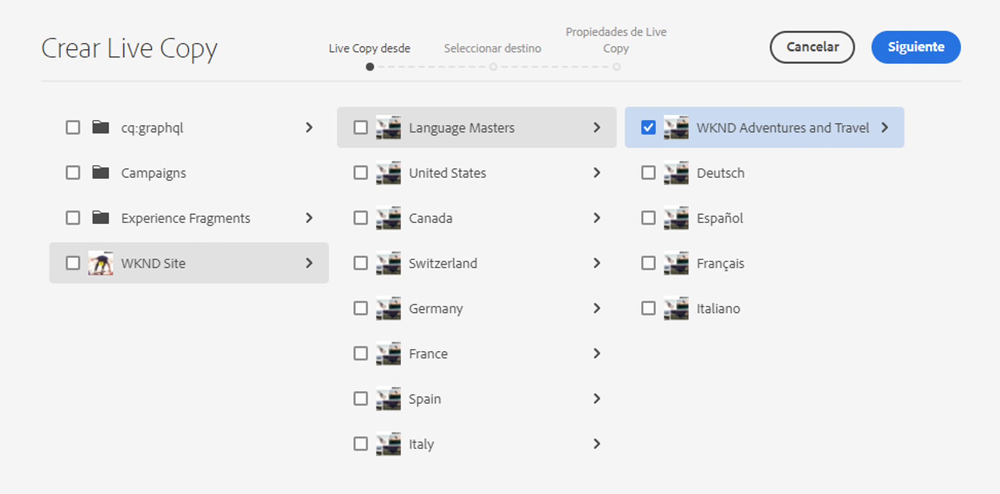

1. Especifique la ruta de destino de Live Copy (abra la carpeta o página principal de Live Copy) y, a continuación, seleccione **Siguiente**.

   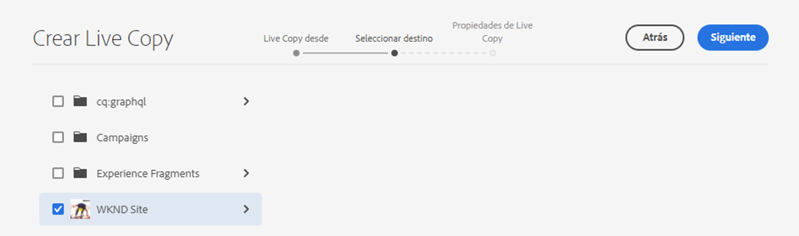

   >[!NOTE]
   >
   >La ruta de destino no puede estar dentro de la ruta de origen.

1. Escriba

   * un **Título** para la página.
   * un **Nombre** que se utilizará en la dirección URL.

   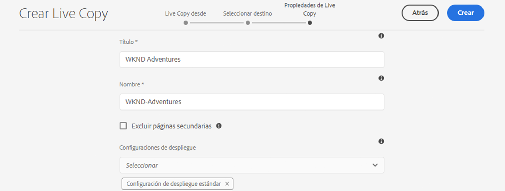

1. Utilice la casilla de verificación **Excluir páginas secundarias**:

   * Seleccionado: crear una Live Copy solo de la página seleccionada (Live Copy superficial)
   * No seleccionado: crear una Live Copy que incluya todos los descendientes de la página seleccionada (Live Copy profundo)

1. (Opcional) Para especificar una o más configuraciones de despliegue que se utilizarán para Live Copy, utilice la lista desplegable **Configuración de lanzamiento** para seleccionarlas. Las configuraciones seleccionadas se muestran debajo del selector desplegable.
1. Seleccione **Crear**. Se muestra un mensaje de confirmación, desde el que puede seleccionar una de las opciones siguientes: **Apertura** o **Listo**.

   >[!NOTE]
   >
   >Puede aparecer un cuadro de diálogo de error con el mensaje &quot;Error al enviar el formulario&quot;. Esto sucede debido a un tiempo de espera de la red. Sin embargo, el proceso para crear la Live Copy se está ejecutando en segundo plano. Espere unos minutos y compruebe que las páginas de la Live Copy se han creado correctamente.

### Creación de una Live Copy de un sitio a partir de una configuración de modelo {#creating-a-live-copy-of-a-site-from-a-blueprint-configuration}

Cree una Live Copy con una configuración de modelo para crear un sitio basado en el contenido del modelo (origen). Cuando crea una Live Copy a partir de una configuración de modelo, selecciona una o varias ramas de idioma del origen del modelo que desea copiar y, a continuación, selecciona los capítulos que desea copiar de las ramas de idioma. Consulte [Creación de una configuración de modelo](#creating-a-blueprint-configuration).

Si omite algunas ramas de idioma de Live Copy, puede agregarlas más adelante. Consulte [Creación de una Live Copy dentro de una Live Copy (configuración de modelo)](#creating-a-live-copy-inside-a-live-copy-blueprint-configuration) para obtener más información.

>[!CAUTION]
>
>Cuando el origen del modelo contiene vínculos y referencias que dirigen un párrafo a una rama diferente, los destinatarios no se actualizan en las páginas de Live Copy, sino que siguen apuntando al destino original.

Cuando cree el sitio, proporcione valores para las siguientes propiedades:

* **Idiomas iniciales**: las ramas de idioma del origen del modelo que se incluirán en Live Copy.
* **Capítulos iniciales**: las páginas secundarias de las ramas de idioma del modelo que se incluirán en Live Copy.
* **Ruta de destino**: la ubicación de la página raíz del sitio de Live Copy.
* **Título**: título de la página raíz del sitio de Live Copy.
* **Nombre**(opcional): el nombre del nodo JCR que almacena la página raíz de Live Copy (el valor predeterminado se basa en el título).
* **Propietario del sitio**(opcional): información sobre la parte responsable de Live Copy.
* **Live Copy**: seleccione esta opción para establecer una relación activa con el sitio de origen. Si no selecciona esta opción, se crea una copia del modelo, pero no se sincroniza posteriormente con el origen.
* **Configuración de despliegue**: (Opcional) Seleccione una o varias opciones de configuración de despliegue para sincronizar Live Copy. De forma predeterminada, las configuraciones de despliegue se heredan del modelo. Consulte [Especificación de las configuraciones de despliegue que se van a utilizar](live-copy-sync-config.md#specifying-the-rollout-configurations-to-use) para obtener más información.

Para crear una Live Copy de un sitio a partir de una configuración de modelo:

1. En la consola **Sites**, seleccione **Crear**, a continuación **Sitio** en el selector desplegable.
1. Seleccione la configuración de modelo que se utilizará como origen de Live Copy y continúe con **Siguiente**:

   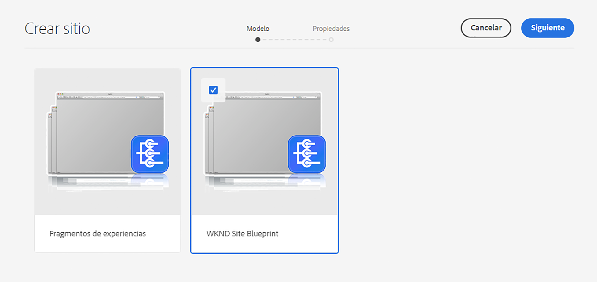

1. Utilice el selector **Idiomas iniciales** para especificar los idiomas del sitio del modelo que se usarán para Live Copy.

   Todos los idiomas disponibles están seleccionados de forma predeterminada. Para quitar un idioma, seleccione el **X** que aparece junto al idioma.

   Por ejemplo:

   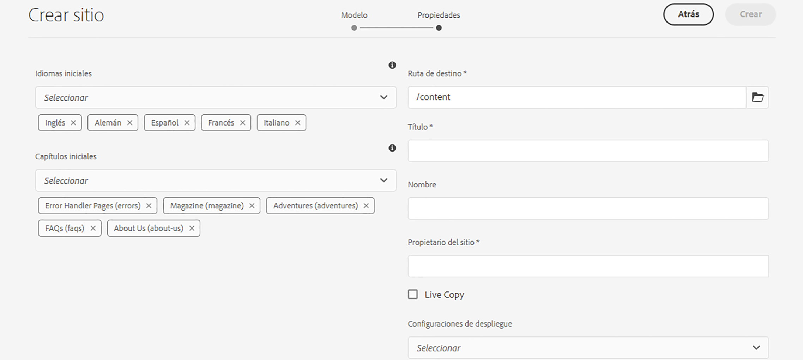

1. Utilice el desplegable **Capítulos iniciales** para seleccionar las secciones del modelo que desea incluir en Live Copy. Todos los capítulos disponibles se incluyen de forma predeterminada, pero se pueden eliminar.
1. Proporcione valores para las propiedades restantes y seleccione **Crear**. En el cuadro de diálogo de confirmación, seleccione **Listo** para volver a la consola **Sitios** o **Abrir sitio** para abrir la página raíz del sitio.

### Creación de una Live Copy dentro de una Live Copy (configuración de modelo) {#creating-a-live-copy-inside-a-live-copy-blueprint-configuration}

Cuando crea una Live Copy dentro de la Live Copy existente (creada con una configuración de modelo), puede insertar cualquier copia de idioma o capítulos que no se incluyeron cuando se creó originalmente la Live Copy.

## Monitorización de Live Copy {#monitoring-your-live-copy}

### Ver el estado de una Live Copy {#seeing-the-status-of-a-live-copy}

Las propiedades de una página Live Copy muestran la siguiente información sobre Live Copy:

* **Fuente**: La página de origen de la página Live Copy
* **Estado**: El estado de sincronización de Live Copy, que incluye si Live Copy está actualizado con el origen, cuándo se produjo la última sincronización y quién realizó la sincronización
* **Configuración**:

   * Si la página sigue estando sujeta a la herencia de Live Copy
   * Si la configuración se hereda de la página principal
   * Cualquier configuración de despliegue que utilice Live Copy

Para ver las propiedades:

1. En la consola **Sitios**, seleccione la página Live Copy y abra las propiedades.
1. Seleccione la pestaña **Live Copy**.

   Por ejemplo:

   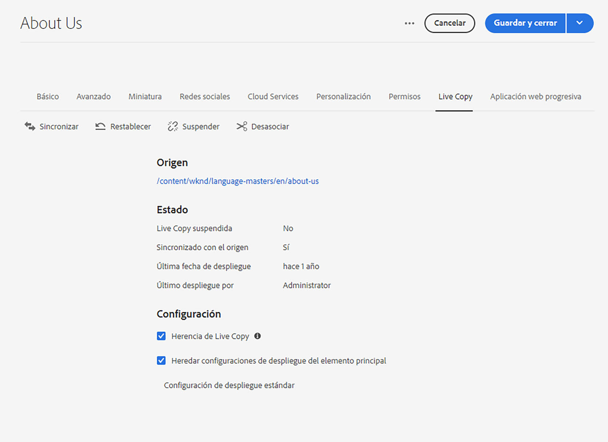

   Consulte la sección [Información general sobre el uso de Live Copy](live-copy-overview.md#using-the-live-copy-overview) en el artículo Consola de información general de Live Copy para obtener más información.

### Ver las Live Copies de una página de modelo {#seeing-the-live-copies-of-a-blueprint-page}

Las páginas de modelo (a las que se hace referencia en una configuración de modelo) proporcionan una lista de las páginas de Live Copy que utilizan la página actual (modelo) como origen. Utilice esta lista para realizar un seguimiento de las Live Copies. La lista aparece en la ficha **Modelo** de las [propiedades de página.](/help/sites-cloud/authoring/sites-console/page-properties.md)

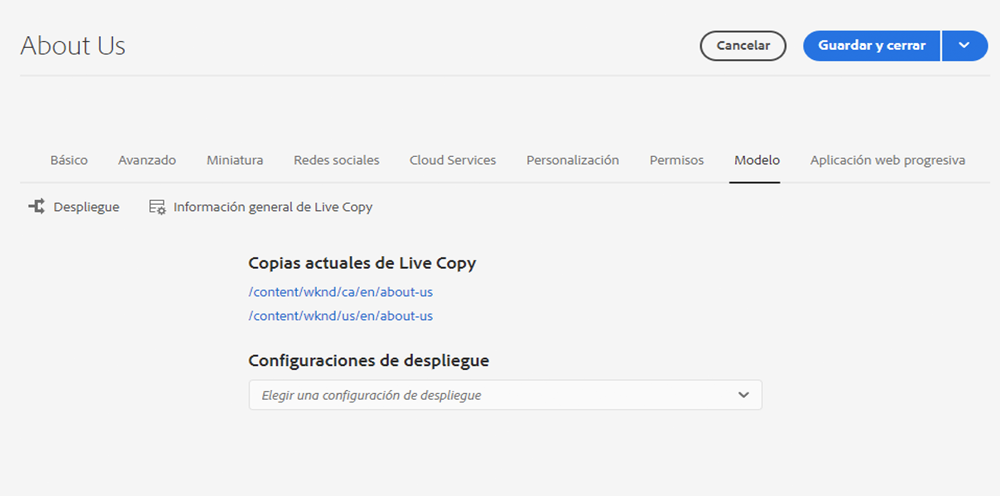

## Sincronización de Live Copy {#synchronizing-your-live-copy}

Existen varias formas de sincronizar su Live Copy.

### Despliegue de un modelo {#rolling-out-a-blueprint}

Despliegue una página de modelo para insertar los cambios de contenido en Live Copies. Una acción de **Despliegue** ejecuta las configuraciones de despliegue que utilizan el activador [En el despliegue](live-copy-sync-config.md#rollout-triggers).

>[!NOTE]
>
>Pueden producirse conflictos si se crean nuevas páginas con el mismo nombre de página en la rama del modelo y en una rama de Live Copy dependiente.
>
>Tales [conflictos deben gestionarse y resolverse en el momento del despliegue](rollout-conflicts.md).

#### Despliegue de un modelo desde las propiedades de página {#rolling-out-a-blueprint-from-page-properties}

1. En la consola **Sitios**, seleccione la página en el modelo y abra las propiedades.
1. Abra la pestaña **Modelo**.
1. Seleccione **Despliegue**.

   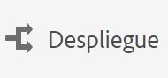

1. Especifique las páginas y las páginas secundarias y, a continuación, confirme con la marca de verificación:

   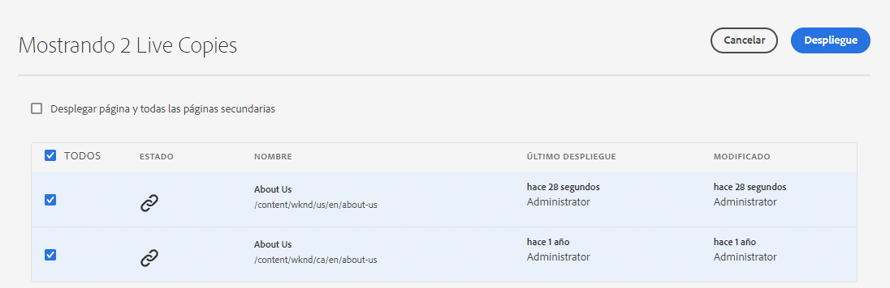

1. Especifique si el trabajo de despliegue debe ejecutarse inmediatamente (**Ahora**) o en otra fecha u hora (**Más tarde**).

   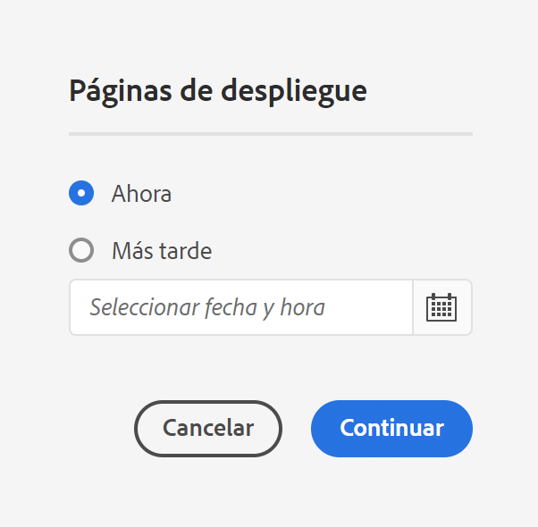

Los despliegues se procesan como trabajos asincrónicos y se pueden comprobar en la página [***Estado de trabajos asincrónicos**](/help/operations/asynchronous-jobs.md#monitor-the-status-of-asynchronous-operations).

#### Despliegue un modelo desde el carril de referencia {#roll-out-a-blueprint-from-the-reference-rail}

1. En la consola **Sitios**, seleccione la página en la Live Copy y abra el panel **[Referencias](/help/sites-cloud/authoring/basic-handling.md#references)** (de la barra de herramientas).
1. Seleccione la opción **Modelo** de la lista, para mostrar los modelos asociados con esta página.
1. Seleccione el modelo requerido de la lista.
1. Seleccione **Despliegue**.

   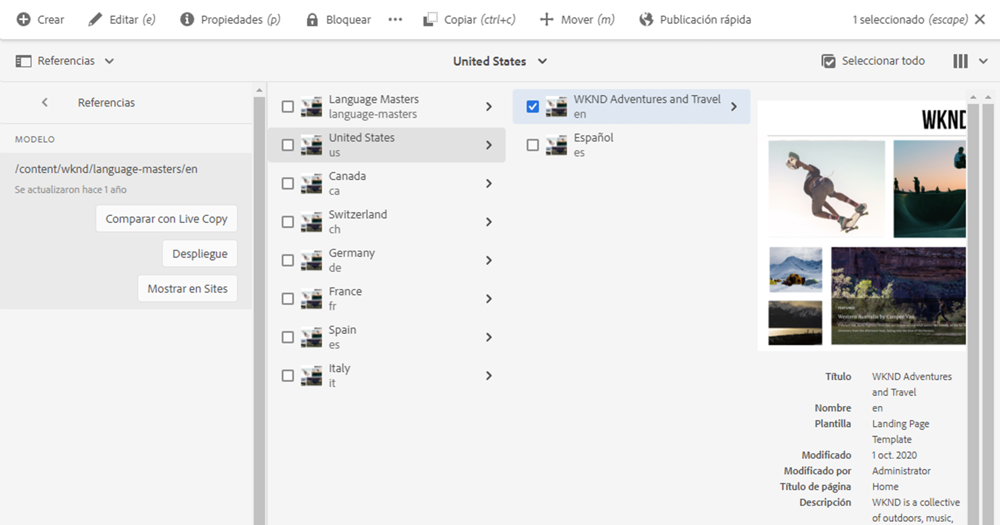

1. Se le pide que confirme los detalles del despliegue:

   * **Ámbito de despliegue**:

     Especifique si el ámbito es solo para la página seleccionada o si debe incluir las subpáginas.

   * **Programa**:

     Especifique si el trabajo de despliegue debe ejecutarse de inmediato (**Ahora**) o en una fecha u hora posterior (**Más tarde**).

     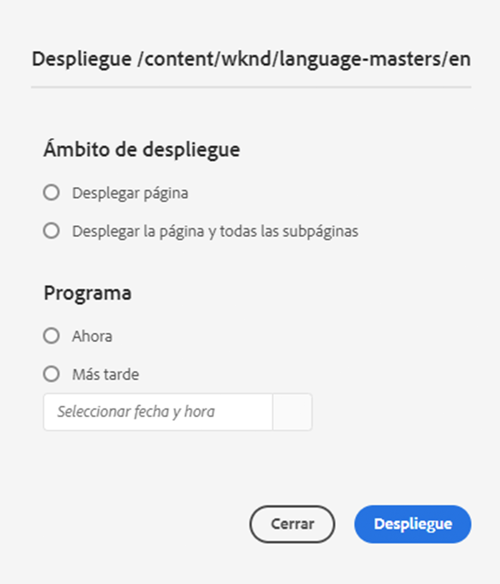

1. Después de confirmar estos detalles, seleccione **Despliegue** para llevar a cabo la acción.

Los despliegues se procesan como trabajos asincrónicos y se pueden comprobar en la página [**Estado de trabajos asincrónicos**](/help/operations/asynchronous-jobs.md#monitor-the-status-of-asynchronous-operations).

#### Despliegue de un modelo desde la información general de Live Copy {#roll-out-a-blueprint-from-the-live-copy-overview}

La acción [**Despliegue** también está disponible en la Información general de Live Copy](live-copy-overview.md#using-the-live-copy-overview), cuando se selecciona una página de modelo.

1. Abra la [Información general de Live Copy](live-copy-overview.md#using-the-live-copy-overview) y seleccione una página de modelo.
1. En la barra de herramientas, seleccione **Despliegue**.

   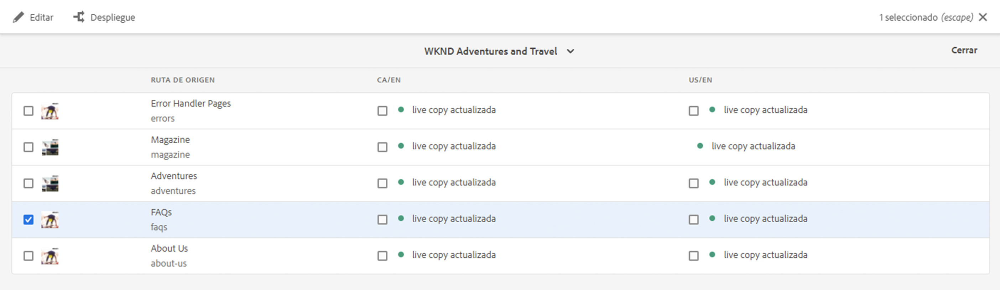

1. Especifique las páginas y las páginas secundarias y, a continuación, confirme con la marca de verificación:

   

1. Especifique si el trabajo de despliegue debe ejecutarse de inmediato (**Ahora**) o en otra fecha u hora (**Más tarde**).

   

Los despliegues se procesan como trabajos asincrónicos y se pueden comprobar en la página [**Estado de trabajos asincrónicos**](/help/operations/asynchronous-jobs.md#monitor-the-status-of-asynchronous-operations).

### Creación de una Live Copy {#synchronizing-a-live-copy}

Sincronice una página Live Copy para extraer los cambios de contenido del origen a Live Copy.

#### Sincronización de una Live Copy desde Propiedades de página {#synchronize-a-live-copy-from-page-properties}

Sincronice una Live Copy para extraer cambios del origen a la Live Copy.

>[!NOTE]
>
>La sincronización ejecuta las configuraciones de despliegue que utilizan el activador [En el despliegue](live-copy-sync-config.md#rollout-triggers).

1. En la consola **Sitios**, seleccione la página Live Copy y abra las propiedades.
1. Abra la pestaña **Live Copy**.
1. Seleccione **Sincronizar**.

   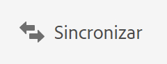

   Se solicitará una confirmación. Use **Sincronizar** para continuar.

#### Sincronización de una Live Copy desde la Información general de Live Copy {#synchronize-a-live-copy-from-the-live-copy-overview}

La [acción Sincronizar también está disponible en la Información general de Live Copy](live-copy-overview.md#using-the-live-copy-overview), cuando se seleccione una página Live Copy.

1. Abra la [Información general de Live Copy](live-copy-overview.md#using-the-live-copy-overview) y seleccione una página Live Copy.
1. En la barra de herramientas, seleccione **Sincronizar**.
1. Confirme la acción **Despliegue** después de especificar si desea incluir lo siguiente:

   * **Página y páginas secundarias**
   * **Página solamente**

   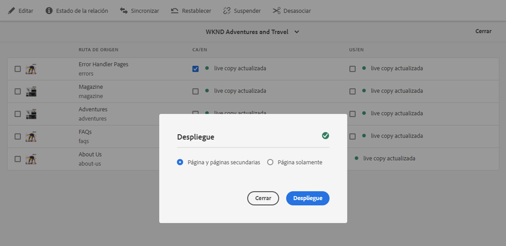

## Cambio del contenido de Live Copy {#changing-live-copy-content}

Para cambiar el contenido de Live Copy, puede hacer lo siguiente:

* Añadir párrafos a la página.
* Actualizar el contenido existente al romper la herencia de Live Copy para cualquier página o componente.

>[!TIP]
>
>Si crea manualmente una página en Live Copy, la nueva página es local para Live Copy, lo que significa que no tiene una página de origen correspondiente a la que esté adjunta.
>
>La práctica recomendada para crear una página local que forme parte de la relación es crear la página local en el origen y llevar a cabo un despliegue profundo. Esto creará la página localmente como Live Copies.

>[!NOTE]
>
>Pueden producirse conflictos si se crean nuevas páginas con el mismo nombre de página en la rama del modelo y en una rama de Live Copy dependiente.
>
>Tales [conflictos deben gestionarse y resolverse en el momento del despliegue](rollout-conflicts.md).

### Adición de componentes a una página Live Copy {#adding-components-to-a-live-copy-page}

Puede añadir componentes a una página Live Copy en cualquier momento. El estado de herencia de Live Copy y su sistema de párrafos no controla la capacidad de añadir componentes.

Cuando la página Live Copy se sincroniza con la página de origen, los componentes añadidos permanecen inalterados. Consulte también [Cambio del orden de los componentes en una página Live Copy](#changing-the-order-of-components-on-a-live-copy-page).

>[!TIP]
>
>Los cambios ejecutados localmente en un componente marcado como contenedor no se sobrescribirán con el contenido del modelo en un despliegue. Consulte las [Prácticas recomendadas de MSM](best-practices.md#components-and-container-synchronization) para obtener más información.

### Suspensión de la herencia de una página {#suspending-inheritance-for-a-page}

Cuando crea una Live Copy, la configuración de Live Copy se guarda en la página raíz de las páginas copiadas. Todas las páginas secundarias de la página raíz heredan las configuraciones de Live Copy. Los componentes de las páginas de Live Copy también heredan la configuración de Live Copy.

Puede suspender la herencia de Live Copy de una página Live Copy para poder cambiar las propiedades y los componentes de la página. Al suspender la herencia, las propiedades y los componentes de la página ya no se sincronizan con el origen.

>[!TIP]
>
>También puede [desasociar una Live Copy](#detaching-a-live-copy) de su modelo para eliminar todas las conexiones. A diferencia de la suspensión de la herencia, la acción de desprendimiento es permanente e irreversible.

#### Suspensión de la herencia de las Propiedades de página {#suspending-inheritance-from-page-properties}

Para suspender la herencia en una página:

1. Abra las propiedades de la página Live Copy mediante el comando **Ver propiedades** de la consola **Sitios** o con **Información de la página** en la barra de herramientas de la página.
1. Seleccione la pestaña **Live Copy**.
1. En la barra de herramientas, seleccione **Suspender**. A continuación, puede seleccionar una de las opciones siguientes:

   * **Suspender**: para suspender solo la página actual.
   * **Suspender con tareas secundarias**: para suspender la página actual junto con las páginas secundarias.

1. Seleccione **Suspender** en el cuadro de diálogo de confirmación.

#### Suspensión de la herencia desde la Información general de Live Copy {#suspending-inheritance-from-the-live-copy-overview}

La [acción Suspender también está disponible en la Información general de Live Copy](live-copy-overview.md#using-the-live-copy-overview), cuando se selecciona una página Live Copy.

1. Abra la [Información general de Live Copy](live-copy-overview.md#using-the-live-copy-overview) y seleccione una página Live Copy.
1. En la barra de herramientas, seleccione **Suspender**.
1. Seleccione la opción adecuada desde:

   * **Suspender**
   * **Suspender con tareas secundarias**

   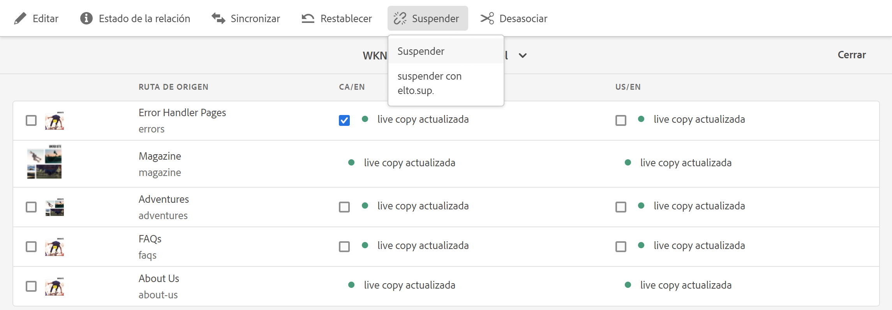

1. Confirme la acción **Suspender** en el diálogo **Suspender Live Copy**:

   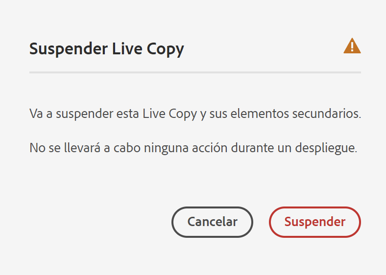

### Reanudación de la herencia de una página {#resuming-inheritance-for-a-page}

Suspender la herencia de Live Copy de una página es una acción temporal. Una vez suspendida, la acción **Reanudar** está disponible, lo que le permite restablecer la relación publicada.

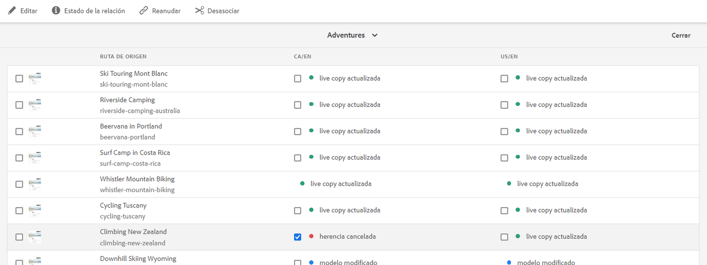

Al volver a habilitar la herencia, la página no se sincroniza automáticamente con el origen. Puede solicitar una sincronización, si es necesario, de una de las siguientes maneras:

* En el diálogo **Reanudar**/**Revertir**; por ejemplo:

  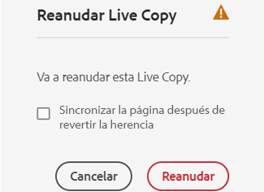

* En una etapa posterior, seleccionando manualmente la acción de sincronización.

>[!NOTE]
>
>Al volver a habilitar la herencia, la página no se sincroniza automáticamente con el origen. Si es necesario, puede solicitar manualmente una sincronización en el momento de reanudarla o más tarde.

#### Reanudación de la herencia desde las Propiedades de página {#resuming-inheritance-from-page-properties}

Una vez [suspendida](#suspending-inheritance-from-page-properties), la acción **Reanudar** aparece en la barra de herramientas de las propiedades de página:

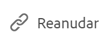

Al seleccionarlo, se muestra el cuadro de diálogo. Si es necesario, puede seleccionar una sincronización y confirmar la acción.

#### Reanudación de una página Live Copy desde la Información general de Live Copy {#resume-a-live-copy-page-from-the-live-copy-overview}

La [acción Reanudar también está disponible en la Información general de Live Copy](live-copy-overview.md#using-the-live-copy-overview), cuando se selecciona una página Live Copy.

1. Abra la [Información general de Live Copy](live-copy-overview.md#using-the-live-copy-overview) y seleccione una página de Live Copy suspendida. La página se muestra como **HERENCIA CANCELADA**.
1. En la barra de herramientas, seleccione **Reanudar**.
1. Indique si desea sincronizar la página después de revertir la herencia y, a continuación, confirme la acción **Reanudar** en el diálogo **Reanudar Live Copy**.

### Cambio de la profundidad de la herencia (superficial/profunda) {#changing-inheritance-depth-shallow-deep}

En una Live Copy existente, puede cambiar la profundidad de una página, es decir, ya sea que se incluyan páginas secundarias.

* Cambio a una Live Copy superficial:

   * Tendrá un efecto inmediato y no es reversible.

   * Desasocia explícitamente las páginas secundarias de Live Copy. No se pueden conservar más modificaciones en tareas secundarias si se deshacen.

   * Eliminará cualquier descendiente `LiveRelationships`incluso si hay `LiveCopies` anidados.

* Cambio a una Live Copy profunda:

   * Deja las páginas secundarias intactas.
   * Para ver el efecto del conmutador, puede ejecutar un despliegue, las modificaciones de contenido se aplican según la configuración de este.

* Cambie a una Live Copy superficial y, a continuación, vuelva a una profunda:

   * Trata a todos los elementos secundarios de la Live Copy (antes) superficial como si se hubieran creado manualmente y, por lo tanto, se apartaran utilizando `[oldname]_msm_moved name`.

Para especificar o cambiar la profundidad:

1. Abra las propiedades de la página Live Copy mediante el comando **Ver propiedades** de la consola **Sitios** o usando **Información de la página** en la barra de herramientas de la página.
1. Seleccione la pestaña **Live Copy**.
1. En la sección **Configuración**, establezca o borre la opción **Herencia de Live Copy** en función de si se incluyen páginas secundarias:

   * Activado: una Live Copy profunda (se incluyen las páginas secundarias)
   * Desactivado: una Live Copy superficial (se excluyen las páginas secundarias)

   >[!CAUTION]
   >
   >Cambiar a una Live Copy superficial tendrá un efecto inmediato y no es reversible.
   >
   >Consulte [Live Copies: composición](overview.md#live-copies-composition) para obtener más información.

1. Seleccione **Guardar** para mantener las actualizaciones.

### Cancelación de la herencia de un componente {#cancelling-inheritance-for-a-component}

Cancele la herencia de Live Copy de un componente para que ya no se sincronice con el componente de origen. Puede habilitar la herencia en un momento posterior si es necesario.

>[!NOTE]
>
>Al volver a habilitar la herencia, el componente no se sincroniza automáticamente con el origen. Puede solicitar manualmente una sincronización si es necesario.

Cancele la herencia para cambiar el contenido del componente o eliminarlo:

1. Seleccione el componente cuya herencia desea cancelar.

   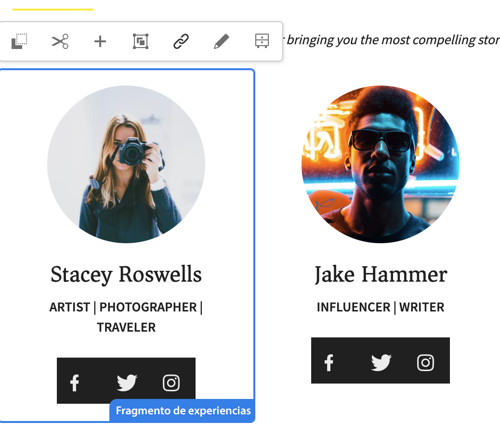

1. En la barra de herramientas de componentes, seleccione el icono **Cancelar herencia**.

   

1. En el cuadro de diálogo Cancelar herencia, confirme la acción con **Sí**.

   La barra de herramientas de componentes se actualiza para incluir todos los comandos de edición (adecuados).

### Reactivación de la herencia para un componente {#re-enabling-inheritance-for-a-component}

Para habilitar la herencia para un componente, seleccione el icono **Volver a habilitar la herencia** en la barra de herramientas de componentes.

### Cambio del orden de los componentes en una página Live Copy {#changing-the-order-of-components-on-a-live-copy-page}

Si una Live Copy contiene componentes que forman parte de un sistema de párrafos, la herencia de ese sistema de párrafos cumple las siguientes reglas:

* Se puede modificar el orden de los componentes de un sistema de párrafos heredado, incluso con la herencia establecida.
* En el despliegue, el orden de los componentes se restaura a partir del modelo. Si se añadieran nuevos componentes a la Live Copy antes del despliegue, estos se reordenan junto con los componentes sobre los cuales se agregaron.
* Si se cancela la herencia del sistema de párrafos, el orden de los componentes no se restaurará durante el despliegue y permanecerá tal cual en la Live Copy.

>[!NOTE]
>
>Al revertir una herencia cancelada en un sistema de párrafos, el orden de los componentes **no se restaura automáticamente** a partir del modelo. Puede solicitar manualmente una sincronización si es necesario.

Utilice el siguiente procedimiento para cancelar la herencia del sistema de párrafos.

1. Abra la página Live Copy.
1. Arrastre un componente existente a una nueva ubicación de la página.
1. En el cuadro de diálogo **Cancelar herencia**, confirme la acción con **Sí**.

### Omisión de las propiedades de una página Live Copy {#overriding-properties-of-a-live-copy-page}

Las propiedades de página de una página Live Copy se heredan de la página de origen de forma predeterminada y no se pueden editar.

Puede cancelar la herencia de una propiedad cuando necesite cambiar el valor de la propiedad de Live Copy. Un icono de vínculo indica que la herencia está habilitada para la propiedad.

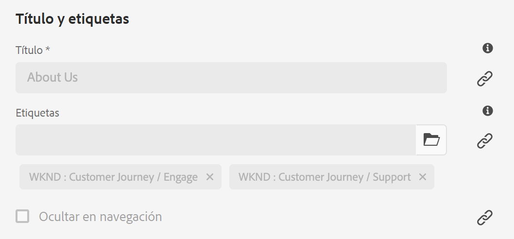

Al cancelar la herencia, puede cambiar el valor de la propiedad. Un icono de vínculo roto indica que se ha cancelado la herencia.

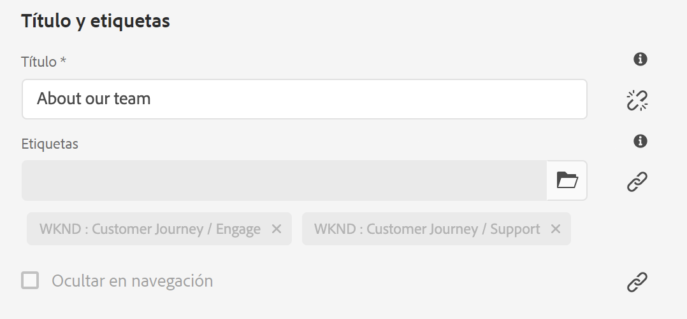

Puede volver a habilitar la herencia para una propiedad más tarde si es necesario.

>[!NOTE]
>
>Al volver a habilitar la herencia, la propiedad de página Live Copy no se sincroniza automáticamente con la propiedad de origen. Puede solicitar manualmente una sincronización si es necesario.

1. Abra las propiedades de la página Live Copy mediante la opción **Ver propiedades** de **Sitios** consola o el icono **Información de la página** en la barra de herramientas de la página.
1. Para cancelar la herencia de una propiedad, seleccione el icono de vínculo que aparece a la derecha de la propiedad.

   

1. En el diálogo de confirmación **Cancelar herencia**, seleccione **Sí**.

### Revertir propiedades de una página de Live Copy {#revert-properties-of-a-live-copy-page}

Para habilitar la herencia para una propiedad, seleccione el icono **Revertir herencia** que aparece junto a la propiedad.

### Restablecer una página de Live Copy {#resetting-a-live-copy-page}

Puede restablecer una página de Live Copy para hacer lo siguiente:

* Quite todas las cancelaciones de herencia y
* Devuelva la página al mismo estado que la página de origen.

El restablecimiento afecta a los cambios realizados en las propiedades de la página, el sistema de párrafos y los componentes.

#### Restablecer una página de Live Copy desde las propiedades de página {#reset-a-live-copy-page-from-the-page-properties}

1. En la consola **Sitios**, seleccione la página Live Copy y seleccione **Ver propiedades**.
1. Abra la pestaña **Live Copy**.
1. En la barra de herramientas, seleccione **Restablecer**.

   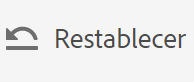

1. En el cuadro de diálogo **Restablecer Live Copy**, confirmar con **Restablecer**.

#### Restablecer una página de Live Copy desde la información general de Live Copy {#reset-a-live-copy-page-from-the-live-copy-overview}

La acción [**Restablecer** también está disponible en la Información general de Live Copy](live-copy-overview.md#using-the-live-copy-overview), cuando se selecciona una página Live Copy.

1. Abra la [Información general de Live Copy](live-copy-overview.md#using-the-live-copy-overview) y seleccione una página Live Copy.
1. En la barra de herramientas, seleccione **Restablecer**.
1. Confirme la acción **Restablecer** en el cuadro de diálogo **Restablecer Live Copy**:

   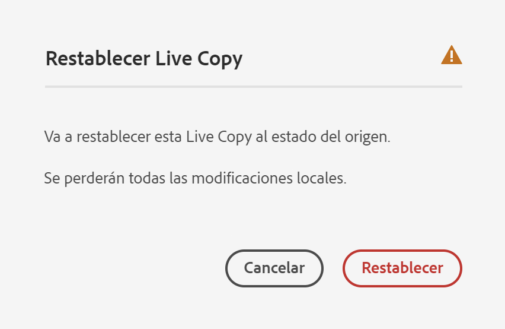

## Comparación de una página de Live Copy con una página de modelo {#comparing-a-live-copy-page-with-a-blueprint-page}

Para realizar un seguimiento de los cambios realizados, puede ver la página de modelo en **Referencias** y compárela con su página Live Copy:

1. En la consola **Sites**, [vaya a un modelo o a una página de Live Copy y selecciónela](/help/sites-cloud/authoring/basic-handling.md#viewing-and-selecting-resources).
1. Abra el panel **[Referencias](/help/sites-cloud/authoring/basic-handling.md#references)** y, en función del contexto, seleccione:

   * **Modelo**
   * **Live Copies**

1. Seleccione la Live Copy específica en función del contexto, o bien:

   * **Comparar con el modelo**
   * **Comparar con Live Copy**

   Por ejemplo:

   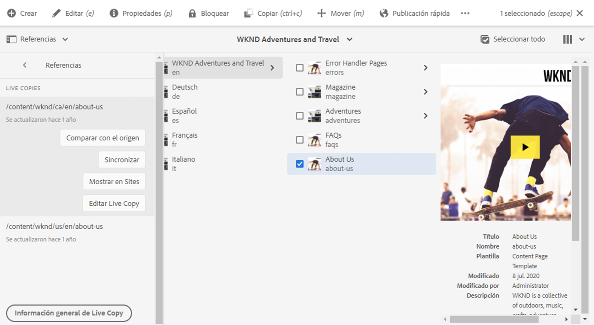

1. Las páginas Live Copy y modelo se abren en paralelo.

   Para obtener información completa sobre el uso de esta característica de comparación, consulte la [diferencia de la página](/help/sites-cloud/authoring/sites-console/page-diff.md).

## Desasociación de una Live Copy {#detaching-a-live-copy}

La acción de desasociar elimina permanentemente la relación activa entre una Live Copy y su página de origen/modelo. Todas las propiedades relevantes para MSM se eliminan de Live Copy y las páginas de Live Copy se convierten en una copia independiente.

>[!CAUTION]
>
>No puede restablecer la relación activa después de desasociar Live Copy.
>
>Para eliminar la relación activa con la opción de reinstalarla posteriormente, puede [cancelar la herencia de Live Copy](#suspending-inheritance-for-a-page) para la página.

Hay implicaciones sobre dónde dentro del árbol que utiliza **Desasociar**:

* **Desasociar en una página raíz de una Live Copy**

  Cuando esta operación se realiza en la página raíz de una Live Copy, se elimina la relación activa entre todas las páginas del modelo y su Live Copy.

  Más cambios en las páginas del modelo **no** afectarán a Live Copy.

* **Desasociar en una subpágina de una Live Copy**

  Cuando esta operación se realiza en una subpágina (o rama) dentro de una Live Copy:

   * La relación activa se elimina para esa subpágina (o rama) y
   * Las páginas (sub) de la rama de Live Copy se tratan como si se hubieran creado manualmente.

  Sin embargo, las páginas secundarias siguen estando sujetas a la relación activa de la rama principal, por lo que un nuevo despliegue de las páginas de modelo:

   1. Cambie el nombre de las páginas separadas:

      * Esto se debe a que MSM los considera como páginas creadas manualmente que causan un conflicto, ya que tienen el mismo nombre que las páginas de Live Copy que intenta crear.

   1. Cree una nueva página de Live Copy con el nombre original, que contenga los cambios del despliegue.

  >[!NOTE]
  >
  >Consulte [Conflictos de despliegue de MSM](rollout-conflicts.md) para obtener detalles sobre estas situaciones.

### Desasociar una página de Live Copy de las propiedades de página {#detach-a-live-copy-page-from-the-page-properties}

Para separar una Live Copy:

1. En la consola **Sitios**, seleccione la página Live Copy y seleccione **Ver propiedades**.
1. Abra la pestaña **Live Copy**.
1. En la barra de herramientas, seleccione **Desasociar**.

   

1. Se muestra un cuadro de diálogo de confirmación: seleccione **Desasociar** para completar la acción.

### Desasociar una página de Live Copy de la información general de Live Copy {#detach-a-live-copy-page-from-the-live-copy-overview}

La [acción Separar también está disponible en la Información general de Live Copy](live-copy-overview.md#using-the-live-copy-overview), cuando se selecciona una página Live Copy.

1. Abra la [Información general de Live Copy](live-copy-overview.md#using-the-live-copy-overview) y seleccione una página Live Copy.
1. En la barra de herramientas, seleccione **Desasociar**.
1. Confirme la acción **Desasociar** en el diálogo **Desasociar Live Copy**:

   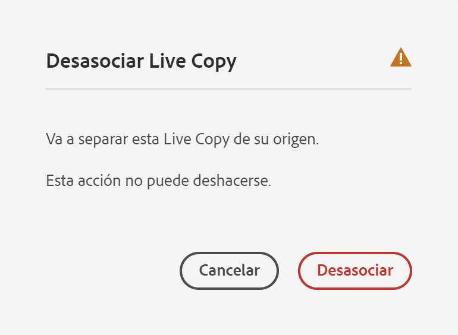
