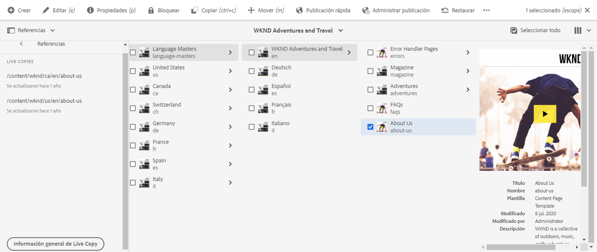
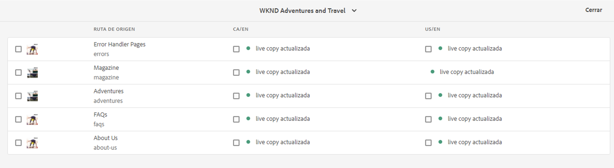
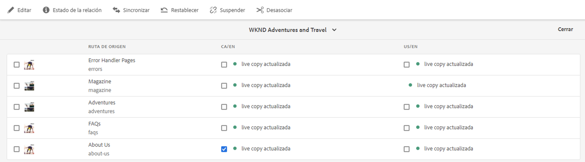
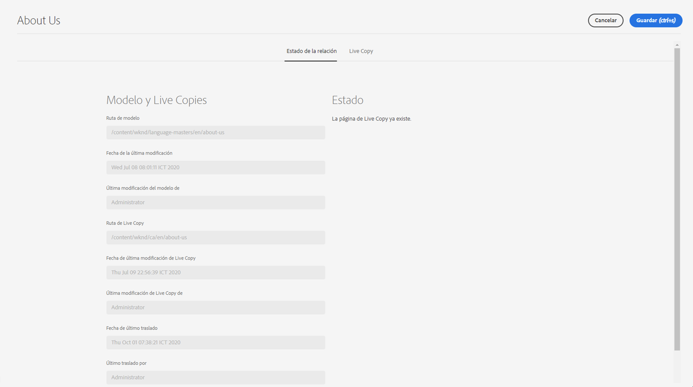
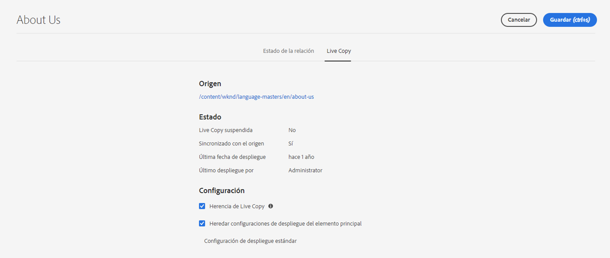

# Consola de información general de Live Copy {#live-copy-overview-console}

La consola **Información general de Live Copy** le permite:

* Ver/administrar la herencia en un sitio.
   * Ver el árbol de modelo y la estructura correspondiente de Live Copy, junto con su estado de herencia
   * Cambiar el estado de herencia, como suspender y reanudar
   * Ver propiedades de modelo y Live Copy
* Realice acciones de despliegue.

## Información general sobre la apertura de Live Copy {#opening-the-live-copy-overview}

Puede abrir la Información general de Live Copy desde:

* [Panel lateral Referencias de una página de modelo (consola Sitios)](#opening-live-copy-overview-references-for-a-blueprint-page)
* [Propiedades de una página de modelo](#opening-live-copy-overview-properties-of-a-blueprint-page)

### Referencias a una página de modelo {#references-to-a-blueprint-page}

La **Información general de Live Copy** se puede abrir desde el panel lateral **Referencias** de la consola **Sitios**:

1. En la consola **Sites**, [vaya a la página de modelo y selecciónela.](/help/sites-cloud/authoring/getting-started/basic-handling.md#viewing-and-selecting-resources)
1. Abra el carril **[References](/help/sites-cloud/authoring/getting-started/basic-handling.md#references)** y seleccione **Live Copies**.

   

   >[!TIP]
   >
   >También puede abrir primero las referencias y, a continuación, seleccionar el modelo.

1. Seleccione **Información general de Live Copy** para mostrar y utilizar la descripción general de todas las Live Copies relacionadas con el modelo seleccionado.
1. Utilice **Cerrar** para salir y volver a la consola **Sitios**.

### Propiedades de una página de modelo {#properties-of-a-blueprint-page}

La **Información general de Live Copy** se puede abrir al ver las propiedades de una página de modelo:

1. Abra **Propiedades** para la página de modelo adecuada.
1. Abra la pestaña **Modelo**: la opción **Información general de Live Copy** se mostrará en la barra de herramientas superior:

   

1. Seleccione **Información general de Live Copy** para mostrar y utilizar la descripción general de todas las Live Copies relacionadas con el modelo actual.

1. Utilice **Cerrar** para salir y volver a la consola **Sitios**.

## Información general sobre el uso de Live Copy {#using-the-live-copy-overview}

La ventana **Live Copy Overview** proporciona información general sobre el estado de las Live Copies relacionadas con la página seleccionada.

Un despliegue depende de las acciones de sincronización definidas en la configuración específica del despliegue. Algunas acciones dependen de las modificaciones del contenido. Sin embargo, también hay muchas acciones que no dependen de las modificaciones del contenido, sino que dependen de eventos como la activación de páginas. Estos eventos no modifican el contenido, pero sí las propiedades internas relacionadas con el contenido.

Los campos de estado también dependen de las acciones de sincronización definidas en la configuración de lanzamiento específica e indican si ha habido alguna acción de este tipo en el modelo o en Live Copy desde la última implementación correcta. Un campo de estado solo reflejará las acciones de la configuración específica del despliegue. Si nunca se ha realizado una implementación correcta en una Live Copy, el estado siempre se mostrará actualizado.

Por ejemplo, una configuración de lanzamiento se define como `targetActivate`. Por lo tanto, el despliegue dependerá únicamente de los eventos de activación. El campo de estado solo indica si se ha producido algún evento de activación desde la última vez que se implementó correctamente.

La **Información general de Live Copy** también se puede utilizar para realizar acciones en Live Copy:

1. Abra **Información general de Live Copy**.
1. Seleccione el modelo necesario o la página Live Copy y la barra de herramientas se actualizará para mostrar las acciones disponibles. Las [acciones](overview.md#terms-used) disponibles dependen de si selecciona una página [modelo](#actions-for-a-blueprint-page) o [Live Copy](#actions-for-a-live-copy-page).

### Acciones para una página de modelo {#actions-for-a-blueprint-page}

Cuando selecciona una página de modelo, están disponibles las siguientes acciones:

* **Editar** : abra la página de modelo para editarla.
* **[Despliegue](overview.md#rollout-and-synchronize)** : realice un despliegue para insertar cambios del origen a la Live Copy.

### Acciones para una página de Live Copy {#actions-for-a-live-copy-page}

Cuando selecciona una página de Live Copy, están disponibles las siguientes acciones:

* **Editar** : abra la página Live Copy para editarla.
* **[Estado de relación](#relationship-status)** : permite ver información sobre el estado y la herencia.
* **[Sincronizar](overview.md#rollout-and-synchronize)** : sincronice una Live Copy para extraer cambios del origen a la Live Copy.
* **[Restablecer](creating-live-copies.md#resetting-a-live-copy-page)** : restablezca una página de Live Copy para eliminar todas las cancelaciones de herencia y devolver la página al mismo estado que la página de origen.
* **[Suspender](overview.md#suspending-and-cancelling-inheritance-and-synchronization)** : desactiva temporalmente la relación activa entre una Live Copy y su página de modelo.
* **[Reanudar](creating-live-copies.md#resuming-inheritance-for-a-page)** : la reanudación le permite restablecer una relación suspendida.
* **[Desasociar](overview.md#detaching-a-live-copy)** : elimina de forma permanente la relación activa entre una Live Copy y su página de modelo.

## Estado de la relación {#relationship-status}

La consola **Estado de relación** tiene dos fichas que proporcionan una amplia gama de funciones.

* [Estado de la relación](#relationship-status-tab)
* [Live Copy   ](#live-copy-tab)

### Estado de la relación {#relationship-status-tab}

Esta pestaña proporciona información detallada sobre el estado de la relación entre el modelo y Live Copy.

### Live Copy    {#live-copy-tab}

Esta pestaña le permite ver y editar la configuración de Live Copy.

