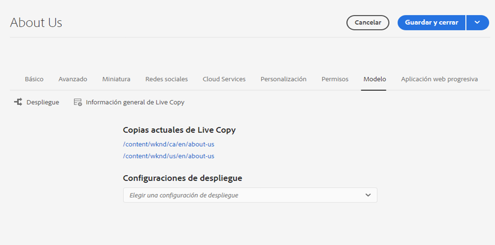

# Información general de Live Copy {#live-copy-overview-console}

La consola **Información general de Live Copy** le permite lo siguiente:

* Ver/administrar la herencia en un sitio.
   * Ver el árbol de modelo y la estructura correspondiente de Live Copy, junto con su estado de herencia
   * Cambiar el estado de herencia, como suspenderlo y reanudarlo
   * Ver las propiedades de modelo y Live Copy
* Llevar a cabo acciones de despliegue

## Apertura de la información general de Live Copy {#opening-the-live-copy-overview}

Puede abrir la Información general de Live Copy desde estas ubicaciones:

* [Panel lateral Referencias de una página de modelo (consola Sites)](#opening-live-copy-overview-references-for-a-blueprint-page)
* [Propiedades de una página de modelo](#opening-live-copy-overview-properties-of-a-blueprint-page)

### Referencias a una página de modelo {#references-to-a-blueprint-page}

La **Información general de Live Copy** se puede abrir desde el panel lateral **Referencias** de la consola **Sites**:

1. En la consola **Sites**, [vaya a la página de modelo y selecciónela](/help/sites-cloud/authoring/basic-handling.md#viewing-and-selecting-resources).
1. Abra el carril **[Referencias](/help/sites-cloud/authoring/basic-handling.md#references)** y seleccione **Live Copies**.

   

   >[!TIP]
   >
   >También puede abrir primero las referencias y, a continuación, seleccionar el modelo.

1. Seleccione **Información general de Live Copy** para mostrar y utilizar la descripción general de todas las Live Copies relacionadas con el modelo seleccionado.
1. Use **Cerrar** para salir y volver a la consola **Sites**.

### Propiedades de una página de modelo {#properties-of-a-blueprint-page}

La **Información general de Live Copy** se puede abrir al ver las propiedades de una página de modelo:

1. Abra las **Propiedades** de la página de modelo adecuada.
1. Abra la pestaña **Modelo**, la **Información general de Live Copy** se muestra en la barra de herramientas superior:

   

1. Seleccione **Información general de Live Copy** para mostrar y utilizar la información general de todas las Live Copies relacionadas con el modelo actual.

1. Use **Cerrar** para salir y volver a la consola **Sites**.

## Información general sobre el uso de Live Copy {#using-the-live-copy-overview}

La ventana **Información general de Live Copy** proporciona información general sobre el estado de las Live Copies relacionadas con la página seleccionada.

Un despliegue depende de las acciones de sincronización definidas en la configuración específica de este. Algunas acciones dependen de las modificaciones del contenido. Sin embargo, también hay muchas que no dependen de las modificaciones del contenido, sino de eventos como la activación de páginas. Estos eventos no modifican el contenido, pero sí las propiedades internas relacionadas con él.

Los campos de estado también dependen de las acciones de sincronización definidas en la configuración de lanzamiento específica e indican si ha habido alguna acción de este tipo en el modelo o en la Live Copy desde el último despliegue correcto. Un campo de estado solo reflejará las acciones de la configuración específica del despliegue. Si nunca se ha ejecutado un despliegue correcto en una Live Copy, el estado siempre se mostrará actualizado.

Por ejemplo, una configuración de despliegue se define como `targetActivate`. Por lo tanto, el despliegue dependerá únicamente de los eventos de activación. El campo de estado solo indica si se ha producido algún evento de activación desde el último despliegue correcto.

La **Información general de Live Copy** también se puede utilizar para llevar a cabo acciones en Live Copy:

1. Abra la **Información general de Live Copy**.
1. Seleccione el modelo necesario o la página de Live Copy y la barra de herramientas se actualiza para mostrar las acciones disponibles. Las [acciones](overview.md#terms-used) disponibles dependen de si escoge una página de [modelo](#actions-for-a-blueprint-page) o [Live Copy](#actions-for-a-live-copy-page).

### Acciones para una página de modelo {#actions-for-a-blueprint-page}

Cuando selecciona una página de modelo, están disponibles las siguientes acciones:

* **Editar**: abra la página de modelo para editarla.
* **[Despliegue](overview.md#rollout-and-synchronize)**: ejecute un despliegue para insertar los cambios de origen en Live Copy.

### Acciones para una página de Live Copy {#actions-for-a-live-copy-page}

Cuando selecciona una página de Live Copy, están disponibles las siguientes acciones:

* **Editar**: abra la página de Live Copy para editarla.
* **[Estado de la relación](#relationship-status)**: vea información sobre el estado y la herencia.
* **[Sincronizar](overview.md#rollout-and-synchronize)**: sincronice una Live Copy para extraer cambios del origen a la Live Copy.
* **[Restablecer](creating-live-copies.md#resetting-a-live-copy-page)**: restablezca una página de Live Copy para eliminar todas las cancelaciones de herencia y devuélvala al mismo estado que la de origen.
* **[Suspender](overview.md#suspending-and-cancelling-inheritance-and-synchronization)**: desactiva temporalmente la relación activa entre una Live Copy y su página de modelo.
* **[Reanudar](creating-live-copies.md#resuming-inheritance-for-a-page)** - Reanudar le permite restablecer una relación suspendida.
* **[Desasociar](overview.md#detaching-a-live-copy)**: elimina de forma permanente la relación activa entre una Live Copy y su página de modelo.

## Estado de la relación {#relationship-status}

La consola **Estado de la relación** tiene dos pestañas que proporcionan una amplia gama de funcionalidades.

* [Estado de la relación](#relationship-status-tab)
* [Live Copy   &#x200B;](#live-copy-tab)

### Estado de la relación {#relationship-status-tab}

Esta pestaña proporciona información detallada acerca del estado de la relación entre el modelo y la Live Copy.

### Live Copy    {#live-copy-tab}

Esta pestaña le permite ver y editar la configuración de Live Copy.

