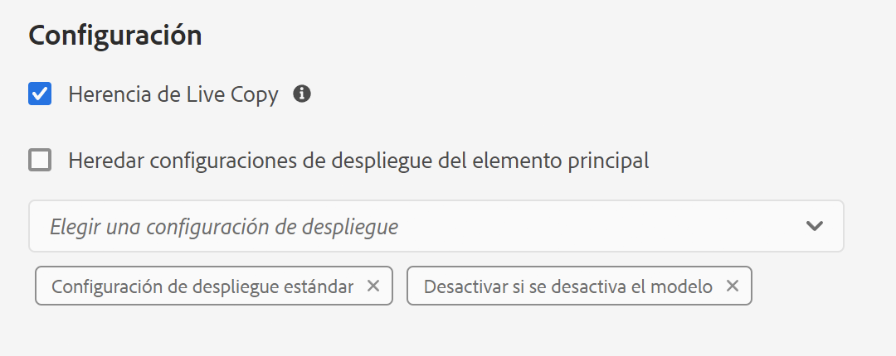

# Configuración de la sincronización de Live Copy {#configuring-live-copy-synchronization}

Adobe Experience Manager proporciona varias configuraciones de sincronización listas para usarse. Antes de usar Live Copies, debe tener en cuenta lo siguiente para definir cómo y cuándo se sincronizan estas con su contenido de origen.

1. Decida si las configuraciones de despliegue existentes cumplen los requisitos
1. Si no lo hacen, determine si necesita crear las suyas.
1. Especifique las opciones de configuración de despliegue que se utilizarán en los elementos de Live Copies.

## Configuraciones de despliegue instaladas y personalizadas {#installed-and-custom-rollout-configurations}

En esta sección se proporciona información sobre las configuraciones de despliegue instaladas, las acciones de sincronización que utilizan y cómo crear configuraciones personalizadas si es necesario.

>[!CAUTION]
>
>Actualizar o cambiar una configuración de despliegue predeterminada **no** está recomendado. Si hay algún requisito para una acción en directo personalizada, debe añadirse en una configuración de despliegue personalizada.

### Activadores de despliegue {#rollout-triggers}

Cada configuración de lanzamiento utiliza un activador de lanzamiento que hace que se produzca el lanzamiento. Las configuraciones de despliegue pueden utilizar uno de los siguientes activadores:

* **En el despliegue**: el comando **Despliegue** se utiliza en la página del modelo, o el comando **Sincronizar** se usa en la página de Live Copy.
* **En la modificación**: la página de origen se modifica.
* **En la activación**: la página de origen se activa.
* **En la desactivación**: la página de origen se desactiva.

>[!NOTE]
>
>Recuerde que el uso del activador **En la modificación** puede afectar al rendimiento. Consulte [las prácticas recomendadas de MSM](best-practices.md#onmodify) para obtener más información.

### Opciones de configuración del lanzamiento {#rollout-configurations}

En la siguiente tabla, se enumeran las opciones de configuración de despliegue listas para usarse de AEM. La tabla incluye las acciones de activación y sincronización de cada configuración de lanzamiento.

Si las acciones de configuración de lanzamiento instaladas no cumplen con sus requisitos, puede [cree una configuración de despliegue.](#creating-a-rollout-configuration)

| Nombre | Descripción | Activador | [Acciones de sincronización](#synchronization-actions) |
|---|---|---|---|
| Configuración de lanzamiento estándar | La configuración de lanzamiento estándar permite iniciar procesos de lanzamiento con el activador de lanzamientos, y ejecuta acciones como crear, actualizar, eliminar contenido y ordenar nodos secundarios | En el lanzamiento | `contentUpdate` `contentCopy` `contentDelete` `referencesUpdate` `productUpdate` `orderChildren` |
| Activar si se activa el modelo | Publica la Live Copy cuando se publica el origen | En la activación | `targetActivate` |
| Desactivar si se desactiva el modelo | Desactiva la Live Copy cuando se desactiva el origen | En la desactivación | `targetDeactivate` |
| Insertar al modificar | Inserta el contenido en Live Copy cuando se modifica el origen Utilice esta configuración de despliegue con moderación, ya que utiliza el activador En la modificación. | En la modificación | `contentUpdate` `contentCopy` `contentDelete` `referencesUpdate` `orderChildren` |
| Insertar al modificar (superficial) | Inserta el contenido en Live Copy cuando se modifica la página del modelo, sin actualizar las referencias (por ejemplo, para copias superficiales) Utilice esta configuración de despliegue con moderación, ya que utiliza el activador “En la modificación”. | En la modificación | `contentUpdate` `contentCopy` `contentDelete` `orderChildren` |
| Promocionar lanzamiento | Configuración de despliegue estándar para promocionar páginas con dicho fin. | En el despliegue | `contentUpdate` `contentCopy` `contentDelete` `referencesUpdate` `orderChildren` `markLiveRelationship` |

### Acciones de sincronización {#synchronization-actions}

En la siguiente tabla, se enumeran las opciones de sincronización listas para usarse de AEM.

Si las acciones instaladas no cumplen con sus requisitos, puede [Cree una nueva acción de sincronización.](/help/implementing/developing/extending/msm.md#creating-a-new-synchronization-action)

| Nombre de la acción | Descripción | Propiedades |
|---|---|---|
| `contentCopy` | Cuando los nodos de origen no existen en la Live Copy, esta acción los copia en esta. [Configure el servicio de **acción de copia de contenido de CQ MSM**](#excluding-properties-and-node-types-from-synchronization) para especificar los tipos de nodo, los elementos de párrafo y las propiedades de página que se excluirán. |  |
| `contentDelete` | Esta acción elimina los nodos de la Live Copy que no existen en el origen. [Configure el servicio de **acción de eliminación de contenido de CQ MSM**](#excluding-properties-and-node-types-from-synchronization) para especificar los tipos de nodo, los elementos de párrafo y las propiedades de página que se excluirán. |  |
| `contentUpdate` | Esta acción actualiza el contenido de la Live Copy con los cambios del origen. [Configure el servicio de **acción de actualización de contenido de CQ MSM**](#excluding-properties-and-node-types-from-synchronization) para especificar los tipos de nodo, los elementos de párrafo y las propiedades de página que se excluirán. |  |
| `editProperties` | Esta acción edita las propiedades de la Live Copy. La propiedad `editMap` determina qué propiedades se editan y su valor. El valor de la propiedad `editMap` debe utilizar el siguiente formato: `[property_name_n]#[current_value]#[new_value]` `current_value` y `new_value` son expresiones regulares y `n` es un entero incrementado. Por ejemplo, considere el siguiente valor para `editMap`: `sling:resourceType#/(contentpage`‖`homepage)#/mobilecontentpage,cq:template#/contentpage#/mobilecontentpage` Este valor edita las propiedades de los nodos de Live Copy de la siguiente manera: Las propiedades `sling:resourceType` que se establecen como `contentpage` o `homepage` están configuradas en `mobilecontentpage`. Las propiedades `cq:template` definidas en `contentpage` se establecen como `mobilecontentpage`. | `editMap: (String)` identifica la propiedad, el valor actual y el nuevo valor. Consulte la descripción para obtener más información. |
| `notify` | Esta acción envía un evento de página que indica que la página se ha lanzado. Para recibir notificaciones, primero debe suscribirse a eventos de despliegue. |  |
| `orderChildren` | Esta acción ordena los nodos secundarios según el orden del modelo. |  |
| `referencesUpdate` | Esta acción de sincronización actualiza las referencias en la Live Copy. Busca rutas de acceso en las páginas de Live Copy que apuntan a un recurso dentro del modelo. Cuando se encuentran, se actualiza la ruta de acceso para que apunte al recurso relacionado dentro de la Live Copy. Las referencias que tienen los destinos fuera del modelo no cambian.  [Configure el servicio de **acción de actualización de referencias de CQ MSM**](#excluding-properties-and-node-types-from-synchronization) para especificar los tipos de nodo, los elementos de párrafo y las propiedades de página que se excluirán. |  |
| `targetVersion` | Esta acción crea una versión de la Live Copy. Esta acción debe ser la única acción de sincronización incluida en una configuración de lanzamiento. |  |
| `targetActivate` | Esta acción activa la Live Copy. Esta acción debe ser la única acción de sincronización incluida en una configuración de lanzamiento. |  |
| `targetDeactivate` | Esta acción desactiva la Live Copy. Esta acción debe ser la única acción de sincronización incluida en una configuración de lanzamiento. |  |
| `workflow` | Inicia el flujo de trabajo que define la propiedad de destino (solo para páginas) y toma la Live Copy como carga útil. La ruta de destino es la ruta del nodo del modelo. | `target: (String)` es la ruta al modelo de flujo de trabajo. |
| `mandatory` | Esta acción establece el permiso de varias ACL en la página de la Live Copy como de solo lectura para un grupo de usuarios específico. Se configuran las siguientes ACL: `ActionSet.ACTION_NAME_REMOVE` `ActionSet.ACTION_NAME_SET_PROPERTY` `ActionSet.ACTION_NAME_ACL_MODIFY` Utilice esta acción solo para páginas. | `target: (String)` es el ID del grupo para el que se definen los permisos. |
| `mandatoryContent` | Esta acción establece el permiso de varias ACL en la página de la Live Copy como de solo lectura para un grupo de usuarios específico. Se configuran las siguientes ACL: `ActionSet.ACTION_NAME_SET_PROPERTY` `ActionSet.ACTION_NAME_ACL_MODIFY` Utilice esta acción solo para páginas. | `target: (String)` es el ID del grupo para el que se definen los permisos. |
| `mandatoryStructure` | Esta acción establece el permiso de la `ActionSet.ACTION_NAME_REMOVE`ACL en la página de la Live Copy como de solo lectura para un grupo de usuarios específico. Utilice esta acción solo para páginas. | `target: (String)` es el ID del grupo para el que se definen los permisos. |
| `VersionCopyAction` | Si la página de origen o el modelo se ha publicado al menos una vez, esta acción crea una página de Live Copy mediante la versión publicada. Nota: Esta acción solo está disponible para crear una página de Live Copy basada en una página de origen publicada, no para actualizar una página de Live Copy existente. |  |
| `PageMoveAction` | Se aplica `PageMoveAction` cuando una página se ha movido en el modelo. La acción copia la página de Live Copy (relacionada) en lugar de moverla desde la ubicación, antes de realizar el traslado a la ubicación posterior. No cambia `PageMoveAction` la página de Live Copy a la ubicación antes del traslado. Por lo tanto, para las configuraciones de despliegue consecutivas, tiene el estado de una relación activa sin un modelo. [Configure el servicio de **acción de traslado de páginas de CQ MSM**](#excluding-properties-and-node-types-from-synchronization) para especificar los tipos de nodo, los elementos de párrafo y las propiedades de página que se excluirán. Esta acción debe ser la única acción de sincronización incluida en una configuración de lanzamiento. | Establezca `prop_referenceUpdate: (Boolean)` como true (predeterminado) para actualizar referencias. |
| `markLiveRelationship` | Esta acción indica una relación dinámica del contenido creado para el lanzamiento. |  |

### Creación de una configuración de despliegue {#creating-a-rollout-configuration}

Puede [creación de una configuración de despliegue](/help/implementing/developing/extending/msm.md#creating-a-new-rollout-configuration) cuando las configuraciones de despliegue instaladas no cumplen los requisitos de la aplicación, siga estos pasos.

1. [Creación de la configuración de despliegue:](/help/implementing/developing/extending/msm.md#create-the-rollout-configuration)
1. [Añada acciones de sincronización a la configuración de lanzamiento.](/help/implementing/developing/extending/msm.md#add-synchronization-actions-to-the-rollout-configuration)

La nueva configuración de despliegue está disponible al configurar opciones de configuración de despliegue en una página de modelo o Live Copy.

### Exclusión de propiedades y tipos de nodos de la sincronización {#excluding-properties-and-node-types-from-synchronization}

Puede configurar varios servicios de OSGi que admitan las acciones de sincronización correspondientes para que no afecten a los tipos de nodos y propiedades específicos. Por ejemplo, muchas propiedades y subnodos relacionados con el trabajo interno de AEM no deben incluirse en una Live Copy. Solo se debe copiar el contenido relevante para el usuario de la página.

Al trabajar con AEM, existen varios métodos para administrar los parámetros de configuración de dichos servicios. Consulte [Configuración de OSGi](/help/implementing/deploying/configuring-osgi.md) para obtener más información y las prácticas recomendadas.

En la tabla siguiente se enumeran las acciones de sincronización para las que se pueden especificar los nodos que se excluirán. La tabla proporciona los nombres de los servicios que se van a configurar mediante la consola web y el PID para configurar mediante un nodo del repositorio.

| Acción de sincronización | Nombre del servicio en la consola web | PID de servicio |
|---|---|---|
| `contentCopy` | Acción de copia de contenido de CQ MSM | `com.day.cq.wcm.msm.impl.actions.ContentCopyActionFactory` |
| `contentDelete` | Acción de eliminación de contenido de CQ MSM | `com.day.cq.wcm.msm.impl.actions.ContentDeleteActionFactory` |
| `contentUpdate` | Acción de actualización de contenido de CQ MSM | `com.day.cq.wcm.msm.impl.actions.ContentUpdateActionFactory` |
| `PageMoveAction` | Acción de movimiento de página de CQ MSM | `com.day.cq.wcm.msm.impl.actions.PageMoveActionFactory` |
| `referencesUpdate` | Acción de actualización de referencias de CQ MSM | `com.day.cq.wcm.msm.impl.actions.ReferencesUpdateActionFactory` |

En la tabla siguiente se describen las propiedades que se pueden configurar:

| Propiedad de la consola web | Propiedad OSGi | Descripción |
|---|---|---|
| Tipos de nodos excluidos | `cq.wcm.msm.action.excludednodetypes` | Expresión regular que coincide con los tipos de nodos que se van a excluir de la acción de sincronización |
| Elementos de párrafo excluidos | `cq.wcm.msm.action.excludedparagraphitems` | Una expresión regular que coincide con los elementos de párrafo que se van a excluir de la acción de sincronización. |
| Propiedades de página excluidas | `cq.wcm.msm.action.excludedprops` | Una expresión regular que coincide con las propiedades de página que se van a excluir de la acción de sincronización. |
| Tipos de nodos de Mixin ignorados | `cq.wcm.msm.action.ignoredMixin` | Una expresión regular que coincide con los nombres de los tipos de nodos de mixin que se van a excluir de la acción de sincronización (solo disponible para la acción `contentUpdate`) |

#### Acción de actualización de contenido de CQ MSM: exclusiones {#cq-msm-content-update-action-exclusions}

De forma predeterminada, se excluyen varias propiedades y tipos de nodos, que se definen en la configuración OSGi de **Acción de actualización de contenido de CQ MSM**, en **Propiedades de página excluidas**.

De forma predeterminada, las propiedades que coinciden con las siguientes expresiones regulares se excluyen (es decir, no se actualizan) en el despliegue:

Puede cambiar las expresiones que definen la lista de exclusión según sea necesario.

Por ejemplo, si quiere que el **título** de la página se incluya en los cambios considerados para el lanzamiento, elimine `jcr:title` de las exclusiones. Por ejemplo, con la expresión regular:

`jcr:(?!(title)$).*`

### Configuración de la sincronización de actualización de referencias {#configuring-synchronization-for-updating-references}

Puede configurar varios servicios de OSGi que admitan las acciones de sincronización correspondientes relacionadas con la actualización de referencias.

Al trabajar con AEM, existen varios métodos para administrar los parámetros de configuración de dichos servicios. Consulte [Configuración de OSGi](/help/implementing/deploying/configuring-osgi.md) para obtener más información y las prácticas recomendadas.

En la siguiente tabla se enumeran las acciones de sincronización para las que se puede especificar la actualización de referencia. La tabla proporciona los nombres de los servicios que se van a configurar mediante la consola web y el PID para configurar mediante un nodo del repositorio.

| Propiedad de la consola web | Propiedad OSGi | Descripción |
|---|---|---|
| Actualizar referencia en LiveCopies anidadas | `cq.wcm.msm.impl.action.referencesupdate.prop_updateNested` | Seleccione esta opción en la consola web o establezca esta propiedad boolean como `true` con la configuración del repositorio para reemplazar referencias que estén orientadas a cualquier recurso que se encuentre dentro de la rama de la Live Copy más importante. Solo disponible para la acción `referencesUpdate`. |
| Actualizar páginas de referencia | `cq.wcm.msm.impl.actions.pagemove.prop_referenceUpdate` | Seleccione esta opción en la consola web o establezca esta propiedad boolean como `true` con la configuración del repositorio para actualizar cualquier referencia que utilice la página original para hacer referencia, en su lugar, a la página de Live Copy. Solo disponible para `PageMoveAction`. |

## Especificación de las opciones de configuración de lanzamiento que se van a utilizar {#specifying-the-rollout-configurations-to-use}

MSM le permite especificar conjuntos de opciones de configuración de despliegue que suelen utilizarse y, cuando sea necesario, puede invalidar determinadas Live Copies. MSM proporciona varias ubicaciones para especificar las opciones de configuración de lanzamiento que se deben utilizar. La ubicación determina si la configuración se aplica a una Live Copy específica.

En la siguiente lista de ubicaciones en la que se pueden especificar las opciones de configuración de lanzamiento que se deben utilizar, se describe cómo MSM determina qué opciones de configuración de lanzamiento se deben utilizar para una Live Copy:

* **[Propiedades de la página de Live Copy](live-copy-sync-config.md#setting-the-rollout-configurations-for-a-live-copy-page):** cuando una página de Live Copy está configurada para utilizar una o varias opciones de configuración de despliegue, MSM utiliza dichas opciones de configuración.
* **[Propiedades de la página de modelo](live-copy-sync-config.md#setting-the-rollout-configuration-for-a-blueprint-page):** cuando una página de Live Copy se basa en un modelo y la página de Live Copy no usa una configuración de despliegue, se utiliza la configuración de despliegue asociada a la página de origen del modelo.
* **Propiedades de la página principal de Live Copy:** cuando ni la página de Live Copy ni la página de origen del modelo usan una configuración de despliegue, se utiliza la configuración de despliegue que se aplica a la página principal de la página de Live Copy.
* **[Sistema predeterminado](live-copy-sync-config.md#setting-the-system-default-rollout-configuration):** cuando no se puede determinar la configuración de despliegue de la página principal de Live Copy, se utiliza la configuración de despliegue predeterminada del sistema.

Por ejemplo, un modelo utiliza el sitio [Tutorial de WKND](/help/implementing/developing/introduction/develop-wknd-tutorial.md) como contenido de origen. Se crea un sitio a partir del modelo. Cada elemento de la siguiente lista describe un escenario diferente con respecto al uso de configuraciones de despliegue:

* Ninguna de las páginas del modelo ni de Live Copy están configuradas para utilizar una configuración de despliegue. MSM utiliza la configuración de despliegue predeterminada del sistema para todas las páginas de Live Copy.
* La página raíz del sitio WKND se configura con varias opciones de configuración de despliegue. MSM utiliza estas opciones de configuración de despliegue para todas las páginas de Live Copy.
* La página raíz del sitio WKND se configura con varias opciones de configuración de despliegue, mientras que la página raíz del sitio de Live Copy se configura con un conjunto diferente. MSM utiliza las opciones de configuración de despliegue que están en la página raíz del sitio de Live Copy.

### Configuración de las opciones de configuración de lanzamiento para una página de Live Copy {#setting-the-rollout-configurations-for-a-live-copy-page}

Configure una página de Live Copy con las opciones de configuración de despliegue que se usarán cuando se lance la página de origen. Las páginas secundarias heredan la configuración de forma predeterminada. Al establecer la configuración de despliegue para su uso, se anula la configuración que la página de Live Copy hereda de su elemento principal.

También puede configurar las opciones de configuración de despliegue para una página de Live Copy al [crear la Live Copy](creating-live-copies.md#creating-a-live-copy-of-a-page).

1. Utilice la consola **Sitios** para seleccionar la página de Live Copy.
1. En la barra de herramientas, seleccione **Propiedades**.
1. Abra la pestaña **Live Copy**.

   La sección **Configuración** muestra las opciones de configuración de lanzamiento que hereda la página.

   

1. Si es necesario, ajuste el **Herencia de Live Copy** Indicador. Si se selecciona, la configuración de Live Copy es eficaz en todas las páginas secundarias.

1. Borre la propiedad **Heredar configuración de despliegue del elemento principal** y, a continuación, seleccione una o varias opciones de configuración de despliegue de la lista.

   Las configuraciones de despliegue seleccionadas aparecen debajo de la lista desplegable.

   

1. Seleccionar **Guardar y cerrar**.

### Configuración de despliegue para una página de modelo {#setting-the-rollout-configuration-for-a-blueprint-page}

Configure una página modelo con las configuraciones de despliegue que se usarán cuando se lance la página modelo.

Las páginas secundarias de la página de modelo heredan la configuración. Al establecer la configuración de despliegue para su uso, se anula la configuración que la página hereda de su elemento principal.

1. Utilice la consola **Sitios** para seleccionar la página de modelo.
1. En la barra de herramientas, seleccione **Propiedades**.
1. Abra la pestaña **Modelo**.
1. Seleccione una o más **opciones de configuración de lanzamiento** con el selector desplegable.
1. Para almacenar las actualizaciones, seleccione **Guardar**.

### Opciones de la configuración de lanzamiento predeterminada del sistema {#setting-the-system-default-rollout-configuration}

Para especificar una configuración de despliegue que se utilizará como predeterminada del sistema, configure el siguiente servicio OSGi.

* El **Administrador de relaciones dinámicas de CQ WCM por día** con el servicio PID `com.day.cq.wcm.msm.impl.LiveRelationshipManagerImpl`

Configure el servicio mediante la [consola web](/help/implementing/deploying/configuring-osgi.md#osgi-configuration-with-the-web-console) o un [nodo del repositorio](/help/implementing/deploying/configuring-osgi.md#osgi-configuration-in-the-repository).

* En la consola web, el nombre de la propiedad que se va a configurar es **Configuración de despliegue predeterminada**.
* Mediante un nodo del repositorio, el nombre de la propiedad que se va a configurar es `liverelationshipmgr.relationsconfig.default`.

Establezca este valor de la propiedad en la ruta de la configuración de lanzamiento que se utilizará como valor predeterminado del sistema. El valor predeterminado es `/libs/msm/wcm/rolloutconfigs/default`, que es la **Configuración de despliegue estándar**.
