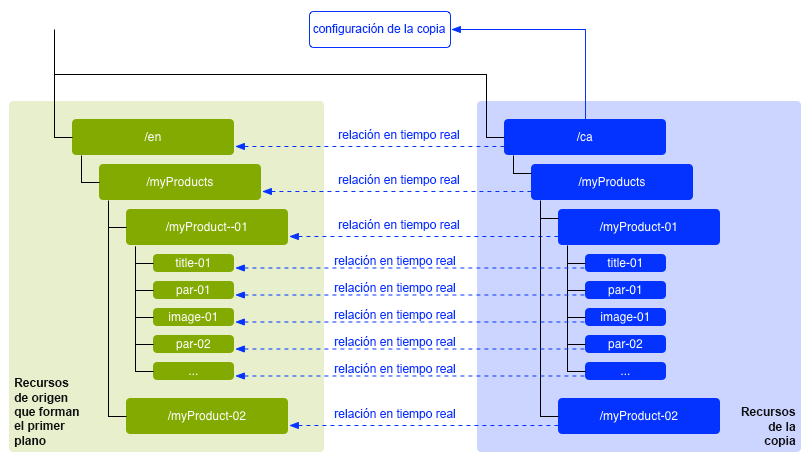
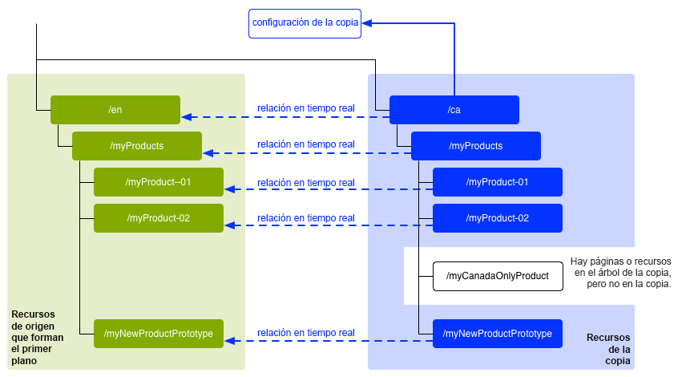
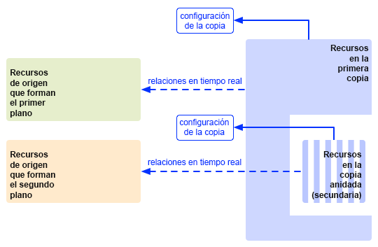
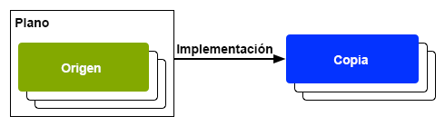
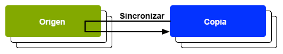

# Reutilización del contenido: administrador de varios sitios y Live Copy {#multi-site-manager-and-live-copy}

El Administrador de varios sitios (MSM) le permite usar el mismo contenido del sitio en diversas ubicaciones. MSM utiliza su funcionalidad de Live Copy para conseguirlo.

* Con MSM puede lograr lo siguiente:
   * Crear contenido una vez y después
   * reutilizarlo en otras áreas (mediante [Live Copies](#live-copies)) del mismo sitio u otros.
* A continuación, MSM mantiene las relaciones activas entre el contenido de origen y sus Live Copies para lo siguiente:
   * Al cambiar el contenido de origen, se sincronizan el origen y las Live Copies.
   * Puede hacer ajustes solo en el contenido de las Live Copies desconectando la relación activa para subpáginas o componentes individuales.

Esta página proporciona información general sobre cómo reutilizar contenido con MSM. Las siguientes páginas tratan en detalle los problemas relacionados.

* [Creación y sincronización de Live Copies](creating-live-copies.md)
* [Información general de la consola de Live Copy](live-copy-overview.md)
* [Configuración de la sincronización de Live Copy](live-copy-sync-config.md)
* [Conflictos de despliegue de MSM](rollout-conflicts.md)
* [Prácticas recomendadas de MSM](best-practices.md)

>[!NOTE]
>
>MSM también se puede utilizar para Assets, incluidos los Fragmentos de contenido. Ver [Reutilizar fragmentos de contenido usando MSM para Assets](/help/assets/reuse-assets-using-msm.md) (solo disponible a través de la consola de Assets).

## Posibles escenarios {#possible-scenarios}

Existen muchos casos de uso para MSM y Live Copies. Algunos incluyen lo siguiente:

* **Multinacionales: empresa global a local**

  Un caso de uso típico que admite MSM es reutilizar contenido en varios sitios multinacionales en el mismo idioma. Esto permite aprovechar el contenido principal, aunque también admite variaciones nacionales.

  Por ejemplo, la sección en inglés de la [Muestra de tutorial de WKND](/help/implementing/developing/introduction/develop-wknd-tutorial.md) se crea para clientes de EE. UU. La mayor parte del contenido de este sitio también puede usarse para otros sitios de WKND que atienden a clientes de habla inglesa de diferentes países y culturas. El contenido principal sigue siendo el mismo en todos los sitios, mientras que se pueden llevar a cabo ajustes regionales.

  La siguiente estructura se puede utilizar para sitios de Estados Unidos y Canadá. Observe cómo el nodo `language-masters` mantiene la copia maestra no solo del contenido en inglés sino de otros idiomas. Estos contenidos pueden servir de base para otros en lenguas regionales, además del inglés.

  ```xml
  /content
      |- wknd
          |- language-masters
              |- en
              |- es
              |- fr
          |- us
              |- en
              |- es
          |- ca
              |- en
              |- fr
  ```

  >[!NOTE]
  >
  >MSM no traduce el contenido. Se utiliza para crear la estructura necesaria e implementar el contenido.
  >
  >
  >Consulte [Traducción de contenido para sitios multilingües](/help/sites-cloud/administering/translation/overview.md) para ver un ejemplo.

* **Nacional: de la sede central a las subdivisiones regionales**

  Otra opción es que una empresa con una red de distribuidores puede querer sitios web separados para sus concesionarios individuales, cada uno de los cuales es una variación del sitio principal proporcionado por la sede central. Esto podría ser para una sola empresa con múltiples oficinas regionales, o un sistema nacional de franquicias compuesto por un franquiciador central y múltiples franquicias locales.

  La sede central puede proporcionar la información básica, mientras que las entidades regionales pueden añadir información local, como detalles de contacto, horarios de apertura y eventos.

  ```xml
  /content
      |- head-office-berlin
      |- branch-hamburg
      |- branch-stuttgart
      |- branch-munich
      |- branch-frankfurt
  ```

* **Varias versiones**

  MSM puede crear versiones de una subrama específica. Por ejemplo, un subsitio de asistencia puede contener detalles de las distintas versiones de un producto específico, donde la información base permanece constante y solo es necesario cambiar las funciones actualizadas:

  ```xml
  /content
      |- game-support
          |- polybius
              |- v5.0
              |- v4.0
              |- v3.0
              |- v2.0
              |- v1.0
  ```

  >[!TIP]
  >
  >En tal escenario, se trata de la cuestión de si hacer una copia directa o utilizar Live Copies, lo que supone un equilibrio entre lo siguiente:
  >
  >* La cantidad de contenido principal que debe actualizarse en varias versiones.
  >
  >Frente a:
  >
  >* La cantidad de copias individuales que deben ajustarse.

## MSM desde la IU {#msm-from-the-ui}

Se puede acceder directamente a MSM desde la IU mediante diversas opciones desde la consola adecuada.

* **Crear sitio** (**Sitios**)

   * MSM le ayuda a administrar varios sitios web que comparten contenido común. Por ejemplo: los sitios web suelen estar destinados a públicos internacionales, de modo que la mayor parte del contenido es común en todos los países, con un subconjunto del contenido específico de cada país. MSM le permite [crear Live Copies que actualicen automáticamente uno o más sitios basados en su sitio de origen](creating-live-copies.md#creating-a-live-copy-of-a-site-from-a-blueprint-configuration). Esto también le ayuda a aplicar una estructura base común, utilizar el contenido general en varios sitios, mantener un aspecto y un enfoque comunes y enfocar los esfuerzos en administrar el contenido que difiere entre los sitios. Crear un sitio de esta manera:
      * Requiere una configuración de modelo predefinida para especificar el origen.
      * Crea una Live Copy del origen (predefinido).
      * Proporciona al usuario el botón **Despliegue**.

* **Creación de Live Copy** (**Sites**)

   * MSM le permite [crear una Live Copy ad-hoc (única) de una página o rama individual de un sitio web](creating-live-copies.md#creating-a-live-copy-of-a-page). Por ejemplo, duplicar una subrama para proporcionar información sobre una versión nueva o actualizada de un producto. Crear una Live Copy de esta manera:
      * Crea una Live Copy ad-hoc (no se requiere configuración de modelo).
      * Se puede utilizar para crear (inmediatamente) una Live Copy de cualquier página o rama.
      * Requiere **Sincronizar** (no proporciona el botón **Despliegue**).

* **Ver propiedades** (**Sitios**)

   * Si corresponde, esta opción le ayuda a [monitorizar Live Copy](creating-live-copies.md#monitoring-your-live-copy) proporcionando información sobre la **Live Copy** o **Modelo** relacionado.

* **Referencias** (**Sitios**)

   * El carril [Referencias](/help/sites-cloud/authoring/basic-handling.md#references) proporciona información sobre **Live Copies** junto con el acceso a las acciones adecuadas.

* **Información general de Live Copy** (**Sites**)

   * Esta consola le permite [ver y administrar su modelo y sus Live Copies](live-copy-overview.md).

* **Modelos** (**Herramientas** - **Sites**)

   * Esta consola le permite [crear y administrar sus configuraciones de modelo](creating-live-copies.md#creating-a-blueprint-configuration).

>[!NOTE]
>
>MSM se puede usar con ambas páginas y [Fragmentos de experiencias](/help/sites-cloud/authoring/fragments/experience-fragments.md), ya que estos fragmentos son parte de una experiencia (página).

>[!NOTE]
>
>Los aspectos de la funcionalidad de MSM se utilizan en varias otras funciones de AEM, como los lanzamientos. En estos casos, dicha función administra Live Copy.

### Términos utilizados {#terms-used}

Como introducción, la siguiente tabla proporciona una descripción general de los términos principales utilizados con MSM. Se tratarán en más detalles en las secciones y páginas siguientes.

| Término | Definición | Más detalles |
|---|---|---|
| Origen | Las páginas originales utilizadas como base para Live Copies | Sinónimo de páginas de modelos o modelos |
| Live Copy | La copia (del origen), mantenida mediante acciones de sincronización definidas según las configuraciones de despliegue |  |
| Configuración de Live Copy | Definición de los detalles de configuración de una Live Copy |  |
| Relación activa | Definición efectiva de la herencia para un recurso determinado, es decir, la conexión entre el origen y Live Copies | Garantiza que los cambios en el origen se puedan sincronizar con Live Copy |
| Modelo | Sinónimo de origen | Se puede definir mediante una configuración de modelo |
| Configuración del modelo | Configuración predefinida que especifica una ruta de origen | Cuando se hace referencia a una página de modelo en una configuración de modelo, el comando Despliegue está disponible |
| Capítulo | Las secciones del modelo que se incluirán en la Live Copy | Generalmente, son páginas secundarias de la raíz |
| Sincronización | Término genérico para la sincronización de contenido entre el origen y las Live Copies (por las opciones **Despliegue** y **Sincronizar**) |  |
| Despliegue | Sincroniza desde el origen a Live Copy | Se puede activar mediante un autor (en una página de modelo) o mediante un evento del sistema (tal como se define en la configuración de despliegue) |
| Configuración de despliegue | Reglas que determinan qué propiedades se sincronizan, cómo y cuándo |  |
| Sincronizar | Solicitud manual de sincronización, realizada desde las páginas de Live Copy |  |
| Herencia | Una página o componente de Live Copy hereda contenido de su página o componente de origen cuando se produce la sincronización |  |
| Suspender | Elimina temporalmente la relación activa entre una Live Copy y su página de modelo |  |
| Desasociar | Elimina permanentemente la relación activa entre una Live Copy y su página de modelo |  |
| Restablecer | Restablecer una página de Live Copy para quitar todas las cancelaciones de herencia y devolver la página al mismo estado que la página de origen | Restablecer afecta a cualquier cambio que haya realizado en las propiedades de la página, el sistema de párrafos y los componentes. |
| Superficial | Una Live Copy de una sola página |  |
| Profundo | Una Live Copy de una página, junto con sus páginas secundarias |  |

>[!TIP]
>
>Consulte [Ampliación del Administrador de varios sitios](/help/implementing/developing/extending/msm.md#overview-of-the-java-api) para ver los nombres de los objetos.

## Live Copies {#live-copies}

Una Live Copy de MSM es una copia de contenido de un sitio específico que mantiene una relación activa con el origen:

* Live Copy hereda el contenido de su origen.
* La sincronización realiza la transferencia real de contenido cuando se realizan cambios en el origen.
* Una Live Copy puede considerarse como:
   * Superficial: una sola página
   * Profundo: la página, junto con sus páginas secundarias
* Las reglas de sincronización, denominadas configuraciones de despliegue, determinan qué propiedades se sincronizan y cuándo se produce la sincronización.

En el ejemplo anterior, `/content/wknd/language-masters/en` es la ubicación maestra global en inglés. Para reutilizar el contenido de este sitio, se crean Live Copies de MSM:

* El contenido siguiente `/content/wknd/language-masters/en` es el origen.
* El contenido siguiente `/content/wknd/language-masters/en` se copia debajo de `/content/wknd/us/en/` y `/content/wknd/ca/en` nodos. Estas son Live Copies.
* Los autores cambian de página por debajo de `/content/wknd/language-masters/en`.
* Cuando se activa, MSM sincroniza estos cambios con Live Copies.

### Live Copies: composición {#live-copies-composition}

>[!NOTE]
>
>Los diagramas y las descripciones de esta sección representan instantáneas de posibles Live Copies. No son exhaustivas, pero ofrecen una descripción general para resaltar características específicas.

Cuando crea una Live Copy, las páginas de origen seleccionadas se reflejan en 1:1 en Live Copy. Después de esto, también se pueden crear nuevos recursos (páginas o párrafos) directamente dentro de Live Copy, por lo que es útil tener en cuenta estas variaciones y cómo afectan a la sincronización. Las posibles composiciones incluyen las siguientes:

* [Live Copy con páginas que no sean de Live Copy](#live-copy-with-non-live-copy-pages)
* [Live Copies anidadas](#nested-live-copies)

La forma básica de Live Copy tiene lo siguiente:

* Páginas de Live Copy que reflejen las páginas de origen seleccionadas de forma individual :1.
* Una definición de configuración.
* Una relación activa definida para cada recurso:
   * Vincule el recurso de Live Copy con su modelo u origen.
   * Se utilizan para realizar la herencia y el despliegue.

Los cambios se pueden [sincronizar](creating-live-copies.md#synchronizing-your-live-copy) según los requisitos.



#### Live Copy con páginas que no sean de Live Copy {#live-copy-with-non-live-copy-pages}

Cuando crea una Live Copy en AEM, puede ver y navegar por la rama de Live Copy y utilizar la funcionalidad de AEM normal en la rama de Live Copy. Esto significa que usted (o un proceso) puede crear nuevos recursos (páginas o párrafos) dentro de Live Copy. Por ejemplo, un producto para una región o un país en particular.

* Estos recursos no tienen relación activa con las páginas de origen/modelo y no se sincronizan.
* Pueden producirse escenarios que MSM gestione como casos especiales. Por ejemplo, cuando usted (o un proceso) crea una página con la misma posición y el mismo nombre en las ramas de origen/modelo y Live Copy. Para estas situaciones, consulte [Conflictos de despliegue de MSM](rollout-conflicts.md) para obtener más información.



#### Live Copies anidadas {#nested-live-copies}

Al crear (o un proceso) una [nueva página dentro de una Live Copy existente](#live-copy-with-non-live-copy-pages) esta nueva página también se puede configurar como Live Copy de un modelo diferente. Esto se conoce como una Live Copy anidada. En Live Copies anidadas, el comportamiento de la segunda Live Copy o de la copia interna se ve afectado por la primera o la Live Copy externa de las siguientes maneras:

* Se puede continuar con un despliegue profundo activado para Live Copy de nivel superior en la Live Copy anidada.
* Cualquier vínculo entre los orígenes se reescribe dentro de Live Copies.

Por ejemplo, los vínculos que apuntan desde el segundo al primer modelo se reescriben como vínculos que apunten desde la Live Copy anidada/segunda a la primera Live Copy.



>[!NOTE]
>
>Si mueve o cambia el nombre de una página dentro de la rama de Live Copy, esta se trata como una Live Copy anidada para permitir que AEM rastree las relaciones.

#### Copias activas apiladas {#stacked-live-copies}

Una Live Copy se conoce como Live Copy apilada cuando se crea como el elemento secundario de una Live Copy superficial. Se comporta de la misma manera que una [Live Copy anidada](#nested-live-copies).

### Fuentes, modelos y configuraciones de modelo {#source-blueprints-and-blueprint-configurations}

Cualquier página o rama de páginas puede utilizarse como fuente de una Live Copy. Sin embargo, MSM también le permite definir una configuración de modelo que especifica una ruta de origen. Los beneficios de utilizar una configuración de modelo son los siguientes:

* Permiten que el autor use la opción de **Despliegue** en un modelo. Es decir, le permiten insertar explícitamente modificaciones en Live Copies que hereden de este modelo.
* Permiten que el autor utilice **Crear sitio**. Esto permite al usuario seleccionar idiomas fácilmente y configurar la estructura de la Live Copy.
* Definen una configuración de despliegue predeterminada para Live Copies que tengan una relación con el modelo.

El origen de una Live Copy pueden ser tanto páginas normales como páginas incluidas en una configuración de modelo. Ambos son casos de uso válidos.

El origen forma el modelo para la Live Copy. El modelo se define al:

* [Crear una configuración de modelo](creating-live-copies.md#creating-a-blueprint-configuration): la configuración define de antemano las páginas que se utilizarán para crear la Live Copy.
* [Crear una Live Copy de una página](creating-live-copies.md#creating-a-live-copy-of-a-page): las páginas utilizadas para crear la Live Copy (las páginas de origen) son las páginas de modelo. Una configuración de modelo podría hacer referencia a la página de origen.

### Desplegar y sincronizar {#rollout-and-synchronize}

Un despliegue es la acción central de MSM que sincroniza Live Copies con sus orígenes. Puede realizar despliegues manualmente o automáticamente.

* Una [configuración de despliegue](#rollout-configurations) puede definirse de modo que [eventos](live-copy-sync-config.md#rollout-triggers) específicos puedan provocar un despliegue automáticamente.
* Al crear una página de modelo, puede usar el comando **[Despliegue](creating-live-copies.md#rolling-out-a-blueprint)** para insertar cambios en la Live Copy.
   * El comando **Despliegue** está disponible en una página de modelo a la que se hace referencia mediante una configuración de modelo.

  

* Al crear una página de Live Copy, puede usar el comando **[Sincronizar](creating-live-copies.md#synchronizing-a-live-copy)** para extraer cambios del origen a la Live Copy.
   * El comando **Sincronizar** siempre está disponible en la página de Live Copy, independientemente de si la página de origen/modelo está incluida en una configuración de modelo.

  

### Opciones de configuración del lanzamiento {#rollout-configurations}

Una configuración de despliegue define cuándo y cómo se sincroniza una Live Copy con el contenido de origen. Una configuración de despliegue consta de un activador y una o más acciones de sincronización:

* **Activador**: un activador es un evento que hace que se produzca la acción de sincronización dinámica, como la activación de una página de origen. MSM define los activadores que puede utilizar.
* **Acciones de sincronización**: las acciones de sincronización se realizan en la Live Copy para sincronizarlas con el origen. Algunas acciones de ejemplo son copiar contenido, ordenar nodos secundarios y activar la página de Live Copy. MSM proporciona varias acciones de sincronización.

>[!NOTE]
>
>Puede crear acciones personalizadas para su instancia mediante la API de Java.

Las configuraciones de despliegue se pueden reutilizar, de modo que más de una Live Copy pueda utilizar la misma configuración de despliegue. Varias [configuraciones de despliegue](live-copy-sync-config.md#installed-rollout-configurations) se incluyen en una instalación estándar.

### Despliegue de conflictos {#rollout-conflicts}

Los despliegues se pueden complicar, especialmente cuando los autores editan contenido tanto en el origen como en la Live Copy. Por lo tanto, es útil tener en cuenta cómo administra AEM los [conflictos que puedan producirse durante el despliegue](rollout-conflicts.md).

### Suspender y cancelar la herencia y sincronización {#suspending-and-cancelling-inheritance-and-synchronization}

Cada página y componente de una Live Copy está asociado con su página de origen y componente a través de una relación dinámica. La relación dinámica configura la sincronización de contenido de Live Copy desde el origen.

Puede **Suspender** la herencia Live Copy de una página de Live Copy para cambiar las propiedades y los componentes de la página. Al suspender la herencia, las propiedades y los componentes de la página ya no se sincronizan con el origen.

Al editar una página individual, los autores pueden **Cancelar la herencia** de un componente. Cuando se cancela la herencia, la relación dinámica se suspende y la sincronización no se lleva a cabo para ese componente. Cancelar la herencia y la sincronización resulta útil cuando se deben personalizar las subsecciones del contenido.

### Desasociación de una Live Copy {#detaching-a-live-copy}

También puede [desasociar una Live Copy](creating-live-copies.md#detaching-a-live-copy) de su modelo para eliminar todas las conexiones.

>[!CAUTION]
>
>La acción Desasociar es permanente e irreversible.

La acción desasociar elimina permanentemente la relación dinámica entre una Live Copy y su página de modelo. Todas las propiedades relevantes para MSM se eliminan de Live Copy y las páginas de Live Copy se convierten en una copia independiente.

>[!TIP]
>
>Consulte [Desasociar una Live Copy](creating-live-copies.md#detaching-a-live-copy) para obtener información detallada, incluido el impacto relacionado en las páginas principales y secundarias.

## Pasos estándar para usar MSM {#standard-steps-for-using-msm}

Los siguientes pasos describen el procedimiento estándar de uso de MSM para reutilizar contenido y sincronizar cambios en Live Copies.

1. Desarrollar el contenido del sitio de origen.
1. Determine la configuración de despliegue que desea utilizar.

   1. MSM [instala varias configuraciones de despliegue](live-copy-sync-config.md#installed-rollout-configurations) que pueden satisfacer varios casos de uso.
   1. Opcionalmente, puede [crear una configuración de despliegue](live-copy-sync-config.md#creating-a-rollout-configuration) si es necesario.

1. Determine dónde debe [especificar las configuraciones de despliegue que se van a utilizar](live-copy-sync-config.md#specifying-the-rollout-configurations-to-use) y configúrelas según sea necesario.
1. Si es necesario, [cree una configuración de modelo](creating-live-copies.md#creating-a-blueprint-configuration) que identifique el contenido de origen de Live Copy.
1. [Crear una Live Copy](creating-live-copies.md#creating-a-live-copy).
1. Realice los cambios necesarios en el contenido de origen. Debe utilizar el proceso normal de revisión y aprobación de contenido que ha establecido su organización.
1. [Despliegue](creating-live-copies.md#rolling-out-a-blueprint) el modelo o [sincronice la Live Copy](creating-live-copies.md#synchronizing-a-live-copy) con los cambios.

## Personalización de MSM {#customizing-msm}

MSM proporciona herramientas para que su implementación se pueda adaptar a las complejidades excepcionales que puedan existir al compartir contenido.

* **Configuraciones de despliegue personalizadas**: [cree una configuración de despliegue](live-copy-sync-config.md#creating-a-rollout-configuration) si las instaladas no cumplen con sus requisitos. Puede utilizar cualquier activador de despliegue y acción de sincronización disponible.

<!--
* **Custom Synchronization Actions** - [Create a custom synchronization action](/help/sites-developing/extending-msm.md#creating-a-new-synchronization-action) when the installed actions do not meet your specific application requirements. MSM provides a Java API for creating custom synchronization actions.
-->

## Prácticas recomendadas {#best-practices}

La página [Prácticas recomendadas de MSM](best-practices.md) contiene información importante sobre la implementación.
