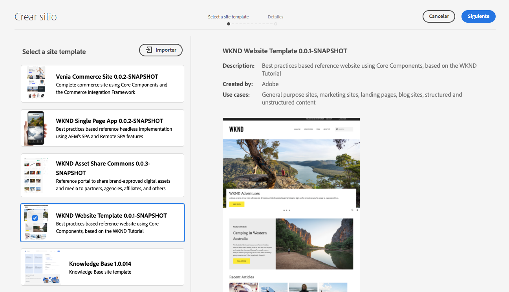
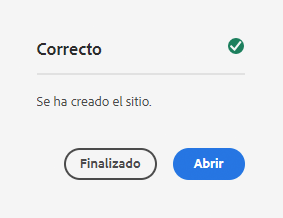
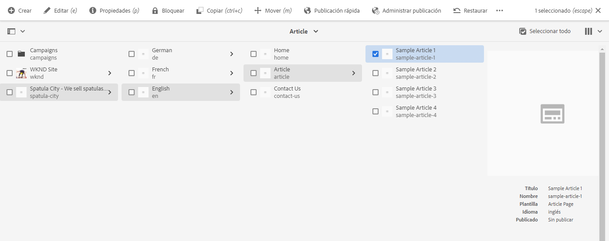

# Crear un sitio {#creating-site}

{{traditional-aem}}

Aprenda a utilizar AEM para crear un sitio mediante plantillas de sitio para definir el estilo y la estructura del sitio.

## Información general {#overview}

Para que los autores de contenido puedan crear páginas con contenido, primero debe crearse el sitio. Esto generalmente lo realiza un administrador de AEM que define la estructura inicial del sitio. El uso de plantillas de sitio hace que la creación del sitio sea rápida y flexible.

La herramienta Creación rápida de sitios de AEM permite a los usuarios que no son desarrolladores crear rápidamente un sitio desde cero mediante plantillas de sitio.

Una vez creada, la herramienta de creación rápida de sitios también permite la personalización rápida del tema y el estilo del sitio AEM (JavaScript, CSS y recursos estáticos). Esto permite que el desarrollador del front-end, que no necesita ningún conocimiento de AEM, trabaje de forma independiente y paralela a los creadores de contenido. El administrador de AEM simplemente descarga el tema del sitio y lo proporciona al desarrollador de front-end que lo personaliza con sus herramientas favoritas y luego confirma los cambios en el repositorio de código de AEM, que luego se implementa.

Este documento se centra en la creación de sitios mediante la herramienta de creación rápida de sitios. Si desea obtener información general sobre el flujo de trabajo de creación y personalización del sitio, consulte [Recorrido de creación rápida de sitios de AEM](/help/journey-sites/quick-site/overview.md)

## Planificación de la estructura del sitio {#structure}

Tómese tiempo para tener en cuenta el propósito de su sitio y el contenido planificado con mucha antelación. Esto impulsará la forma en que se diseña la estructura del sitio. Una buena estructura del sitio permite una fácil navegación y detección de contenido para los visitantes del sitio y también admite varias funciones de AEM, como la [administración y traducción de varios sitios](/help/sites-cloud/administering/msm-and-translation.md).

>[!TIP]
>
>[El sitio de referencia WKND](https://wknd.site) proporciona una implementación de prácticas recomendadas de un sitio web de marca de experiencias al aire libre completamente funcional. Explórela para ver cómo está estructurado un sitio AEM bien construido.

## Plantillas de sitios {#site-templates}

Debido a que la estructura del sitio es tan importante para el éxito de un sitio, resulta conveniente tener estructuras predefinidas disponibles para implementar rápidamente un nuevo sitio en función de un conjunto de estándares existentes. Las plantillas de sitio son una forma de combinar el contenido básico del sitio en un paquete conveniente y reutilizable.

Las plantillas del sitio suelen contener contenido y estructura base del sitio, así como información de estilo, para comenzar con uno nuevo rápidamente. Las plantillas son eficaces, ya que se pueden reutilizar y personalizar. Y como puede tener varias plantillas disponibles en la instalación de AEM, tiene la flexibilidad de crear diferentes sitios para satisfacer diversas necesidades comerciales.

>[!TIP]
>
>Para obtener más información sobre las plantillas de sitios, consulte [Plantillas de sitios](site-templates.md).

>[!NOTE]
>
>La plantilla del sitio no se debe confundir con las plantillas de página. Las plantillas de sitio definen la estructura general de un sitio. Una plantilla de página define la estructura y el contenido inicial de una página individual.

## Crear un sitio {#create-site}

El uso de una plantilla para crear un sitio es sencillo.

1. Inicie sesión en el entorno de creación de AEM y vaya a la consola Sites.

   * `https://<your-author-environment>.adobeaemcloud.com/sites.html/content`

1. Seleccione **Crear** en la parte superior derecha de la pantalla y en el menú desplegable, seleccione **Sitio a partir de una plantilla**.

   

1. En el asistente Crear sitio, seleccione una plantilla existente en el panel izquierdo o en **Importar** en la parte superior de la columna izquierda para importar una nueva plantilla.

   

   1. Si elige importar, en el explorador de archivos, busque la plantilla que desee usar y seleccione **Cargar**.

   1. Una vez cargado, aparece en la lista de plantillas disponibles.

1. Al seleccionar una plantilla, se muestra información sobre la plantilla en la columna derecha. Con la plantilla deseada seleccionada, seleccione **Siguiente**.

   

1. Proporcione un título para el sitio. Se puede proporcionar un nombre de sitio o se genera a partir del título si se omite.

   * El título del sitio aparece en la barra de título de los exploradores.
   * El nombre del sitio forma parte de la dirección URL.
   * El nombre del sitio debe cumplir con las [convenciones de asignación de nombres de páginas de AEM](/help/sites-cloud/authoring/sites-console/organizing-pages.md#page-name-restrictions-and-best-practices).

1. Seleccione **Crear** y el sitio se creará a partir de la plantilla del sitio.

   

1. En el cuadro de diálogo de confirmación que aparece, seleccione **Listo**.

   

1. En la consola Sitios, el nuevo sitio es visible y se puede navegar para explorar su estructura básica según se define en la plantilla.

   

¡Los autores de contenido ahora pueden empezar a crear!

## Personalización del sitio {#site-customization}

Si su sitio requiere personalización más allá de las plantillas disponibles, tiene varias opciones.

* Si es necesario ajustar la estructura del sitio o el contenido inicial, [la plantilla del sitio se puede personalizar para satisfacer sus necesidades](site-templates.md).
* Si es necesario ajustar el estilo del sitio, [el tema del sitio se puede descargar y personalizar](/help/journey-sites/quick-site/overview.md).
* Si se debe ajustar la funcionalidad del sitio, [el sitio se puede personalizar completamente](/help/implementing/developing/introduction/develop-wknd-tutorial.md).

Cualquier personalización debe realizarse con el apoyo de un equipo de desarrollo.
