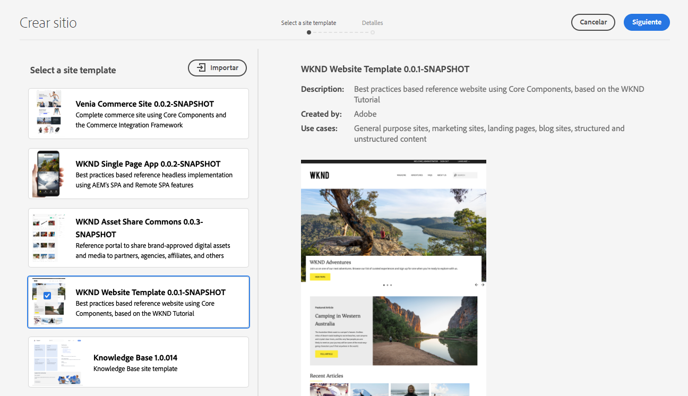

# Plantillas de sitios {#site-templates}

{{traditional-aem}}

Descubra cómo se pueden utilizar las plantillas de sitio AEM para predefinir la estructura del sitio y el contenido inicial para permitirle crear sitios rápidamente.

## Información general {#overview}

Es práctico tener estructuras predefinidas disponibles para implementar rápidamente un nuevo sitio basado en un conjunto de estándares existentes. Las plantillas de sitio son una forma de combinar el contenido básico del sitio en un paquete conveniente y reutilizable.

Las plantillas de sitio generalmente contienen contenido y estructura base del sitio, así como información de estilo del sitio, conocida como [tema del sitio](site-themes.md), para comenzar un nuevo sitio rápidamente. Los administradores seleccionan una plantilla de sitio en la que basar el sitio [durante el proceso de creación del sitio](create-site.md).

Las plantillas son eficaces, ya que se pueden reutilizar y personalizar. Y como puede tener varias plantillas disponibles en la instalación de AEM, tiene la flexibilidad de crear diferentes sitios para satisfacer diversas necesidades comerciales.

>[!NOTE]
>
>Las plantillas de sitio de AEM no deben confundirse con las [plantillas de página](/help/sites-cloud/authoring/page-editor/templates.md). Las plantillas de sitio definen la estructura general de un sitio. Una plantilla de página define la estructura y el contenido inicial de una página individual.
>
>Las plantillas de sitio de AEM no deben confundirse con los [temas de sitio de AEM](site-themes.md). Los temas del sitio de AEM solo contienen la información de estilo de un sitio de AEM. Las plantillas del sitio de AEM definen la estructura del sitio y el contenido inicial. Además, contienen un tema del sitio de AEM para permitir una [rápida creación del sitio](create-site.md).

## Adición de una plantilla de sitio a AEM {#adding}

Puede agregar varias plantillas a AEM, que luego se pueden usar para [crear sitios](create-site.md).

1. Inicie sesión en el entorno de creación de AEM y vaya a la consola Sites.

   * `https://<your-author-environment>.adobeaemcloud.com/sites.html/content`

1. Seleccione **Crear** en la parte superior derecha de la pantalla y en el menú desplegable, seleccione **Sitio a partir de una plantilla**.

   

1. En el asistente Crear sitio, seleccione **Importar** en la parte superior de la columna izquierda.

   

1. En el explorador de archivos, busque la plantilla que desee usar y seleccione **Cargar**.

1. Una vez cargado, aparece en la lista de plantillas disponibles.

La plantilla se ha cargado y se puede usar en [crear sitios nuevos](create-site.md).

Al seleccionar una plantilla existente, muestra información sobre la plantilla en la columna derecha.

## Estructura de la plantilla del sitio {#structure}

Las plantillas de sitio son simplemente paquetes con una estructura lógica que refleja claramente el propósito del contenido del paquete. Una plantilla de sitio tiene la siguiente estructura.

* `files`: carpeta con el kit de interfaz de usuario, XD archivo y, posiblemente, otros archivos
* `previews`: carpeta con capturas de pantalla de la plantilla del sitio.
* `site`: paquete de contenido del contenido que se copia para cada sitio creado a partir de esta plantilla, como plantillas de página, páginas, etc.
* `theme`: fuentes del [tema del sitio](site-themes.md) para modificar el aspecto del sitio, incluidos CSS, JavaScript, etc.

## Plantilla de sitio estándar {#standard-site-template}

Adobe proporciona una plantilla de referencia de prácticas recomendadas que puede utilizar como base para crear sus propias plantillas. [La plantilla de sitio estándar está disponible en GitHub](https://github.com/adobe/aem-site-template-standard).

[La última versión de la plantilla de sitio estándar](https://github.com/adobe/aem-site-template-standard/releases) se puede descargar y utilizar directamente para [crear nuevos sitios](create-site.md).

## Desarrollo de plantillas de sitio {#developing-templates}

Adobe proporciona el Generador de plantillas de sitio de AEM como un conjunto de secuencias de comandos para la creación de nuevas plantillas de sitio.

[El generador de plantillas de sitio AEM está disponible junto con la documentación de uso en GitHub](https://github.com/adobe/aem-site-template-builder). El desarrollador front-end necesita experiencia para personalizar el [tema del sitio](site-themes.md) y el desarrollador de AEM necesita conocimiento para personalizar la estructura y el contenido del sitio.
