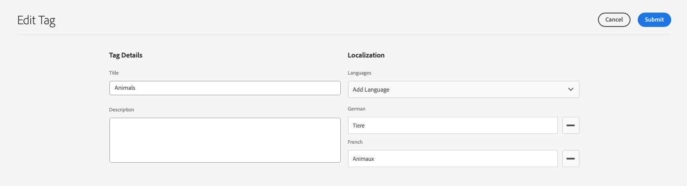

# Administración de etiquetas {#administering-tags}

Las etiquetas son un método intuitivo de clasificar el contenido. Se pueden considerar como palabras clave o etiquetas (metadatos) que permiten encontrar el contenido más rápidamente.

En Adobe Experience Manager AEM (), una etiqueta puede ser una propiedad de:

* Un nodo de contenido para una página
   * Ver el documento [Uso de etiquetas](/help/sites-cloud/authoring/sites-console/tags.md) para obtener más información.
* Un nodo de metadatos para un recurso
   * Ver el documento [Administración de metadatos para recursos digitales](/help/assets/manage-metadata.md) para obtener más información.

>[!TIP]
>
>Se recomienda minimizar el número de etiquetas relacionadas con las mismas ideas. Por ejemplo, si administra contenido de una tienda de suministros al aire libre, probablemente no necesite una etiqueta para ambas **calzado** y **zapatos**.

## Características de etiquetas {#tag-features}

Las etiquetas ofrecen funciones sólidas para organizar y administrar el contenido.

* Las etiquetas se pueden agrupar en varias áreas de nombres.
   * Las áreas de nombres se pueden considerar como jerarquías que permiten crear taxonomías.
   * AEM Estas taxonomías son globales en todo el mundo
* Los autores pueden aplicar las etiquetas y los visitantes del sitio pueden utilizarlas.
* Independientemente de su creador, todas las formas de etiquetas están disponibles para su selección, tanto al asignarlas a una página como al buscar.
* Las etiquetas son utilizadas por [Componente Lista](https://experienceleague.adobe.com/docs/experience-manager-core-components/using/wcm-components/list.html) para generar listas dinámicas basadas en las etiquetas seleccionadas.

## Requisitos de etiquetas {#requirements}

Hay algunos detalles técnicos que se deben tener en cuenta al crear y administrar etiquetas.

* Las etiquetas deben ser únicas dentro de un área de nombres específica.
* El nombre de una etiqueta no puede incluir delimitadores de etiqueta:
   * Dos puntos (`:`): Delimita la etiqueta de área de nombres
   * Barra diagonal (`/`): Delimita las subetiquetas
* Si el título de una etiqueta incluye delimitadores de etiqueta, estos se suprimirán en la interfaz de usuario.
* Las etiquetas se pueden crear y los miembros del grupo pueden modificar su taxonomía `tag-administrators` grupo y miembros que tienen derechos de modificación a `/content/cq:tags`.
   * Una etiqueta que contiene etiquetas secundarias se denomina etiqueta contenedora.
   * Una etiqueta que no es una etiqueta contenedora se denomina etiqueta de hoja.
   * Un área de nombres de etiqueta puede ser una etiqueta de hoja o una etiqueta contenedora.

Para obtener más información técnica sobre cómo funcionan las etiquetas, consulte [AEM Marco de etiquetado de](/help/implementing/developing/introduction/tagging-framework.md).

## Consola de etiquetado {#tagging-console}

La consola de etiquetado se utiliza para crear y administrar etiquetas y sus taxonomías. Puede utilizar la consola de etiquetado para administrar las etiquetas de las siguientes formas:

* Agrupándolos en áreas de nombres.
* Revise el uso de las etiquetas existentes antes de crear nuevas.
* Reorganizar las etiquetas sin desconectar la etiqueta del contenido al que se hace referencia actualmente.

Para acceder a la consola de etiquetado:

1. Inicie sesión en un entorno de creación con privilegios administrativos.
1. En el menú de navegación global, seleccione **`Tools`** > **`General`** >
   **`Tagging`**.

## Creación de nuevas etiquetas {#creating-new-tags}

Existen varios pasos para crear y utilizar etiquetas para organizar el contenido.

1. [Cree un área de nombres para las etiquetas](#creating-namespaces) (o elija uno existente para reutilizarlo).
1. [Cree una etiqueta nueva.](#creating-tags)
1. [Publique la etiqueta.](#publishing-tags)

### Creación de áreas de nombres {#creating-namespaces}

Se utiliza un área de nombres para organizar otras etiquetas. Se puede considerar como la etiqueta de nivel inferior y se suele utilizar para agrupar otras etiquetas.

1. Para crear un área de nombres, abra [consola de etiquetado](#tagging-console) y seleccione la **Crear** en la barra de herramientas y, a continuación, **Crear área de nombres**.

   

1. Proporcione la información necesaria.

   * **Título** : un título para el área de nombres mostrado al usuario en la interfaz de usuario (opcional)
   * **Nombre** - Si no se especifica un nombre, se crea un nombre de nodo válido a partir del **Título**. Ver el documento [AEM Marco de etiquetado de](/help/implementing/developing/introduction/tagging-framework.md#tagid) para obtener más información.
   * **Descripción** : descripción del área de nombres (opcional)

1. Una vez introducida la información necesaria, seleccione **Crear**.

Se crea el área de nombres. En la consola de etiquetado, las áreas de nombres se encuentran en el nivel inferior (en la columna del extremo izquierdo de la consola) y se representan mediante iconos de carpeta, que reflejan su naturaleza como &quot;contenedor&quot; o agrupación de otras etiquetas.

Ahora puede [crear nuevas etiquetas](#creating-tags) en esta área de nombres o [administrar etiquetas existentes.](#managing-tags)

Un área de nombres no necesita contener subetiquetas. Como un área de nombres es en sí misma una etiqueta, se puede utilizar para organizar el contenido como cualquier otra etiqueta. Sin embargo, para seguir creando una taxonomía de etiquetado estructurada, puede [creación de subetiquetas](#creating-tags) dentro de ese área de nombres según los requisitos del proyecto.

### Creación de etiquetas {#creating-tags}

Las etiquetas se suelen añadir a áreas de nombres.

1. Para crear una etiqueta, abra el [consola de etiquetado.](#tagging-console)

1. Seleccione el área de nombres donde desea crear la etiqueta. O seleccione otra etiqueta para crear una subetiqueta debajo de ella.

1. Seleccione el **Crear** en la barra de herramientas y, a continuación, **Crear etiqueta**.

1. El **Crear etiqueta** se abre. Proporcione la información necesaria para la nueva etiqueta.

   * **Título** - Un título para mostrar para la etiqueta (obligatorio)
   * **Nombre** - Un nombre para la etiqueta (obligatorio). Si no se especifica, se crea un nombre de nodo válido a partir del **Título**. Consulte [TagID](/help/implementing/developing/introduction/tagging-framework.md#tagid).
   * **Descripción** - Una descripción de la etiqueta
   * **Ruta de etiqueta** : El valor predeterminado es el área de nombres (o etiqueta) seleccionada en la consola de etiquetado. Esto se puede actualizar manualmente tocando o haciendo clic en el icono del selector de rutas.

   

1. Seleccione **Enviar**.

La etiqueta se crea y la consola se actualiza para mostrar la nueva etiqueta.

Las etiquetas permiten la creación flexible de su propia taxonomía en función de sus necesidades organizativas.

* Puede crear etiquetas secundarias de etiquetas existentes seleccionando la etiqueta principal en la consola antes de crear la nueva etiqueta.
* Si crea una etiqueta sin seleccionar un área de nombres u otra etiqueta, creará de forma efectiva un área de nombres.

### Publicación de etiquetas {#publishing-tags}

AEM Al igual que con la creación de cualquier otro contenido en la, después de crear una etiqueta (o área de nombres), solo existe en el entorno de creación. Para que las etiquetas estén disponibles para los usuarios, debe publicarlas.

1. Para publicar una etiqueta, abra el [consola de etiquetado.](#tagging-console)

1. Seleccione las etiquetas que desee publicar y, en la barra de herramientas, seleccione **Publish**.

   

1. El **Publicar etiqueta** El cuadro de diálogo solicita una confirmación para publicar las etiquetas seleccionadas. Seleccione **Publicar**.

   

1. La acción de publicación se confirma con un **Correcto** diálogo.

   

Las etiquetas seleccionadas se han puesto en la cola de publicación. Al igual que el contenido de la página, solo se publican las etiquetas seleccionadas, independientemente de si tienen o no subetiquetas.

Para publicar una taxonomía completa (un área de nombres y subetiquetas), la práctica recomendada es crear una [paquete](/help/implementing/developing/tools/package-manager.md) del área de nombres (consulte [Nodo raíz de taxonomía](/help/implementing/developing/introduction/tagging-framework.md#taxonomy-root-node)).

<!--
Be sure to [apply permissions](#setting-tag-permissions) to the namespace before creating the package.
-->

## Administración de etiquetas {#managing-tags}

Existen varias acciones que puede realizar en las etiquetas y áreas de nombres existentes para administrarlas y organizarlas. Simplemente, seleccione una etiqueta o área de nombres en la [consola de etiquetado](#tagging-console) para mostrar en la barra de herramientas las acciones disponibles.

* [Ver propiedades](#viewing-tag-properties)
* [Editar](#editing-tags)
* [Cancelar publicación](#unpublishing-tags)
* [Referencias](#viewing-tag-references)
* [Mover](#moving-tags)
* [Combinar](#merging-tags)
* [Eliminar](#deleting-tags)

Cuando no hay suficiente espacio disponible en la barra de herramientas, hay opciones adicionales disponibles detrás del icono de puntos suspensivos.

### Visualización de propiedades de etiqueta {#viewing-tag-properties}

Cuando se selecciona una sola etiqueta, un área de nombres u otra etiqueta en la consola de etiquetado, los detalles básicos de la etiqueta seleccionada, como la hora de la última edición y la última publicación, se muestran en la columna a la izquierda de la columna de etiqueta.

Puede ver más detalles acerca de la etiqueta, incluidos quién la publicó por última vez y cuándo cambió la consola a **Propiedades** vista.

1. Para ver las propiedades de una etiqueta, abra el [consola de etiquetado.](#tagging-console)

1. Seleccione la etiqueta cuyas propiedades desee ver y, en el carril izquierdo, seleccione **Propiedades**.

   

1. Las propiedades detalladas de la etiqueta seleccionada se muestran en el carril izquierdo.

   

Para obtener más información sobre la selección de los modos de visualización y el carril, consulte [Gestión básica](/help/sites-cloud/authoring/basic-handling.md#rail-selector).

### Edición de etiquetas {#editing-tags}

Las etiquetas y los espacios de nombre se pueden editar después de la creación.

1. Para editar una etiqueta, abra el [consola de etiquetado.](#tagging-console)

1. Seleccione la etiqueta que desee editar y, en la barra de herramientas, seleccione **Editar**.

1. Realice los cambios que desee. Es posible modificar el:

   * **Título**
   * **Descripción**
   * [**Localización**](#managing-tags-in-different-languages)

1. Una vez realizadas las ediciones, seleccione **Enviar**.

Para obtener más información sobre cómo añadir traducciones de idioma, consulte la sección sobre [Administración de etiquetas en diferentes idiomas](#managing-tags-in-different-languages).

Si los cambios que ha realizado son de una etiqueta ya publicada, es posible que desee [vuelva a publicarlo.](#publishing-tags)

### Cancelar publicación de etiquetas {#unpublishing-tags}

Para desactivar la etiqueta en la instancia de autor y quitarla de la instancia de publicación, puede cancelar la publicación.

1. Para cancelar la publicación de una etiqueta, abra el [consola de etiquetado.](#tagging-console)

1. Seleccione la etiqueta o etiquetas que desea cancelar la publicación y, en la barra de herramientas, seleccione **Cancelar publicación**.

   

1. El **Cancelar publicación de etiqueta** El cuadro de diálogo solicita una confirmación para publicar las etiquetas seleccionadas. Seleccione **Publicar**.

   

1. La acción de cancelación de publicación se confirma con un **Correcto** diálogo.

   

Las etiquetas seleccionadas se han puesto en la cola de cancelación de publicación. Si la etiqueta seleccionada es una etiqueta contenedora, todas sus etiquetas secundarias se desactivarán en el entorno de creación y se eliminarán del entorno de publicación.

### Visualización de referencias de etiqueta {#viewing-tag-references}

Puede resultar útil ver a qué contenido se aplica una etiqueta en particular. Para ello, utilice el complemento **Referencias** en la consola de etiquetado.

1. Para ver las referencias de una etiqueta, abra el [consola de etiquetado.](#tagging-console)

1. Seleccione la etiqueta cuyas referencias desee ver y, en el carril izquierdo, seleccione **Referencias**.

   

1. El número total de referencias para la etiqueta seleccionada se muestra en el carril izquierdo.

   

1. Seleccione el número de referencias de etiqueta para ver la lista detallada del contenido asignado a la etiqueta.

   

Pase el ratón o seleccione un contenido de referencia en la lista para mostrar la ruta completa del contenido.

Para obtener más información sobre la selección de los modos de visualización y el carril, consulte [Gestión básica](/help/sites-cloud/authoring/basic-handling.md#rail-selector).

### Mover etiquetas {#moving-tags}

Puede ser necesario limpiar o reorganizar la taxonomía de etiquetado moviendo una etiqueta a una nueva ubicación o cambiándole el nombre.

>[!TIP]
>
>Se recomienda que solo se permita a los administradores mover y cambiar el nombre de las etiquetas.

1. Para mover o cambiar el nombre de una etiqueta, abra [consola de etiquetado.](#tagging-console)

1. Seleccione la etiqueta que desee mover o cambiar el nombre y seleccione **Mover** en la barra de herramientas.

1. En el **Mover etiqueta** , especifique qué propiedad desea cambiar.

   * **Cambiar nombre a** - El nuevo nombre que desea dar a la etiqueta
      * Este campo se rellena previamente con el nombre actual de la etiqueta.
      * Deje sin modificar si sólo desea mover la etiqueta y no cambiarle el nombre.
   * **Mover a** - Dónde desea mover la etiqueta
      * Este campo se rellena previamente con la ubicación actual de la etiqueta.
      * Deje sin modificar si sólo desea cambiar el nombre de la etiqueta y no moverla.

   

1. Seleccione **Enviar**.

Se cambia el nombre de la etiqueta o se mueve a su nueva ubicación. Si la etiqueta seleccionada es una etiqueta contenedora, al mover la etiqueta también se moverán todas las etiquetas secundarias.

### Combinación de etiquetas {#merging-tags}

Si la taxonomía de etiquetado tiene duplicados o etiquetas similares, puede resultar útil combinar esas etiquetas. Etiqueta When `A` se combina en la etiqueta `B`, todas las páginas etiquetadas con la etiqueta `A` se etiquetan con etiqueta `B` Etiqueta y `A` ya no está disponible para los autores.

1. Para combinar dos etiquetas, abra [consola de etiquetado.](#tagging-console)

1. Seleccione la etiqueta que desea combinar en otra etiqueta y, a continuación, seleccione **Combinar** en la barra de herramientas.

1. En el **Combinar etiqueta** , seleccione la **Examinar** icono de la **Combinar en** para especificar en qué etiqueta desea combinar la etiqueta seleccionada.

   

1. Seleccione **Enviar**.

La etiqueta seleccionada en la consola se combina con la etiqueta especificada en el cuadro de diálogo. Cuando se mueve o combina una etiqueta a la que se hace referencia, la etiqueta no se elimina físicamente de modo que sea posible mantener referencias. Consulte [AEM Marco de etiquetado de](/help/implementing/developing/introduction/tagging-framework.md#moving-and-merging-tags) para obtener más información.

### Eliminación de etiquetas {#deleting-tags}

Si la taxonomía de etiquetado cambia y hace que una etiqueta o área de nombres sea innecesaria, se puede eliminar.

1. Para eliminar una etiqueta, abra el [consola de etiquetado.](#tagging-console)

1. Seleccione la etiqueta que desee eliminar y, a continuación, seleccione **Eliminar** en la barra de herramientas.

1. El **Eliminar etiqueta** El cuadro de diálogo solicita una confirmación para eliminar las etiquetas seleccionadas. Seleccione **Eliminar**.

   

1. AEM Comprobaciones para asegurarse de que no se hace referencia a la etiqueta.

   1. AEM Si no se encuentran referencias, se solicita una confirmación final para eliminar el elemento de la lista de referencias. Seleccionar **Eliminar**

      

   1. AEM Si se encuentran referencias, las presenta y solicita una confirmación final para su eliminación.

      

Las etiquetas seleccionadas se eliminarán y se eliminarán permanentemente del entorno de creación. Si la etiqueta se publicó, también se elimina del entorno de publicación. Si la etiqueta seleccionada es una etiqueta contenedora, también se eliminan todas sus etiquetas secundarias.

<!--

## Setting Tag Permissions {#setting-tag-permissions}

Tag permissions are ['secure (by default)'](/help/sites-administering/production-ready.md); a best practice for the publish environment that requires read permission to be explicitly allowed for tags. Bascially, this is done by creating a package of the Tag Namespace after permissions have been set on author, and installing the package on all publish instances.

* on author instance

    * sign in with administrative privileges
    * access the [Security Console](/help/sites-administering/security.md#accessing-user-administration-with-the-security-console),

        * for example, browse to http://localhost:4502/useradmin

    * in the left pane, select the group (or user) for which [read permission](/help/sites-administering/security.md#permissions) is to be granted
    * in the right pane, locate the **Path **to the Tag Namespace

        * for example, `/content/cq:tags/mycommunity`

    * select the `checkbox`in the **Read** column
    * select **Save**

* ensure all publish instances have same permissions

    * one approach is to [create a package](/help/sites-administering/package-manager.md#package-manager) of the namespace on author

        * on `Advanced` tab, for `AC Handling` select `Overwrite`

    * replicate the package

        * choose `Replicate` from package manager

-->

## Administración de etiquetas en diferentes idiomas {#managing-tags-in-different-languages}

El `title` La propiedad de una etiqueta se puede traducir a varios idiomas. Una vez traducido, el título de etiqueta adecuado se puede mostrar según el idioma del usuario o el contenido.

Supongamos que tenemos una etiqueta llamada.. `Animals` que queremos traducir al alemán y al francés.

1. Abra el [consola de etiquetado.](#tagging-console)

1. Seleccione la etiqueta que desee traducir y, a continuación, seleccione **Editar** en la barra de herramientas.

1. En el **Editar etiqueta** diálogo, en el **Localización** , seleccione el idioma de destino, por ejemplo, alemán.

1. En el **Alemán** que aparece, proporcione el título traducido.

1. Repita los dos pasos anteriores para francés.

   

1. Seleccione **Enviar**.

Para las páginas de contenido, el idioma elegido para la etiqueta se toma del idioma de la página, cuando está disponible.

AEM Sin embargo, en el entorno de creación de, utiliza la configuración de idioma del usuario. Por lo tanto, en la consola de etiquetado, para `Animals` etiqueta, `Animaux` se mostraría para un usuario que establece el idioma en francés en sus propiedades de usuario.

Para añadir un nuevo idioma al cuadro de diálogo, consulte el documento [AEM Creación de etiquetas en aplicaciones de](/help/implementing/developing/introduction/tagging-applications.md#adding-a-new-language-to-the-edit-tag-dialog)

>[!TIP]
>
>AEM Si desea obtener más información acerca de las funciones de localización de la, consulte [Traducción Del Contenido Para Sitios Multilingües](/help/sites-cloud/administering/translation/overview.md).
