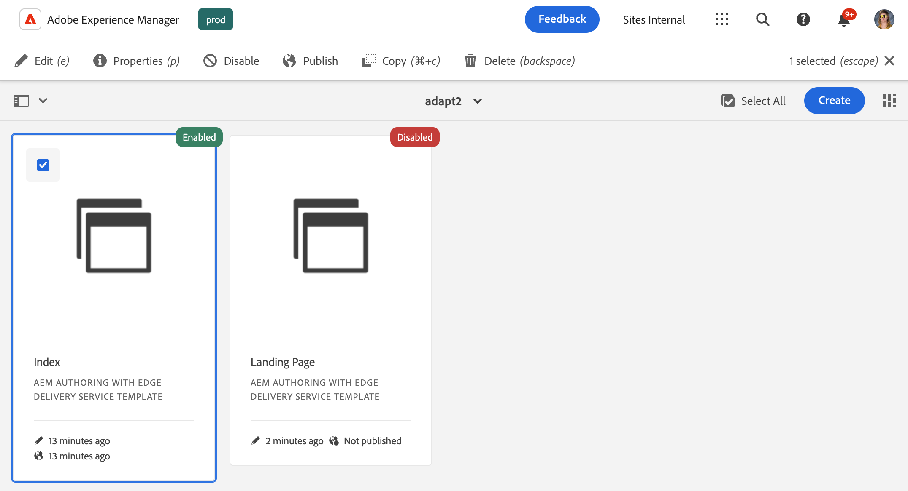

# La consola Plantillas {#templates-console}

Descubra cómo la consola de plantillas sirve como ubicación central para ver y administrar las plantillas de página.

## Información general {#overview}

Al crear una página, debe seleccionar una plantilla. La plantilla de página se utiliza como base para la nueva página. [Las plantillas editables de AEM](/help/implementing/developing/components/templates.md) pueden definir la estructura de la página resultante, el contenido inicial y los componentes que se pueden utilizar (propiedades de diseño).

A los autores de contenido se les presenta una selección de plantillas disponibles cuando [crean páginas nuevas en la consola Sitios](/help/sites-cloud/authoring/sites-console/creating-pages.md). Las plantillas se pueden utilizar para crear páginas editables con:

* [El editor de páginas](/help/sites-cloud/authoring/page-editor/templates.md) o
* [Editor universal](/help/sites-cloud/authoring/universal-editor/templates.md)

La consola de plantillas permite a un administrador ver y administrar todas las plantillas de página en una ubicación central.

## Acceso a la consola Plantillas {#accessing}

1. Inicie sesión en AEM as a Cloud Service.
1. Abra la navegación global y seleccione el panel **Herramientas** y, a continuación, **General** -> **Plantillas**.

## Orientación {#orientation}

La consola de plantillas está organizada en carpetas con una carpeta por cada [configuración](/help/implementing/developing/introduction/configurations.md) en las que se han activado plantillas editables para la configuración.

[La vista predeterminada](/help/sites-cloud/authoring/quick-start.md) de la consola es la vista de tarjetas. Toque o haga clic en una carpeta para explorar su contenido.

Seleccione una plantilla para mostrar las opciones disponibles en la barra de herramientas.

* [Editar](#edit-edit)
* [Propiedades](#properties)
* [Deshabilitar/habilitar](#enable-disable)
* [Publicación](#publish)
* [Copiar](#copy)
* [Eliminar](#delete)

## Editar {#edit}

Al editar una plantilla, se abre el editor que se utilizó para crearla. O bien, haga lo siguiente:

* [Editor de plantillas](/help/sites-cloud/authoring/page-editor/templates.md)
* [Editor universal](/help/sites-cloud/authoring/universal-editor/templates.md)

Con cualquier editor, puede realizar los cambios necesarios en la plantilla. Tenga en cuenta que la edición de una plantilla en uso puede afectar a los autores.

* En el caso de las plantillas creadas con el Editor de plantillas, los cambios realizados pueden afectar a las páginas activas basadas en la plantilla seleccionada.
* En el caso de las plantillas creadas con el Editor universal, los cambios realizados afectan únicamente a las páginas nuevas que los autores creen en función de la plantilla seleccionada.

Si un autor inicia una plantilla creada con el editor de plantillas que ya se ha habilitado, se muestra una advertencia.

>[!TIP]
>
>Una vez seleccionada una plantilla en la consola, use la tecla de acceso directo `e` para editar la plantilla seleccionada.

## Propiedades {#properties}

Puede editar las [propiedades de la plantilla](/help/sites-cloud/authoring/page-editor/templates.md) de la misma manera que puede [editar las propiedades de página.](/help/sites-cloud/authoring/sites-console/edit-page-properties.md) propiedades de plantilla incluyen:

* Título de plantilla
* Descripción
* Imagen

>[!TIP]
>
>Una vez seleccionada una plantilla en la consola, use la tecla de acceso directo `p` para abrir las propiedades de la plantilla seleccionada.

## Activación y desactivación {#enable-disable}

Una plantilla puede tener uno de estos tres estados:

* **Borrador**: la plantilla aún se está creando y no está disponible para crear páginas nuevas.
* **Habilitada**: la plantilla está completa y disponible para crear páginas nuevas.
* **Deshabilitada**: la plantilla está completa pero no está disponible para crear páginas nuevas.

Cuando se crea una plantilla, está de forma predeterminada en un estado **Borrador** (para plantillas creadas con [Editor de plantillas](/help/sites-cloud/authoring/page-editor/templates.md)) o en estado **Habilitado** (para plantillas creadas con [Editor universal](/help/sites-cloud/authoring/universal-editor/templates.md)).

Se debe habilitar una plantilla para que los autores de contenido puedan utilizarla para crear páginas. Si una plantilla ya no es necesaria, se puede deshabilitar para que ya no se muestre en el asistente de creación de páginas.

* Seleccione la plantilla y haga clic en **Deshabilitar** para deshabilitarla.
* Seleccione la plantilla y haga clic en **Habilitar** para habilitarla.

## Publicación {#publish}

Una plantilla creada con el editor de plantillas solo se puede utilizar una vez publicada. Seleccione la plantilla y haga clic en **Publicar** para publicar.

No es necesario publicar las plantillas creadas con el editor universal para poder utilizarlas.

## Copiando {#copy}

Si tiene varias páginas con una estructura similar, puede usar el botón **Copiar** para crear un ámbito de plantilla y luego variar la copia según sus necesidades. Esto también es útil si desea utilizar una plantilla en otro sitio.

1. Seleccione la plantilla y, a continuación, toque o haga clic en **Copiar** para crear una copia.
1. Desplácese hasta donde desee crear la copia.
1. Toque o haga clic en **Pegar** en la barra de herramientas.

Una vez pegado, puede:

* [Edite la plantilla](#edit) para ajustarla según sea necesario.
* [Use la ventana de propiedades](#properties) para actualizar el título de la plantilla.
* [Habilite la plantilla](#enable-disable) para que pueda utilizarse para crear página.
* [Publicar la plantilla](#publish) si es necesario.

>[!TIP]
>
>Una vez seleccionada una plantilla en la consola, use la tecla de acceso directo `Command+c` o `ctrl+c` para copiar la plantilla seleccionada.

## Eliminando {#delete}

Si una plantilla ya no es necesaria, se puede eliminar siempre que ninguna página haga referencia a ella.

Seleccione la plantilla y, a continuación, toque o haga clic en **Eliminar** para eliminarla.

>[!TIP]
>
>Una vez seleccionada una plantilla en la consola, use la tecla de acceso directo `Backspace` para eliminar la plantilla seleccionada.

## Creación de plantillas {#create}

Use el botón **Crear** de la consola para crear una nueva plantilla en su ubicación actual. Para obtener más información sobre cómo crear una plantilla, consulte el documento [Plantillas para crear páginas que se pueden editar con el editor de páginas](/help/sites-cloud/authoring/page-editor/templates.md).

El botón **Crear** solo se usa para crear plantillas que se puedan editar con el Editor de páginas. Consulte el documento [Plantillas para crear páginas que se pueden editar con el editor universal](/help/sites-cloud/authoring/universal-editor/templates.md) para obtener más información acerca de la creación de plantillas basadas en páginas creadas con el editor universal.
