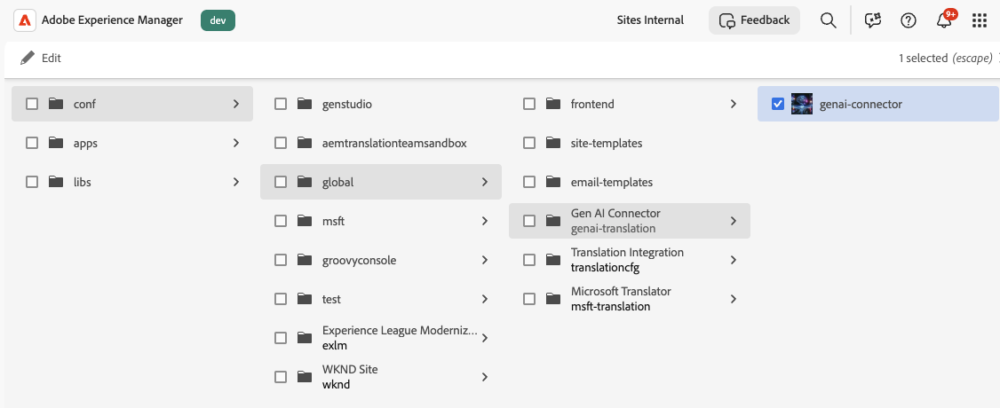
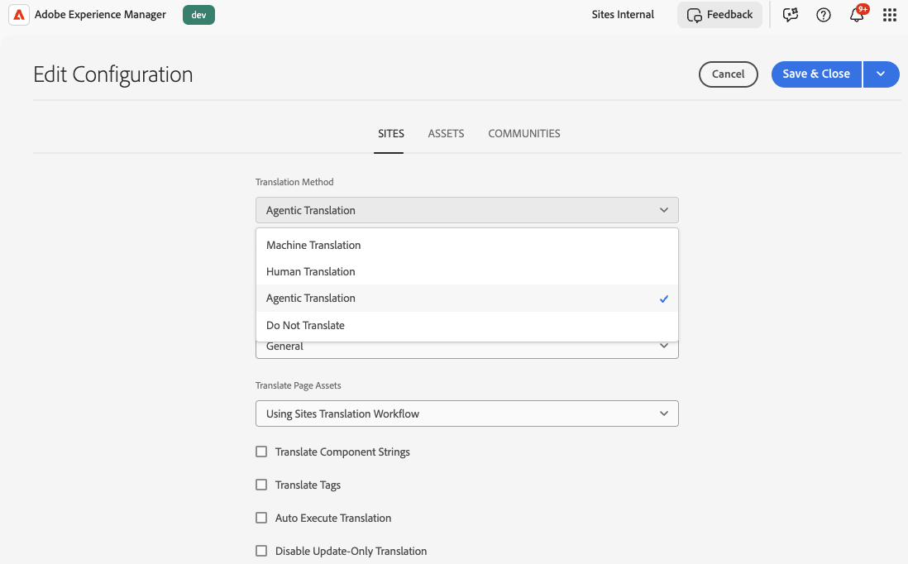

# Configuración de la integración de traducción AI {#ai-translation-integration}

La integración de traducción de IA le permite usar un **modelo de idioma grande (LLM)** como servicio de traducción para el contenido que crea en Adobe Experience Manager. Conecta AEM a tu proveedor LLM (empezando por Microsoft Azure OpenAI), reutiliza los mismos [flujos de trabajo de traducción](/help/sites-cloud/administering/translation/overview.md) que para otros conectores y, opcionalmente, carga **guías de estilo de traducción** para que AEM pueda generar reglas que mantengan la coherencia del tono, la terminología y el idioma de marca en todas las configuraciones regionales.

Para obtener información general sobre proyectos de traducción, configuraciones en la nube y el marco de trabajo de integración de traducciones, consulte [Traducción de contenido para sitios multilingües](overview.md) y [Configuración del marco de trabajo de integración de traducciones](integration-framework.md).

## Cómo encaja la traducción de IA en AEM {#how-ai-translation-fits-in-aem}

Los modelos de idiomas grandes pueden traducir pasajes completos con atención al contexto, el tono y las expresiones idiomáticas en lugar de la sustitución literal palabra por palabra. Al configurar la integración de traducción de IA, LLM actúa como un **servicio de traducción de terceros** de la misma manera que otros proveedores a los que se conecta a través de AEM. Usted proporciona su **licencia propia y credenciales** para el servicio LLM.

La compatibilidad inicial conecta AEM con **Azure OpenAI**. Adobe planea añadir compatibilidad con proveedores adicionales en una versión posterior.

Puede configurar tanto la conexión LLM como las guías de estilo opcionales en **Cloud Services de traducción**, junto con el resto de las configuraciones de traducción. Puede utilizar diferentes servicios de traducción para diferentes [configuraciones de nube](/help/sites-cloud/administering/translation/integration-framework.md#creating-a-translation-integration-configuration); por ejemplo, una configuración puede utilizar la traducción de IA mientras que otra utiliza un conector de traducción automática tradicional.

## Configuración de Cloud Services de traducción {#configure-translation-cloud-services}

Configure la traducción de IA en el mismo área en la que administra otras configuraciones de nube de traducción.

1. En el [menú de navegación global](/help/sites-cloud/authoring/basic-handling.md#global-navigation), seleccione **Herramientas** > **Cloud Services** > **Cloud Services de traducción**.
1. Abra o cree la configuración donde desee habilitar la traducción de IA (incluido `/conf/global` si la capacidad debe aplicarse en sentido amplio).

## Configuración de la conexión LLM {#configure-the-llm-connection}

La experiencia **Configuración de traducción automática** incluye una sección **LLM Config** en la que conectas a tu proveedor.

1. Abra la configuración de traducción de IA para la entrada de Cloud Services de traducción.
1. Seleccione **[!UICONTROL Configuración LLM]**.
1. Elija su proveedor (por ejemplo, **Azure OpenAI**).
1. Escriba las credenciales y los detalles del extremo requeridos para su suscripción (**Clave de API**, **Versión de API**, **Ruta de acceso base**, **Nombre de implementación** y cualquier otro campo que requiera su proveedor).
1. Guarde la configuración.

## Añadir guías de estilo de traducción y reglas generadas {#add-translation-style-guides-and-generated-rules}

Puede cargar **documentos de la guía de estilo de traducción** (normalmente uno por idioma de destino). AEM analiza cada guía y genera **reglas de traducción** para alinear la salida con las expectativas lingüísticas y de marca.

1. En **Configuración de traducción automática**, seleccione **[!UICONTROL Directrices LLM]**.
1. Elija una configuración regional y use **[!UICONTROL Cargar]** para agregar un documento de guía de estilo para ese idioma.
1. Mientras AEM procesa una guía, un indicador de estado muestra el progreso (**procesando**, **completado** o **anulado**).
1. Revise o edite las reglas generadas en el editor (por ejemplo, JSON que captura el tono, la terminología y los ejemplos).

## Configuración del método de traducción predeterminado en el módulo {#set-the-default-translation-method-in-the-framework}

Una vez guardada la configuración en la nube, registre **traducción auténtica** como el comportamiento predeterminado en la configuración de [Translation Integration Framework](integration-framework.md) cuando cree proyectos de traducción. Puede cambiar el método por proyecto si es necesario.

## Ejecución de proyectos de traducción {#run-translation-projects}

Una vez configurada la traducción de IA y asociada con sus páginas, [crea y ejecuta proyectos de traducción](managing-projects.md) del mismo modo que con otros proveedores de traducción. El contenido de las páginas, los fragmentos de contenido y los recursos sigue las reglas de traducción y la configuración del marco de trabajo.

>[!NOTE]
>
>La integración de traducción de IA **no** está disponible en el [Asistente de IA de la interfaz de usuario de chat de Adobe Experience Manager](/help/implementing/cloud-manager/ai-assistant-in-aem.md) o en la interfaz del agente de producción de Experience Cloud. Utilice los flujos de trabajo de traducción y las consolas descritas en este artículo.

