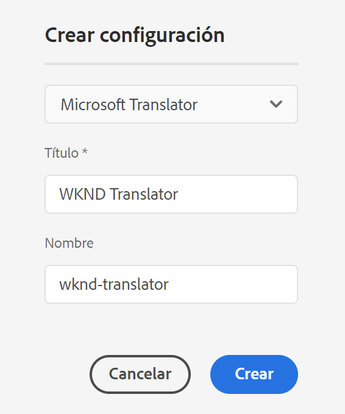
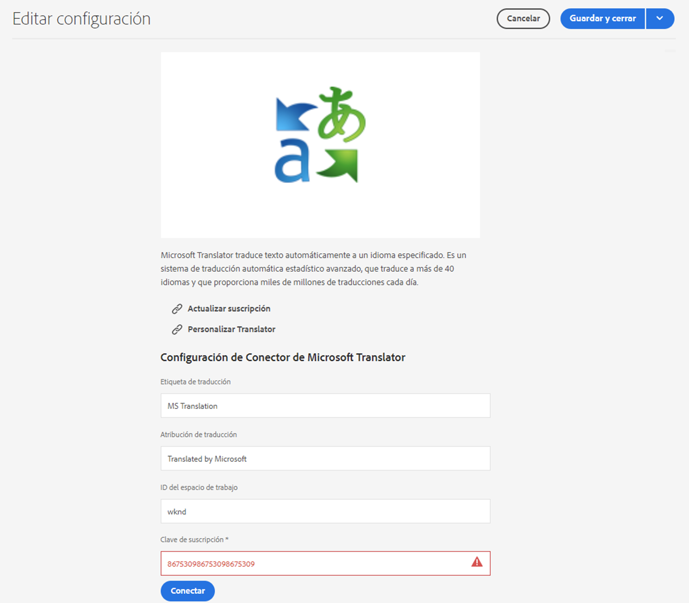

# Volver a conectar con Microsoft Translator {#connecting-to-microsoft-translator}

Cree una configuración para el servicio en la nube de [Microsoft Translator](https://www.microsoft.com/es-es/translator/business/) y use su cuenta de Microsoft Translation para traducir contenido o recursos de la página de AEM.

>[!TIP]
>
>Si es nuevo traduciendo contenido, consulte nuestro [Recorrido de traducción de sitios,](/help/journey-sites/translation/overview.md) que es una ruta guiada a través de la traducción del contenido de AEM Sites mediante las potentes herramientas de traducción de AEM. Es ideal para aquellos que no tengan experiencia ni en traducción ni en AEM.

>[!NOTE]
>
>AEM proporciona una cuenta de versión de prueba de Microsoft Translation que permite un máximo de 2 000 000 caracteres traducidos gratuitos al mes. Para obtener una suscripción de cuenta adecuada para los sistemas de producción, consulte [Actualización de la configuración de la licencia de versión de prueba de Microsoft Translator](#upgrading-the-microsoft-translator-trial-license-configuration).

| Propiedad | Descripción |
|---|---|
| Etiqueta de traducción | El nombre para mostrar del servicio de traducción |
| Atribución de traducción | (Opcional) Para el contenido generado por el usuario, la atribución que aparece junto al texto traducido, por ejemplo `Translations by Microsoft` |
| ID del espacio de trabajo | (Opcional) El ID del motor personalizado de Microsoft Translator que debe utilizar |
| Clave de suscripción | La clave de suscripción de Microsoft para Microsoft Translator |

Después de crear la configuración, debe [activarla](#activating-the-translator-service-configurations).

El siguiente procedimiento crea una configuración de Microsoft Translator.

1. En el [panel de navegación,](/help/sites-cloud/authoring/getting-started/basic-handling.md#first-steps) pulse o haga clic en **Herramientas** -> **Cloud Services** -> **Cloud Services de traducción**.
1. Vaya a donde desea crear la configuración. Normalmente, se encuentra en la raíz del sitio o puede ser una configuración global predeterminada.
1. Pulse o haga clic en el botón **Crear**.
1. Defina la configuración.
   1. Seleccione **Microsoft Translator** en la lista desplegable.
   1. Escriba un título para la configuración. El título identifica la configuración en la consola Cloud Services, así como en las listas desplegables de propiedades de página.
   1. De forma opcional, escriba un nombre para usar para el nodo del repositorio que almacena la configuración.

   

1. Haga clic en **Crear**.
1. En la ventana **Editar configuración**, proporcione los valores para el servicio de traducción descrito en la tabla anterior.

   

1. Pulse o haga clic en **Conectar** para verificar la conexión.
1. Haga clic o pulse en **Guardar y cerrar**.

## Actualización de la configuración de la licencia de versión de prueba de Microsoft Translator {#upgrading-the-microsoft-translator-trial-license-configuration}

Las páginas de configuración de Microsoft Translation proporcionan un práctico vínculo al sitio web de Microsoft para obtener una suscripción de cuenta adecuada para los sistemas de producción.

1. En el [panel de navegación,](/help/sites-cloud/authoring/getting-started/basic-handling.md#first-steps) pulse o haga clic en **Herramientas** -> **Cloud Services** -> **Cloud Services de traducción**.
1. Pulse o haga clic en la configuración de Microsoft Translator existente.
1. Haga clic o pulse en **Editar**.
1. En la ventana **Editar configuración**, pulse o haga clic en **Actualizar suscripción**. Se abre una página web de Microsoft con más detalles acerca del servicio.

## Personalización del motor de Microsoft Translator {#customizing-your-microsoft-translator-engine}

Las páginas de configuración de Microsoft Translation proporcionan un práctico vínculo al sitio web de Microsoft para personalizar el motor de Microsoft Translator.

1. En el [panel de navegación,](/help/sites-cloud/authoring/getting-started/basic-handling.md#first-steps) pulse o haga clic en **Herramientas** -> **Cloud Services** -> **Cloud Services de traducción**.
1. Pulse o haga clic en la configuración de Microsoft Translator existente.
1. Haga clic o pulse en **Editar**
1. En la ventana **Editar configuración**, pulse o haga clic en **Personalizar traductor**. Utilice la página web de Microsoft que se abre para personalizar el servicio.

## Activación de las configuraciones del servicio de traducción {#activating-the-translator-service-configurations}

Debe activar las configuraciones del servicio en la nube para que admitan el contenido traducido que se replica en la instancia de publicación. Utilice el método de [Publicación de un árbol](/help/sites-cloud/authoring/fundamentals/publishing-pages.md#publishing-and-unpublishing-a-tree) para activar los nodos del repositorio que almacenan las configuraciones de Microsoft Translator. Los nodos se encuentran debajo de los siguientes nodos principales:

* `/libs/settings/cloudconfigs/translation/msft-translation`
