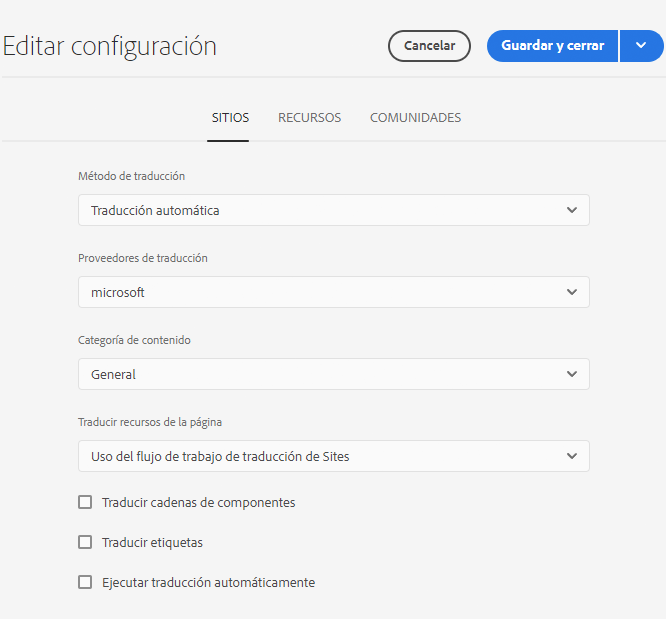
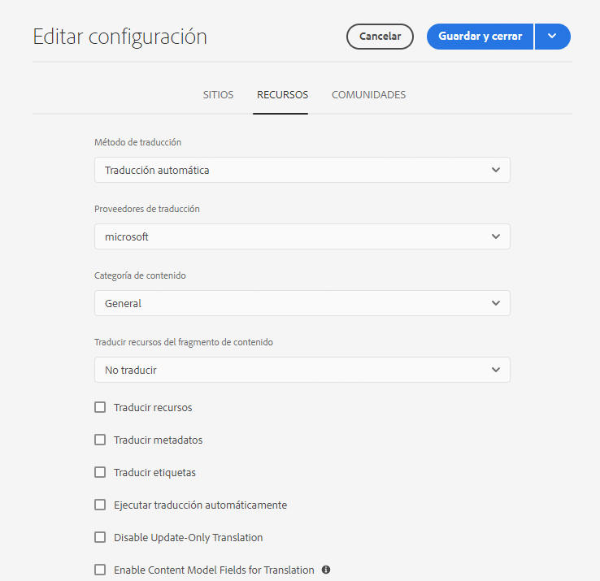

# Configuración del marco de trabajo de integración de traducción {#configuring-the-translation-integration-framework}

El marco de trabajo de integración de traducciones se conecta con los servicios de traducción de terceros para organizar la traducción de contenido de AEM. Requiere tres pasos básicos.

1. [Conéctese a su proveedor de servicios de traducción](#connecting-to-a-translation-service-provider).
1. [Crear una configuración del módulo de integración de traducción](#creating-a-translation-integration-configuration).
1. [Asocie las configuraciones en la nube con sus páginas](#configuring-pages-for-translation).

Para obtener información general sobre las funciones de traducción de contenido de AEM, consulte [Traducción de contenido para sitios multilingües](overview.md).

>[!TIP]
>
>Si no tiene experiencia en la traducción de contenido, consulte el [Recorrido de traducción de sitios](/help/journey-sites/translation/overview.md), que es una ruta guiada a través de la traducción del contenido de AEM Sites AEM AEM mediante herramientas de traducción potentes que se utilizan para traducir contenido. Es ideal para aquellos que no tienen experiencia en traducción o en traducción de sitios.

## Conexión a un proveedor de servicios de traducción {#connecting-to-a-translation-service-provider}

AEM Cree una configuración en la nube que se conecte con su proveedor de servicios de traducción de forma que pueda acceder a la.

AEM De forma predeterminada, incluye la capacidad de [conectar con Microsoft® Translator](connect-ms-translator.md). AEM Hay otros proveedores de tecnología de traducción con conectores de trabajo que son miembros del programa de socios de Adobe Exchange [aquí](https://exchange.adobe.com/apps/browse/ec?page=1&partnerLevel=All&product=AEM&q=experience+manager+translation&sort=RELEVANCE).

Después de instalar un paquete de conector, puede crear una configuración de la nube para él. Normalmente, debe proporcionar sus credenciales para autenticarse en el servicio de traducción. Para obtener información sobre cómo agregar una configuración de nube para el conector de Microsoft® Translator, consulte [Integración con Microsoft® Translator](connect-ms-translator.md).

Si es necesario, puede crear varias configuraciones de nube para el mismo conector. Por ejemplo, cree una configuración para cada una de las cuentas o proyectos que tenga con el mismo proveedor.

Después de configurar una conexión, puede crear la configuración del marco de trabajo de integración de traducciones que la utiliza.

## Creación de una configuración de integración de traducción {#creating-a-translation-integration-configuration}

Cree una configuración del marco de trabajo de integración de traducciones para que pueda especificar cómo traducir el contenido. La configuración incluye la siguiente información:

* Qué proveedor de servicios de traducción utilizar
* Si se va a realizar una traducción humana o automática
* Si se va a traducir otro contenido asociado a una página o recurso, como etiquetas

Después de crear una configuración de marco de trabajo, asocia la configuración de la nube con las páginas que desea traducir según la configuración. Cuando se inicia el proceso de traducción, el flujo de trabajo de traducción se ejecuta según la configuración del marco de trabajo asociada.

Cuando las diferentes secciones del sitio web tengan distintos requisitos de traducción, cree varias configuraciones de marco de trabajo según corresponda. Por ejemplo, un sitio web multilingüe puede incluir copias en inglés, español y japonés. El propietario del sitio utiliza dos proveedores de servicios de traducción diferentes para las traducciones al español y al japonés. Por lo tanto, se establecen dos configuraciones del marco de trabajo. Cada configuración utiliza un proveedor de servicios de traducción diferente.

Después de configurar un marco de trabajo de integración de traducciones, puede [asociarlo a las páginas](preparation.md) que lo usan.

>[!TIP]
>
>Para obtener una descripción general de las funciones de traducción de contenido de AEM, consulte [Traducción de contenido para sitios multilingües](overview.md).

Una sola configuración del marco de trabajo controla cómo se traducen el contenido de la página y los recursos. Para crear una nueva configuración de traducción haga lo siguiente:

1. En el [menú de navegación global](/help/sites-cloud/authoring/basic-handling.md#global-navigation), seleccione **Herramientas > Cloud Service y Cloud Service de traducción**.
1. Desplácese hasta donde desee crear la configuración en la estructura de contenido. A menudo se basa en un sitio en particular, pero puede ser global.
1. Proporcione la siguiente información en los campos y seleccione **Crear**.:
   1. Seleccione **Tipo de configuración** en la lista desplegable.
   1. Escriba un **Título** para su configuración. El **Título** identifica la configuración en la consola **Cloud Services**, así como en las listas desplegables de propiedad de página.
   1. Opcionalmente, escriba un **Nombre** para usar para el nodo del repositorio que almacena la configuración.
1. En la ventana **Editar configuración**, configure las propiedades de las pestañas **Sitios** y **Assets**, y después seleccione **Guardar y cerrar**.

### Propiedades de configuración de sitios {#sites-configuration-properties}

La pestaña **Sitios** controla cómo se traduce el contenido de la página.

| Propiedad | Descripción |
|---|---|
| Método de traducción | Esta propiedad define el método de traducción que el marco de trabajo aplica al contenido del sitio. - Traducción automática: el proveedor de traducción efectúa la traducción mediante traducción automática en tiempo real. - Traducción humana: el contenido se envía al proveedor de traducción para que lo traduzcan traductores. - No traducir: el contenido no se envía para su traducción. Esto sirve para omitir ciertas divisiones de contenido que no se traducen, pero que podrían actualizarse con el contenido más reciente. |
| Proveedor de traducciones | Esta propiedad define el proveedor de traducción para llevar a cabo la traducción. Cuando se instala su conector correspondiente, aparece un proveedor en la lista. |
| Categoría de contenido | (Solo traducción automática) Esta propiedad es una categoría que describe el contenido que está traduciendo. La categoría puede afectar a la elección de la terminología y el estilo al traducir el contenido. |
| Traducir etiquetas | Esta opción permite traducir las etiquetas asociadas con la página. |
| Traducir recursos de la página | Esta propiedad define cómo traducir recursos que se añaden a componentes del sistema de archivos o a los que se hace referencia desde recursos: - No traducir: los recursos de la página no se traducen. - Uso del flujo de trabajo de traducción de sitios: los recursos se gestionan según las propiedades de configuración de la pestaña **Sitios**. - Uso del flujo de trabajo de traducción de recursos: los recursos se gestionan según las propiedades configuradas en la pestaña **Recursos**. |
| Ejecutar traducción automáticamente | Active esta propiedad para ejecutar los trabajos de traducción automáticamente después de crear los proyectos. Cuando selecciona esta opción, no tiene la oportunidad de revisar y ampliar el ámbito del trabajo de traducción. |
| Deshabilitar traducción de solo actualización | Cuando se activa esta opción, al actualizar el proyecto de traducción se envían todos los campos traducibles para su traducción, no solo los modificados desde la última traducción. |

### Propiedades de configuración de recursos {#assets-configuration-properties}

Las propiedades de recursos controlan cómo se configuran los recursos. Para obtener más información acerca de la traducción de recursos, consulte [Creación de copias de idioma para los recursos](/help/assets/translate-assets.md).

| Propiedad | Descripción |
|---|---|
| Método de traducción | Esta propiedad define el método de traducción que el marco de trabajo aplica al contenido de los recursos: - Traducción automática: el proveedor de traducción efectúa la traducción mediante traducción automática en tiempo real. - Traducción humana: el contenido se envía al proveedor de traducción para que lo traduzcan traductores. - No traducir: los recursos no se envían para su traducción. |
| Proveedor de traducciones | Esta propiedad define el proveedor de traducción para llevar a cabo la traducción. Cuando se instala su conector correspondiente, aparece un proveedor en la lista. |
| Categoría de contenido | (Solo traducción automática) Esta propiedad describe el contenido que está traduciendo. La categoría puede afectar a la elección de la terminología y el estilo al traducir el contenido. |
| Traducir recursos | Active esta propiedad para incluir recursos en el proyecto de traducción. |
| Traducir metadatos | Active esta propiedad para poder traducir metadatos de recursos. |
| Traducir etiquetas | Active esta propiedad para poder traducir las etiquetas asociadas al recurso. |
| Ejecutar traducción automáticamente | Seleccione esta propiedad para poder ejecutar los trabajos de traducción automáticamente después de crear los proyectos. Cuando selecciona esta opción, no tiene la oportunidad de revisar o ampliar el ámbito del trabajo de traducción. |
| Deshabilitar traducción de solo actualización | Cuando se activa esta opción, al actualizar el proyecto de traducción se envían todos los campos traducibles para su traducción, no solo los modificados desde la última traducción. |
| Habilitar los campos de modelo de contenido para la traducción | Al habilitar esta opción, se usa el campo **Traducible** en [Modelos de fragmento de contenido](/help/sites-cloud/administering/content-fragments/content-fragment-models.md#properties) para determinar si el campo está traducido y se crean automáticamente [reglas de traducción](rules.md) según corresponda. Esta opción reemplaza las reglas de traducción que haya creado. |

## Configuración de páginas para su traducción {#configuring-pages-for-translation}

Para configurar la traducción de las páginas de origen a otros idiomas, asócielas con las siguientes configuraciones de la nube:

* La configuración en la nube que conecta AEM con su proveedor de traducción.
* El marco de trabajo de integración de traducciones que configura los detalles de la traducción.

La configuración de nube del marco de trabajo de integración de traducciones identifica la configuración de nube que se utilizará para la conexión con el proveedor de servicios. Cuando asocia una página de origen con una configuración de nube de marco de trabajo, la página debe asociarse a la configuración de nube del proveedor de servicios que utiliza la configuración de nube de marco trabajo.

Cuando asocia una página con una configuración de nube, los descendientes de la página heredan la asociación. Por ejemplo, si asoció la página `/content/wknd/language-masters/en/magazine` con un marco de trabajo de integración de traducción, la página `magazine` y las páginas secundarias inferiores se traducen según el marco de trabajo.

Si es necesario, puede anular la asociación en una página descendiente. Por ejemplo, el contenido de un sitio web se refiere principalmente a viajes y estilo de vida. Sin embargo, una rama de páginas describe la compañía. En tal caso, la página raíz del sitio puede asociarse con un marco de trabajo de integración de traducciones que especifique la traducción automática con la categoría Estilo de vida. La rama que describe la compañía utilizará un marco de trabajo que realice la traducción automática mediante la categoría General.

### Asociación de una página con un proveedor de traducción {#associating-a-page-with-a-translation-provider}

Asocie una página al proveedor de traducción que esté utilizando para traducir la página y las páginas descendientes.

1. En la consola Sitios, seleccione la página que desea configurar y seleccione **Ver propiedades**.
1. Seleccione la pestaña **Cloud Services**.
1. En la lista desplegable **Agregar configuración**, seleccione la configuración.
1. Seleccione **Guardar y cerrar**.

### Asociación de páginas a un marco de trabajo integración de traducción {#associating-pages-with-a-translation-integration-framework}

Asocie una página al marco de trabajo de integración de traducción que define cómo desea realizar la traducción de la página y de las páginas descendientes.

1. En la consola Sitios, seleccione la página que desea configurar y seleccione **Ver propiedades**.
1. Seleccione la pestaña **Cloud Services**.
1. En la lista desplegable **Agregar configuración**, seleccione la configuración.
1. Seleccione **Guardar y cerrar**.
